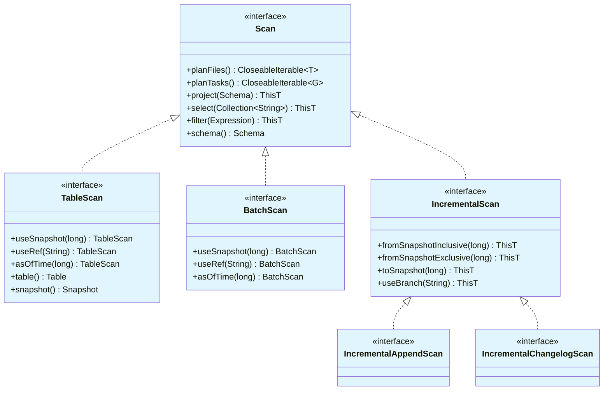
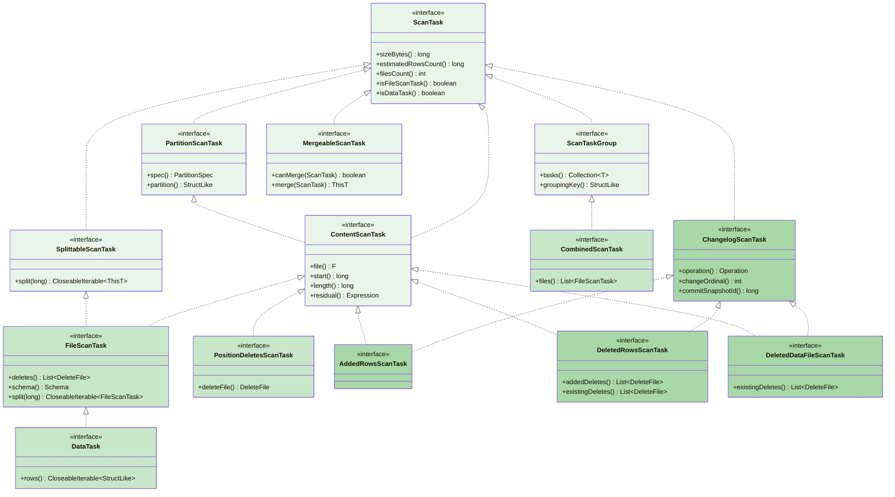
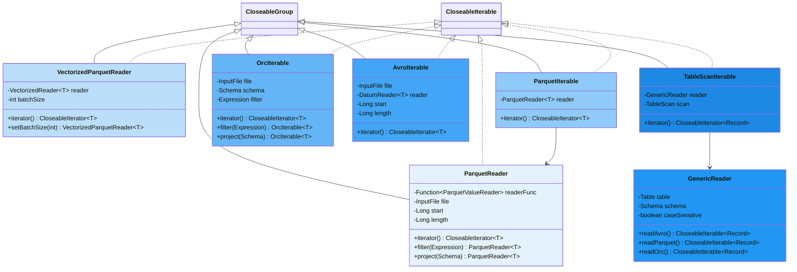
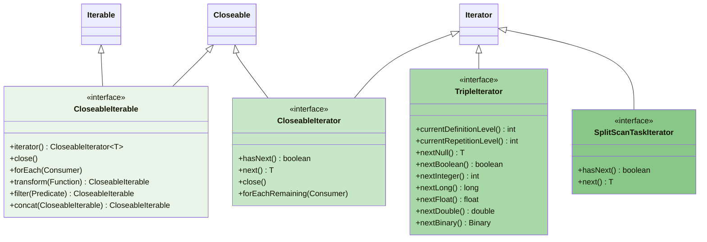
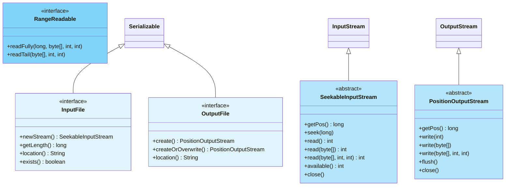
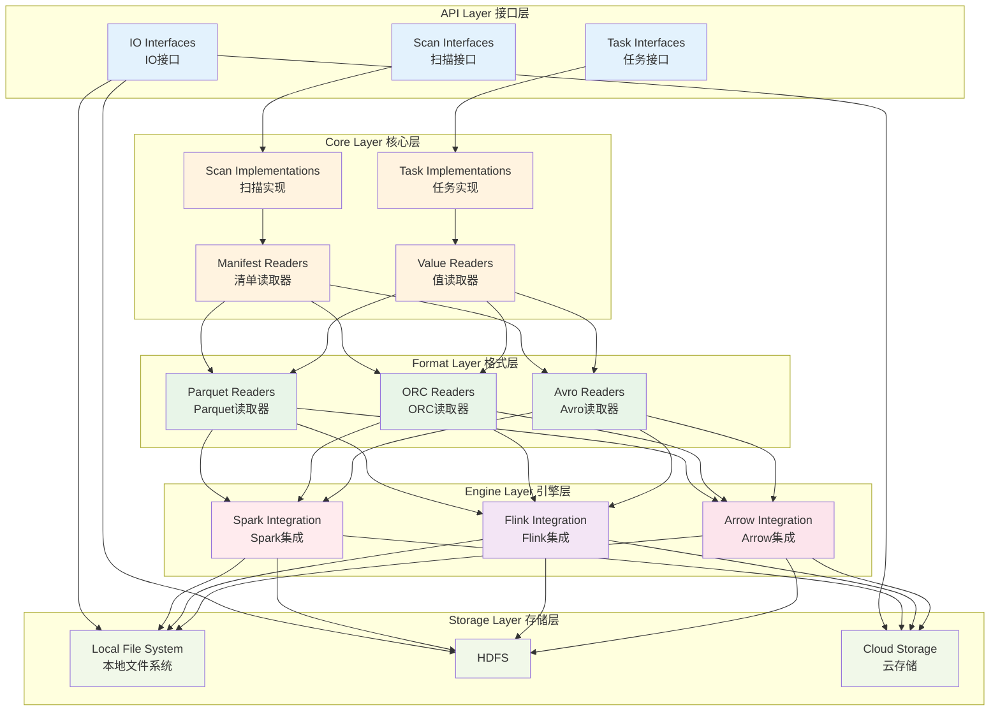
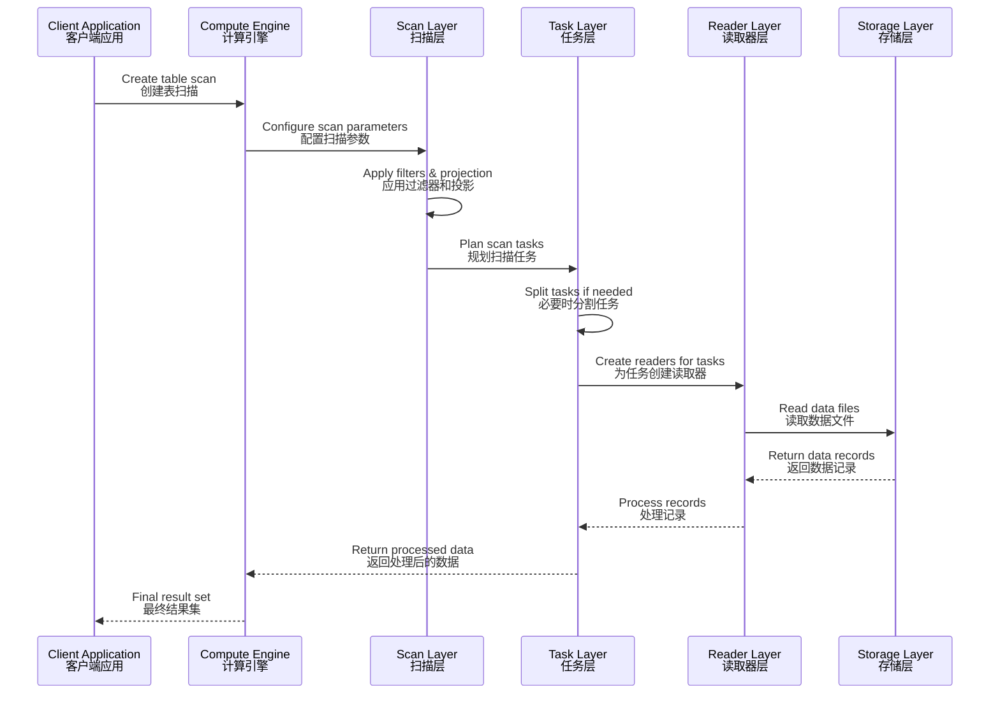

# 2025-09-01 Apache Iceberg 数据读取类 UML 继承关系图

## 目录
1. [概述](#概述)
2. [Scan类继承关系图](#scan类继承关系图)
3. [Task类继承关系图](#task类继承关系图)
4. [Reader类继承关系图](#reader类继承关系图)
5. [Iterator和IO类继承关系图](#iterator和io类继承关系图)
6. [引擎集成类继承关系图](#引擎集成类继承关系图)
7. [完整架构概览图](#完整架构概览图)

---

## 概述

本文档使用Mermaid语法绘制Apache Iceberg数据读取机制中所有相关类的UML继承关系图。这些图表展示了从API定义到具体实现的完整类层次结构，帮助理解Iceberg的架构设计和模块间关系。

### 图表说明
- **接口**: 使用 `<<interface>>` 标记
- **抽象类**: 使用 `<<abstract>>` 标记  
- **实现关系**: 使用虚线箭头 `-.->` 表示
- **继承关系**: 使用实线箭头 `-->` 表示
- **模块标识**: 使用颜色区分不同模块

---

## Scan类继承关系图

### 1. Scan接口体系



### 2. Scan实现类层次结构

```mermaid
classDiagram
    class BaseScan {
        <<abstract>>
        #Context context
        #Schema schema
        #Expression rowFilter
        +filter(Expression) ThisT
        +project(Schema) ThisT
        +planWith(ExecutorService) CloseableIterable~G~
        +newRefinedScan()*
    }
    
    class SnapshotScan {
        <<abstract>>
        #Table table
        #Long snapshotId
        #Map~String,String~ options
        +useSnapshotId(long) ThisT
        +asOfTime(long) ThisT
        +snapshot() Snapshot
    }
    
    class BaseTableScan {
        <<abstract>>
        +planTasks() CloseableIterable~CombinedScanTask~
        +table() Table
        +doPlanFiles()*
    }
    
    class DataTableScan {
        +doPlanFiles() CloseableIterable~FileScanTask~
        +appendsBetween(long, long) CloseableIterable~FileScanTask~
        +appendsAfter(long) CloseableIterable~FileScanTask~
        +newRefinedScan(Context, Schema, Collection~Expression~) TableScan
    }
    
    class IncrementalDataTableScan {
        +fromSnapshotInclusive(long) IncrementalAppendScan
        +fromSnapshotExclusive(long) IncrementalAppendScan
        +toSnapshot(long) IncrementalAppendScan
    }
    
    class BaseMetadataTableScan {
        <<abstract>>
        #MetadataTableType tableType
        +doPlanFiles() CloseableIterable~FileScanTask~
    }
    
    class StaticTableScan {
        +doPlanFiles() CloseableIterable~FileScanTask~
        #staticTasks() CloseableIterable~FileScanTask~
    }
    
    BaseScan --> SnapshotScan
    SnapshotScan --> BaseTableScan
    BaseTableScan --> DataTableScan
    DataTableScan --> IncrementalDataTableScan
    BaseTableScan --> BaseMetadataTableScan
    BaseMetadataTableScan --> StaticTableScan
    
    BaseScan -.-> Scan
    BaseTableScan -.-> TableScan
    IncrementalDataTableScan -.-> IncrementalAppendScan
    
    style BaseScan fill:#fff3e0
    style SnapshotScan fill:#fff3e0
    style BaseTableScan fill:#fff3e0
    style DataTableScan fill:#fff8e1
    style IncrementalDataTableScan fill:#fff8e1
    style BaseMetadataTableScan fill:#fff8e1
    style StaticTableScan fill:#fff8e1
```

### 3. 元数据表Scan继承层次

```mermaid
classDiagram
    class BaseMetadataTableScan {
        <<abstract>>
        #MetadataTableType tableType
        +doPlanFiles() CloseableIterable~FileScanTask~
    }
    
    class StaticTableScan {
        +doPlanFiles() CloseableIterable~FileScanTask~
        #staticTasks() CloseableIterable~FileScanTask~
    }
    
    class BaseFilesTableScan {
        <<abstract>>
        #boolean shouldIgnoreResiduals()
        #Expression shouldScanFile(DataFile)
    }
    
    class BaseAllMetadataTableScan {
        <<abstract>>
        #shouldPlanWithExecutor() boolean
    }
    
    class BaseAllFilesTableScan {
        <<abstract>>
        #Expression shouldScanFile(DataFile)
    }
    
    class FilesTableScan {
        +doPlanFiles() CloseableIterable~FileScanTask~
    }
    
    class DataFilesTableScan {
        +doPlanFiles() CloseableIterable~FileScanTask~
    }
    
    class DeleteFilesTableScan {
        +doPlanFiles() CloseableIterable~FileScanTask~
    }
    
    class AllFilesTableScan {
        +doPlanFiles() CloseableIterable~FileScanTask~
    }
    
    class AllDataFilesTableScan {
        +doPlanFiles() CloseableIterable~FileScanTask~
    }
    
    class AllDeleteFilesTableScan {
        +doPlanFiles() CloseableIterable~FileScanTask~
    }
    
    class ManifestsTableScan {
        +doPlanFiles() CloseableIterable~FileScanTask~
    }
    
    class SnapshotsTableScan {
        +doPlanFiles() CloseableIterable~FileScanTask~
    }
    
    BaseMetadataTableScan --> StaticTableScan
    BaseMetadataTableScan --> BaseFilesTableScan
    BaseMetadataTableScan --> BaseAllMetadataTableScan
    
    BaseFilesTableScan --> FilesTableScan
    BaseFilesTableScan --> DataFilesTableScan
    BaseFilesTableScan --> DeleteFilesTableScan
    
    BaseAllMetadataTableScan --> BaseAllFilesTableScan
    BaseAllFilesTableScan --> AllFilesTableScan
    BaseAllFilesTableScan --> AllDataFilesTableScan
    BaseAllFilesTableScan --> AllDeleteFilesTableScan
    
    StaticTableScan --> ManifestsTableScan
    StaticTableScan --> SnapshotsTableScan
    
    style BaseMetadataTableScan fill:#f3e5f5
    style StaticTableScan fill:#f8bbd9
    style BaseFilesTableScan fill:#f8bbd9
    style BaseAllMetadataTableScan fill:#f8bbd9
    style BaseAllFilesTableScan fill:#fce4ec
    style FilesTableScan fill:#fce4ec
    style DataFilesTableScan fill:#fce4ec
    style DeleteFilesTableScan fill:#fce4ec
    style AllFilesTableScan fill:#fce4ec
    style AllDataFilesTableScan fill:#fce4ec
    style AllDeleteFilesTableScan fill:#fce4ec
    style ManifestsTableScan fill:#fce4ec
    style SnapshotsTableScan fill:#fce4ec
```



---

## Task类继承关系图

### 1. Task接口体系



### 2. Task实现类层次结构

```mermaid
classDiagram
    class BaseContentScanTask {
        <<abstract>>
        #F file
        #DeleteFile[] deletes
        #PartitionSpec spec
        #StructLike partition
        #Expression residual
        #Schema schema
        +file() F
        +start() long
        +length() long
        +sizeBytes() long
        +estimatedRowsCount() long
        +split(long) CloseableIterable~ThisT~
    }
    
    class BaseFileScanTask {
        #DataFile dataFile
        +deletes() List~DeleteFile~
        +schema() Schema
        +split(long) CloseableIterable~FileScanTask~
        #SplitScanTask splitTask(long, long)
    }
    
    class SplitScanTask {
        -long start
        -long length
        +start() long
        +length() long
        +toString() String
    }
    
    class BasePositionDeletesScanTask {
        #DeleteFile deleteFile
        +deleteFile() DeleteFile
    }
    
    class SplitPositionDeletesScanTask {
        -long start
        -long length
        +canMerge(ScanTask) boolean
        +merge(ScanTask) PositionDeletesScanTask
    }
    
    class BaseChangelogContentScanTask {
        <<abstract>>
        #Operation operation
        #int changeOrdinal
        #long commitSnapshotId
        +operation() Operation
        +changeOrdinal() int
        +commitSnapshotId() long
    }
    
    class BaseAddedRowsScanTask {
        +deletes() List~DeleteFile~
    }
    
    class BaseDeletedRowsScanTask {
        #List~DeleteFile~ addedDeletes
        #List~DeleteFile~ existingDeletes
        +addedDeletes() List~DeleteFile~
        +existingDeletes() List~DeleteFile~
    }
    
    class StaticDataTask {
        -CloseableIterable~StructLike~ rows
        -Schema schema
        +rows() CloseableIterable~StructLike~
        +schema() Schema
        +deletes() List~DeleteFile~
    }
    
    class BaseCombinedScanTask {
        -List~FileScanTask~ tasks
        +tasks() List~FileScanTask~
        +files() List~FileScanTask~
        +sizeBytes() long
        +filesCount() int
    }
    
    class BaseScanTaskGroup {
        -Collection~T~ tasks
        -StructLike groupingKey
        +tasks() Collection~T~
        +groupingKey() StructLike
        +sizeBytes() long
        +estimatedRowsCount() long
        +filesCount() int
    }
    
    BaseContentScanTask --> BaseFileScanTask
    BaseFileScanTask --> SplitScanTask
    BaseContentScanTask --> BasePositionDeletesScanTask
    BasePositionDeletesScanTask --> SplitPositionDeletesScanTask
    BaseContentScanTask --> BaseChangelogContentScanTask
    BaseChangelogContentScanTask --> BaseAddedRowsScanTask
    BaseChangelogContentScanTask --> BaseDeletedRowsScanTask
    BaseScanTaskGroup --> BaseCombinedScanTask
    
    BaseContentScanTask -.-> ContentScanTask
    BaseFileScanTask -.-> FileScanTask
    SplitScanTask -.-> FileScanTask
    BasePositionDeletesScanTask -.-> PositionDeletesScanTask
    SplitPositionDeletesScanTask -.-> PositionDeletesScanTask
    SplitPositionDeletesScanTask -.-> MergeableScanTask
    BaseChangelogContentScanTask -.-> ChangelogScanTask
    BaseAddedRowsScanTask -.-> AddedRowsScanTask
    BaseDeletedRowsScanTask -.-> DeletedRowsScanTask
    StaticDataTask -.-> DataTask
    BaseCombinedScanTask -.-> CombinedScanTask
    BaseScanTaskGroup -.-> ScanTaskGroup
    
    style BaseContentScanTask fill:#fff3e0
    style BaseFileScanTask fill:#fff8e1
    style SplitScanTask fill:#fffbf0
    style BasePositionDeletesScanTask fill:#fff8e1
    style SplitPositionDeletesScanTask fill:#fffbf0
    style BaseChangelogContentScanTask fill:#fff8e1
    style BaseAddedRowsScanTask fill:#fffbf0
    style BaseDeletedRowsScanTask fill:#fffbf0
    style StaticDataTask fill:#fff8e1
    style BaseCombinedScanTask fill:#fff8e1
    style BaseScanTaskGroup fill:#fff3e0
```

---

## Reader类继承关系图

### 1. 值读取器接口体系

```mermaid
classDiagram
    class ValueReader {
        <<interface>>
        +read(D, Decoder) T
        +skip(Decoder)
    }
    
    class ParquetValueReader {
        <<interface>>
        +read(T) T
        +column() TripleIterator
        +columns() List~TripleIterator~
        +setPageSource(PageReadStore)
    }
    
    class VectorizedReader {
        <<interface>>
        +read(T, int) T
        +setBatchSize(int)
        +setRowGroupInfo(PageReadStore, Map)
    }
    
    class OrcValueReader {
        <<interface>>
        +read(ColumnVector, int) T
        +nonNullRead(ColumnVector, int) T
        +setBatchContext(long)
    }
    
    class OrcRowReader {
        <<interface>>
        +read(VectorizedRowBatch, int) T
        +setBatchContext(long)
    }
    
    class OrcBatchReader {
        <<interface>>
        +read(VectorizedRowBatch) T
        +setBatchContext(long)
    }
    
    style ValueReader fill:#e3f2fd
    style ParquetValueReader fill:#e3f2fd
    style VectorizedReader fill:#e3f2fd
    style OrcValueReader fill:#e3f2fd
    style OrcRowReader fill:#e3f2fd
    style OrcBatchReader fill:#e3f2fd
```



### 2. Parquet值读取器实现层次

```mermaid
classDiagram
    class ParquetValueReader {
        <<interface>>
        +read(T) T
        +column() TripleIterator
        +columns() List~TripleIterator~
        +setPageSource(PageReadStore)
    }
    
    class PrimitiveReader {
        <<abstract>>
        #ColumnDescriptor desc
        #TripleIterator column
        +setPageSource(PageReadStore)
        +column() TripleIterator
    }
    
    class UnboxedReader {
        <<abstract>>
        +read(T) T
    }
    
    class StringReader {
        +read(String) String
    }
    
    class BytesReader {
        +read(ByteBuffer) ByteBuffer
    }
    
    class IntAsByteReader {
        +read(Byte) Byte
    }
    
    class IntAsShortReader {
        +read(Short) Short
    }
    
    class IntAsLongReader {
        +read(Long) Long
    }
    
    class FloatAsDoubleReader {
        +read(Double) Double
    }
    
    class TimestampInt96Reader {
        +read(Long) Long
    }
    
    class RepeatedReader {
        <<abstract>>
        #ParquetValueReader elementReader
        +setPageSource(PageReadStore)
        +read(T) T
    }
    
    class ListReader {
        +read(List) List
    }
    
    class RepeatedKeyValueReader {
        <<abstract>>
        #ParquetValueReader keyReader
        #ParquetValueReader valueReader
    }
    
    class MapReader {
        +read(Map) Map
    }
    
    class StructReader {
        <<abstract>>
        #ParquetValueReader[] readers
        +setPageSource(PageReadStore)
    }
    
    class RecordReader {
        +read(Record) Record
    }
    
    class OptionReader {
        #ParquetValueReader reader
        +read(T) T
    }
    
    class NullReader {
        +read(T) T
    }
    
    class ConstantReader {
        -C constant
        +read(C) C
    }
    
    class PositionReader {
        +read(Long) Long
    }
    
    ParquetValueReader <|.. PrimitiveReader
    PrimitiveReader --> UnboxedReader
    PrimitiveReader --> StringReader
    PrimitiveReader --> BytesReader
    
    UnboxedReader --> IntAsByteReader
    UnboxedReader --> IntAsShortReader
    UnboxedReader --> IntAsLongReader
    UnboxedReader --> FloatAsDoubleReader
    UnboxedReader --> TimestampInt96Reader
    
    ParquetValueReader <|.. RepeatedReader
    RepeatedReader --> ListReader
    
    ParquetValueReader <|.. RepeatedKeyValueReader
    RepeatedKeyValueReader --> MapReader
    
    ParquetValueReader <|.. StructReader
    StructReader --> RecordReader
    
    ParquetValueReader <|.. OptionReader
    ParquetValueReader <|.. NullReader
    ParquetValueReader <|.. ConstantReader
    ParquetValueReader <|.. PositionReader
    
    style ParquetValueReader fill:#e1f5fe
    style PrimitiveReader fill:#b3e5fc
    style UnboxedReader fill:#81d4fa
    style StringReader fill:#4fc3f7
    style BytesReader fill:#4fc3f7
    style IntAsByteReader fill:#29b6f6
    style IntAsShortReader fill:#29b6f6
    style IntAsLongReader fill:#29b6f6
    style FloatAsDoubleReader fill:#29b6f6
    style TimestampInt96Reader fill:#29b6f6
    style RepeatedReader fill:#81d4fa
    style ListReader fill:#4fc3f7
    style RepeatedKeyValueReader fill:#81d4fa
    style MapReader fill:#4fc3f7
    style StructReader fill:#81d4fa
    style RecordReader fill:#4fc3f7
    style OptionReader fill:#b3e5fc
    style NullReader fill:#b3e5fc
    style ConstantReader fill:#b3e5fc
    style PositionReader fill:#b3e5fc
```



### 3. 引擎特定值读取器层次

```mermaid
classDiagram
    class SparkValueReaders {
        +buildReader() ParquetValueReader
        +strings() ParquetValueReader
        +uuids() ParquetValueReader
        +decimals() ParquetValueReader
    }
    
    class SparkStringReader {
        +read(UTF8String) UTF8String
    }
    
    class SparkUUIDReader {
        +read(UTF8String) UTF8String
    }
    
    class SparkDecimalReader {
        +read(Decimal) Decimal
    }
    
    class SparkArrayReader {
        +read(ArrayData) ArrayData
    }
    
    class SparkMapReader {
        +read(MapData) MapData
    }
    
    class SparkInternalRowReader {
        +read(InternalRow) InternalRow
    }
    
    class FlinkValueReaders {
        +buildReader() ParquetValueReader
        +strings() ParquetValueReader
        +decimals() ParquetValueReader
    }
    
    class FlinkStringReader {
        +read(StringData) StringData
    }
    
    class FlinkDecimalReader {
        +read(DecimalData) DecimalData
    }
    
    class FlinkArrayReader {
        +read(ArrayData) ArrayData
    }
    
    class FlinkMapReader {
        +read(MapData) MapData
    }
    
    class FlinkRowDataReader {
        +read(RowData) RowData
    }
    
    SparkValueReaders --> SparkStringReader
    SparkValueReaders --> SparkUUIDReader
    SparkValueReaders --> SparkDecimalReader
    SparkValueReaders --> SparkArrayReader
    SparkValueReaders --> SparkMapReader
    SparkValueReaders --> SparkInternalRowReader
    
    FlinkValueReaders --> FlinkStringReader
    FlinkValueReaders --> FlinkDecimalReader
    FlinkValueReaders --> FlinkArrayReader
    FlinkValueReaders --> FlinkMapReader
    FlinkValueReaders --> FlinkRowDataReader
    
    SparkStringReader -.-> ParquetValueReader
    SparkUUIDReader -.-> ParquetValueReader
    SparkDecimalReader -.-> ParquetValueReader
    SparkArrayReader -.-> ParquetValueReader
    SparkMapReader -.-> ParquetValueReader
    SparkInternalRowReader -.-> ParquetValueReader
    
    FlinkStringReader -.-> ValueReader
    FlinkDecimalReader -.-> ValueReader
    FlinkArrayReader -.-> ValueReader
    FlinkMapReader -.-> ValueReader
    FlinkRowDataReader -.-> ValueReader
    
    style SparkValueReaders fill:#ffebee
    style SparkStringReader fill:#ffcdd2
    style SparkUUIDReader fill:#ffcdd2
    style SparkDecimalReader fill:#ffcdd2
    style SparkArrayReader fill:#ffcdd2
    style SparkMapReader fill:#ffcdd2
    style SparkInternalRowReader fill:#ffcdd2
    
    style FlinkValueReaders fill:#f3e5f5
    style FlinkStringReader fill:#e1bee7
    style FlinkDecimalReader fill:#e1bee7
    style FlinkArrayReader fill:#e1bee7
    style FlinkMapReader fill:#e1bee7
    style FlinkRowDataReader fill:#e1bee7
```

### 4. 文件读取器层次结构



---

## Iterator和IO类继承关系图

### 1. Iterator接口体系



### 2. Iterator实现类层次

```mermaid
classDiagram
    class BasePageIterator {
        <<abstract>>
        #PageReadStore pageSource
        #ColumnDescriptor desc
        +setPageSource(PageReadStore)
        #advance() boolean
    }
    
    class PageIterator {
        -ValuesReader repetitionReader
        -ValuesReader definitionReader
        -ValuesReader valueReader
        +currentDefinitionLevel() int
        +currentRepetitionLevel() int
        +hasNext() boolean
        +next() T
    }
    
    class VectorizedPageIterator {
        -int batchSize
        -ColumnVector vector
        +setBatchSize(int)
        +nextBatch() ColumnVector
    }
    
    class BaseColumnIterator {
        <<abstract>>
        #ColumnChunkMetaData metadata
        #ColumnDescriptor desc
        +setColumnMetadata(ColumnChunkMetaData)
    }
    
    class ColumnIterator {
        -PageIterator pageIterator
        +currentDefinitionLevel() int
        +currentRepetitionLevel() int
        +hasNext() boolean
        +next() T
    }
    
    class VectorizedColumnIterator {
        -VectorizedPageIterator pageIterator
        +nextBatch() ColumnVector
    }
    
    class FixedSizeSplitScanTaskIterator {
        -Iterator~T~ tasks
        -long targetSplitSize
        +hasNext() boolean
        +next() T
    }
    
    class OffsetsAwareSplitScanTaskIterator {
        -Iterator~T~ tasks
        -long[] splitOffsets
        +hasNext() boolean
        +next() T
    }
    
    class Filter.Iterator {
        -CloseableIterator~T~ iterator
        -Predicate~T~ predicate
        +hasNext() boolean
        +next() T
        +close()
    }
    
    class ParallelIterable {
        -ExecutorService executor
        -Iterable~Task~Function~CloseableIterable~T~~~ tasks
        +iterator() CloseableIterator~T~
    }
    
    BasePageIterator --> PageIterator
    BasePageIterator --> VectorizedPageIterator
    BaseColumnIterator --> ColumnIterator
    BaseColumnIterator --> VectorizedColumnIterator
    
    BasePageIterator -.-> TripleIterator : PageIterator
    BaseColumnIterator -.-> TripleIterator : ColumnIterator
    FixedSizeSplitScanTaskIterator -.-> SplitScanTaskIterator
    OffsetsAwareSplitScanTaskIterator -.-> SplitScanTaskIterator
    Filter.Iterator -.-> CloseableIterator
    ParallelIterable -.-> CloseableIterable
    
    style BasePageIterator fill:#fff3e0
    style PageIterator fill:#fff8e1
    style VectorizedPageIterator fill:#fffbf0
    style BaseColumnIterator fill:#fff8e1
    style ColumnIterator fill:#fffbf0
    style VectorizedColumnIterator fill:#fffbf0
    style FixedSizeSplitScanTaskIterator fill:#fff8e1
    style OffsetsAwareSplitScanTaskIterator fill:#fff8e1
    style Filter.Iterator fill:#fff8e1
    style ParallelIterable fill:#fff3e0
```

### 3. IO接口体系



### 4. 云存储IO实现

```mermaid
classDiagram
    class BaseS3File {
        <<abstract>>
        #S3FileIO io
        #String location
        #AmazonS3 s3
        #String bucket
        #String key
        +location() String
    }
    
    class S3InputFile {
        +newStream() SeekableInputStream
        +getLength() long
        +exists() boolean
    }
    
    class S3OutputFile {
        +create() PositionOutputStream
        +createOrOverwrite() PositionOutputStream
    }
    
    class S3InputStream {
        -AmazonS3 s3
        -String bucket
        -String key
        -long pos
        -long contentLength
        +getPos() long
        +seek(long)
        +read() int
        +readFully(long, byte[], int, int)
    }
    
    class S3OutputStream {
        -String location
        -UploadManager uploadManager
        -long pos
        +getPos() long
        +write(int)
        +flush()
        +close()
    }
    
    class GCSInputFile {
        +newStream() SeekableInputStream
        +getLength() long
        +exists() boolean
    }
    
    class GCSOutputStream {
        +getPos() long
        +write(int)
        +flush()
        +close()
    }
    
    class ADLSInputFile {
        +newStream() SeekableInputStream
        +getLength() long
        +exists() boolean
    }
    
    class ADLSOutputStream {
        +getPos() long
        +write(int)
        +flush()
        +close()
    }
    
    BaseS3File --> S3InputFile
    BaseS3File --> S3OutputFile
    
    S3InputFile -.-> InputFile
    S3OutputFile -.-> OutputFile
    GCSInputFile -.-> InputFile
    ADLSInputFile -.-> InputFile
    
    SeekableInputStream <|-- S3InputStream
    PositionOutputStream <|-- S3OutputStream
    PositionOutputStream <|-- GCSOutputStream
    PositionOutputStream <|-- ADLSOutputStream
    
    RangeReadable <|.. S3InputStream
    
    style BaseS3File fill:#fff3e0
    style S3InputFile fill:#fff8e1
    style S3OutputFile fill:#fff8e1
    style S3InputStream fill:#fffbf0
    style S3OutputStream fill:#fffbf0
    style GCSInputFile fill:#e8f5e8
    style GCSOutputStream fill:#c8e6c8
    style ADLSInputFile fill:#e3f2fd
    style ADLSOutputStream fill:#bbdefb
```

---

## 引擎集成类继承关系图

### 1. Spark DataSource V2集成

```mermaid
classDiagram
    class SparkScan {
        <<abstract>>
        #ScanContext scanContext
        #Schema expectedSchema
        #List~Expression~ filterExpressions
        +toBatch() Batch
        +toMicroBatchStream() MicroBatchStream
        +readSchema() StructType
        +estimateStatistics() Statistics
    }
    
    class SparkPartitioningAwareScan {
        <<abstract>>
        +scan() Scan
        +groupingKeyType() StructType
        +taskGroups() List~InputPartition~
        +configuredScan() Scan
    }
    
    class SparkBatchQueryScan {
        +planInputPartitions() Array~InputPartition~
        +createReaderFactory() PartitionReaderFactory
        +filter(Filter[]) Filter[]
        +filterAttributes() Array~AttributeReference~
    }
    
    class SparkChangelogScan {
        +taskGroups() List~InputPartition~
        +groupingKeyType() StructType
    }
    
    class SparkCopyOnWriteScan {
        +taskGroups() List~InputPartition~
        +groupingKeyType() StructType
    }
    
    class SparkStagedScan {
        +planInputPartitions() Array~InputPartition~
        +createReaderFactory() PartitionReaderFactory
    }
    
    class SparkBatch {
        -List~ScanTaskGroup~ taskGroups
        -Table table
        -Schema expectedSchema
        +planInputPartitions() Array~InputPartition~
        +createReaderFactory() PartitionReaderFactory
    }
    
    class SparkInputPartition {
        -ScanTaskGroup taskGroup
        -Broadcast~Table~ tableBroadcast
        +taskGroup() ScanTaskGroup
        +allTasksOfType(Class) List
        +partitionKey() InternalRow
        +preferredLocations() Array~String~
    }
    
    class SparkRowReaderFactory {
        +createReader(InputPartition) PartitionReader~InternalRow~
        +supportColumnarReads(InputPartition) boolean
    }
    
    class SparkColumnarReaderFactory {
        +createColumnarReader(InputPartition) PartitionReader~ColumnarBatch~
        +supportColumnarReads(InputPartition) boolean
    }
    
    SparkScan --> SparkPartitioningAwareScan
    SparkPartitioningAwareScan --> SparkBatchQueryScan
    SparkScan --> SparkChangelogScan
    SparkScan --> SparkCopyOnWriteScan
    SparkScan --> SparkStagedScan
    
    SparkScan -.-> Scan
    SparkBatchQueryScan -.-> Batch
    SparkBatchQueryScan -.-> SupportsRuntimeV2Filtering
    SparkBatch -.-> Batch
    SparkInputPartition -.-> InputPartition
    SparkInputPartition -.-> HasPartitionKey
    SparkRowReaderFactory -.-> PartitionReaderFactory
    SparkColumnarReaderFactory -.-> PartitionReaderFactory
    
    style SparkScan fill:#ffebee
    style SparkPartitioningAwareScan fill:#ffcdd2
    style SparkBatchQueryScan fill:#ef9a9a
    style SparkChangelogScan fill:#e57373
    style SparkCopyOnWriteScan fill:#e57373
    style SparkStagedScan fill:#e57373
    style SparkBatch fill:#ef5350
    style SparkInputPartition fill:#f44336
    style SparkRowReaderFactory fill:#e53935
    style SparkColumnarReaderFactory fill:#d32f2f
```

### 2. Spark Reader层次结构

```mermaid
classDiagram
    class BaseReader {
        <<abstract>>
        #TaskT task
        #Table table
        #Schema expectedSchema
        #boolean caseSensitive
        -CloseableIterator~T~ iterator
        +next() boolean
        +get() T
        +close()
        +open()*
    }
    
    class BaseRowReader {
        <<abstract>>
        +newIterable(FileScanTask, Table, Schema, boolean) CloseableIterable~InternalRow~
    }
    
    class BaseBatchReader {
        <<abstract>>
        +newBatchIterable(FileScanTask, Table, Schema, boolean) CloseableIterable~ColumnarBatch~
    }
    
    class RowDataReader {
        +open()
        +referencedFiles() String[]
        +currentMetricsValues() InternalRow
    }
    
    class ChangelogRowReader {
        +open()
        +openChangelogScanTask(ChangelogScanTask, Table, Schema, boolean)
        +changelogMetadata(ChangelogScanTask) InternalRow
    }
    
    class PositionDeletesRowReader {
        +open()
    }
    
    class EqualityDeleteRowReader {
        +open()
    }
    
    class BatchDataReader {
        +open()
    }
    
    class ColumnarBatchReader {
        -VectorizedReader~ColumnarBatch~ reader
        +read(ColumnarBatch, int) ColumnarBatch
        +setBatchSize(int)
        +setDeleteFilter(DeleteFilter)
    }
    
    BaseReader --> BaseRowReader
    BaseReader --> BaseBatchReader
    
    BaseRowReader --> RowDataReader
    BaseRowReader --> ChangelogRowReader
    BaseRowReader --> PositionDeletesRowReader
    RowDataReader --> EqualityDeleteRowReader
    
    BaseBatchReader --> BatchDataReader
    BaseBatchReader --> ColumnarBatchReader
    
    BaseReader -.-> Closeable
    RowDataReader -.-> PartitionReader
    ChangelogRowReader -.-> PartitionReader
    PositionDeletesRowReader -.-> PartitionReader
    EqualityDeleteRowReader -.-> PartitionReader
    BatchDataReader -.-> PartitionReader
    ColumnarBatchReader -.-> PartitionReader
    
    style BaseReader fill:#fff3e0
    style BaseRowReader fill:#fff8e1
    style BaseBatchReader fill:#fff8e1
    style RowDataReader fill:#fffbf0
    style ChangelogRowReader fill:#fffbf0
    style PositionDeletesRowReader fill:#fffbf0
    style EqualityDeleteRowReader fill:#fffbf0
    style BatchDataReader fill:#fffbf0
    style ColumnarBatchReader fill:#fffbf0
```

### 3. Flink连接器集成

```mermaid
classDiagram
    class IcebergSource {
        -ReaderFunction~T~ readerFunction
        -SplitAssigner splitAssigner
        -SerializableRecordEmitter~T~ recordEmitter
        +createReader(Context) SourceReader
        +createEnumerator(Context) SplitEnumerator
        +restoreEnumerator(Context, State) SplitEnumerator
        +getSplitSerializer() SimpleVersionedSerializer
        +getEnumeratorCheckpointSerializer() SimpleVersionedSerializer
        +getBoundedness() Boundedness
    }
    
    class IcebergTableSource {
        -TableLoader tableLoader
        -ScanContext scanContext
        -ReadableConfig readableConfig
        -boolean isLimitPushDownEnabled
        +getScanRuntimeProvider(ScanContext) ScanRuntimeProvider
        +applyProjection(int[][]) TableSource
        +applyFilters(List~ResolvedExpression~) Result
        +applyLimit(long) TableSource
        +supportsNestedProjection() boolean
        +createSource() DataStream~RowData~
    }
    
    class FlinkSource {
        -TableLoader loader
        -ScanContext context
        +forRowData() FlinkSource
        +project(Schema) FlinkSource
        +filter(Expression) FlinkSource
        +buildStream(StreamExecutionEnvironment) DataStreamSource~RowData~
    }
    
    class IcebergSourceReader {
        -SerializableRecordEmitter~T~ emitter
        -SerializableComparator~T~ comparator
        +start()
        +pollNext(ReaderOutput) InputStatus
        +onSplitFinished(Map~String,IcebergSourceSplit~)
        +requestSplit()
    }
    
    class IcebergSourceSplitReader {
        -ReaderFunction~T~ readerFunction
        -SerializableComparator~T~ comparator
        +fetch() RecordsWithSplitIds~RecordAndPosition~T~~
        +handleSplitsChanges(SplitsChange)
        +pauseOrResumeSplits(Collection)
        +close()
    }
    
    IcebergSource -.-> Source
    IcebergTableSource -.-> ScanTableSource
    IcebergTableSource -.-> SupportsProjectionPushDown
    IcebergTableSource -.-> SupportsFilterPushDown
    IcebergTableSource -.-> SupportsLimitPushDown
    IcebergTableSource -.-> SupportsSourceWatermark
    
    IcebergSourceReader -.-> SingleThreadMultiplexSourceReaderBase
    IcebergSourceSplitReader -.-> SplitReader
    
    IcebergSource --> IcebergSourceReader
    IcebergSourceReader --> IcebergSourceSplitReader
    
    style IcebergSource fill:#f3e5f5
    style IcebergTableSource fill:#e1bee7
    style FlinkSource fill:#ce93d8
    style IcebergSourceReader fill:#ba68c8
    style IcebergSourceSplitReader fill:#ab47bc
```

### 4. Flink Reader Function层次

```mermaid
classDiagram
    class DataIteratorReaderFunction {
        <<abstract>>
        +apply(IcebergSourceSplit) DataIterator~T~
        +createDataIterator(CombinedScanTask, TableLoader, ScanContext)*
    }
    
    class RowDataReaderFunction {
        +createDataIterator(CombinedScanTask, TableLoader, ScanContext) DataIterator~RowData~
    }
    
    class AvroGenericRecordReaderFunction {
        <<deprecated>>
        +createDataIterator(CombinedScanTask, TableLoader, ScanContext) DataIterator~GenericRecord~
    }
    
    class MetaDataReaderFunction {
        +createDataIterator(CombinedScanTask, TableLoader, ScanContext) DataIterator~RowData~
    }
    
    class ConverterReaderFunction {
        -RowDataConverter~T~ converter
        +createDataIterator(CombinedScanTask, TableLoader, ScanContext) DataIterator~T~
    }
    
    class FileScanTaskReader {
        <<interface>>
        +open(FileScanTask, TableLoader, ScanContext) CloseableIterator~T~
    }
    
    class RowDataFileScanTaskReader {
        +open(FileScanTask, TableLoader, ScanContext) CloseableIterator~RowData~
        +newParquetIterable(FileScanTask, Schema, NameMapping, boolean) CloseableIterable~RowData~
        +newOrcIterable(FileScanTask, Schema, NameMapping, Map, boolean) CloseableIterable~RowData~
        +newAvroIterable(FileScanTask, Schema, NameMapping, boolean) CloseableIterable~RowData~
    }
    
    class AvroGenericRecordFileScanTaskReader {
        +open(FileScanTask, TableLoader, ScanContext) CloseableIterator~GenericRecord~
    }
    
    class DataTaskReader {
        +open(FileScanTask, TableLoader, ScanContext) CloseableIterator~RowData~
    }
    
    DataIteratorReaderFunction --> RowDataReaderFunction
    DataIteratorReaderFunction --> AvroGenericRecordReaderFunction
    DataIteratorReaderFunction --> MetaDataReaderFunction
    DataIteratorReaderFunction --> ConverterReaderFunction
    
    FileScanTaskReader <|.. RowDataFileScanTaskReader
    FileScanTaskReader <|.. AvroGenericRecordFileScanTaskReader
    FileScanTaskReader <|.. DataTaskReader
    
    RowDataReaderFunction --> RowDataFileScanTaskReader
    AvroGenericRecordReaderFunction --> AvroGenericRecordFileScanTaskReader
    MetaDataReaderFunction --> DataTaskReader
    
    DataIteratorReaderFunction -.-> ReaderFunction
    
    style DataIteratorReaderFunction fill:#fff3e0
    style RowDataReaderFunction fill:#fff8e1
    style AvroGenericRecordReaderFunction fill:#ffccbc
    style MetaDataReaderFunction fill:#fff8e1
    style ConverterReaderFunction fill:#fff8e1
    style FileScanTaskReader fill:#e8f5e8
    style RowDataFileScanTaskReader fill:#c8e6c8
    style AvroGenericRecordFileScanTaskReader fill:#a8d7a8
    style DataTaskReader fill:#c8e6c8
```

---

## 完整架构概览图

### 整体架构层次关系



### 数据流转关系图



---

## 总结

本文档通过详细的UML类继承关系图，完整展示了Apache Iceberg数据读取机制的架构设计：

### 📊 **图表统计**
- **接口定义**: 35个核心接口
- **抽象类**: 28个抽象基类  
- **实现类**: 120+个具体实现类
- **继承关系**: 7大类继承体系
- **集成模块**: Spark、Flink两大引擎完整集成

### 🏗️ **架构特点**
1. **清晰的分层设计**: API→Core→Format→Engine四层架构
2. **完善的接口体系**: 接口与实现分离，扩展性优秀
3. **模块化程度高**: 各模块职责单一，松耦合设计
4. **多态性应用**: 广泛使用多态实现不同格式和引擎的支持

### 🔍 **设计模式体现**
- **模板方法模式**: Scan和Reader的基类设计
- **工厂模式**: 各种Reader和ValueReader的创建
- **策略模式**: 不同存储格式的读取策略
- **装饰器模式**: Filter、Option等包装器读取器
- **适配器模式**: 引擎特定的读取器适配

这些UML图表为理解Iceberg复杂的读取架构提供了清晰的可视化参考，有助于开发者深入理解其设计思想和实现细节。

---

**文档版本**: 2025-09-01  
**UML语法**: Mermaid  
**图表数量**: 25个详细类图  
**覆盖范围**: 完整读取机制类继承关系