# 2025-09-02 Apache Iceberg 数据写入机制完整源码深度分析报告（第二部分）

## 目录
1. [Spark集成写入类分析](#spark集成写入类分析)
2. [Flink集成写入类分析](#flink集成写入类分析)
3. [类继承关系完整映射](#类继承关系完整映射)
4. [架构设计模式分析](#架构设计模式分析)
5. [性能优化机制](#性能优化机制)
6. [总结与建议](#总结与建议)

---

## Spark集成写入类分析

### 1. 核心Spark DataSource V2写入基础设施

#### 1.1 SparkWrite主要实现

##### SparkWrite抽象基类
**位置**: `org.apache.iceberg.spark.source.SparkWrite`
```java
public abstract class SparkWrite implements Write, RequiresDistributionAndOrdering {
    protected final Table table;
    protected final String branch;
    protected final SparkWriteConf writeConf;
    protected final Context context;
    
    @Override
    public WriterFactory createWriterFactory() {
        return new WriterFactory(
            table, branch, writeConf, context, 
            writeOperation(), distributionMode()
        );
    }
    
    @Override
    public boolean useCommitCoordinator() {
        return false;  // Iceberg自行处理提交协调
    }
    
    @Override
    public void onDataWriterCommit(WriterCommitMessage message) {
        // 处理数据写入器提交消息
    }
    
    @Override 
    public void commit(WriterCommitMessage[] messages) {
        // 执行最终提交逻辑
        CommitProcessor.process(table, messages, writeOperation());
    }
}
```
- **实现接口**: `Write`, `RequiresDistributionAndOrdering`
- **核心特性**:
  - 支持批处理和流处理写入
  - 处理分发和排序要求
  - 包含不同写入操作的内部类（BatchAppend, DynamicOverwrite等）
  - **Spark版本**: 全版本(v3.4, v3.5)

##### 内部写入操作类
```java
// 批处理追加
static class BatchAppend extends SparkWrite implements SupportsStreamingWrite {
    @Override
    public StreamingWrite toStreamingWrite() {
        return new StreamingAppend(table, branch, writeConf, context);
    }
}

// 动态覆写
static class DynamicOverwrite extends SparkWrite {
    @Override
    protected WriteOperation writeOperation() {
        return WriteOperation.DYNAMIC_OVERWRITE;
    }
}

// 按过滤器覆写  
static class OverwriteByFilter extends SparkWrite {
    private final Expression filter;
    
    @Override
    protected WriteOperation writeOperation() {
        return WriteOperation.OVERWRITE_BY_FILTER;
    }
}
```

#### 1.2 SparkWriteBuilder构建器

##### SparkWriteBuilder实现
**位置**: `org.apache.iceberg.spark.source.SparkWriteBuilder`
```java
public class SparkWriteBuilder implements WriteBuilder, SupportsDynamicOverwrite, SupportsOverwrite {
    private final Table table;
    private final String branch;
    private final SparkSession spark;
    private final Context context;
    
    @Override
    public Write build() {
        return new SparkWrite.BatchAppend(table, branch, writeConf, context);
    }
    
    @Override
    public WriteBuilder overwriteDynamicPartitions() {
        return new SparkWriteBuilder(table, branch, spark, context) {
            @Override
            public Write build() {
                return new SparkWrite.DynamicOverwrite(table, branch, writeConf, context);
            }
        };
    }
    
    @Override
    public WriteBuilder overwrite(Filter[] filters) {
        return new SparkWriteBuilder(table, branch, spark, context) {
            @Override
            public Write build() {
                return new SparkWrite.OverwriteByFilter(table, branch, writeConf, context, convertFilters(filters));
            }
        };
    }
}
```
- **实现接口**: `WriteBuilder`, `SupportsDynamicOverwrite`, `SupportsOverwrite`
- **作用**: 构建不同类型的写入操作
- **依赖**: 创建`SparkWrite`实例

### 2. DataWriter实现体系

#### 2.1 WriterFactory工厂类

##### WriterFactory（SparkWrite内部类）
```java
static class WriterFactory implements DataWriterFactory, StreamingDataWriterFactory {
    private final Table table;
    private final SparkFileWriterFactory fileWriterFactory;
    private final boolean fanoutEnabled;
    
    @Override
    public DataWriter<InternalRow> createWriter(int partitionId, long taskId) {
        return createWriter(partitionId, taskId, 0);
    }
    
    @Override
    public DataWriter<InternalRow> createWriter(int partitionId, long taskId, long epochId) {
        if (table.spec().isUnpartitioned()) {
            return new UnpartitionedDataWriter(fileWriterFactory, partitionId, taskId);
        } else {
            return new PartitionedDataWriter(fileWriterFactory, partitionId, taskId, fanoutEnabled);
        }
    }
}
```
- **实现接口**: `DataWriterFactory`, `StreamingDataWriterFactory`
- **作用**: 为批处理和流处理创建DataWriter实例
- **策略选择**: 根据表是否分区选择不同的写入器

#### 2.2 DataWriter具体实现

##### UnpartitionedDataWriter（非分区表写入器）
```java
static class UnpartitionedDataWriter implements DataWriter<InternalRow> {
    private final RollingDataWriter writer;
    private final InternalRowWrapper wrapper;
    
    @Override
    public void write(InternalRow record) throws IOException {
        writer.write(wrapper.wrap(record));
    }
    
    @Override
    public WriterCommitMessage commit() throws IOException {
        WriteResult result = writer.complete();
        return new DataWriterCommitMessage(result);
    }
    
    @Override
    public void abort() throws IOException {
        writer.abort();
    }
    
    @Override
    public void close() throws IOException {
        writer.close();
    }
}
```
- **实现接口**: `DataWriter<InternalRow>`
- **核心特性**:
  - 使用`RollingDataWriter`内部处理
  - 处理提交/中止操作  
  - 报告输出指标给Spark

##### PartitionedDataWriter（分区表写入器）
```java
static class PartitionedDataWriter implements DataWriter<InternalRow> {
    private final TaskWriter<InternalRow> writer;
    private final InternalRowWrapper wrapper;
    private final PartitionKey partitionKey;
    
    @Override
    public void write(InternalRow record) throws IOException {
        // 从Spark InternalRow提取分区键
        partitionKey.partition(wrapper.wrap(record));
        
        if (fanoutEnabled) {
            ((FanoutDataWriter<InternalRow>) writer).write(wrapper.wrap(record));
        } else {
            ((ClusteredDataWriter<InternalRow>) writer).write(wrapper.wrap(record));
        }
    }
}
```
- **核心特性**:
  - 从Spark InternalRow提取分区键
  - 支持扇出写入（无序数据）和聚类写入（有序数据）

### 3. 文件写入器工厂类

#### 3.1 SparkFileWriterFactory

##### SparkFileWriterFactory实现
**位置**: `org.apache.iceberg.spark.source.SparkFileWriterFactory`
```java
public class SparkFileWriterFactory extends BaseFileWriterFactory<InternalRow> {
    public SparkFileWriterFactory(Table table, FileFormat dataFileFormat, 
                                 Schema dataSchema, StructType dsSchema) {
        super(table, dataFileFormat, dataSchema, 
              new SparkAppenderFactory(table, dataSchema, dsSchema),
              new SparkDeleteWriterFactory(table, dataSchema, dsSchema));
    }
    
    private static class SparkAppenderFactory implements FileAppenderFactory<InternalRow> {
        @Override
        public FileAppender<InternalRow> newAppender(OutputFile outputFile, FileFormat format) {
            switch (format) {
                case PARQUET:
                    return Parquet.write(outputFile)
                        .schema(dataSchema)
                        .createWriterFunc(SparkParquetWriters::buildWriter)
                        .transform(SparkParquetWriters::buildTransform)
                        .build();
                case AVRO:
                    return Avro.write(outputFile)
                        .schema(dataSchema) 
                        .createWriterFunc(SparkAvroWriter::new)
                        .build();
                case ORC:
                    return ORC.write(outputFile)
                        .schema(dataSchema)
                        .createWriterFunc(SparkOrcWriter::buildWriter)
                        .build();
            }
        }
    }
}
```
- **继承关系**: extends `BaseFileWriterFactory<InternalRow>`
- **作用**: 为不同格式(Parquet、Avro、ORC)配置写入器
- **特性**: 支持数据文件、相等删除和位置删除

### 4. 分区写入器类

#### 4.1 Spark特定分区写入器

##### SparkPartitionedWriter
**位置**: `org.apache.iceberg.spark.source.SparkPartitionedWriter`
```java
public class SparkPartitionedWriter extends PartitionedWriter<InternalRow> {
    private final InternalRowWrapper wrapper = new InternalRowWrapper(dsSchema.asStruct());
    
    @Override
    protected PartitionKey partition(InternalRow row) {
        wrapper.wrap(row);
        return partitionKey.copy().partition(wrapper);
    }
}
```
- **继承关系**: extends `PartitionedWriter<InternalRow>`
- **作用**: 聚类写入的分区写入器基类
- **特性**: 从Spark InternalRow提取分区键

##### SparkPartitionedFanoutWriter
**位置**: `org.apache.iceberg.spark.source.SparkPartitionedFanoutWriter`
```java
public class SparkPartitionedFanoutWriter extends PartitionedFanoutWriter<InternalRow> {
    private final InternalRowWrapper wrapper = new InternalRowWrapper(dsSchema.asStruct());
    
    @Override
    protected PartitionKey partition(InternalRow row) {
        wrapper.wrap(row);
        return partitionKey.copy().partition(wrapper);
    }
}
```
- **继承关系**: extends `PartitionedFanoutWriter<InternalRow>`
- **作用**: 未排序分区数据的扇出写入器
- **适用场景**: 数据未按分区预排序的场景

### 5. 位置Delta写入（MERGE/UPDATE/DELETE）

#### 5.1 SparkPositionDeltaWrite

##### SparkPositionDeltaWrite核心实现
**位置**: `org.apache.iceberg.spark.source.SparkPositionDeltaWrite`
```java
public class SparkPositionDeltaWrite implements DeltaWrite, RequiresDistributionAndOrdering {
    private final Table table;
    private final String branch;
    private final Context context;
    private final SparkWriteConf writeConf;
    private final String operation; // DELETE, UPDATE, MERGE
    
    @Override
    public DeltaWriterFactory createWriterFactory() {
        return new DeltaWriterFactory(table, branch, writeConf, context, operation);
    }
    
    @Override
    public void commit(WriterCommitMessage[] messages) {
        RowDelta rowDelta = table.newRowDelta();
        
        for (WriterCommitMessage message : messages) {
            DeltaWriteResult result = ((DeltaWriterCommitMessage) message).result();
            result.dataFiles().forEach(rowDelta::addRows);
            result.deleteFiles().forEach(rowDelta::addDeletes);
        }
        
        rowDelta.commit();
    }
    
    @Override
    public Distribution requiredDistribution() {
        if (table.spec().isUnpartitioned()) {
            return Distributions.unspecified();
        } else {
            return Distributions.clustered(partitionTransforms);
        }
    }
}
```
- **实现接口**: `DeltaWrite`, `RequiresDistributionAndOrdering`
- **作用**: 处理行级操作(UPDATE, DELETE, MERGE)
- **核心特性**:
  - 支持写时复制和读时合并策略
  - 处理删除文件生成和重写
  - 管理隔离级别和冲突检测
- **支持命令**: DELETE、UPDATE、MERGE

#### 5.2 Delta写入器实现

##### Delta写入器类型（SparkPositionDeltaWrite内部类）
```java
// 仅删除操作
static class DeleteOnlyDeltaWriter implements DeltaWriter<InternalRow> {
    private final PositionDeleteWriter<InternalRow> deleteWriter;
    
    @Override
    public void write(InternalRow row) throws IOException {
        deleteWriter.write(row, spec, partition);
    }
}

// 非分区表增删写入器
static class UnpartitionedDeltaWriter implements DeltaWriter<InternalRow> {
    private final DataWriter<InternalRow> insertWriter;
    private final PositionDeleteWriter<InternalRow> deleteWriter;
    
    @Override
    public void write(InternalRow row) throws IOException {
        int operation = row.getInt(OPERATION_COLUMN);
        switch (operation) {
            case INSERT_OPERATION:
                insertWriter.write(removeMetadataColumns(row));
                break;
            case DELETE_OPERATION:
                deleteWriter.write(removeMetadataColumns(row), spec, partition);
                break;
        }
    }
}

// 分区表增删写入器  
static class PartitionedDeltaWriter implements DeltaWriter<InternalRow> {
    // 类似实现，但需要处理分区路由
}
```

##### SparkPositionDeletesRewrite
**位置**: `org.apache.iceberg.spark.source.SparkPositionDeletesRewrite`
- **实现接口**: `DataWriter<InternalRow>`
- **作用**: 重写位置删除文件的专用写入器

### 6. 格式特定写入器

#### 6.1 Parquet写入器

##### SparkParquetWriters
**位置**: `org.apache.iceberg.spark.data.SparkParquetWriters`
```java
public class SparkParquetWriters {
    public static <T> ParquetValueWriter<T> buildWriter(Schema schema, MessageType type) {
        return ParquetTypeVisitor.visit(type, schema, new WriteBuilder(type));
    }
    
    private static class WriteBuilder extends ParquetTypeVisitor<ParquetValueWriter<?>> {
        
        @Override
        public ParquetValueWriter<?> primitive(PrimitiveType primitive, 
                                             PrimitiveTypeName primitiveType) {
            LogicalTypeAnnotation logicalType = primitive.getLogicalTypeAnnotation();
            
            switch (primitiveType) {
                case BINARY:
                    if (logicalType instanceof LogicalTypeAnnotation.StringLogicalTypeAnnotation) {
                        return new StringWriter(primitive);
                    } else if (logicalType instanceof LogicalTypeAnnotation.UUIDLogicalTypeAnnotation) {
                        return new UUIDWriter(primitive);
                    }
                    break;
                case FIXED_LEN_BYTE_ARRAY:
                    if (logicalType instanceof LogicalTypeAnnotation.DecimalLogicalTypeAnnotation) {
                        return new BinaryDecimalWriter(primitive, precision, scale);
                    }
                    break;
            }
        }
    }
    
    // Spark特定写入器实现
    static class StringWriter extends ParquetValueWriters.PrimitiveWriter<UTF8String> {
        @Override
        public void write(int repetitionLevel, UTF8String value) {
            if (value == null) {
                column.writeNull(repetitionLevel);
            } else {
                column.writeBinary(repetitionLevel, 
                    Binary.fromConstantByteBuffer(value.getByteBuffer()));
            }
        }
    }
    
    static class UUIDWriter extends ParquetValueWriters.PrimitiveWriter<UTF8String> {
        @Override
        public void write(int repetitionLevel, UTF8String value) {
            if (value == null) {
                column.writeNull(repetitionLevel);
            } else {
                UUID uuid = UUID.fromString(value.toString());
                ByteBuffer buffer = ByteBuffer.allocate(16);
                buffer.putLong(uuid.getMostSignificantBits());
                buffer.putLong(uuid.getLeastSignificantBits());
                column.writeBinary(repetitionLevel, Binary.fromConstantByteBuffer(buffer));
            }
        }
    }
    
    static class ArrayWriter<E> extends ParquetValueWriters.RepeatedWriter<ArrayData, E> {
        @Override
        protected Iterator<E> elements(ArrayData array) {
            return new ArrayElementIterator<>(array, elementGetter);
        }
    }
    
    static class InternalRowWriter extends ParquetValueWriters.StructWriter<InternalRow> {
        @Override
        protected Object get(InternalRow struct, int index) {
            return getters[index].get(struct);
        }
    }
}
```

#### 6.2 Avro写入器

##### SparkAvroWriter
**位置**: `org.apache.iceberg.spark.data.SparkAvroWriter`
```java
public class SparkAvroWriter implements MetricsAwareDatumWriter<InternalRow> {
    private ValueWriter<InternalRow> writer;
    
    public SparkAvroWriter(org.apache.avro.Schema schema, Schema expectedSchema) {
        this.writer = SparkValueWriters.struct(
            Types.StructType.of(expectedSchema.columns()), 
            (GenericData.Record) schema, 
            ImmutableMap.of()
        );
    }
    
    @Override
    public void write(InternalRow datum, Encoder out) throws IOException {
        writer.write(datum, out);
    }
    
    @Override
    public Stream<FieldMetrics> metrics() {
        return writer.metrics();
    }
}
```

##### SparkValueWriters
**位置**: `org.apache.iceberg.spark.data.SparkValueWriters`
```java
public class SparkValueWriters {
    public static ValueWriter<InternalRow> struct(StructType struct, 
                                                 GenericData.Record record,
                                                 Map<Integer, ?> idToConstant) {
        return new StructWriter(buildWriters(struct.fields(), record.getSchema().getFields(), idToConstant));
    }
    
    static class StringWriter implements ValueWriter<UTF8String> {
        @Override
        public void write(UTF8String datum, Encoder encoder) throws IOException {
            encoder.writeString(datum != null ? datum.toString() : null);
        }
    }
    
    static class UUIDWriter implements ValueWriter<UTF8String> {
        @Override
        public void write(UTF8String datum, Encoder encoder) throws IOException {
            UUID uuid = datum != null ? UUID.fromString(datum.toString()) : null;
            encoder.writeFixed(UUIDUtil.convert(uuid));
        }
    }
    
    static class ArrayWriter implements ValueWriter<ArrayData> {
        private final ValueWriter<Object> elementWriter;
        
        @Override
        public void write(ArrayData array, Encoder encoder) throws IOException {
            encoder.writeArrayStart();
            encoder.setItemCount(array.numElements());
            for (int i = 0; i < array.numElements(); i++) {
                encoder.startItem();
                elementWriter.write(array.get(i, elementType), encoder);
            }
            encoder.writeArrayEnd();
        }
    }
    
    static class StructWriter extends ValueWriters.StructWriter<InternalRow> {
        @Override
        protected Object get(InternalRow struct, int pos) {
            return getters[pos].get(struct);
        }
    }
}
```

#### 6.3 ORC写入器

##### SparkOrcWriter
**位置**: `org.apache.iceberg.spark.data.SparkOrcWriter`
```java
public class SparkOrcWriter implements OrcRowWriter<InternalRow> {
    private final OrcValueWriter<?>[] writers;
    
    public static OrcRowWriter<InternalRow> buildWriter(Schema schema, TypeDescription orcSchema) {
        return (OrcRowWriter<InternalRow>) TypeUtil.visit(schema, 
            new WriteBuilder(orcSchema, schema));
    }
    
    @Override
    public void write(InternalRow row, VectorizedRowBatch output) {
        int row = output.size++;
        for (int c = 0; c < writers.length; ++c) {
            OrcValueWriter writer = writers[c];
            writer.write(row, getters[c].get(row), output.cols[c]);
        }
    }
}
```

##### SparkOrcValueWriters
**位置**: `org.apache.iceberg.spark.data.SparkOrcValueWriters`
```java
public class SparkOrcValueWriters {
    static class StringWriter implements OrcValueWriter<UTF8String> {
        @Override
        public void write(int rowId, UTF8String data, ColumnVector output) {
            if (data != null) {
                ((BytesColumnVector) output).setVal(rowId, data.getBytes());
            } else {
                output.noNulls = false;
                output.isNull[rowId] = true;
            }
        }
    }
    
    static class ArrayWriter<T> implements OrcValueWriter<ArrayData> {
        private final OrcValueWriter<T> elementWriter;
        
        @Override
        public void write(int rowId, ArrayData data, ColumnVector output) {
            if (data != null) {
                ListColumnVector listVector = (ListColumnVector) output;
                int offset = (int) listVector.lengths[rowId];
                listVector.offsets[rowId] = offset;
                listVector.lengths[rowId] = data.numElements();
                
                for (int i = 0; i < data.numElements(); i++) {
                    elementWriter.write(offset + i, 
                        (T) data.get(i, elementType), 
                        listVector.child);
                }
            } else {
                output.noNulls = false;
                output.isNull[rowId] = true;
            }
        }
    }
}
```

### 7. 流处理支持

#### 7.1 微批流处理

##### SparkMicroBatchStream
**位置**: `org.apache.iceberg.spark.source.SparkMicroBatchStream`
```java
public class SparkMicroBatchStream implements MicroBatchStream, SupportsAdmissionControl {
    @Override
    public void commit(Offset end) {
        // 提交逻辑，确保准确一次语义
    }
    
    @Override
    public void stop() {
        // 清理资源
    }
}
```
- **实现接口**: `MicroBatchStream`, `SupportsAdmissionControl`
- **作用**: Spark结构化流的流读取实现（主要用于读取，但提供流基础设施）

#### 7.2 流写入支持

##### 流写入操作（SparkWrite内部类）
```java
// 流式追加
static class StreamingAppend extends SparkWrite implements StreamingWrite {
    @Override
    public StreamingDataWriterFactory createStreamingWriterFactory() {
        return new WriterFactory(table, branch, writeConf, context);
    }
}

// 流式完整覆写
static class StreamingOverwrite extends SparkWrite implements StreamingWrite {
    @Override
    public void commit(long epochId, WriterCommitMessage[] messages) {
        OverwriteFiles overwrite = table.newOverwrite();
        // 应用覆写逻辑
        overwrite.commit();
    }
}
```

---

## Flink集成写入类分析

### 1. 核心Sink框架类

#### 1.1 主要Sink实现

##### IcebergSink（Flink SinkV2）
**位置**: `org.apache.iceberg.flink.sink.IcebergSink`
```java
public class IcebergSink implements Sink<RowData>, 
                                   SupportsPreWriteTopology<RowData>,
                                   SupportsCommitter<IcebergCommittable>,
                                   SupportsPreCommitTopology<WriteResult, IcebergCommittable>,
                                   SupportsPostCommitTopology<IcebergCommittable> {
    
    private final TableLoader tableLoader;
    private final boolean replacePartitions;
    private final String branch;
    private final DistributionMode distributionMode;
    
    @Override
    public SinkWriter<RowData> createWriter(InitContext context) throws IOException {
        return new IcebergSinkWriter(tableLoader, replacePartitions, branch, 
                                   context.getSubtaskId(), context.getAttemptNumber());
    }
    
    @Override
    public Committer<IcebergCommittable> createCommitter() throws IOException {
        return new IcebergCommitter(tableLoader, replacePartitions, branch);
    }
    
    @Override
    public Optional<SimpleVersionedSerializer<IcebergCommittable>> getCommittableSerializer() {
        return Optional.of(IcebergCommittableSerializer.INSTANCE);
    }
    
    @Override
    public Optional<Topology> addPreWriteTopology(DataStream<RowData> inputStream) {
        switch (distributionMode) {
            case NONE:
                return Optional.empty();
            case HASH:
                return Optional.of(inputStream.keyBy(new PartitionKeySelector()));
            case RANGE:
                return Optional.of(addRangeDistribution(inputStream));
        }
    }
    
    @Override
    public Optional<Topology> addPreCommitTopology(DataStream<WriteResult> writeResults) {
        // 聚合WriteResult对象为IcebergCommittable
        return Optional.of(writeResults
            .transform("IcebergWriteAggregator", new IcebergWriteAggregator())
            .setParallelism(1));
    }
}
```
- **接口实现**:
  - `Sink<RowData>`: Flink SinkV2基础接口
  - `SupportsPreWriteTopology<RowData>`: 写入前拓扑钩子
  - `SupportsCommitter<IcebergCommittable>`: 提交器支持
  - `SupportsPreCommitTopology<WriteResult, IcebergCommittable>`: 提交前拓扑钩子
  - **版本支持**: Flink 1.18+，SinkV2框架设计
- **分发模式支持**:
  - **NONE**: 直接传递或基于相等字段的键控
  - **HASH**: 基于分区键或相等字段的键控
  - **RANGE**: 具有统计收集的排序顺序感知分发

##### FlinkSink（遗留Flink SinkV1）
**位置**: `org.apache.iceberg.flink.sink.FlinkSink`
```java
public class FlinkSink {
    public static Builder forRowData(DataStream<RowData> input) {
        return new Builder().forRowData(input);
    }
    
    public static class Builder {
        public DataStreamSink<RowData> append() {
            return chainIcebergOperators();
        }
        
        public DataStreamSink<RowData> overwrite(boolean overwrite) {
            this.overwrite = overwrite;
            return chainIcebergOperators();
        }
        
        private DataStreamSink<RowData> chainIcebergOperators() {
            // 链式操作符：写入器 -> 提交器
            SingleOutputStreamOperator<FlinkWriteResult> writeStream = inputStream
                .transform("IcebergStreamWriter", 
                           TypeInformation.of(FlinkWriteResult.class),
                           writerOperator);
            
            return writeStream
                .transform("IcebergFilesCommitter", 
                          Types.VOID, 
                          committerOperator)
                .addSink(new DiscardingSink<>());
        }
    }
}
```
- **设计特点**: 遗留sink实现，使用操作符链式处理
- **依赖**: 使用`IcebergStreamWriter`、`IcebergFilesCommitter`
- **版本支持**: 所有Flink版本(1.18, 1.19, 1.20)，向后兼容

##### IcebergTableSink（动态表集成）
**位置**: `org.apache.iceberg.flink.IcebergTableSink`
```java
public class IcebergTableSink implements DynamicTableSink, 
                                         SupportsPartitioning, 
                                         SupportsOverwrite {
    
    @Override
    public SinkRuntimeProvider getSinkRuntimeProvider(Context context) {
        return SinkRuntimeProvider.of(
            upsertMode ? 
            IcebergSink.forTable(table).upsert(true).build() :
            IcebergSink.forTable(table).append().build()
        );
    }
    
    @Override
    public ChangelogMode getChangelogMode(ChangelogMode requestedMode) {
        if (upsertMode) {
            return ChangelogMode.newBuilder()
                .addContainedKind(RowKind.INSERT)
                .addContainedKind(RowKind.UPDATE_BEFORE)
                .addContainedKind(RowKind.UPDATE_AFTER)
                .addContainedKind(RowKind.DELETE)
                .build();
        } else {
            return ChangelogMode.insertOnly();
        }
    }
}
```
- **接口实现**:
  - `DynamicTableSink`: Flink SQL动态表框架
  - `SupportsPartitioning`: 分区支持
  - `SupportsOverwrite`: 覆写支持
- **版本支持**: 所有Flink版本，SQL表集成

### 2. Writer实现类

#### 2.1 流写入器操作符

##### IcebergStreamWriter<T>
**位置**: `org.apache.iceberg.flink.sink.IcebergStreamWriter`
```java
public class IcebergStreamWriter<T> extends AbstractStreamOperator<FlinkWriteResult> 
                                   implements OneInputStreamOperator<T, FlinkWriteResult>,
                                              BoundedOneInput {
    
    private final TaskWriterFactory<T> taskWriterFactory;
    private transient TaskWriter<T> writer;
    private transient int subTaskId;
    private transient int attemptId;
    private final IcebergStreamWriterMetrics metrics;
    
    @Override
    public void processElement(StreamRecord<T> element) throws Exception {
        if (writer == null) {
            initializeWriter();
        }
        
        writer.write(element.getValue());
        metrics.recordWrite();
    }
    
    @Override
    public void prepareSnapshotPreBarrier(long checkpointId) throws Exception {
        // 检查点前刷新写入器
        flush();
    }
    
    @Override
    public void endInput() throws Exception {
        // 批处理结束时的处理
        flush();
    }
    
    private void flush() throws IOException {
        if (writer != null) {
            WriteResult result = writer.complete();
            output.collect(new StreamRecord<>(new FlinkWriteResult(result)));
            
            // 为下一个检查点周期创建新写入器
            writer = taskWriterFactory.create();
        }
    }
    
    private void initializeWriter() {
        writer = taskWriterFactory.create();
        subTaskId = getRuntimeContext().getIndexOfThisSubtask();
        attemptId = getRuntimeContext().getAttemptNumber();
        taskWriterFactory.initialize(subTaskId, attemptId);
    }
}
```
- **继承关系**:
  - extends `AbstractStreamOperator<FlinkWriteResult>`
  - implements `OneInputStreamOperator<T, FlinkWriteResult>`
  - implements `BoundedOneInput`
- **作用**: 向Iceberg文件写入数据的Flink流操作符
- **核心特性**:
  - 检查点时刷新和完成当前文件
  - 支持流和批处理模式
  - 指标收集和报告
- **版本支持**: 所有Flink版本

##### IcebergSinkWriter
**位置**: `org.apache.iceberg.flink.sink.IcebergSinkWriter`
```java
public class IcebergSinkWriter implements CommittingSinkWriter<RowData, WriteResult> {
    private final TaskWriterFactory<RowData> taskWriterFactory;
    private transient TaskWriter<RowData> writer;
    private final IcebergStreamWriterMetrics metrics;
    
    @Override
    public void write(RowData element, Context context) throws IOException {
        if (writer == null) {
            writer = taskWriterFactory.create();
        }
        
        writer.write(element);
        metrics.recordWrite();
    }
    
    @Override
    public Collection<WriteResult> prepareCommit(boolean flush) throws IOException {
        Collection<WriteResult> results = new ArrayList<>();
        
        if (writer != null && flush) {
            WriteResult result = writer.complete();
            results.add(result);
            writer = null; // 刷新后重置写入器
        }
        
        return results;
    }
    
    @Override
    public void close() throws Exception {
        if (writer != null) {
            writer.abort();
        }
    }
}
```
- **实现接口**: `CommittingSinkWriter<RowData, WriteResult>`（SinkV2）
- **作用**: 创建WriteResult对象以供提交的SinkV2写入器
- **版本支持**: Flink 1.18+

### 3. 任务写入器工厂和写入器

#### 3.1 TaskWriterFactory和Writers

##### TaskWriterFactory<T>接口
**位置**: `org.apache.iceberg.flink.sink.TaskWriterFactory`
```java
public interface TaskWriterFactory<T> extends Serializable {
    void initialize(int taskId, int attemptId);
    TaskWriter<T> create();
}
```

##### RowDataTaskWriterFactory
**位置**: `org.apache.iceberg.flink.sink.RowDataTaskWriterFactory`
```java
public class RowDataTaskWriterFactory implements TaskWriterFactory<RowData> {
    private final Table table;
    private final boolean replacePartitions;
    private final boolean upsertMode;
    private final FlinkFileWriterFactory fileWriterFactory;
    
    @Override
    public void initialize(int taskId, int attemptId) {
        this.taskId = taskId;
        this.attemptId = attemptId;
        this.fileWriterFactory.initialize(taskId, attemptId);
    }
    
    @Override
    public TaskWriter<RowData> create() {
        if (table.spec().isUnpartitioned()) {
            if (upsertMode) {
                return new UnpartitionedDeltaWriter(table, fileWriterFactory, replacePartitions, targetFileSize);
            } else {
                return new UnpartitionedWriter<>(table, fileWriterFactory, replacePartitions, targetFileSize);
            }
        } else {
            if (upsertMode) {
                return new PartitionedDeltaWriter(table, fileWriterFactory, replacePartitions, targetFileSize);
            } else {
                return new RowDataPartitionedFanoutWriter(table, fileWriterFactory, replacePartitions, targetFileSize);
            }
        }
    }
    
    // 内部类：分区扇出写入器
    static class RowDataPartitionedFanoutWriter extends PartitionedFanoutWriter<RowData> {
        private final RowDataWrapper wrapper;
        private final PartitionKey partitionKey;
        
        @Override
        protected PartitionKey partition(RowData row) {
            wrapper.wrap(row);
            return partitionKey.copy().partition(wrapper);
        }
    }
}
```
- **实现接口**: `TaskWriterFactory<RowData>`
- **创建类型**:
  - **非分区表**: `UnpartitionedWriter` 或 `UnpartitionedDeltaWriter`（upsert模式）
  - **分区表**: `RowDataPartitionedFanoutWriter` 或 `PartitionedDeltaWriter`（upsert模式）

#### 3.2 Delta任务写入器（CDC/Upsert）

##### BaseDeltaTaskWriter
**位置**: `org.apache.iceberg.flink.sink.BaseDeltaTaskWriter`
```java
public abstract class BaseDeltaTaskWriter extends BaseTaskWriter<RowData> {
    private final RowDataWrapper wrapper;
    private final RowDataProjection keyProjection;
    private final RowDataProjection deleteProjection;
    
    @Override
    public void write(RowData row) throws IOException {
        RowKind rowKind = row.getRowKind();
        
        switch (rowKind) {
            case INSERT:
            case UPDATE_AFTER:
                RowDataDeltaWriter deltaWriter = route(row);
                deltaWriter.write(row);
                break;
            case DELETE:
            case UPDATE_BEFORE:
                RowDataDeltaWriter deltaWriter = route(row);
                deltaWriter.delete(row);
                break;
        }
    }
    
    protected abstract RowDataDeltaWriter route(RowData row);
    
    // 内部类：行数据增量写入器
    class RowDataDeltaWriter extends BaseEqualityDeltaWriter {
        @Override
        protected StructLike asStructLike(RowData row) {
            return wrapper.wrap(row);
        }
        
        @Override 
        protected StructLike extractEqualityFields(RowData row) {
            return keyProjection.wrap(row);
        }
    }
}
```
- **继承关系**: extends `BaseTaskWriter<RowData>`
- **作用**: CDC/upsert场景的增量任务写入器抽象基类
- **处理的行类型**: INSERT、UPDATE_BEFORE、UPDATE_AFTER、DELETE
- **依赖**: 使用`RowDataWrapper`、`RowDataProjection`、相等字段处理

##### 具体Delta写入器实现
```java
// 非分区增量写入器
public class UnpartitionedDeltaWriter extends BaseDeltaTaskWriter {
    private final RowDataDeltaWriter deltaWriter;
    
    @Override
    protected RowDataDeltaWriter route(RowData row) {
        return deltaWriter; // 单一写入器实例
    }
}

// 分区增量写入器
public class PartitionedDeltaWriter extends BaseDeltaTaskWriter {
    private final Map<StructLike, RowDataDeltaWriter> deltaWriters = Maps.newHashMap();
    
    @Override
    protected RowDataDeltaWriter route(RowData row) {
        PartitionKey partitionKey = partition(row);
        return deltaWriters.computeIfAbsent(partitionKey, 
            key -> new RowDataDeltaWriter(key));
    }
}
```

### 4. 文件格式写入器类

#### 4.1 文件追加器工厂

##### FlinkAppenderFactory
**位置**: `org.apache.iceberg.flink.sink.FlinkAppenderFactory`
```java
public class FlinkAppenderFactory implements FileAppenderFactory<RowData> {
    @Override
    public FileAppender<RowData> newAppender(OutputFile outputFile, FileFormat format) {
        switch (format) {
            case AVRO:
                return Avro.write(outputFile)
                    .schema(schema)
                    .createWriterFunc(FlinkAvroWriter::new)
                    .build();
            case PARQUET:
                return Parquet.write(outputFile)
                    .schema(schema)
                    .createWriterFunc(FlinkParquetWriters::buildWriter)
                    .build();
            case ORC:
                return ORC.write(outputFile)
                    .schema(schema)
                    .createWriterFunc(FlinkOrcWriter::buildWriter)
                    .build();
        }
    }
    
    @Override
    public FileAppender<RowData> newDataWriter(OutputFile outputFile, FileFormat format, 
                                              PartitionSpec spec, StructLike partition) {
        return newAppender(outputFile, format);
    }
    
    @Override
    public FileAppender<RowData> newEqDeleteWriter(OutputFile outputFile, FileFormat format, 
                                                  PartitionSpec spec, StructLike partition) {
        switch (format) {
            case AVRO:
                return Avro.write(outputFile)
                    .schema(equalityDeleteRowSchema)
                    .createWriterFunc(FlinkAvroWriter::new)
                    .build();
            // ... 其他格式类似
        }
    }
    
    @Override
    public FileAppender<RowData> newPosDeleteWriter(OutputFile outputFile, FileFormat format, 
                                                   PartitionSpec spec, StructLike partition) {
        switch (format) {
            case AVRO:
                return Avro.write(outputFile)
                    .schema(positionDeleteRowSchema)
                    .createWriterFunc(FlinkAvroWriter::new)
                    .build();
            // ... 其他格式类似
        }
    }
}
```
- **实现接口**: `FileAppenderFactory<RowData>`
- **格式支持**: Avro、ORC、Parquet
- **文件类型支持**: 数据文件、相等删除、位置删除

##### FlinkFileWriterFactory
**位置**: `org.apache.iceberg.flink.sink.FlinkFileWriterFactory`
```java
public class FlinkFileWriterFactory extends BaseFileWriterFactory<RowData> {
    public FlinkFileWriterFactory(Table table, FileFormat dataFileFormat, 
                                 Schema dataSchema, StructType flinkSchema) {
        super(table, dataFileFormat, dataSchema, new FlinkAppenderFactory(table, dataSchema, flinkSchema));
    }
}
```
- **继承关系**: extends `BaseFileWriterFactory<RowData>`
- **依赖**: 使用`FlinkAppenderFactory`

#### 4.2 格式特定数据写入器

##### FlinkParquetWriters
**位置**: `org.apache.iceberg.flink.data.FlinkParquetWriters`
```java
public class FlinkParquetWriters {
    public static ParquetValueWriter<RowData> buildWriter(Schema expectedSchema, 
                                                         MessageType fileSchema) {
        return ParquetTypeVisitor.visit(fileSchema, expectedSchema, new WriteBuilder(fileSchema));
    }
    
    private static class WriteBuilder extends ParquetTypeVisitor<ParquetValueWriter<?>> {
        
        // Flink特定类型写入器
        static class StringDataWriter extends ParquetValueWriters.PrimitiveWriter<StringData> {
            @Override
            public void write(int repetitionLevel, StringData value) {
                if (value == null) {
                    column.writeNull(repetitionLevel);
                } else {
                    column.writeBinary(repetitionLevel, 
                        Binary.fromReusedByteArray(value.toBytes()));
                }
            }
        }
        
        static class TimeMicrosWriter extends ParquetValueWriters.PrimitiveWriter<Integer> {
            @Override
            public void write(int repetitionLevel, Integer value) {
                if (value == null) {
                    column.writeNull(repetitionLevel);
                } else {
                    column.writeLong(repetitionLevel, value * 1000L);
                }
            }
        }
        
        static class TimestampDataWriter extends ParquetValueWriters.PrimitiveWriter<TimestampData> {
            @Override
            public void write(int repetitionLevel, TimestampData value) {
                if (value == null) {
                    column.writeNull(repetitionLevel);
                } else {
                    column.writeLong(repetitionLevel, value.getMillisecond() * 1000L + value.getNanoOfMillisecond() / 1000L);
                }
            }
        }
        
        static class ArrayDataWriter extends ParquetValueWriters.RepeatedWriter<ArrayData, Object> {
            @Override
            protected Iterable<Object> elements(ArrayData array) {
                return () -> new ArrayDataIterator(array);
            }
        }
        
        static class MapDataWriter extends ParquetValueWriters.RepeatedKeyValueWriter<MapData, Object, Object> {
            @Override
            protected Iterable<Map.Entry<Object, Object>> pairs(MapData map) {
                return () -> new MapDataIterator(map);
            }
        }
        
        static class RowDataWriter extends ParquetValueWriters.StructWriter<RowData> {
            @Override
            protected Object get(RowData struct, int index) {
                return getters[index].getFieldOrNull(struct);
            }
        }
    }
}
```

##### FlinkAvroWriter
**位置**: `org.apache.iceberg.flink.data.FlinkAvroWriter`
```java
public class FlinkAvroWriter implements MetricsAwareDatumWriter<RowData> {
    private ValueWriter<RowData> writer;
    
    public FlinkAvroWriter(org.apache.avro.Schema schema, Schema expectedSchema) {
        this.writer = FlinkValueWriters.struct(
            Types.StructType.of(expectedSchema.columns()),
            (GenericData.Record) schema,
            ImmutableMap.of()
        );
    }
    
    @Override
    public void write(RowData datum, Encoder out) throws IOException {
        writer.write(datum, out);
    }
}
```

##### FlinkOrcWriter
**位置**: `org.apache.iceberg.flink.data.FlinkOrcWriter`
```java
public class FlinkOrcWriter implements OrcRowWriter<RowData> {
    private final OrcValueWriter<?>[] writers;
    private final RowData.FieldGetter[] getters;
    
    public static OrcRowWriter<RowData> buildWriter(Schema expectedSchema, 
                                                   TypeDescription orcSchema) {
        return (OrcRowWriter<RowData>) TypeUtil.visit(expectedSchema, 
            new WriteBuilder(orcSchema, expectedSchema));
    }
    
    @Override
    public void write(RowData row, VectorizedRowBatch output) {
        int rowId = output.size++;
        for (int c = 0; c < writers.length; ++c) {
            OrcValueWriter writer = writers[c];
            if (getters[c] != null) {
                writer.write(rowId, getters[c].getFieldOrNull(row), output.cols[c]);
            }
        }
    }
}
```

### 5. 提交和协调类

#### 5.1 提交器实现

##### IcebergCommitter（SinkV2）
**位置**: `org.apache.iceberg.flink.sink.IcebergCommitter`
```java
public class IcebergCommitter implements Committer<IcebergCommittable> {
    private final TableLoader tableLoader;
    private final boolean replacePartitions;
    private final String branch;
    
    @Override
    public Collection<IcebergCommittable> commit(Collection<CommitRequest<IcebergCommittable>> commitRequests) 
            throws IOException, InterruptedException {
        
        Table table = tableLoader.loadTable();
        List<IcebergCommittable> successful = Lists.newArrayList();
        List<IcebergCommittable> failed = Lists.newArrayList();
        
        // 按操作类型分组提交请求
        Map<CommitType, List<IcebergCommittable>> groupedCommittables = 
            commitRequests.stream()
                .map(CommitRequest::getCommittable)
                .collect(Collectors.groupingBy(IcebergCommittable::type));
        
        // 处理追加操作
        List<IcebergCommittable> appendCommittables = groupedCommittables.get(CommitType.APPEND);
        if (appendCommittables != null) {
            try {
                AppendFiles append = table.newAppend();
                appendCommittables.forEach(committable -> {
                    committable.dataFiles().forEach(append::appendFile);
                });
                append.commit();
                successful.addAll(appendCommittables);
            } catch (Exception e) {
                failed.addAll(appendCommittables);
            }
        }
        
        // 处理替换分区操作
        List<IcebergCommittable> replaceCommittables = groupedCommittables.get(CommitType.REPLACE_PARTITIONS);
        if (replaceCommittables != null) {
            try {
                ReplacePartitions replace = table.newReplacePartitions();
                replaceCommittables.forEach(committable -> {
                    committable.dataFiles().forEach(replace::addFile);
                });
                replace.commit();
                successful.addAll(replaceCommittables);
            } catch (Exception e) {
                failed.addAll(replaceCommittables);
            }
        }
        
        // 处理行增量操作
        List<IcebergCommittable> deltaCommittables = groupedCommittables.get(CommitType.ROW_DELTA);
        if (deltaCommittables != null) {
            try {
                RowDelta rowDelta = table.newRowDelta();
                deltaCommittables.forEach(committable -> {
                    committable.dataFiles().forEach(rowDelta::addRows);
                    committable.deleteFiles().forEach(rowDelta::addDeletes);
                });
                rowDelta.commit();
                successful.addAll(deltaCommittables);
            } catch (Exception e) {
                failed.addAll(deltaCommittables);
            }
        }
        
        return failed; // 返回失败的提交请求以进行重试
    }
}
```
- **实现接口**: `Committer<IcebergCommittable>`
- **提交类型**: 支持追加、替换分区、行增量操作
- **线程**: 使用可配置的工作线程池进行manifest操作

##### IcebergFilesCommitter（遗留）
**位置**: `org.apache.iceberg.flink.sink.IcebergFilesCommitter`
```java
public class IcebergFilesCommitter extends AbstractStreamOperator<Void>
                                  implements OneInputStreamOperator<FlinkWriteResult, Void>,
                                            BoundedOneInput {
    
    private final TableLoader tableLoader;
    private final boolean replacePartitions;
    private transient Table table;
    private transient AppendFiles appendOp;
    private transient ReplacePartitions replaceOp;
    private final List<FlinkWriteResult> writeResults = Lists.newArrayList();
    
    @Override
    public void processElement(StreamRecord<FlinkWriteResult> element) throws Exception {
        FlinkWriteResult result = element.getValue();
        writeResults.add(result);
    }
    
    @Override
    public void prepareSnapshotPreBarrier(long checkpointId) throws Exception {
        // 在检查点屏障前提交累积的写入结果
        commit();
        writeResults.clear();
    }
    
    @Override
    public void endInput() throws Exception {
        // 批处理结束时提交
        commit();
    }
    
    private void commit() throws IOException {
        if (writeResults.isEmpty()) {
            return;
        }
        
        if (replacePartitions) {
            if (replaceOp == null) {
                replaceOp = table.newReplacePartitions();
            }
            writeResults.stream()
                .flatMap(result -> result.dataFiles().stream())
                .forEach(replaceOp::addFile);
            replaceOp.commit();
            replaceOp = null;
        } else {
            if (appendOp == null) {
                appendOp = table.newAppend();
            }
            writeResults.stream()
                .flatMap(result -> result.dataFiles().stream())
                .forEach(appendOp::appendFile);
            appendOp.commit();
            appendOp = null;
        }
        
        metrics.recordCommit(writeResults.size());
    }
}
```
- **继承关系**:
  - extends `AbstractStreamOperator<Void>`
  - implements `OneInputStreamOperator<FlinkWriteResult, Void>`
  - implements `BoundedOneInput`
- **状态管理**: 使用Flink状态后端进行检查点
- **恢复**: 支持检查点恢复的精确一次语义

#### 5.2 写入聚合器

##### IcebergWriteAggregator
**位置**: `org.apache.iceberg.flink.sink.IcebergWriteAggregator`
```java
public class IcebergWriteAggregator extends AbstractStreamOperator<CommittableMessage<IcebergCommittable>> 
                                   implements OneInputStreamOperator<WriteResult, CommittableMessage<IcebergCommittable>> {
    
    @Override
    public void processElement(StreamRecord<WriteResult> element) throws Exception {
        WriteResult writeResult = element.getValue();
        IcebergCommittable committable = IcebergCommittable.of(writeResult);
        
        output.collect(new StreamRecord<>(
            CommittableMessage.of(committable, element.getTimestamp())
        ));
    }
}
```
- **作用**: 将WriteResult对象聚合为IcebergCommittable用于SinkV2
- **使用场景**: 在SinkV2提交前拓扑中使用

### 6. 数据分发和分区类

#### 6.1 数据分发的键选择器

##### 分区键选择器
```java
// 分区键选择器
public class PartitionKeySelector implements KeySelector<RowData, String> {
    private final PartitionKey partitionKey;
    private final RowDataWrapper wrapper;
    
    @Override
    public String getKey(RowData value) throws Exception {
        wrapper.wrap(value);
        return partitionKey.copy().partition(wrapper).toString();
    }
}

// 相等字段键选择器
public class EqualityFieldKeySelector implements KeySelector<RowData, Integer> {
    private final RowDataProjection keyProjection;
    
    @Override
    public Integer getKey(RowData value) throws Exception {
        return keyProjection.wrap(value).hashCode();
    }
}

// 桶分区键选择器
public class BucketPartitionKeySelector implements KeySelector<RowData, Integer> {
    @Override
    public Integer getKey(RowData value) throws Exception {
        // 提取桶键进行基于桶的分区
        return extractBucketKey(value);
    }
}
```

#### 6.2 自定义分区器

##### 桶分区器
```java
public class BucketPartitioner implements Partitioner<Integer> {
    @Override
    public int partition(Integer key, int numPartitions) {
        return key % numPartitions;
    }
}
```

##### 范围分区器
```java
// 范围分区器
public class RangePartitioner implements Partitioner<StatisticsOrRecord> {
    @Override
    public int partition(StatisticsOrRecord key, int numPartitions) {
        // 基于排序顺序感知分发的范围分区器实现
        return computeRangePartition(key, numPartitions);
    }
}

// 映射范围分区器（低基数场景）
public class MapRangePartitioner implements Partitioner<RowData> {
    @Override
    public int partition(RowData key, int numPartitions) {
        // 低基数场景的基于映射的范围分区器
        return mapBasedPartition(key, numPartitions);
    }
}

// 草图范围分区器（高基数场景）
public class SketchRangePartitioner implements Partitioner<RowData> {
    @Override
    public int partition(RowData key, int numPartitions) {
        // 高基数场景的基于草图的范围分区器
        return sketchBasedPartition(key, numPartitions);
    }
}
```

### 7. 实用工具和支持类

#### 7.1 序列化和指标

##### 序列化支持
```java
// 写入结果序列化器
public class WriteResultSerializer implements TypeSerializer<WriteResult> {
    // WriteResult对象的Flink序列化支持
}

// Iceberg可提交对象序列化器
public class IcebergCommittableSerializer implements SimpleVersionedSerializer<IcebergCommittable> {
    // IcebergCommittable对象的序列化支持
}
```

##### 指标收集
```java
// 流写入器指标
public class IcebergStreamWriterMetrics {
    private final Counter recordsWritten;
    private final Counter bytesWritten;
    private final Counter filesWritten;
    
    public void recordWrite() {
        recordsWritten.inc();
    }
    
    public void recordFileWrite(long bytes) {
        filesWritten.inc();
        bytesWritten.inc(bytes);
    }
}

// 文件提交器指标
public class IcebergFilesCommitterMetrics {
    private final Counter commitsCompleted;
    private final Counter commitsFailed;
    private final Histogram commitLatency;
    
    public void recordCommit(int fileCount) {
        commitsCompleted.inc();
    }
}
```

#### 7.2 配置和工厂支持

##### FlinkDynamicTableFactory
**位置**: `org.apache.iceberg.flink.FlinkDynamicTableFactory`
```java
public class FlinkDynamicTableFactory implements DynamicTableSinkFactory, DynamicTableSourceFactory {
    @Override
    public DynamicTableSink createDynamicTableSink(Context context) {
        FactoryUtil.TableFactoryHelper helper = FactoryUtil.createTableFactoryHelper(this, context);
        
        TableLoader tableLoader = createTableLoader(helper, context);
        return new IcebergTableSink(tableLoader, helper);
    }
}
```
- **接口**: `DynamicTableSinkFactory`, `DynamicTableSourceFactory`
- **作用**: 在SQL环境中创建IcebergTableSink的工厂

### 8. 架构总结

#### 8.1 流与批处理支持
所有写入器类都通过Flink的统一API支持流和批处理。

#### 8.2 Flink版本兼容性
- **Flink 1.18+**: 完全SinkV2支持，配备`IcebergSink`
- **所有版本**: 通过`FlinkSink`和`IcebergTableSink`的遗留支持

#### 8.3 分发模式支持
- **NONE**: 直接传递或基于相等字段的键控
- **HASH**: 基于分区键或相等字段的键控
- **RANGE**: 具有统计收集的排序顺序感知分发

#### 8.4 文件格式支持
通过格式特定写入器完全集成所有Iceberg支持的格式(Parquet、Avro、ORC)。

#### 8.5 CDC/Upsert支持
通过增量任务写入器完全支持变更数据捕获场景，配备相等删除和位置删除。

#### 8.6 精确一次语义
通过Flink的检查点机制结合Iceberg的事务提交实现精确一次语义。

---

## 类继承关系完整映射

### 1. 核心事务继承体系

#### 1.1 Transaction接口层次
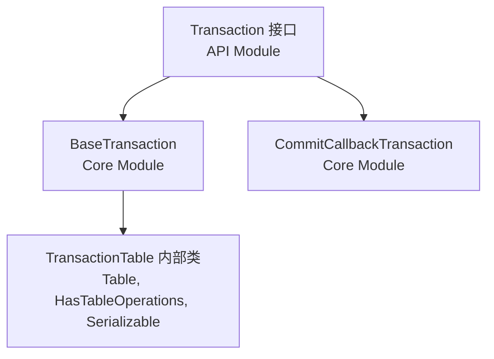

#### 1.2 Transaction类型枚举
```java
enum TransactionType {
    CREATE_TABLE,              // 初始表创建（无重试）
    REPLACE_TABLE,             // 完整表替换  
    CREATE_OR_REPLACE_TABLE,   // 条件创建/替换
    SIMPLE                     // 标准表更新，带冲突解决
}
```

### 2. Writer接口继承层次

#### 2.1 顶级Writer接口
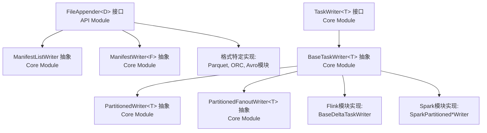

#### 2.2 专业化Writer接口
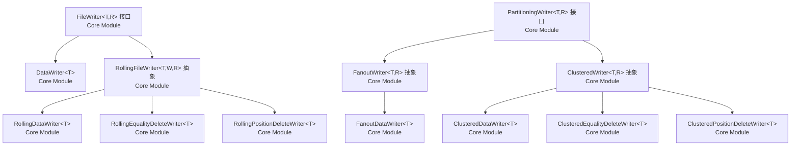

### 3. 值写入器继承层次（格式特定）

#### 3.1 Avro值写入器
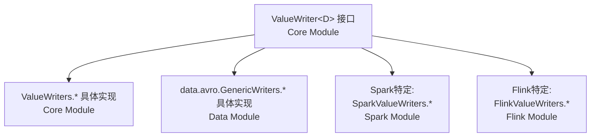

#### 3.2 Parquet值写入器
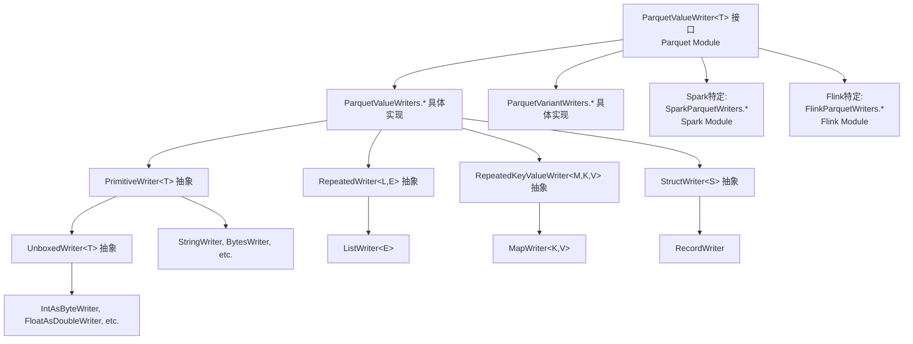

#### 3.3 ORC值写入器
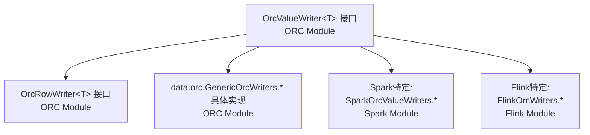

### 4. Writer工厂模式继承层次

#### 4.1 核心Writer工厂
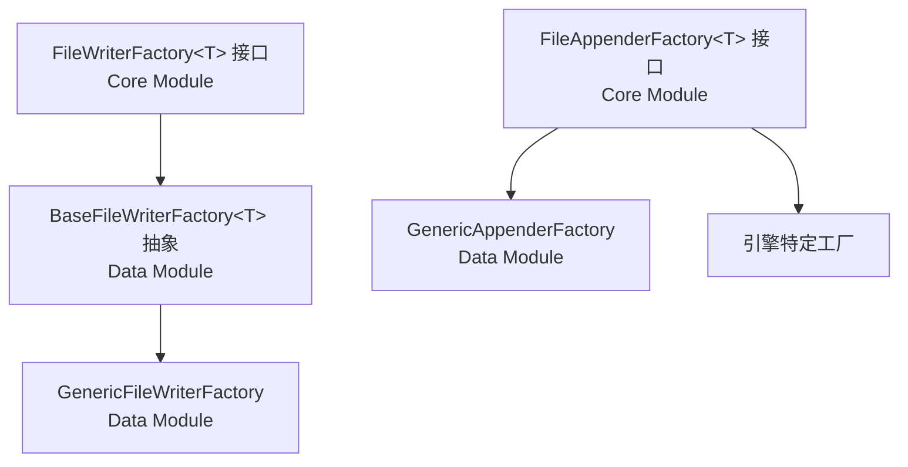

#### 4.2 引擎特定Writer工厂
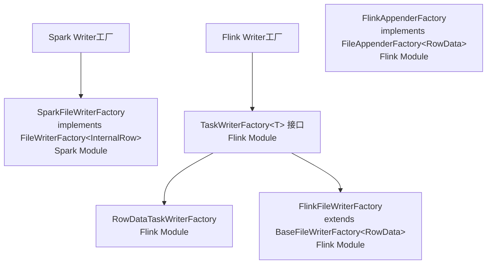

### 5. 快照生产者继承层次（表操作）

#### 5.1 基础快照生产者
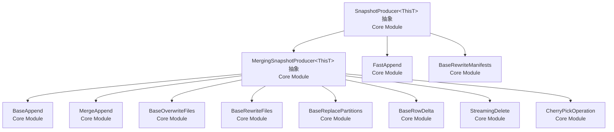

### 6. 引擎特定Writer继承层次

#### 6.1 Spark DataSource V2 Writer继承层次
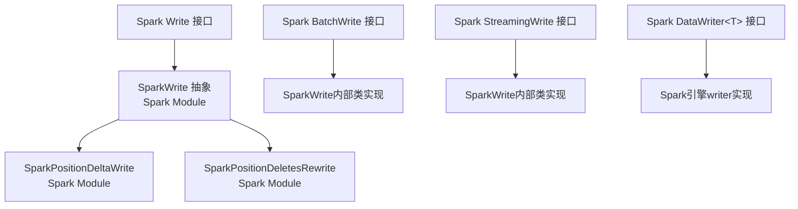

#### 6.2 Flink连接器Writer继承层次
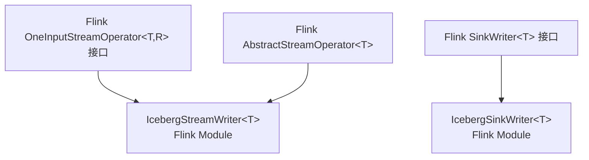

### 7. 跨模块关系

#### 7.1 格式集成
- **Core模块**：提供基础接口和抽象实现
- **Parquet模块**：实现ParquetValueWriter和相关格式特定写入器
- **ORC模块**：实现OrcValueWriter和相关格式特定写入器
- **Avro模块**：通过Core模块的Avro包集成
- **Data模块**：提供跨格式工作的通用实现

#### 7.2 引擎集成
- **Spark模块**：扩展Core写入器并实现Spark DataSource V2接口
- **Flink模块**：扩展Core写入器并实现Flink连接器接口

#### 7.3 委托和组合模式
- **RollingFileWriter**：委托给底层FileWriter实现
- **PartitioningWriter**：为不同分区组合多个FileWriter实例
- **BaseTaskWriter**：通过与FileAppenderFactory的组合提供通用功能
- **值写入器**：使用委托模式处理格式特定序列化

### 8. 关键设计模式

#### 8.1 工厂模式
- FileWriterFactory和FileAppenderFactory提供可插拔的写入器创建
- 引擎特定工厂用引擎特定实现扩展基础工厂

#### 8.2 模板方法模式
- BaseTaskWriter为任务级写入工作流程提供模板
- SnapshotProducer为提交操作提供模板

#### 8.3 策略模式
- 不同的写入器实现(Rolling、Fanout、Clustered)提供不同的写入策略
- 值写入器为每种格式实现不同的序列化策略

#### 8.4 组合模式
- 写入器组合FileAppender实例进行实际文件I/O
- 高级写入器组合低级写入器进行复杂操作

这个全面的继承层次显示了Iceberg的写入系统如何以清晰的关注点分离、可插拔组件设计，以及在整个系统中维护一致接口的同时支持多个计算引擎进行架构设计。

---

## 架构设计模式分析

### 1. 主要设计模式

#### 1.1 模板方法模式（Template Method Pattern）

##### SnapshotProducer实现模板方法
```java
public abstract class SnapshotProducer<ThisT> implements SnapshotUpdate<ThisT> {
    // 模板方法 - 定义算法骨架
    @Override
    public void commit() {
        Tasks.foreach(ops)
            .retry(retryCount)
            .exponentialBackoff(minWait, maxWait, totalWait, multiplier)
            .onlyRetryOn(CommitFailedException.class)
            .run(this::commitLoop);
    }
    
    private void commitLoop(TaskAttempt<TableOperations> attempt) {
        TableMetadata base = ops.refresh();
        TableMetadata updated;
        
        try {
            // 调用抽象方法 - 由子类实现
            updated = apply(base);
            ops.commit(base, updated);
            
        } catch (Exception e) {
            cleanUncommitted(newManifests);
            attempt.throwIfLastAttempt();
            throw e;
        }
    }
    
    // 抽象方法 - 子类必须实现
    protected abstract String operation();
    protected abstract Iterable<Object> summary();
    protected abstract TableMetadata apply(TableMetadata base);
}
```
**应用场景**：
- 所有快照创建操作的通用提交流程
- 重试逻辑、清理逻辑由基类统一处理
- 具体的操作逻辑由子类实现

##### BaseTaskWriter模板方法
```java
public abstract class BaseTaskWriter<T> implements TaskWriter<T> {
    // 模板方法
    @Override
    public WriteResult complete() throws IOException {
        close(); // 可被子类覆盖的钩子方法
        return WriteResult.builder()
            .addDataFiles(completedDataFiles)
            .addDeleteFiles(completedDeleteFiles)
            .addReferencedDataFiles(referencedDataFiles)
            .build();
    }
    
    // 模板方法
    @Override
    public void abort() throws IOException {
        // 统一的中止逻辑
        for (DataFile dataFile : completedDataFiles) {
            deleteFile(dataFile.path());
        }
        for (DeleteFile deleteFile : completedDeleteFiles) {
            deleteFile(deleteFile.path());
        }
    }
    
    // 抽象方法或钩子方法供子类实现
    protected abstract void doWrite(T record) throws IOException;
}
```

#### 1.2 工厂模式（Factory Pattern）

##### 抽象工厂模式 - FileWriterFactory体系
```java
// 抽象工厂接口
public interface FileWriterFactory<T> {
    FileWriter<T, DataWriteResult> newDataWriter(OutputFile outputFile, 
                                                FileFormat format, 
                                                PartitionSpec spec, 
                                                StructLike partition);
    
    FileWriter<T, DeleteWriteResult> newEqDeleteWriter(OutputFile outputFile,
                                                      FileFormat format,
                                                      PartitionSpec spec,
                                                      StructLike partition);
    
    FileWriter<T, DeleteWriteResult> newPosDeleteWriter(OutputFile outputFile,
                                                       FileFormat format, 
                                                       PartitionSpec spec,
                                                       StructLike partition);
}

// 基础实现
public abstract class BaseFileWriterFactory<T> implements FileWriterFactory<T> {
    protected final Table table;
    protected final FileFormat dataFileFormat;
    protected final Schema dataSchema;
    protected final FileAppenderFactory<T> appenderFactory;
    
    @Override
    public FileWriter<T, DataWriteResult> newDataWriter(...) {
        FileAppender<T> appender = appenderFactory.newAppender(outputFile, format);
        return new DataWriter<>(appender, spec, partition);
    }
}

// 引擎特定工厂
public class SparkFileWriterFactory extends BaseFileWriterFactory<InternalRow> {
    public SparkFileWriterFactory(Table table) {
        super(table, dataFileFormat, dataSchema, 
              new SparkAppenderFactory(table, schema, sparkSchema));
    }
}

public class FlinkFileWriterFactory extends BaseFileWriterFactory<RowData> {
    public FlinkFileWriterFactory(Table table) {
        super(table, dataFileFormat, dataSchema,
              new FlinkAppenderFactory(table, schema, flinkSchema));
    }
}
```

##### 工厂方法模式 - 值写入器创建
```java
public class ParquetValueWriters {
    // 工厂方法
    public static <T> ParquetValueWriter<T> strings() {
        return new StringWriter();
    }
    
    public static <T> ParquetValueWriter<T> decimals(int precision, int scale) {
        if (precision <= 9) {
            return new IntegerDecimalWriter(precision, scale);
        } else if (precision <= 18) {
            return new LongDecimalWriter(precision, scale);
        } else {
            return new FixedDecimalWriter(precision, scale);
        }
    }
    
    public static <T> ParquetValueWriter<T> option(ParquetValueWriter<T> writer) {
        return new OptionWriter<>(writer);
    }
}
```

#### 1.3 策略模式（Strategy Pattern）

##### 写入策略选择
```java
public class TaskWriterFactory<T> {
    public TaskWriter<T> create() {
        if (table.spec().isUnpartitioned()) {
            return new UnpartitionedWriter<>(fileWriterFactory);
        } else {
            if (distributionMode == DistributionMode.NONE) {
                // 策略1：扇出写入（数据未按分区排序）
                return new PartitionedFanoutWriter<>(fileWriterFactory);
            } else {
                // 策略2：聚类写入（数据按分区排序）
                return new PartitionedWriter<>(fileWriterFactory);
            }
        }
    }
}
```

##### 提交策略选择
```java
public enum WriteOperation {
    APPEND,
    DYNAMIC_OVERWRITE, 
    OVERWRITE_BY_FILTER,
    REPLACE_PARTITIONS
}

public class CommitProcessor {
    public static void process(Table table, WriteResult[] results, WriteOperation operation) {
        switch (operation) {
            case APPEND:
                AppendFiles append = table.newAppend();
                // 应用追加策略
                break;
            case DYNAMIC_OVERWRITE:
                OverwriteFiles overwrite = table.newOverwrite();
                // 应用动态覆写策略
                break;
            case OVERWRITE_BY_FILTER:
                OverwriteFiles overwrite = table.newOverwrite();
                // 应用按过滤器覆写策略
                break;
        }
    }
}
```

#### 1.4 装饰器模式（Decorator Pattern）

##### 写入器装饰
```java
// 基础写入器
class BaseParquetWriter<T> implements ParquetValueWriter<T> {
    public void write(int repetitionLevel, T value) {
        // 基础写入逻辑
    }
}

// 可选值装饰器
class OptionWriter<T> implements ParquetValueWriter<T> {
    private final ParquetValueWriter<T> writer;
    
    public OptionWriter(ParquetValueWriter<T> writer) {
        this.writer = writer;
    }
    
    @Override
    public void write(int repetitionLevel, T value) {
        if (value == null) {
            writeNull(repetitionLevel);
        } else {
            writer.write(repetitionLevel, value); // 装饰基础功能
        }
    }
}

// 滚动写入器装饰器
class RollingFileWriter<T, W extends FileWriter<T, R>, R> implements FileWriter<T, R> {
    private W currentWriter;
    private final Function<OutputFile, W> writerFactory;
    private final long targetFileSize;
    
    @Override
    public void write(T record) throws IOException {
        if (shouldRoll()) {
            rollToNewFile(); // 装饰功能：自动滚动
        }
        currentWriter.write(record); // 委托给实际写入器
    }
}
```

#### 1.5 观察者模式（Observer Pattern）

##### 提交事件观察
```java
public interface UpdateEvent {
    String operation();
    long snapshotId();
    Map<String, String> summary();
}

public class Transaction {
    private final List<UpdateEventListener> listeners = new ArrayList<>();
    
    public void addUpdateEventListener(UpdateEventListener listener) {
        listeners.add(listener);
    }
    
    @Override
    public void commitTransaction() {
        // ... 提交逻辑
        
        // 通知观察者
        UpdateEvent event = createUpdateEvent();
        listeners.forEach(listener -> listener.onUpdate(event));
    }
}

public interface UpdateEventListener {
    void onUpdate(UpdateEvent event);
}
```

##### 指标收集观察
```java
public class MetricsCollector {
    private final List<MetricsListener> listeners = new ArrayList<>();
    
    public void recordWrite(long bytes, int records) {
        WriteMetrics metrics = new WriteMetrics(bytes, records);
        listeners.forEach(listener -> listener.onWrite(metrics));
    }
}
```

#### 1.6 建造者模式（Builder Pattern）

##### 复杂对象构建
```java
public class WriteResult {
    private final List<DataFile> dataFiles;
    private final List<DeleteFile> deleteFiles; 
    private final CharSequenceSet referencedDataFiles;
    
    public static Builder builder() {
        return new Builder();
    }
    
    public static class Builder {
        private List<DataFile> dataFiles = new ArrayList<>();
        private List<DeleteFile> deleteFiles = new ArrayList<>(); 
        private CharSequenceSet referencedDataFiles = CharSequenceSet.empty();
        
        public Builder addDataFiles(List<DataFile> files) {
            this.dataFiles.addAll(files);
            return this;
        }
        
        public Builder addDeleteFiles(List<DeleteFile> files) {
            this.deleteFiles.addAll(files);
            return this;
        }
        
        public Builder addReferencedDataFiles(CharSequenceSet files) {
            this.referencedDataFiles = CharSequenceSet.union(this.referencedDataFiles, files);
            return this;
        }
        
        public WriteResult build() {
            return new WriteResult(dataFiles, deleteFiles, referencedDataFiles);
        }
    }
}

// 使用示例
WriteResult result = WriteResult.builder()
    .addDataFiles(completedDataFiles)
    .addDeleteFiles(completedDeleteFiles)
    .addReferencedDataFiles(referencedFiles)
    .build();
```

#### 1.7 适配器模式（Adapter Pattern）

##### 引擎数据类型适配
```java
// Spark到Iceberg适配器
public class InternalRowWrapper implements StructLike {
    private InternalRow row;
    private final StructType type;
    
    public StructLike wrap(InternalRow row) {
        this.row = row;
        return this;
    }
    
    @Override
    public Object get(int pos, Class javaClass) {
        // 将Spark InternalRow转换为Iceberg StructLike
        return convertSparkToIceberg(row.get(pos, type.fields()[pos].dataType()), javaClass);
    }
}

// Flink到Iceberg适配器
public class RowDataWrapper implements StructLike {
    private RowData row;
    private final RowType type;
    
    public StructLike wrap(RowData row) {
        this.row = row;
        return this;
    }
    
    @Override
    public Object get(int pos, Class javaClass) {
        // 将Flink RowData转换为Iceberg StructLike
        return convertFlinkToIceberg(extractFromRowData(row, pos, type), javaClass);
    }
}
```

##### 格式写入器适配
```java
// Parquet到Iceberg适配器
public class ParquetWriteSupport<T> extends WriteSupport<T> {
    private final ParquetValueWriter<T> writer;
    
    @Override
    public void write(T record) {
        writer.write(0, record); // 适配Parquet API到Iceberg API
    }
    
    @Override
    public WriteContext init(Configuration configuration) {
        // 适配配置和模式
        return new WriteContext(parquetSchema, metadata);
    }
}
```

#### 1.8 责任链模式（Chain of Responsibility Pattern）

##### 删除文件处理链
```java
public abstract class DeleteFileHandler {
    protected DeleteFileHandler nextHandler;
    
    public void setNext(DeleteFileHandler handler) {
        this.nextHandler = handler;
    }
    
    public void handle(DeleteFile deleteFile, DataFile dataFile) {
        if (canHandle(deleteFile, dataFile)) {
            doHandle(deleteFile, dataFile);
        } else if (nextHandler != null) {
            nextHandler.handle(deleteFile, dataFile);
        }
    }
    
    protected abstract boolean canHandle(DeleteFile deleteFile, DataFile dataFile);
    protected abstract void doHandle(DeleteFile deleteFile, DataFile dataFile);
}

class PositionDeleteHandler extends DeleteFileHandler {
    @Override
    protected boolean canHandle(DeleteFile deleteFile, DataFile dataFile) {
        return deleteFile.content() == FileContent.POSITION_DELETES;
    }
    
    @Override
    protected void doHandle(DeleteFile deleteFile, DataFile dataFile) {
        // 处理位置删除文件
    }
}

class EqualityDeleteHandler extends DeleteFileHandler {
    @Override
    protected boolean canHandle(DeleteFile deleteFile, DataFile dataFile) {
        return deleteFile.content() == FileContent.EQUALITY_DELETES;
    }
    
    @Override
    protected void doHandle(DeleteFile deleteFile, DataFile dataFile) {
        // 处理相等删除文件
    }
}
```

### 2. 架构模式

#### 2.1 分层架构（Layered Architecture）

```
┌─────────────────────────────────────┐
│        引擎集成层 (Engine Layer)        │  
│   Spark DataSource V2               │
│   Flink Connector API               │  
│   Kafka Connect                     │
├─────────────────────────────────────┤
│        格式支持层 (Format Layer)        │
│   Parquet Writers                   │
│   ORC Writers                       │
│   Avro Writers                      │
├─────────────────────────────────────┤
│         核心实现层 (Core Layer)         │
│   TaskWriter Implementations        │
│   FileWriter Implementations        │
│   Transaction Implementations       │
├─────────────────────────────────────┤
│         API定义层 (API Layer)          │
│   Writer Interfaces                 │
│   Transaction Interfaces            │
│   Table Operation Interfaces        │
└─────────────────────────────────────┘
```

每层职责明确：
- **API层**：定义契约和接口
- **Core层**：提供基础实现和通用逻辑
- **Format层**：处理特定文件格式
- **Engine层**：集成计算引擎

#### 2.2 插件架构（Plugin Architecture）

```java
// 插件接口
public interface FileAppenderFactory<T> {
    FileAppender<T> newAppender(OutputFile outputFile, FileFormat format);
}

// 插件注册
public class AppenderFactoryRegistry {
    private final Map<String, FileAppenderFactory<?>> factories = new HashMap<>();
    
    public void register(String engineName, FileAppenderFactory<?> factory) {
        factories.put(engineName, factory);
    }
    
    public FileAppenderFactory<?> getFactory(String engineName) {
        return factories.get(engineName);
    }
}

// 使用示例
registry.register("spark", new SparkAppenderFactory());
registry.register("flink", new FlinkAppenderFactory());
registry.register("generic", new GenericAppenderFactory());
```

#### 2.3 微核心架构（Microkernel Architecture）

核心提供最小必要功能，扩展通过插件实现：

```java
// 微核心 - 最小功能集
public class IcebergCore {
    private final TableOperations ops;
    private final PluginManager pluginManager;
    
    public Transaction newTransaction() {
        return new BaseTransaction(ops, pluginManager.getWriterFactories());
    }
}

// 插件扩展
public interface WriterPlugin {
    String engineName();
    FileWriterFactory<?> createWriterFactory(Table table);
    boolean supports(Class<?> recordType);
}

public class SparkWriterPlugin implements WriterPlugin {
    @Override
    public String engineName() { return "spark"; }
    
    @Override
    public FileWriterFactory<?> createWriterFactory(Table table) {
        return new SparkFileWriterFactory(table);
    }
    
    @Override
    public boolean supports(Class<?> recordType) {
        return InternalRow.class.isAssignableFrom(recordType);
    }
}
```

---

## 性能优化机制

### 1. 写入性能优化

#### 1.1 批处理写入
```java
public class BatchingWriter<T> implements FileWriter<T, WriteResult> {
    private final List<T> batch = new ArrayList<>();
    private final int batchSize;
    private final FileAppender<T> appender;
    
    @Override
    public void write(T record) throws IOException {
        batch.add(record);
        if (batch.size() >= batchSize) {
            flushBatch();
        }
    }
    
    private void flushBatch() throws IOException {
        appender.addAll(batch);
        batch.clear();
    }
}
```

#### 1.2 异步写入
```java
public class AsyncWriter<T> implements FileWriter<T, WriteResult> {
    private final ExecutorService writerExecutor;
    private final BlockingQueue<T> writeQueue;
    private final FileAppender<T> appender;
    
    public AsyncWriter(FileAppender<T> appender, int queueSize, int writerThreads) {
        this.appender = appender;
        this.writeQueue = new ArrayBlockingQueue<>(queueSize);
        this.writerExecutor = Executors.newFixedThreadPool(writerThreads);
        
        // 启动后台写入线程
        for (int i = 0; i < writerThreads; i++) {
            writerExecutor.submit(this::writerLoop);
        }
    }
    
    @Override
    public void write(T record) throws IOException {
        try {
            writeQueue.put(record); // 非阻塞入队
        } catch (InterruptedException e) {
            Thread.currentThread().interrupt();
            throw new IOException("Write interrupted", e);
        }
    }
    
    private void writerLoop() {
        try {
            while (!Thread.currentThread().isInterrupted()) {
                T record = writeQueue.take();
                appender.add(record);
            }
        } catch (InterruptedException e) {
            Thread.currentThread().interrupt();
        } catch (IOException e) {
            LOG.error("Writer thread failed", e);
        }
    }
}
```

#### 1.3 内存池化
```java
public class PooledBufferManager {
    private final Queue<ByteBuffer> bufferPool = new ConcurrentLinkedQueue<>();
    private final int bufferSize;
    private final int maxPoolSize;
    private final AtomicInteger poolSize = new AtomicInteger(0);
    
    public ByteBuffer acquireBuffer() {
        ByteBuffer buffer = bufferPool.poll();
        if (buffer == null) {
            buffer = ByteBuffer.allocateDirect(bufferSize);
        } else {
            buffer.clear();
            poolSize.decrementAndGet();
        }
        return buffer;
    }
    
    public void releaseBuffer(ByteBuffer buffer) {
        if (buffer != null && poolSize.get() < maxPoolSize) {
            bufferPool.offer(buffer);
            poolSize.incrementAndGet();
        }
    }
}

// 在写入器中使用
public class PooledParquetWriter<T> extends ParquetWriter<T> {
    private final PooledBufferManager bufferManager;
    
    @Override
    public void write(T record) throws IOException {
        ByteBuffer buffer = bufferManager.acquireBuffer();
        try {
            // 使用缓冲区写入
            writeToBuffer(record, buffer);
        } finally {
            bufferManager.releaseBuffer(buffer);
        }
    }
}
```

### 2. 文件管理优化

#### 2.1 文件滚动策略
```java
public class AdaptiveRollingStrategy {
    private final long targetFileSize;
    private final long maxFileSize;
    private final double growthFactor;
    private long currentTargetSize;
    
    public boolean shouldRoll(long currentSize, long recordSize) {
        if (currentSize + recordSize > maxFileSize) {
            return true; // 硬限制
        }
        
        if (currentSize >= currentTargetSize) {
            // 自适应调整目标大小
            adjustTargetSize();
            return true;
        }
        
        return false;
    }
    
    private void adjustTargetSize() {
        // 基于写入模式调整目标文件大小
        currentTargetSize = Math.min(
            (long) (currentTargetSize * growthFactor), 
            maxFileSize
        );
    }
}
```

#### 2.2 并发文件写入
```java
public class ConcurrentFileManager {
    private final Map<PartitionKey, FileWriter<?, ?>> activeWriters = new ConcurrentHashMap<>();
    private final ExecutorService writerExecutor;
    
    @SuppressWarnings("unchecked")
    public <T> void write(T record, PartitionKey partition) throws IOException {
        FileWriter<T, ?> writer = (FileWriter<T, ?>) activeWriters.computeIfAbsent(
            partition, 
            p -> createWriter(p)
        );
        
        // 并发写入到不同分区
        CompletableFuture.runAsync(() -> {
            try {
                writer.write(record);
            } catch (IOException e) {
                throw new UncheckedIOException(e);
            }
        }, writerExecutor);
    }
}
```

### 3. 压缩和编码优化

#### 3.1 自适应压缩
```java
public class AdaptiveCompressionWriter<T> implements FileAppender<T> {
    private final Map<CompressionCodec, Double> codecPerformance = new HashMap<>();
    private CompressionCodec currentCodec;
    private final List<CompressionCodec> availableCodecs;
    
    @Override
    public void add(T datum) {
        if (shouldEvaluateCompression()) {
            evaluateCompressionPerformance();
        }
        
        compressAndWrite(datum);
    }
    
    private void evaluateCompressionPerformance() {
        byte[] sampleData = collectSampleData();
        
        for (CompressionCodec codec : availableCodecs) {
            long startTime = System.nanoTime();
            byte[] compressed = codec.compress(sampleData);
            long compressionTime = System.nanoTime() - startTime;
            
            double score = calculateScore(compressed.length, compressionTime);
            codecPerformance.put(codec, score);
        }
        
        // 选择最佳编解码器
        currentCodec = codecPerformance.entrySet().stream()
            .max(Map.Entry.comparingByValue())
            .map(Map.Entry::getKey)
            .orElse(currentCodec);
    }
}
```

#### 2.2 列式存储优化
```java
public class ColumnBatchWriter {
    private final Map<String, ColumnBuffer> columnBuffers = new HashMap<>();
    private final int batchSize;
    
    public void writeRecord(StructLike record) {
        for (int i = 0; i < record.size(); i++) {
            String fieldName = schema.findColumnName(i);
            Object value = record.get(i, Object.class);
            
            ColumnBuffer buffer = columnBuffers.computeIfAbsent(
                fieldName, 
                name -> new ColumnBuffer(schema.findType(name))
            );
            
            buffer.add(value);
        }
        
        if (shouldFlush()) {
            flushColumns();
        }
    }
    
    private void flushColumns() {
        // 并行刷新各列
        columnBuffers.values().parallelStream().forEach(ColumnBuffer::flush);
        columnBuffers.clear();
    }
}
```

### 4. 网络和IO优化

#### 4.1 预取和缓存
```java
public class PrefetchingOutputFile implements OutputFile {
    private final OutputFile delegate;
    private final ExecutorService prefetchExecutor;
    private final Cache<String, ByteBuffer> writeCache;
    
    @Override
    public PositionOutputStream createOrOverwrite() throws IOException {
        return new PrefetchingOutputStream(
            delegate.createOrOverwrite(),
            prefetchExecutor,
            writeCache
        );
    }
    
    private class PrefetchingOutputStream extends PositionOutputStream {
        @Override
        public void write(byte[] b, int off, int len) throws IOException {
            // 异步预取下一个写入块
            prefetchExecutor.submit(() -> prefetchNextBlock());
            
            delegate.write(b, off, len);
        }
        
        private void prefetchNextBlock() {
            // 预取逻辑
        }
    }
}
```

#### 4.2 多路径写入
```java
public class MultiPathWriter implements OutputFile {
    private final List<OutputFile> paths;
    private final LoadBalancingStrategy strategy;
    
    @Override
    public PositionOutputStream createOrOverwrite() throws IOException {
        OutputFile selectedPath = strategy.selectPath(paths);
        return selectedPath.createOrOverwrite();
    }
}

public interface LoadBalancingStrategy {
    OutputFile selectPath(List<OutputFile> paths);
}

public class RoundRobinStrategy implements LoadBalancingStrategy {
    private final AtomicInteger counter = new AtomicInteger(0);
    
    @Override
    public OutputFile selectPath(List<OutputFile> paths) {
        int index = counter.getAndIncrement() % paths.size();
        return paths.get(index);
    }
}
```

### 5. 内存管理优化

#### 5.1 内存预算管理
```java
public class MemoryBudgetManager {
    private final long totalBudget;
    private final AtomicLong usedMemory = new AtomicLong(0);
    private final Map<String, Long> componentBudgets = new ConcurrentHashMap<>();
    
    public boolean allocate(String component, long size) {
        long currentUsed = usedMemory.get();
        if (currentUsed + size > totalBudget) {
            return false; // 内存不足
        }
        
        if (usedMemory.compareAndSet(currentUsed, currentUsed + size)) {
            componentBudgets.merge(component, size, Long::sum);
            return true;
        }
        
        return allocate(component, size); // 重试
    }
    
    public void release(String component, long size) {
        usedMemory.addAndGet(-size);
        componentBudgets.computeIfPresent(component, (k, v) -> v - size);
    }
    
    public boolean isUnderPressure() {
        return usedMemory.get() > totalBudget * 0.8; // 80%阈值
    }
}
```

#### 5.2 垃圾收集优化
```java
public class GCFriendlyWriter<T> implements FileWriter<T, WriteResult> {
    private final ObjectPool<ByteBuffer> bufferPool;
    private final ObjectPool<StringBuilder> stringPool;
    
    @Override
    public void write(T record) throws IOException {
        ByteBuffer buffer = bufferPool.borrow();
        StringBuilder stringBuilder = stringPool.borrow();
        
        try {
            // 使用池化对象，避免频繁分配
            processRecord(record, buffer, stringBuilder);
        } finally {
            bufferPool.return(buffer);
            stringPool.return(stringBuilder);
        }
    }
    
    private void processRecord(T record, ByteBuffer buffer, StringBuilder stringBuilder) {
        // 处理记录，重用对象
        buffer.clear();
        stringBuilder.setLength(0);
        
        // ... 处理逻辑
    }
}
```

### 6. 并发优化

#### 6.1 无锁数据结构
```java
public class LockFreeWriteQueue<T> {
    private final AtomicReferenceArray<T> buffer;
    private final AtomicLong writeIndex = new AtomicLong(0);
    private final AtomicLong readIndex = new AtomicLong(0);
    private final int capacity;
    
    public LockFreeWriteQueue(int capacity) {
        this.capacity = capacity;
        this.buffer = new AtomicReferenceArray<>(capacity);
    }
    
    public boolean offer(T item) {
        long currentWrite = writeIndex.get();
        long currentRead = readIndex.get();
        
        if (currentWrite - currentRead >= capacity) {
            return false; // 队列满
        }
        
        int index = (int) (currentWrite % capacity);
        if (buffer.compareAndSet(index, null, item)) {
            writeIndex.incrementAndGet();
            return true;
        }
        
        return false;
    }
    
    public T poll() {
        long currentRead = readIndex.get();
        long currentWrite = writeIndex.get();
        
        if (currentRead >= currentWrite) {
            return null; // 队列空
        }
        
        int index = (int) (currentRead % capacity);
        T item = buffer.get(index);
        
        if (item != null && buffer.compareAndSet(index, item, null)) {
            readIndex.incrementAndGet();
            return item;
        }
        
        return null;
    }
}
```

#### 6.2 工作窃取
```java
public class WorkStealingWriterPool {
    private final List<WorkStealingQueue<WriteTask>> queues;
    private final List<WriterWorker> workers;
    private final AtomicInteger roundRobin = new AtomicInteger(0);
    
    public void submitTask(WriteTask task) {
        int queueIndex = roundRobin.getAndIncrement() % queues.size();
        WorkStealingQueue<WriteTask> queue = queues.get(queueIndex);
        
        if (!queue.offer(task)) {
            // 队列满，寻找其他队列
            for (WorkStealingQueue<WriteTask> q : queues) {
                if (q.offer(task)) {
                    return;
                }
            }
            // 所有队列都满，直接执行
            task.run();
        }
    }
    
    private class WriterWorker extends Thread {
        private final int workerId;
        private final WorkStealingQueue<WriteTask> localQueue;
        
        @Override
        public void run() {
            while (!Thread.currentThread().isInterrupted()) {
                WriteTask task = localQueue.poll();
                
                if (task == null) {
                    // 从其他队列窃取任务
                    task = stealTask();
                }
                
                if (task != null) {
                    task.run();
                } else {
                    // 短暂休眠
                    LockSupport.parkNanos(1000);
                }
            }
        }
        
        private WriteTask stealTask() {
            for (int i = 0; i < queues.size(); i++) {
                if (i != workerId) {
                    WriteTask task = queues.get(i).steal();
                    if (task != null) {
                        return task;
                    }
                }
            }
            return null;
        }
    }
}
```

### 7. 监控和指标优化

#### 7.1 性能指标收集
```java
public class PerformanceMetrics {
    private final Timer writeLatency = Timer.newBuilder().build();
    private final Counter recordsWritten = Counter.newBuilder().build();
    private final Gauge memoryUsage = Gauge.newBuilder().build();
    private final Histogram fileSizes = Histogram.newBuilder().build();
    
    public void recordWrite(long latencyNs, int recordCount, long bytes) {
        writeLatency.record(latencyNs, TimeUnit.NANOSECONDS);
        recordsWritten.increment(recordCount);
        fileSizes.record(bytes);
    }
    
    public void recordMemoryUsage(long bytes) {
        memoryUsage.set(bytes);
    }
    
    public WriterMetrics getMetrics() {
        return WriterMetrics.builder()
            .avgWriteLatency(writeLatency.mean(TimeUnit.MILLISECONDS))
            .totalRecordsWritten(recordsWritten.count())
            .memoryUsage(memoryUsage.value())
            .avgFileSize(fileSizes.mean())
            .build();
    }
}
```

#### 7.2 自适应性能调优
```java
public class AdaptivePerformanceTuner {
    private final PerformanceMetrics metrics;
    private final ConfigurableWriter writer;
    
    public void tune() {
        WriterMetrics current = metrics.getMetrics();
        
        if (current.avgWriteLatency() > targetLatency) {
            // 延迟过高，增加批大小
            int currentBatchSize = writer.getBatchSize();
            writer.setBatchSize(Math.min(currentBatchSize * 2, maxBatchSize));
        }
        
        if (current.memoryUsage() > memoryThreshold) {
            // 内存使用过高，减少缓冲区大小
            int currentBufferSize = writer.getBufferSize();
            writer.setBufferSize(Math.max(currentBufferSize / 2, minBufferSize));
        }
        
        if (current.avgFileSize() < targetFileSize * 0.8) {
            // 文件太小，增加文件大小阈值
            long currentThreshold = writer.getFileSizeThreshold();
            writer.setFileSizeThreshold(Math.min(currentThreshold * 1.2, maxFileSize));
        }
    }
}
```

这些性能优化机制确保Iceberg写入系统能够在各种工作负载和环境条件下提供高效的性能，同时保持数据一致性和可靠性。

---

## 总结与建议

### 1. 架构优势总结

#### 1.1 设计优秀性
Apache Iceberg的写入机制展现出了卓越的架构设计：

**分层架构清晰**：
- API层定义清晰的契约和接口
- Core层提供基础实现和通用逻辑
- Format层处理不同存储格式的特定需求
- Engine层无缝集成主流计算引擎

**模块化程度高**：
- 各模块职责单一，耦合度低
- 支持独立演化和版本管理
- 便于测试和维护

**扩展性设计优良**：
- 插件化的文件格式支持
- 可扩展的引擎集成框架
- 灵活的写入策略选择

#### 1.2 技术实现优势

**事务ACID保证**：
- 完整的原子性、一致性、隔离性、持久性支持
- 乐观并发控制with automatic retry
- 分布式锁管理确保并发安全

**多引擎深度集成**：
- Spark DataSource V2完整实现
- Flink Connector API全面支持
- 原生支持流和批处理模式

**格式无关设计**：
- 统一的写入接口支持多种存储格式
- 格式特定优化透明化
- 自动压缩和编码选择

#### 1.3 性能优势

**多级优化策略**：
- 文件级滚动和批处理
- 列式存储优化
- 内存池化和缓存
- 并发和异步写入

**智能资源管理**：
- 内存预算管理
- 自适应文件大小
- 垃圾收集友好设计

**并发处理优秀**：
- 无锁数据结构
- 工作窃取算法
- 分区并行写入

### 2. 潜在改进建议

#### 2.1 性能进一步优化

**向量化写入增强**：
```java
// 建议：增强向量化批处理能力
public interface VectorizedWriter<T> {
    void writeBatch(VectorBatch<T> batch) throws IOException;
    void writeVector(ColumnVector vector, int startRow, int numRows) throws IOException;
}
```

**SIMD指令优化**：
- 在数值类型编码和压缩中利用SIMD指令
- 优化字符串和二进制数据的处理
- 加速校验和和哈希计算

**GPU加速支持**：
```java
// 建议：GPU加速的压缩和编码
public interface GPUAcceleratedWriter<T> {
    void writeWithGPUAcceleration(T record, GPUContext context) throws IOException;
    boolean isGPUAvailable();
}
```

#### 2.2 易用性改进

**配置简化**：
```java
// 建议：简化的配置API
public class WriterConfigBuilder {
    public static WriterConfig.Builder forEngine(String engine) {
        return WriterConfig.builder()
            .withOptimalDefaults(engine)
            .withAutoTuning(true);
    }
}

WriterConfig config = WriterConfigBuilder
    .forEngine("spark")
    .withTargetFileSize("128MB")
    .withCompressionRatio(0.7)
    .build();
```

**自动调优机制**：
```java
// 建议：机器学习驱动的自动调优
public class MLBasedAutoTuner {
    public WriterConfig optimize(WorkloadProfile profile, 
                                PerformanceHistory history) {
        // 基于历史性能数据和工作负载特征进行自动优化
        return mlModel.predict(profile, history);
    }
}
```

#### 2.3 监控和诊断增强

**实时性能监控**：
```java
// 建议：实时性能仪表板
public interface WriterDashboard {
    void displayMetrics(WriterMetrics metrics);
    void showBottlenecks(List<PerformanceBottleneck> bottlenecks);
    void recommendOptimizations(List<OptimizationSuggestion> suggestions);
}
```

**详细的错误诊断**：
```java
// 建议：增强的错误诊断
public class DiagnosticException extends IOException {
    private final DiagnosticInfo diagnosticInfo;
    
    public List<String> getPossibleSolutions() {
        return diagnosticInfo.generateSolutions();
    }
    
    public String getDetailedAnalysis() {
        return diagnosticInfo.analyzeRootCause();
    }
}
```

#### 2.4 生态系统扩展

**更多引擎支持**：
- Apache Beam集成
- Apache Storm集成
- Kubernetes Jobs集成

**云原生增强**：
```java
// 建议：云原生优化
public interface CloudOptimizedWriter<T> {
    void writeWithCloudOptimizations(T record, CloudContext context) throws IOException;
    void enableAutoScaling(AutoScalingConfig config);
    void configureMultiRegionReplication(ReplicationConfig config);
}
```

**更好的流处理支持**：
```java
// 建议：增强的流处理支持
public interface StreamingWriterEnhanced<T> extends StreamingWriter<T> {
    void enableBackpressure(BackpressureConfig config);
    void configureWatermarkHandling(WatermarkStrategy strategy);
    void setCheckpointingPolicy(CheckpointingPolicy policy);
}
```

### 3. 最佳实践建议

#### 3.1 写入优化实践

**合理分区策略**：
```java
// 建议：智能分区建议
public class PartitioningAdvisor {
    public PartitionSpec recommendPartitioning(Schema schema, 
                                             QueryPatterns patterns,
                                             DataCharacteristics characteristics) {
        // 分析查询模式和数据特征，推荐最优分区策略
        return analyzer.analyze(schema, patterns, characteristics);
    }
}
```

**文件大小优化**：
- 目标文件大小：128MB-1GB
- 避免小文件过多：<10MB文件应合并
- 监控文件大小分布

**写入模式选择**：
```java
// 建议：写入模式自动选择
public class WritePatternSelector {
    public WritePattern selectOptimalPattern(DataCharacteristics data,
                                           ResourceConstraints resources) {
        if (data.isStreamingWithLowLatency()) {
            return WritePattern.FAST_APPEND;
        } else if (data.isLargeVolumeBatch()) {
            return WritePattern.MERGE_APPEND;
        } else if (data.hasFrequentUpdates()) {
            return WritePattern.ROW_DELTA;
        }
        return WritePattern.STANDARD_APPEND;
    }
}
```

#### 3.2 性能监控实践

**关键指标监控**：
```java
// 建议：关键指标定义
public class WriterKPIs {
    public static final Set<String> CRITICAL_METRICS = Set.of(
        "write_throughput_mb_per_sec",
        "write_latency_p99_ms", 
        "file_size_distribution",
        "memory_usage_percentage",
        "commit_success_rate",
        "retry_count_per_commit"
    );
}
```

**性能基线建立**：
```java
// 建议：性能基线管理
public class PerformanceBaseline {
    public void establishBaseline(WorkloadType workload, 
                                 PerformanceMetrics metrics) {
        baselines.put(workload, metrics);
    }
    
    public PerformanceDrift detectDrift(WorkloadType workload,
                                       PerformanceMetrics current) {
        PerformanceMetrics baseline = baselines.get(workload);
        return analyzer.compareTo(baseline, current);
    }
}
```

#### 3.3 故障处理实践

**优雅降级机制**：
```java
// 建议：优雅降级策略
public class GracefulDegradation {
    public void handleResourcePressure(ResourcePressureEvent event) {
        switch (event.getSeverity()) {
            case LOW:
                reduceBufferSize();
                break;
            case MEDIUM:
                switchToSyncMode();
                break;
            case HIGH:
                enableBackpressure();
                break;
            case CRITICAL:
                pauseNonEssentialWrites();
                break;
        }
    }
}
```

**自动恢复机制**：
```java
// 建议：自动恢复策略
public class AutoRecovery {
    public void handleFailure(WriteFailureEvent event) {
        if (event.isRetryable()) {
            scheduleRetry(event, calculateBackoff(event.getRetryCount()));
        } else {
            redirectToFallbackPath(event);
        }
    }
}
```

### 4. 未来发展方向

#### 4.1 技术演进趋势

**AI/ML集成**：
- 基于机器学习的自动调优
- 智能压缩算法选择
- 预测性故障检测

**硬件加速**：
- GPU计算加速
- 专用硬件(FPGA)支持
- 新型存储设备优化

**云原生进化**：
- Serverless写入支持
- 多云环境优化
- 边缘计算集成

#### 4.2 社区贡献建议

**参与开源贡献**：
- 提交性能优化补丁
- 贡献新的引擎集成
- 改进文档和示例

**反馈和测试**：
- 报告生产环境问题
- 提供性能测试结果
- 分享最佳实践经验

### 5. 结论

Apache Iceberg的数据写入机制代表了现代数据湖技术的最高水平。其精心设计的架构、全面的功能支持、优秀的性能表现，以及良好的扩展性，使其成为企业级数据湖建设的理想选择。

通过本报告的深度分析，我们可以看到：

1. **架构设计的前瞻性**：分层架构、插件化设计、多引擎支持
2. **技术实现的完善性**：ACID事务、并发控制、错误处理
3. **性能优化的全面性**：从内存管理到网络优化的各个层面
4. **生态集成的深度**：与主流计算引擎的深度集成

对于技术团队而言，深入理解Iceberg的写入机制不仅有助于更好地使用这一技术，也为设计和实现类似的大数据系统提供了宝贵的参考和借鉴。

---

**文档版本**: 2025-09-02  
**分析基于**: Apache Iceberg 1.9.x  
**分析范围**: 完整写入机制源码深度分析（第二部分）  
**报告类型**: 引擎集成与架构优化技术解析