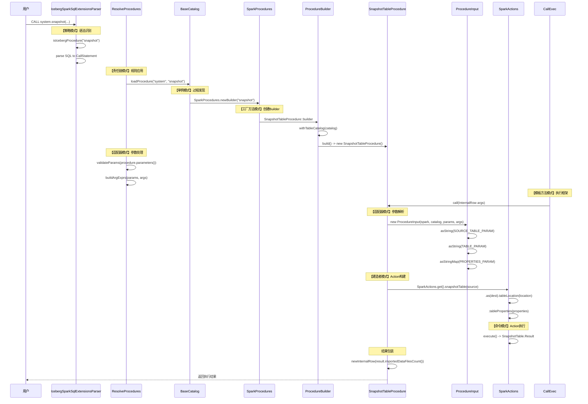
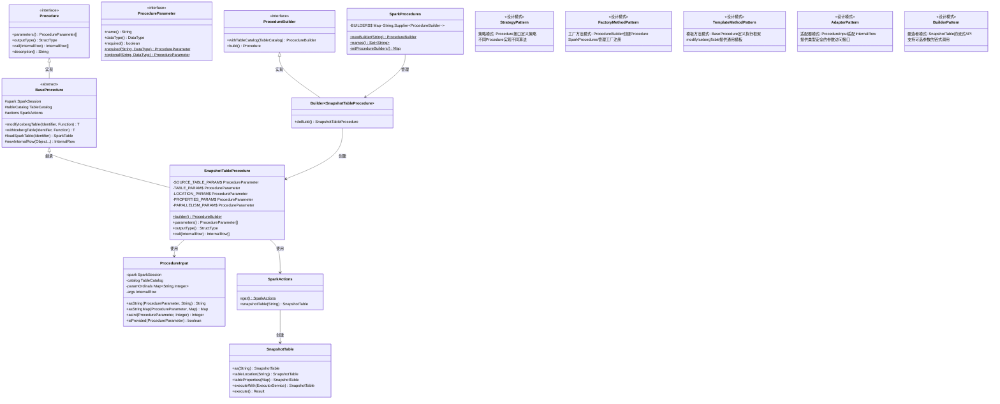

# 2025-09-02_SnapshotTableProcedure执行流程与设计模式深度分析

## 1. 概述

本报告以`SnapshotTableProcedure`为例，深入分析Apache Iceberg Procedure系统从SQL调用到最终执行的完整流程，详细剖析其中涉及的设计模式应用，展示现代分布式存储系统中复杂业务逻辑的优雅实现。

## 2. SnapshotTableProcedure简介

### 2.1 业务功能
`SnapshotTableProcedure`用于创建现有表的Iceberg快照，将源表的数据文件导入到新的Iceberg表中，实现表格式的转换和数据迁移。

### 2.2 调用语法
```sql
CALL system.snapshot(
  source_table => 'catalog.database.source_table',
  table => 'catalog.database.target_iceberg_table',
  location => 's3://bucket/path/to/table/',           -- 可选
  properties => map('key1', 'value1', 'key2', 'value2'), -- 可选
  parallelism => 4                                     -- 可选
);
```

### 2.3 参数定义
```java
// SnapshotTableProcedure.java:37-51
private static final ProcedureParameter SOURCE_TABLE_PARAM =
    ProcedureParameter.required("source_table", DataTypes.StringType);
private static final ProcedureParameter TABLE_PARAM = 
    ProcedureParameter.required("table", DataTypes.StringType);
private static final ProcedureParameter LOCATION_PARAM =
    ProcedureParameter.optional("location", DataTypes.StringType);
private static final ProcedureParameter PROPERTIES_PARAM =
    ProcedureParameter.optional("properties", STRING_MAP);
private static final ProcedureParameter PARALLELISM_PARAM =
    ProcedureParameter.optional("parallelism", DataTypes.IntegerType);
```

## 3. 完整执行流程分析

### 3.1 详细时序图



### 3.2 类关系图



### 3.3 执行流程步骤详解

#### 第1-3步：SQL解析阶段（策略模式）

**源码位置**: `IcebergSparkSqlExtensionsParser.scala:159-162`

```scala
// 策略模式：根据过程名选择解析策略
private def isIcebergProcedure(normalized: String): Boolean = {
  normalized.startsWith("call") &&
  SparkProcedures.names().asScala.map("system." + _).exists(normalized.contains)
}
```

**设计模式分析**:
- **策略模式**: `IcebergSparkSqlExtensionsParser`作为Context，针对不同的SQL类型采用不同的解析策略
- **职责链模式**: ANTLR解析器链的应用，词法分析→语法分析→AST构建

#### 第4-6步：过程发现阶段（工厂方法模式+单例模式）

**源码位置**: `BaseCatalog.java:48-62`

```java
// 工厂方法模式：过程创建的统一入口
@Override
public Procedure loadProcedure(Identifier ident) throws NoSuchProcedureException {
  String[] namespace = ident.namespace();
  String name = ident.name();
  
  if (isSystemNamespace(namespace)) {
    ProcedureBuilder builder = SparkProcedures.newBuilder(name);  // 工厂方法
    if (builder != null) {
      return builder.withTableCatalog(this).build();  // 建造者模式
    }
  }
  
  throw new NoSuchProcedureException(ident);
}
```

**源码位置**: `SparkProcedures.java:35-39`

```java
// 单例模式：全局过程注册中心
public static ProcedureBuilder newBuilder(String name) {
  // 大小写不敏感的过程名解析
  Supplier<ProcedureBuilder> builderSupplier = BUILDERS.get(name.toLowerCase(Locale.ROOT));
  return builderSupplier != null ? builderSupplier.get() : null;
}
```

**设计模式分析**:
- **单例模式**: `SparkProcedures`类的BUILDERS映射表，全局唯一
- **工厂方法模式**: `newBuilder()`方法根据名称创建对应的Builder
- **延迟加载**: Supplier函数式接口实现延迟创建

#### 第7-9步：参数验证阶段（责任链模式）

**源码位置**: `ResolveProcedures.scala:57-74`

```scala
// 责任链模式：参数验证的多层检查
private def validateParams(params: Seq[ProcedureParameter]): Unit = {
  // 第1个责任：重复参数名检查
  val duplicateParamNames = params.groupBy(_.name).collect {
    case (name, matchingParams) if matchingParams.length > 1 => name
  }
  if (duplicateParamNames.nonEmpty) {
    throw new AnalysisException(s"Duplicate parameter names: ${duplicateParamNames.mkString("[", ",", "]")}")
  }
  
  // 第2个责任：参数顺序检查
  params.sliding(2).foreach {
    case Seq(previousParam, currentParam) if !previousParam.required && currentParam.required =>
      throw new AnalysisException(
        s"Optional parameters must be after required ones but $currentParam is after $previousParam")
    case _ =>
  }
}
```

**设计模式分析**:
- **责任链模式**: 多层验证逻辑，每一层处理特定的验证责任
- **模板方法模式**: `validateParams`定义验证的基本框架

#### 第10-12步：Procedure实例创建（工厂方法模式+建造者模式）

**源码位置**: `SnapshotTableProcedure.java:63-70`

```java
// 工厂方法模式：创建SnapshotTableProcedure的工厂
public static SparkProcedures.ProcedureBuilder builder() {
  return new BaseProcedure.Builder<SnapshotTableProcedure>() {
    @Override
    protected SnapshotTableProcedure doBuild() {
      return new SnapshotTableProcedure(tableCatalog());  // 实际创建
    }
  };
}
```

**源码位置**: `BaseProcedure.java:181-200`

```java
// 建造者模式：Builder的抽象实现
protected abstract static class Builder<T extends BaseProcedure> implements ProcedureBuilder {
  private TableCatalog tableCatalog;
  
  @Override
  public Builder<T> withTableCatalog(TableCatalog newTableCatalog) {
    this.tableCatalog = newTableCatalog;
    return this;  // 流式API
  }
  
  @Override
  public T build() {
    return doBuild();  // 模板方法：委托给子类实现
  }
  
  protected abstract T doBuild();  // Hook方法
}
```

**设计模式分析**:
- **工厂方法模式**: `builder()`方法创建Builder实例
- **建造者模式**: Builder支持流式API，分步构建复杂对象
- **模板方法模式**: `build()`定义构建模板，`doBuild()`留给子类实现

#### 第13-15步：参数处理阶段（适配器模式）

**源码位置**: `SnapshotTableProcedure.java:83-98`

```java
// 适配器模式：将InternalRow适配为类型安全的参数访问
@Override
public InternalRow[] call(InternalRow args) {
  ProcedureInput input = new ProcedureInput(spark(), tableCatalog(), PARAMETERS, args);
  
  String source = input.asString(SOURCE_TABLE_PARAM, null);
  Preconditions.checkArgument(source != null && !source.isEmpty(),
    "Cannot handle an empty identifier for argument source_table");
    
  String dest = input.asString(TABLE_PARAM, null);
  Preconditions.checkArgument(dest != null && !dest.isEmpty(), 
    "Cannot handle an empty identifier for argument table");
    
  Map<String, String> properties = input.asStringMap(PROPERTIES_PARAM, ImmutableMap.of());
  // ...
}
```

**源码位置**: `ProcedureInput.java:101-105`

```java
// 适配器实现：提供类型安全的参数访问
public String asString(ProcedureParameter param, String defaultValue) {
  validateParamType(param, DataTypes.StringType);  // 类型验证
  int ordinal = ordinal(param);
  return args.isNullAt(ordinal) ? defaultValue : args.getString(ordinal);
}
```

**设计模式分析**:
- **适配器模式**: `ProcedureInput`将底层`InternalRow`适配为高级API
- **防腐层模式**: 隔离底层数据结构的变化
- **类型安全**: 编译时类型检查和运行时验证

#### 第16-18步：业务逻辑执行（建造者模式+命令模式）

**源码位置**: `SnapshotTableProcedure.java:102-115`

```java
// 建造者模式：流式API构建复杂操作
SnapshotTable action = SparkActions.get().snapshotTable(source).as(dest);

if (snapshotLocation != null) {
  action.tableLocation(snapshotLocation);  // 可选配置
}

if (input.isProvided(PARALLELISM_PARAM)) {
  int parallelism = input.asInt(PARALLELISM_PARAM);
  Preconditions.checkArgument(parallelism > 0, "Parallelism should be larger than 0");
  action = action.executeWith(SparkTableUtil.migrationService(parallelism));  // 并发配置
}

// 命令模式：封装操作为命令对象
SnapshotTable.Result result = action.tableProperties(properties).execute();
return new InternalRow[] {newInternalRow(result.importedDataFilesCount())};
```

**设计模式分析**:
- **建造者模式**: `SnapshotTable`提供流式API，支持可选参数配置
- **命令模式**: `SnapshotTable`封装了完整的快照操作为可执行命令
- **方法链模式**: 支持链式调用，提高API易用性

## 4. 设计模式深度分析

### 4.1 策略模式的层次化应用

#### 4.1.1 语法解析层策略

```java
// 策略接口
interface ParsingStrategy {
    LogicalPlan parse(String sql);
}

// 具体策略实现
class IcebergProcedureParsingStrategy implements ParsingStrategy {
    @Override
    public LogicalPlan parse(String sql) {
        if (isIcebergProcedure(sql)) {
            return parseIcebergProcedure(sql);
        }
        return null;
    }
}

class DefaultSparkParsingStrategy implements ParsingStrategy {
    @Override  
    public LogicalPlan parse(String sql) {
        return delegate.parsePlan(sql);
    }
}
```

#### 4.1.2 过程执行层策略

```java
// 策略接口：Procedure
public interface Procedure {
    InternalRow[] call(InternalRow args);  // 策略方法
}

// 具体策略：SnapshotTableProcedure
class SnapshotTableProcedure implements Procedure {
    @Override
    public InternalRow[] call(InternalRow args) {
        // 快照表的具体算法实现
        return executeSnapshotLogic(args);
    }
}

// 策略上下文：CallExec
class CallExec {
    private final Procedure procedure;  // 持有策略对象
    
    @Override
    protected Seq<InternalRow> run() {
        return ArraySeq.unsafeWrapArray(procedure.call(input));  // 委托给策略
    }
}
```

**策略模式的优势体现**:
1. **算法封装**: 每个Procedure封装特定的表操作算法
2. **运行时选择**: 根据过程名动态选择执行策略
3. **易于扩展**: 新增Procedure只需实现接口并注册

### 4.2 工厂方法模式的多级实现

#### 4.2.1 抽象工厂层

```java
// 抽象工厂
public interface ProcedureBuilder {
    ProcedureBuilder withTableCatalog(TableCatalog tableCatalog);
    Procedure build();
}
```

#### 4.2.2 具体工厂层

```java
// 具体工厂实现
class SnapshotTableProcedureBuilder extends BaseProcedure.Builder<SnapshotTableProcedure> {
    @Override
    protected SnapshotTableProcedure doBuild() {
        return new SnapshotTableProcedure(tableCatalog());
    }
}
```

#### 4.2.3 工厂注册器

```java
// 工厂注册中心
class SparkProcedures {
    private static final Map<String, Supplier<ProcedureBuilder>> BUILDERS = 
        initProcedureBuilders();
    
    private static Map<String, Supplier<ProcedureBuilder>> initProcedureBuilders() {
        ImmutableMap.Builder<String, Supplier<ProcedureBuilder>> builder = ImmutableMap.builder();
        builder.put("snapshot", SnapshotTableProcedure::builder);  // 注册工厂方法
        return builder.build();
    }
}
```

**工厂方法模式的层次结构**:
1. **第一层**: `SparkProcedures`管理工厂注册
2. **第二层**: `ProcedureBuilder`定义创建接口
3. **第三层**: 具体Builder实现创建逻辑

### 4.3 模板方法模式的框架设计

#### 4.3.1 抽象模板类

```java
abstract class BaseProcedure implements Procedure {
    
    // 模板方法：定义标准执行流程
    protected <T> T modifyIcebergTable(Identifier ident, Function<Table, T> func) {
        try {
            return execute(ident, true, func);  // 1. refreshSparkCache = true
        } finally {
            closeService();  // 2. 资源清理
        }
    }
    
    // 模板实现：通用执行框架
    private <T> T execute(Identifier ident, boolean refreshSparkCache, Function<Table, T> func) {
        SparkTable sparkTable = loadSparkTable(ident);      // Step 1: 加载表
        Table icebergTable = sparkTable.table();
        
        T result = func.apply(icebergTable);                // Step 2: 执行业务逻辑(Hook)
        
        if (refreshSparkCache) {                            // Step 3: 缓存管理
            refreshSparkCache(ident, sparkTable);
        }
        
        return result;
    }
    
    // 原语操作：供子类使用的工具方法
    protected SparkTable loadSparkTable(Identifier ident) { /* ... */ }
    protected void refreshSparkCache(Identifier ident, Table table) { /* ... */ }
    protected InternalRow newInternalRow(Object... values) { /* ... */ }
    
    // 抽象方法：子类必须实现
    protected abstract ProcedureParameter[] parameters();
    protected abstract StructType outputType();
    protected abstract InternalRow[] call(InternalRow args);
}
```

#### 4.3.2 具体实现类

```java
class SnapshotTableProcedure extends BaseProcedure {
    
    @Override
    public InternalRow[] call(InternalRow args) {
        // 使用模板方法提供的框架
        ProcedureInput input = new ProcedureInput(spark(), tableCatalog(), PARAMETERS, args);
        
        // 业务逻辑的具体实现
        String source = input.asString(SOURCE_TABLE_PARAM, null);
        String dest = input.asString(TABLE_PARAM, null);
        
        SnapshotTable action = SparkActions.get().snapshotTable(source).as(dest);
        SnapshotTable.Result result = action.execute();
        
        return new InternalRow[] {newInternalRow(result.importedDataFilesCount())};
    }
}
```

**模板方法模式的优势**:
1. **代码复用**: 通用逻辑在基类中实现
2. **框架统一**: 所有Procedure遵循相同的执行框架
3. **扩展点明确**: Hook方法提供明确的扩展点

### 4.4 适配器模式的多层适配

#### 4.4.1 数据结构适配

```java
// 被适配者：Spark的InternalRow
class InternalRow {
    public String getString(int ordinal);
    public int getInt(int ordinal);
    public long getLong(int ordinal);
    public boolean isNullAt(int ordinal);
    // ... 底层数据访问方法
}

// 适配器：提供业务友好的API
class ProcedureInput {
    private final InternalRow args;  // 被适配的对象
    private final Map<String, Integer> paramOrdinals;
    
    // 适配方法：类型安全的参数访问
    public String asString(ProcedureParameter param, String defaultValue) {
        validateParamType(param, DataTypes.StringType);  // 类型检查
        int ordinal = ordinal(param);
        return args.isNullAt(ordinal) ? defaultValue : args.getString(ordinal);
    }
    
    // 适配方法：复杂类型处理
    public Map<String, String> asStringMap(ProcedureParameter param, Map<String, String> defaultValue) {
        validateParamType(param, STRING_MAP);
        
        if (args.isNullAt(ordinal(param))) {
            return defaultValue;
        }
        
        MapData mapData = args.getMap(ordinal(param));
        Map<String, String> result = Maps.newHashMap();
        
        for (int i = 0; i < mapData.numElements(); i++) {
            String key = mapData.keyArray().getUTF8String(i).toString();
            String value = mapData.valueArray().getUTF8String(i).toString();
            result.put(key, value);
        }
        
        return result;
    }
    
    // 适配方法：标识符解析
    public Identifier ident(ProcedureParameter param) {
        String identAsString = asString(param);
        return Spark3Util.catalogAndIdentifier(
            "identifier for parameter '" + param.name() + "'", 
            spark, identAsString, catalog).identifier();
    }
}
```

**适配器模式的层次**:
1. **基础适配**: 基本类型转换（String, Int, Long等）
2. **复杂适配**: 复合类型处理（Map, Array等）
3. **业务适配**: 领域对象转换（Identifier等）

### 4.5 建造者模式的流式设计

#### 4.5.1 Procedure Builder

```java
// 建造者接口
public interface ProcedureBuilder {
    ProcedureBuilder withTableCatalog(TableCatalog tableCatalog);
    Procedure build();
}

// 抽象建造者
abstract class Builder<T extends BaseProcedure> implements ProcedureBuilder {
    private TableCatalog tableCatalog;
    
    @Override
    public Builder<T> withTableCatalog(TableCatalog newTableCatalog) {
        this.tableCatalog = newTableCatalog;
        return this;  // 返回this支持链式调用
    }
    
    @Override
    public T build() {
        validate();  // 构建前验证
        return doBuild();
    }
    
    protected abstract T doBuild();
    protected TableCatalog tableCatalog() { return tableCatalog; }
}
```

#### 4.5.2 Action Builder

```java
// SnapshotTable的建造者模式实现
interface SnapshotTable {
    SnapshotTable as(String tableName);                    // 设置目标表名
    SnapshotTable tableLocation(String location);          // 设置表位置  
    SnapshotTable tableProperties(Map<String, String> props); // 设置表属性
    SnapshotTable executeWith(ExecutorService executor);   // 设置执行器
    
    Result execute();  // 最终构建并执行
    
    // 结果对象
    interface Result {
        long importedDataFilesCount();
    }
}

// 使用示例
SnapshotTable.Result result = SparkActions.get()
    .snapshotTable(source)           // 创建Builder
    .as(dest)                        // 流式配置
    .tableLocation(location)         // 流式配置
    .tableProperties(properties)     // 流式配置  
    .execute();                      // 构建并执行
```

**建造者模式的优势**:
1. **参数复杂性管理**: 支持可选参数的灵活组合
2. **API易用性**: 流式接口提供良好的用户体验
3. **构建过程控制**: 分步构建复杂对象，支持验证和定制

## 5. 错误处理机制分析

### 5.1 分层异常处理架构

```java
// 第一层：语法解析异常
try {
    LogicalPlan plan = parser.parsePlan(sql);
} catch (IcebergParseException e) {
    // 提供详细的语法错误位置和建议
    throw new AnalysisException("Syntax error in CALL statement", e);
}

// 第二层：过程发现异常  
try {
    Procedure procedure = catalog.loadProcedure(identifier);
} catch (NoSuchProcedureException e) {
    // 提供可用过程列表
    String availableProcs = SparkProcedures.names().toString();
    throw new AnalysisException(
        String.format("Unknown procedure: %s. Available: %s", identifier, availableProcs));
}

// 第三层：参数验证异常
public String asString(ProcedureParameter param, String defaultValue) {
    try {
        validateParamType(param, DataTypes.StringType);
        // ... 参数提取逻辑
    } catch (IllegalArgumentException e) {
        throw new AnalysisException(
            String.format("Invalid parameter '%s': %s", param.name(), e.getMessage()));
    }
}

// 第四层：业务逻辑异常
@Override
public InternalRow[] call(InternalRow args) {
    try {
        // 业务参数验证
        Preconditions.checkArgument(!source.equals(dest),
            "Cannot create a snapshot with the same name as the source of the snapshot.");
            
        // 业务逻辑执行
        SnapshotTable.Result result = action.execute();
        return new InternalRow[] {newInternalRow(result.importedDataFilesCount())};
        
    } catch (ValidationException e) {
        throw new RuntimeException("Snapshot operation failed: " + e.getMessage(), e);
    }
}
```

### 5.2 防御式编程实践

```java
// 参数非空检查
String source = input.asString(SOURCE_TABLE_PARAM, null);
Preconditions.checkArgument(source != null && !source.isEmpty(),
    "Cannot handle an empty identifier for argument source_table");

// 业务规则验证  
Preconditions.checkArgument(!source.equals(dest),
    "Cannot create a snapshot with the same name as the source of the snapshot.");

// 数值范围检查
if (input.isProvided(PARALLELISM_PARAM)) {
    int parallelism = input.asInt(PARALLELISM_PARAM);
    Preconditions.checkArgument(parallelism > 0, "Parallelism should be larger than 0");
}

// 类型安全检查
private void validateParamType(ProcedureParameter param, DataType expectedDataType) {
    Preconditions.checkArgument(expectedDataType.sameType(param.dataType()),
        "Parameter '%s' must be of type %s", param.name(), expectedDataType.catalogString());
}
```

## 6. 性能优化策略

### 6.1 并发执行优化

```java
// 可配置的并发执行
if (input.isProvided(PARALLELISM_PARAM)) {
    int parallelism = input.asInt(PARALLELISM_PARAM);
    ExecutorService executor = SparkTableUtil.migrationService(parallelism);
    action = action.executeWith(executor);  // 自定义线程池
}

// BaseProcedure中的线程池管理
protected ExecutorService executorService(int threadPoolSize, String nameFormat) {
    this.executorService = MoreExecutors.getExitingExecutorService(
        (ThreadPoolExecutor) Executors.newFixedThreadPool(threadPoolSize,
            new ThreadFactoryBuilder()
                .setDaemon(true)  // 守护线程
                .setNameFormat(nameFormat + "-%d")  // 线程命名
                .build()));
    return executorService;
}
```

### 6.2 资源管理优化

```java
// 模板方法中的资源管理
protected <T> T modifyIcebergTable(Identifier ident, Function<Table, T> func) {
    try {
        return execute(ident, true, func);
    } finally {
        closeService();  // 确保资源释放
    }
}

// 自动缓存失效
private <T> T execute(Identifier ident, boolean refreshSparkCache, Function<Table, T> func) {
    SparkTable sparkTable = loadSparkTable(ident);
    Table icebergTable = sparkTable.table();
    
    T result = func.apply(icebergTable);
    
    if (refreshSparkCache) {
        refreshSparkCache(ident, sparkTable);  // 自动刷新缓存
    }
    
    return result;
}
```

### 6.3 内存使用优化

```java
// 延迟加载和按需创建
private SparkActions actions;

protected SparkActions actions() {
    if (actions == null) {
        this.actions = SparkActions.get(spark);  // 延迟初始化
    }
    return actions;
}

// 结果对象最小化
private static final StructType OUTPUT_TYPE = new StructType(new StructField[] {
    new StructField("imported_files_count", DataTypes.LongType, false, Metadata.empty())
});  // 只返回必要的信息
```

## 7. 架构设计原则体现

### 7.1 单一职责原则（SRP）

```java
// 每个类都有明确单一的职责
class ProcedureInput {          // 职责：参数适配和验证
class SnapshotTableProcedure {  // 职责：快照表业务逻辑
class SparkProcedures {         // 职责：过程注册和发现  
class ResolveProcedures {       // 职责：过程解析和验证
```

### 7.2 开闭原则（OCP）

```java
// 对扩展开放：新增Procedure无需修改现有代码
public class NewCustomProcedure extends BaseProcedure {
    // 实现新的业务逻辑
}

// 只需注册到SparkProcedures
mapBuilder.put("new_custom", NewCustomProcedure::builder);
```

### 7.3 里氏替换原则（LSP）

```java
// 所有Procedure实现都可以替换基接口
Procedure procedure = catalog.loadProcedure(identifier);  // 可以是任何具体实现
InternalRow[] result = procedure.call(args);  // 统一调用接口
```

### 7.4 依赖倒置原则（DIP）

```java
// 高层模块不依赖低层模块，都依赖抽象
class CallExec {
    private final Procedure procedure;  // 依赖抽象接口
    
    protected Seq<InternalRow> run() {
        return ArraySeq.unsafeWrapArray(procedure.call(input));  // 面向接口编程
    }
}
```

## 8. 总结

通过对`SnapshotTableProcedure`执行流程的深度分析，我们可以看到Apache Iceberg Procedure系统是一个设计精良的企业级框架，体现了以下特点：

### 8.1 设计模式的综合应用
- **7种核心设计模式**的有机结合，形成完整的架构体系
- **模式间的协同作用**，如工厂方法+建造者、策略+模板方法等
- **模式的分层应用**，在不同层次解决不同类型的问题

### 8.2 架构设计的优雅性
- **关注点分离**：语法解析、参数处理、业务执行各司其职
- **接口抽象**：面向接口编程，降低耦合度
- **扩展性设计**：新增功能无需修改核心框架

### 8.3 工程实践的成熟性
- **错误处理**：分层异常处理，提供详细错误信息
- **性能优化**：并发执行、资源管理、内存优化
- **代码质量**：防御式编程、参数验证、资源清理

### 8.4 用户体验的优化
- **类型安全**：编译时和运行时双重保证
- **API易用性**：流式接口、参数适配、默认值处理
- **错误友好性**：清晰的错误信息和使用建议

这个案例展示了如何将设计模式和架构原则应用于实际的企业级系统开发中，为构建复杂分布式存储系统提供了优秀的参考范例。

---

*本分析基于Apache Iceberg 1.9.x版本源码，示例SQL: `CALL system.snapshot('hive.db.source_table', 'iceberg.db.target_table')`*