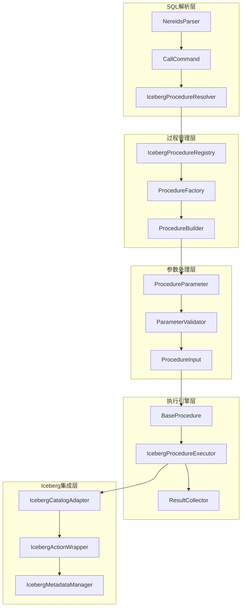

# 2025-09-02_基于Doris的Iceberg_Procedure系统技术设计文档

## 1. 概述

本文档基于Apache Doris现有的Procedure架构和Apache Iceberg Procedure的设计模式，设计一套完整的Doris Iceberg Procedure系统。该系统将为Doris提供原生的Iceberg表管理和维护功能，支持快照管理、数据优化、表迁移等核心操作。

## 2. 现状分析

### 2.1 Doris现有Procedure架构分析

#### 2.1.1 核心组件结构

```
Doris Procedure 系统
├── CallFunc (抽象基类)
│   ├── CallProcedure (PL/SQL过程调用)
│   ├── CallExecuteStmtFunc (外部SQL执行)
│   └── CallFlushAuditLogFunc (审计日志刷新)
├── PlSqlOperation (PL/SQL执行引擎)
├── PlsqlStoredProcedure (存储过程元数据)
└── PlsqlManager (过程管理器)
```

#### 2.1.2 现有设计特点

**优势：**
- **统一抽象**：通过CallFunc抽象类提供统一的调用接口
- **插件化设计**：支持内置函数和用户自定义过程的扩展
- **元数据管理**：完善的过程元数据存储和管理机制
- **权限控制**：集成的用户权限验证系统

**局限性：**
- **重度依赖PL/SQL**：现有架构主要面向PL/SQL过程
- **缺乏类型系统**：参数处理相对简单，缺乏强类型支持
- **功能单一**：主要用于SQL语句执行，缺乏专业的表管理功能

### 2.2 Spark Procedure与Doris Procedure对比

| 对比维度 | Spark Procedure | Doris Procedure | 设计建议 |
|---------|----------------|-----------------|----------|
| **架构模式** | 策略模式+工厂模式 | 简单工厂模式 | 引入策略和建造者模式 |
| **参数处理** | 强类型+适配器模式 | 字符串处理 | 实现类型安全的参数系统 |
| **扩展性** | 高度模块化 | 相对固化 | 设计可插拔的过程注册机制 |
| **执行框架** | 模板方法模式 | 直接执行 | 引入统一的执行框架 |
| **错误处理** | 分层异常处理 | 基础异常 | 完善的错误处理体系 |

## 3. 架构设计

### 3.1 整体架构图



### 3.2 核心设计模式应用

#### 3.2.1 策略模式 - 过程类型管理

```java
// 策略接口
public interface IcebergProcedure {
    String name();
    ProcedureParameter[] parameters();
    ProcedureResult execute(ProcedureContext context) throws ProcedureException;
    String description();
}

// 抽象策略实现
public abstract class BaseIcebergProcedure implements IcebergProcedure {
    protected final IcebergCatalogAdapter catalogAdapter;
    protected final ConnectContext connectContext;
    
    protected BaseIcebergProcedure(IcebergCatalogAdapter adapter, ConnectContext context) {
        this.catalogAdapter = adapter;
        this.connectContext = context;
    }
    
    // 模板方法：定义标准执行流程
    @Override
    public final ProcedureResult execute(ProcedureContext context) throws ProcedureException {
        try {
            validateParameters(context.getParameters());
            return doExecute(context);
        } catch (Exception e) {
            throw new ProcedureException("Procedure execution failed: " + e.getMessage(), e);
        }
    }
    
    protected abstract ProcedureResult doExecute(ProcedureContext context) throws Exception;
    protected abstract void validateParameters(Map<String, Object> parameters) throws ValidationException;
}
```

#### 3.2.2 工厂方法模式 - 过程创建

```java
// 抽象工厂
public interface ProcedureFactory {
    IcebergProcedure createProcedure(String name, IcebergCatalogAdapter adapter, ConnectContext context);
    boolean supports(String name);
    Set<String> getSupportedProcedures();
}

// 具体工厂实现
public class SnapshotManagementProcedureFactory implements ProcedureFactory {
    private static final Map<String, ProcedureBuilder> BUILDERS = ImmutableMap.<String, ProcedureBuilder>builder()
        .put("rollback_to_snapshot", RollbackToSnapshotProcedure::new)
        .put("rollback_to_timestamp", RollbackToTimestampProcedure::new)
        .put("set_current_snapshot", SetCurrentSnapshotProcedure::new)
        .put("expire_snapshots", ExpireSnapshotsProcedure::new)
        .put("cherrypick_snapshot", CherrypickSnapshotProcedure::new)
        .build();
    
    @Override
    public IcebergProcedure createProcedure(String name, IcebergCatalogAdapter adapter, ConnectContext context) {
        ProcedureBuilder builder = BUILDERS.get(name.toLowerCase());
        if (builder == null) {
            throw new IllegalArgumentException("Unsupported procedure: " + name);
        }
        return builder.build(adapter, context);
    }
    
    @Override
    public boolean supports(String name) {
        return BUILDERS.containsKey(name.toLowerCase());
    }
    
    @FunctionalInterface
    interface ProcedureBuilder {
        IcebergProcedure build(IcebergCatalogAdapter adapter, ConnectContext context);
    }
}
```

#### 3.2.3 建造者模式 - 复杂对象构建

```java
// 过程上下文建造者
public class ProcedureContext {
    private final Map<String, Object> parameters;
    private final ConnectContext connectContext;
    private final IcebergCatalogAdapter catalogAdapter;
    private final Map<String, Object> options;
    
    private ProcedureContext(Builder builder) {
        this.parameters = ImmutableMap.copyOf(builder.parameters);
        this.connectContext = builder.connectContext;
        this.catalogAdapter = builder.catalogAdapter;
        this.options = ImmutableMap.copyOf(builder.options);
    }
    
    public static Builder builder() {
        return new Builder();
    }
    
    public static class Builder {
        private Map<String, Object> parameters = new HashMap<>();
        private ConnectContext connectContext;
        private IcebergCatalogAdapter catalogAdapter;
        private Map<String, Object> options = new HashMap<>();
        
        public Builder withParameter(String name, Object value) {
            this.parameters.put(name, value);
            return this;
        }
        
        public Builder withConnectContext(ConnectContext context) {
            this.connectContext = context;
            return this;
        }
        
        public Builder withCatalogAdapter(IcebergCatalogAdapter adapter) {
            this.catalogAdapter = adapter;
            return this;
        }
        
        public Builder withOption(String key, Object value) {
            this.options.put(key, value);
            return this;
        }
        
        public ProcedureContext build() {
            Objects.requireNonNull(connectContext, "ConnectContext is required");
            Objects.requireNonNull(catalogAdapter, "CatalogAdapter is required");
            return new ProcedureContext(this);
        }
    }
}
```

#### 3.2.4 适配器模式 - 参数处理

```java
// 参数适配器
public class ProcedureParameterAdapter {
    private final Map<String, Object> rawParameters;
    private final ProcedureParameter[] parameterDefinitions;
    
    public ProcedureParameterAdapter(Map<String, Object> rawParameters, ProcedureParameter[] definitions) {
        this.rawParameters = rawParameters;
        this.parameterDefinitions = definitions;
    }
    
    public <T> T getParameter(String name, Class<T> type) {
        return getParameter(name, type, null);
    }
    
    public <T> T getParameter(String name, Class<T> type, T defaultValue) {
        Object rawValue = rawParameters.get(name);
        if (rawValue == null) {
            ProcedureParameter param = findParameterDefinition(name);
            if (param != null && param.isRequired()) {
                throw new ValidationException("Required parameter '" + name + "' is missing");
            }
            return defaultValue;
        }
        
        // 类型适配和转换
        return adaptValue(rawValue, type, name);
    }
    
    public String getTableIdentifier(String parameterName) {
        String rawValue = getParameter(parameterName, String.class);
        if (rawValue == null || rawValue.trim().isEmpty()) {
            throw new ValidationException("Table identifier parameter '" + parameterName + "' cannot be empty");
        }
        return normalizeTableIdentifier(rawValue);
    }
    
    public Long getSnapshotId(String parameterName) {
        Object rawValue = rawParameters.get(parameterName);
        if (rawValue == null) return null;
        
        if (rawValue instanceof Number) {
            return ((Number) rawValue).longValue();
        } else if (rawValue instanceof String) {
            try {
                return Long.parseLong((String) rawValue);
            } catch (NumberFormatException e) {
                throw new ValidationException("Invalid snapshot ID format: " + rawValue);
            }
        }
        
        throw new ValidationException("Snapshot ID must be a number, got: " + rawValue.getClass());
    }
    
    public Map<String, String> getStringMap(String parameterName) {
        Object rawValue = rawParameters.get(parameterName);
        if (rawValue == null) return Collections.emptyMap();
        
        if (rawValue instanceof Map) {
            @SuppressWarnings("unchecked")
            Map<Object, Object> rawMap = (Map<Object, Object>) rawValue;
            return rawMap.entrySet().stream()
                .collect(Collectors.toMap(
                    e -> String.valueOf(e.getKey()),
                    e -> String.valueOf(e.getValue())
                ));
        }
        
        throw new ValidationException("Parameter '" + parameterName + "' must be a map");
    }
    
    private <T> T adaptValue(Object rawValue, Class<T> type, String parameterName) {
        if (type.isInstance(rawValue)) {
            return type.cast(rawValue);
        }
        
        // 常见类型转换
        if (type == String.class) {
            return type.cast(String.valueOf(rawValue));
        } else if (type == Long.class && rawValue instanceof Number) {
            return type.cast(((Number) rawValue).longValue());
        } else if (type == Integer.class && rawValue instanceof Number) {
            return type.cast(((Number) rawValue).intValue());
        } else if (type == Boolean.class) {
            if (rawValue instanceof Boolean) {
                return type.cast(rawValue);
            } else if (rawValue instanceof String) {
                return type.cast(Boolean.parseBoolean((String) rawValue));
            }
        }
        
        throw new ValidationException("Cannot convert parameter '" + parameterName + 
            "' from " + rawValue.getClass() + " to " + type);
    }
    
    private ProcedureParameter findParameterDefinition(String name) {
        return Arrays.stream(parameterDefinitions)
            .filter(p -> p.getName().equals(name))
            .findFirst()
            .orElse(null);
    }
    
    private String normalizeTableIdentifier(String identifier) {
        // 处理catalog.database.table格式
        String[] parts = identifier.split("\\.");
        if (parts.length == 1) {
            // 只有表名，使用当前数据库
            return String.format("%s.%s.%s", 
                getCurrentCatalog(), getCurrentDatabase(), parts[0]);
        } else if (parts.length == 2) {
            // database.table格式
            return String.format("%s.%s.%s", 
                getCurrentCatalog(), parts[0], parts[1]);
        } else if (parts.length == 3) {
            // 完整格式
            return identifier;
        } else {
            throw new ValidationException("Invalid table identifier format: " + identifier);
        }
    }
    
    private String getCurrentCatalog() {
        // 从ConnectContext获取当前目录
        return "iceberg"; // 默认值
    }
    
    private String getCurrentDatabase() {
        // 从ConnectContext获取当前数据库
        return "default"; // 默认值
    }
}
```

## 4. 核心接口与类设计

### 4.1 过程参数定义

```java
// 过程参数定义
public class ProcedureParameter {
    private final String name;
    private final ParameterType type;
    private final boolean required;
    private final Object defaultValue;
    private final String description;
    
    private ProcedureParameter(Builder builder) {
        this.name = builder.name;
        this.type = builder.type;
        this.required = builder.required;
        this.defaultValue = builder.defaultValue;
        this.description = builder.description;
    }
    
    public static ProcedureParameter required(String name, ParameterType type) {
        return new Builder(name, type).required(true).build();
    }
    
    public static ProcedureParameter optional(String name, ParameterType type, Object defaultValue) {
        return new Builder(name, type).required(false).defaultValue(defaultValue).build();
    }
    
    // Getter methods...
    public String getName() { return name; }
    public ParameterType getType() { return type; }
    public boolean isRequired() { return required; }
    public Object getDefaultValue() { return defaultValue; }
    public String getDescription() { return description; }
    
    public static class Builder {
        private final String name;
        private final ParameterType type;
        private boolean required = true;
        private Object defaultValue;
        private String description;
        
        public Builder(String name, ParameterType type) {
            this.name = name;
            this.type = type;
        }
        
        public Builder required(boolean required) {
            this.required = required;
            return this;
        }
        
        public Builder defaultValue(Object defaultValue) {
            this.defaultValue = defaultValue;
            return this;
        }
        
        public Builder description(String description) {
            this.description = description;
            return this;
        }
        
        public ProcedureParameter build() {
            return new ProcedureParameter(this);
        }
    }
}

// 参数类型枚举
public enum ParameterType {
    STRING,
    INTEGER,
    LONG,
    BOOLEAN,
    TIMESTAMP,
    STRING_MAP,
    STRING_ARRAY,
    TABLE_IDENTIFIER
}
```

### 4.2 Iceberg目录适配器

```java
// Iceberg目录适配器
public class IcebergCatalogAdapter {
    private final CatalogIf<? extends ExternalCatalog> dorisCatalog;
    private final org.apache.iceberg.catalog.Catalog icebergCatalog;
    private final String catalogName;
    
    public IcebergCatalogAdapter(CatalogIf<? extends ExternalCatalog> dorisCatalog, String catalogName) {
        this.dorisCatalog = dorisCatalog;
        this.catalogName = catalogName;
        this.icebergCatalog = initializeIcebergCatalog();
    }
    
    public org.apache.iceberg.Table loadTable(String tableIdentifier) throws TableNotFoundException {
        try {
            TableIdentifier icebergId = parseTableIdentifier(tableIdentifier);
            return icebergCatalog.loadTable(icebergId);
        } catch (Exception e) {
            throw new TableNotFoundException("Cannot load table: " + tableIdentifier, e);
        }
    }
    
    public boolean tableExists(String tableIdentifier) {
        try {
            TableIdentifier icebergId = parseTableIdentifier(tableIdentifier);
            return icebergCatalog.tableExists(icebergId);
        } catch (Exception e) {
            return false;
        }
    }
    
    public List<TableIdentifier> listTables(String database) {
        try {
            return icebergCatalog.listTables(Namespace.of(database));
        } catch (Exception e) {
            return Collections.emptyList();
        }
    }
    
    public void refreshTable(String tableIdentifier) {
        // 刷新Doris的表元数据缓存
        try {
            TableIdentifier icebergId = parseTableIdentifier(tableIdentifier);
            icebergCatalog.invalidateTable(icebergId);
        } catch (Exception e) {
            // 忽略刷新失败
        }
    }
    
    private org.apache.iceberg.catalog.Catalog initializeIcebergCatalog() {
        // 根据Doris catalog配置初始化Iceberg catalog
        if (dorisCatalog instanceof HMSExternalCatalog) {
            return createHiveCatalog((HMSExternalCatalog) dorisCatalog);
        } else if (dorisCatalog instanceof IcebergExternalCatalog) {
            return ((IcebergExternalCatalog) dorisCatalog).getCatalog();
        } else {
            throw new UnsupportedOperationException("Unsupported catalog type: " + dorisCatalog.getClass());
        }
    }
    
    private TableIdentifier parseTableIdentifier(String identifier) {
        String[] parts = identifier.split("\\.");
        if (parts.length == 2) {
            return TableIdentifier.of(parts[0], parts[1]);
        } else if (parts.length == 3) {
            return TableIdentifier.of(parts[1], parts[2]); // 忽略catalog部分
        } else {
            throw new IllegalArgumentException("Invalid table identifier: " + identifier);
        }
    }
}
```

### 4.3 过程注册机制

```java
// 过程注册表
@Component
public class IcebergProcedureRegistry {
    private static final Logger LOG = LoggerFactory.getLogger(IcebergProcedureRegistry.class);
    
    private final Map<String, ProcedureFactory> factories = new ConcurrentHashMap<>();
    private final Map<String, ProcedureMetadata> metadata = new ConcurrentHashMap<>();
    
    public IcebergProcedureRegistry() {
        registerBuiltinProcedures();
    }
    
    public void registerFactory(String namespace, ProcedureFactory factory) {
        factories.put(namespace.toLowerCase(), factory);
        LOG.info("Registered procedure factory for namespace: {}", namespace);
    }
    
    public IcebergProcedure createProcedure(String name, IcebergCatalogAdapter adapter, ConnectContext context) 
            throws ProcedureNotFoundException {
        for (ProcedureFactory factory : factories.values()) {
            if (factory.supports(name)) {
                return factory.createProcedure(name, adapter, context);
            }
        }
        throw new ProcedureNotFoundException("Unknown procedure: " + name);
    }
    
    public Set<String> listAllProcedures() {
        return factories.values().stream()
            .flatMap(factory -> factory.getSupportedProcedures().stream())
            .collect(Collectors.toSet());
    }
    
    public ProcedureMetadata getProcedureMetadata(String name) {
        return metadata.get(name.toLowerCase());
    }
    
    private void registerBuiltinProcedures() {
        // 注册内置过程工厂
        registerFactory("snapshot_management", new SnapshotManagementProcedureFactory());
        registerFactory("data_maintenance", new DataMaintenanceProcedureFactory());
        registerFactory("table_migration", new TableMigrationProcedureFactory());
        registerFactory("table_administration", new TableAdministrationProcedureFactory());
        registerFactory("utility", new UtilityProcedureFactory());
        
        // 注册过程元数据
        registerProcedureMetadata();
    }
    
    private void registerProcedureMetadata() {
        // 这里可以从配置文件或注解中加载元数据
        metadata.put("rollback_to_snapshot", ProcedureMetadata.builder()
            .name("rollback_to_snapshot")
            .description("Rollback table to a specific snapshot")
            .category("snapshot_management")
            .parameters(Arrays.asList(
                ProcedureParameter.required("table", ParameterType.TABLE_IDENTIFIER),
                ProcedureParameter.required("snapshot_id", ParameterType.LONG)
            ))
            .build());
        // ... 其他过程的元数据
    }
}
```

## 5. 具体Procedure实现示例

### 5.1 RollbackToSnapshotProcedure

```java
public class RollbackToSnapshotProcedure extends BaseIcebergProcedure {
    
    private static final ProcedureParameter[] PARAMETERS = {
        ProcedureParameter.required("table", ParameterType.TABLE_IDENTIFIER)
            .description("Target table identifier"),
        ProcedureParameter.required("snapshot_id", ParameterType.LONG)
            .description("Target snapshot ID to rollback to")
    };
    
    public RollbackToSnapshotProcedure(IcebergCatalogAdapter adapter, ConnectContext context) {
        super(adapter, context);
    }
    
    @Override
    public String name() {
        return "rollback_to_snapshot";
    }
    
    @Override
    public ProcedureParameter[] parameters() {
        return PARAMETERS;
    }
    
    @Override
    protected ProcedureResult doExecute(ProcedureContext context) throws Exception {
        ProcedureParameterAdapter params = new ProcedureParameterAdapter(
            context.getParameters(), PARAMETERS);
        
        String tableIdentifier = params.getTableIdentifier("table");
        Long snapshotId = params.getSnapshotId("snapshot_id");
        
        // 加载Iceberg表
        org.apache.iceberg.Table table = catalogAdapter.loadTable(tableIdentifier);
        
        // 获取当前快照信息
        Snapshot currentSnapshot = table.currentSnapshot();
        Long previousSnapshotId = currentSnapshot != null ? currentSnapshot.snapshotId() : null;
        
        // 验证目标快照存在
        Snapshot targetSnapshot = table.snapshot(snapshotId);
        if (targetSnapshot == null) {
            throw new ValidationException("Snapshot not found: " + snapshotId);
        }
        
        // 执行回滚操作
        table.manageSnapshots().rollbackTo(snapshotId).commit();
        
        // 刷新Doris表缓存
        catalogAdapter.refreshTable(tableIdentifier);
        
        // 构建返回结果
        ProcedureResult.Builder resultBuilder = ProcedureResult.builder()
            .addColumn("table_name", ParameterType.STRING)
            .addColumn("previous_snapshot_id", ParameterType.LONG)
            .addColumn("current_snapshot_id", ParameterType.LONG)
            .addRow(tableIdentifier, previousSnapshotId, snapshotId);
        
        return resultBuilder.build();
    }
    
    @Override
    protected void validateParameters(Map<String, Object> parameters) throws ValidationException {
        ProcedureParameterAdapter params = new ProcedureParameterAdapter(parameters, PARAMETERS);
        
        String tableIdentifier = params.getTableIdentifier("table");
        if (!catalogAdapter.tableExists(tableIdentifier)) {
            throw new ValidationException("Table not found: " + tableIdentifier);
        }
        
        Long snapshotId = params.getSnapshotId("snapshot_id");
        if (snapshotId == null || snapshotId <= 0) {
            throw new ValidationException("Invalid snapshot ID: " + snapshotId);
        }
    }
    
    @Override
    public String description() {
        return "Rollback Iceberg table to a specific snapshot ID. " +
               "This operation is atomic and will invalidate Spark cache plans that reference the table.";
    }
}
```

### 5.2 ExpireSnapshotsProcedure

```java
public class ExpireSnapshotsProcedure extends BaseIcebergProcedure {
    
    private static final ProcedureParameter[] PARAMETERS = {
        ProcedureParameter.required("table", ParameterType.TABLE_IDENTIFIER)
            .description("Target table identifier"),
        ProcedureParameter.optional("older_than", ParameterType.TIMESTAMP, null)
            .description("Expire snapshots older than this timestamp"),
        ProcedureParameter.optional("retain_last", ParameterType.INTEGER, 1)
            .description("Minimum number of snapshots to retain"),
        ProcedureParameter.optional("max_concurrent_deletes", ParameterType.INTEGER, null)
            .description("Maximum number of concurrent delete operations"),
        ProcedureParameter.optional("snapshot_ids", ParameterType.STRING_ARRAY, null)
            .description("Specific snapshot IDs to expire")
    };
    
    public ExpireSnapshotsProcedure(IcebergCatalogAdapter adapter, ConnectContext context) {
        super(adapter, context);
    }
    
    @Override
    public String name() {
        return "expire_snapshots";
    }
    
    @Override
    public ProcedureParameter[] parameters() {
        return PARAMETERS;
    }
    
    @Override
    protected ProcedureResult doExecute(ProcedureContext context) throws Exception {
        ProcedureParameterAdapter params = new ProcedureParameterAdapter(
            context.getParameters(), PARAMETERS);
        
        String tableIdentifier = params.getTableIdentifier("table");
        Long olderThanMillis = params.getParameter("older_than", Long.class);
        Integer retainLast = params.getParameter("retain_last", Integer.class, 1);
        Integer maxConcurrentDeletes = params.getParameter("max_concurrent_deletes", Integer.class);
        String[] snapshotIds = params.getParameter("snapshot_ids", String[].class);
        
        // 加载Iceberg表
        org.apache.iceberg.Table table = catalogAdapter.loadTable(tableIdentifier);
        
        // 构建过期操作
        ExpireSnapshots expireAction = table.expireSnapshots();
        
        if (olderThanMillis != null) {
            expireAction.expireOlderThan(olderThanMillis);
        }
        
        if (retainLast != null && retainLast > 0) {
            expireAction.retainLast(retainLast);
        }
        
        if (snapshotIds != null && snapshotIds.length > 0) {
            for (String snapshotId : snapshotIds) {
                expireAction.expireSnapshotId(Long.parseLong(snapshotId));
            }
        }
        
        // 配置并发执行
        if (maxConcurrentDeletes != null && maxConcurrentDeletes > 0) {
            ExecutorService executor = createExecutorService(maxConcurrentDeletes, "expire-snapshots");
            expireAction.executeDeleteWith(executor);
        }
        
        // 执行过期操作
        ExpireSnapshots.Result result = expireAction.commit();
        
        // 刷新表缓存
        catalogAdapter.refreshTable(tableIdentifier);
        
        // 构建返回结果
        return ProcedureResult.builder()
            .addColumn("table_name", ParameterType.STRING)
            .addColumn("deleted_data_files_count", ParameterType.LONG)
            .addColumn("deleted_position_delete_files_count", ParameterType.LONG)
            .addColumn("deleted_equality_delete_files_count", ParameterType.LONG)
            .addColumn("deleted_manifest_files_count", ParameterType.LONG)
            .addColumn("deleted_manifest_lists_count", ParameterType.LONG)
            .addRow(tableIdentifier,
                    result.deletedDataFilesCount(),
                    result.deletedPositionDeleteFilesCount(),
                    result.deletedEqualityDeleteFilesCount(),
                    result.deletedManifestsCount(),
                    result.deletedManifestListsCount())
            .build();
    }
    
    @Override
    protected void validateParameters(Map<String, Object> parameters) throws ValidationException {
        ProcedureParameterAdapter params = new ProcedureParameterAdapter(parameters, PARAMETERS);
        
        String tableIdentifier = params.getTableIdentifier("table");
        if (!catalogAdapter.tableExists(tableIdentifier)) {
            throw new ValidationException("Table not found: " + tableIdentifier);
        }
        
        Integer retainLast = params.getParameter("retain_last", Integer.class);
        if (retainLast != null && retainLast < 0) {
            throw new ValidationException("retain_last must be >= 0, got: " + retainLast);
        }
        
        Integer maxConcurrentDeletes = params.getParameter("max_concurrent_deletes", Integer.class);
        if (maxConcurrentDeletes != null && maxConcurrentDeletes <= 0) {
            throw new ValidationException("max_concurrent_deletes must be > 0, got: " + maxConcurrentDeletes);
        }
    }
    
    @Override
    public String description() {
        return "Expire old snapshots and their associated metadata files from an Iceberg table. " +
               "This operation helps to clean up storage space by removing old table versions.";
    }
    
    private ExecutorService createExecutorService(int threadCount, String namePrefix) {
        return Executors.newFixedThreadPool(threadCount, 
            new ThreadFactoryBuilder()
                .setNameFormat(namePrefix + "-%d")
                .setDaemon(true)
                .build());
    }
}
```

### 5.3 SnapshotTableProcedure

```java
public class SnapshotTableProcedure extends BaseIcebergProcedure {
    
    private static final ProcedureParameter[] PARAMETERS = {
        ProcedureParameter.required("source_table", ParameterType.TABLE_IDENTIFIER)
            .description("Source table to create snapshot from"),
        ProcedureParameter.required("target_table", ParameterType.TABLE_IDENTIFIER)
            .description("Target Iceberg table name"),
        ProcedureParameter.optional("location", ParameterType.STRING, null)
            .description("Table location override"),
        ProcedureParameter.optional("properties", ParameterType.STRING_MAP, Collections.emptyMap())
            .description("Additional table properties")
    };
    
    public SnapshotTableProcedure(IcebergCatalogAdapter adapter, ConnectContext context) {
        super(adapter, context);
    }
    
    @Override
    public String name() {
        return "snapshot_table";
    }
    
    @Override
    public ProcedureParameter[] parameters() {
        return PARAMETERS;
    }
    
    @Override
    protected ProcedureResult doExecute(ProcedureContext context) throws Exception {
        ProcedureParameterAdapter params = new ProcedureParameterAdapter(
            context.getParameters(), PARAMETERS);
        
        String sourceTable = params.getTableIdentifier("source_table");
        String targetTable = params.getTableIdentifier("target_table");
        String location = params.getParameter("location", String.class);
        Map<String, String> properties = params.getStringMap("properties");
        
        // 验证源表和目标表不同
        if (sourceTable.equals(targetTable)) {
            throw new ValidationException("Source and target table cannot be the same");
        }
        
        // 执行快照操作
        SnapshotTableResult result = executeSnapshotOperation(
            sourceTable, targetTable, location, properties);
        
        return ProcedureResult.builder()
            .addColumn("source_table", ParameterType.STRING)
            .addColumn("target_table", ParameterType.STRING)
            .addColumn("imported_files_count", ParameterType.LONG)
            .addColumn("total_size_bytes", ParameterType.LONG)
            .addRow(sourceTable, targetTable, result.getImportedFilesCount(), result.getTotalSizeBytes())
            .build();
    }
    
    private SnapshotTableResult executeSnapshotOperation(String sourceTable, String targetTable, 
            String location, Map<String, String> properties) throws Exception {
        
        // 这里需要根据源表类型选择不同的快照策略
        TableIdentifier sourceId = parseTableIdentifier(sourceTable);
        
        // 检查源表是否存在
        if (!isTableExists(sourceId)) {
            throw new ValidationException("Source table not found: " + sourceTable);
        }
        
        // 根据源表类型创建快照
        if (isIcebergTable(sourceId)) {
            return snapshotIcebergTable(sourceId, targetTable, location, properties);
        } else if (isHiveTable(sourceId)) {
            return snapshotHiveTable(sourceId, targetTable, location, properties);
        } else {
            throw new UnsupportedOperationException("Unsupported source table type: " + sourceTable);
        }
    }
    
    private SnapshotTableResult snapshotIcebergTable(TableIdentifier sourceId, String targetTable, 
            String location, Map<String, String> properties) throws Exception {
        
        org.apache.iceberg.Table sourceIcebergTable = catalogAdapter.loadTable(sourceId.toString());
        
        // 创建目标表
        Schema schema = sourceIcebergTable.schema();
        PartitionSpec spec = sourceIcebergTable.spec();
        
        TableIdentifier targetId = parseTableIdentifier(targetTable);
        
        Map<String, String> tableProps = new HashMap<>(sourceIcebergTable.properties());
        tableProps.putAll(properties);
        
        org.apache.iceberg.Table targetIcebergTable = catalogAdapter.getIcebergCatalog()
            .buildTable(targetId, schema)
            .withPartitionSpec(spec)
            .withLocation(location)
            .withProperties(tableProps)
            .create();
        
        // 复制数据文件
        long importedFiles = 0;
        long totalSize = 0;
        
        for (ManifestFile manifest : sourceIcebergTable.currentSnapshot().allManifests()) {
            for (DataFile dataFile : ManifestFiles.read(manifest, sourceIcebergTable.io())) {
                targetIcebergTable.newAppend()
                    .appendFile(dataFile)
                    .commit();
                importedFiles++;
                totalSize += dataFile.fileSizeInBytes();
            }
        }
        
        return new SnapshotTableResult(importedFiles, totalSize);
    }
    
    @Override
    protected void validateParameters(Map<String, Object> parameters) throws ValidationException {
        ProcedureParameterAdapter params = new ProcedureParameterAdapter(parameters, PARAMETERS);
        
        String sourceTable = params.getTableIdentifier("source_table");
        String targetTable = params.getTableIdentifier("target_table");
        
        if (sourceTable.equals(targetTable)) {
            throw new ValidationException("Source and target table cannot be the same");
        }
        
        // 检查目标表是否已存在
        if (catalogAdapter.tableExists(targetTable)) {
            throw new ValidationException("Target table already exists: " + targetTable);
        }
    }
    
    @Override
    public String description() {
        return "Create an Iceberg table snapshot from an existing table. " +
               "This operation imports all data files from the source table into a new Iceberg table.";
    }
    
    // 辅助类
    private static class SnapshotTableResult {
        private final long importedFilesCount;
        private final long totalSizeBytes;
        
        public SnapshotTableResult(long importedFilesCount, long totalSizeBytes) {
            this.importedFilesCount = importedFilesCount;
            this.totalSizeBytes = totalSizeBytes;
        }
        
        public long getImportedFilesCount() { return importedFilesCount; }
        public long getTotalSizeBytes() { return totalSizeBytes; }
    }
}
```

## 6. 集成到Doris CallFunc体系

### 6.1 IcebergCallFunc实现

```java
public class IcebergCallFunc extends CallFunc {
    
    private final String procedureName;
    private final Map<String, Object> parameters;
    private final ConnectContext connectContext;
    private final String catalogName;
    
    private IcebergCallFunc(String procedureName, Map<String, Object> parameters, 
                           ConnectContext connectContext, String catalogName) {
        this.procedureName = procedureName;
        this.parameters = parameters;
        this.connectContext = connectContext;
        this.catalogName = catalogName;
    }
    
    public static CallFunc create(ConnectContext ctx, String procedureName, 
                                Map<String, Object> parameters, String catalogName) {
        return new IcebergCallFunc(procedureName, parameters, ctx, catalogName);
    }
    
    @Override
    public void run() {
        try {
            // 获取Iceberg目录适配器
            IcebergCatalogAdapter catalogAdapter = getCatalogAdapter();
            
            // 获取过程注册表
            IcebergProcedureRegistry registry = IcebergProcedureRegistry.getInstance();
            
            // 创建过程实例
            IcebergProcedure procedure = registry.createProcedure(procedureName, catalogAdapter, connectContext);
            
            // 构建执行上下文
            ProcedureContext context = ProcedureContext.builder()
                .withConnectContext(connectContext)
                .withCatalogAdapter(catalogAdapter)
                .withParameters(parameters)
                .build();
            
            // 执行过程
            ProcedureResult result = procedure.execute(context);
            
            // 将结果写入ConnectContext
            writeResultToContext(result);
            
        } catch (Exception e) {
            throw new RuntimeException("Failed to execute Iceberg procedure: " + procedureName, e);
        }
    }
    
    private IcebergCatalogAdapter getCatalogAdapter() {
        CatalogIf<?> catalog = Env.getCurrentEnv().getCatalogMgr().getCatalog(catalogName);
        if (catalog == null) {
            throw new RuntimeException("Catalog not found: " + catalogName);
        }
        
        return new IcebergCatalogAdapter(catalog, catalogName);
    }
    
    private void writeResultToContext(ProcedureResult result) {
        // 将结果转换为Doris格式并写入ConnectContext
        // 这里需要实现结果格式转换
        List<String> columnNames = result.getColumnNames();
        List<List<Object>> rows = result.getRows();
        
        // 构建ResultSet并设置到ConnectContext
        // ... 结果处理逻辑
    }
}
```

### 6.2 扩展CallFunc工厂方法

```java
// 修改现有的CallFunc.getFunc方法
public abstract class CallFunc {
    
    public static CallFunc getFunc(ConnectContext ctx, UserIdentity user, UnboundFunction unboundFunction,
            String originSql) {
        String funcName = unboundFunction.getName().toUpperCase();
        
        // 检查是否是Iceberg过程调用
        if (isIcebergProcedureCall(funcName, unboundFunction)) {
            return createIcebergCallFunc(ctx, unboundFunction);
        }
        
        switch (funcName) {
            case "EXECUTE_STMT":
                return CallExecuteStmtFunc.create(user, unboundFunction.getArguments());
            case "FLUSH_AUDIT_LOG":
                return CallFlushAuditLogFunc.create(user, unboundFunction.getArguments());
            default:
                return CallProcedure.create(ctx, originSql);
        }
    }
    
    private static boolean isIcebergProcedureCall(String funcName, UnboundFunction unboundFunction) {
        // 检查是否是Iceberg过程调用
        // 可以通过函数名前缀、参数特征等判断
        IcebergProcedureRegistry registry = IcebergProcedureRegistry.getInstance();
        return registry.listAllProcedures().contains(funcName.toLowerCase());
    }
    
    private static CallFunc createIcebergCallFunc(ConnectContext ctx, UnboundFunction unboundFunction) {
        String procedureName = unboundFunction.getName();
        
        // 解析参数
        Map<String, Object> parameters = parseIcebergProcedureParameters(unboundFunction.getArguments());
        
        // 确定目录名称（可以从参数中获取或使用默认值）
        String catalogName = determineCatalogName(ctx, parameters);
        
        return IcebergCallFunc.create(ctx, procedureName, parameters, catalogName);
    }
    
    private static Map<String, Object> parseIcebergProcedureParameters(List<Expression> args) {
        Map<String, Object> parameters = new HashMap<>();
        
        for (int i = 0; i < args.size(); i++) {
            Expression arg = args.get(i);
            if (arg instanceof NamedExpression) {
                NamedExpression namedArg = (NamedExpression) arg;
                parameters.put(namedArg.getName(), extractValue(namedArg.child()));
            } else {
                // 位置参数，需要根据过程定义确定参数名
                parameters.put("arg_" + i, extractValue(arg));
            }
        }
        
        return parameters;
    }
    
    private static Object extractValue(Expression expr) {
        if (expr instanceof Literal) {
            return ((Literal) expr).getValue();
        } else {
            throw new AnalysisException("Iceberg procedure arguments must be literal values");
        }
    }
    
    private static String determineCatalogName(ConnectContext ctx, Map<String, Object> parameters) {
        // 从参数中获取目录名，或使用默认值
        Object catalogParam = parameters.get("catalog");
        if (catalogParam != null) {
            return catalogParam.toString();
        }
        
        // 使用当前会话的默认目录
        return ctx.getCurrentCatalog().getName();
    }
}
```

## 7. SQL语法扩展

### 7.1 Nereids解析器扩展

```java
// 扩展Nereids解析器以支持Iceberg过程调用
public class IcebergProcedureCallCommand extends Command implements ForwardWithSync {
    
    private final String procedureName;
    private final List<NamedExpression> arguments;
    private final String catalogName;
    
    public IcebergProcedureCallCommand(String procedureName, List<NamedExpression> arguments, String catalogName) {
        this.procedureName = procedureName;
        this.arguments = arguments;
        this.catalogName = catalogName;
    }
    
    @Override
    public void run(ConnectContext ctx, StmtExecutor executor) throws Exception {
        // 解析参数
        Map<String, Object> parameters = new HashMap<>();
        for (NamedExpression arg : arguments) {
            if (arg.child() instanceof Literal) {
                parameters.put(arg.getName(), ((Literal) arg.child()).getValue());
            } else {
                throw new AnalysisException("Procedure arguments must be literal values");
            }
        }
        
        // 创建并执行CallFunc
        CallFunc callFunc = IcebergCallFunc.create(ctx, procedureName, parameters, catalogName);
        callFunc.run();
    }
    
    @Override
    public Plan visitChildren(PlanVisitor<Plan, PlanContext> visitor, PlanContext context) {
        return this;
    }
    
    @Override
    public List<? extends Expression> getExpressions() {
        return arguments.stream()
            .flatMap(expr -> expr.getInputSlots().stream())
            .collect(Collectors.toList());
    }
    
    @Override
    public boolean equals(Object o) {
        if (this == o) return true;
        if (o == null || getClass() != o.getClass()) return false;
        IcebergProcedureCallCommand that = (IcebergProcedureCallCommand) o;
        return Objects.equals(procedureName, that.procedureName) &&
               Objects.equals(arguments, that.arguments) &&
               Objects.equals(catalogName, that.catalogName);
    }
    
    @Override
    public int hashCode() {
        return Objects.hash(procedureName, arguments, catalogName);
    }
    
    @Override
    public String toString() {
        return String.format("IcebergProcedureCall[%s.%s(%s)]", 
            catalogName, procedureName, 
            arguments.stream().map(Object::toString).collect(Collectors.joining(", ")));
    }
}
```

### 7.2 SQL语法示例

```sql
-- 快照管理
CALL iceberg.rollback_to_snapshot('catalog.db.table', snapshot_id => 123456789);
CALL iceberg.rollback_to_timestamp('catalog.db.table', timestamp => '2023-01-01 00:00:00');
CALL iceberg.set_current_snapshot('catalog.db.table', snapshot_id => 123456789);
CALL iceberg.expire_snapshots('catalog.db.table', older_than => '2023-01-01', retain_last => 5);

-- 数据维护
CALL iceberg.rewrite_data_files('catalog.db.table', 
    strategy => 'sort', 
    sort_order => 'column1, column2',
    where => 'partition_date >= "2023-01-01"');
    
CALL iceberg.rewrite_manifests('catalog.db.table', use_caching => true);

CALL iceberg.remove_orphan_files('catalog.db.table', 
    older_than => '2023-01-01', 
    dry_run => true);

-- 表迁移
CALL iceberg.snapshot_table('hive.db.source_table', 'iceberg.db.target_table',
    location => 's3://bucket/path/',
    properties => map('key1', 'value1', 'key2', 'value2'));

-- 工具命令
CALL iceberg.ancestors_of('catalog.db.table', snapshot_id => 123456789);
CALL iceberg.compute_table_stats('catalog.db.table', columns => array('col1', 'col2'));
```

## 8. 错误处理和日志

### 8.1 异常体系

```java
// 基础过程异常
public class ProcedureException extends Exception {
    private final String procedureName;
    private final Map<String, Object> context;
    
    public ProcedureException(String message) {
        super(message);
        this.procedureName = null;
        this.context = Collections.emptyMap();
    }
    
    public ProcedureException(String message, Throwable cause) {
        super(message, cause);
        this.procedureName = null;
        this.context = Collections.emptyMap();
    }
    
    public ProcedureException(String procedureName, String message, Map<String, Object> context, Throwable cause) {
        super(String.format("[%s] %s", procedureName, message), cause);
        this.procedureName = procedureName;
        this.context = Collections.unmodifiableMap(new HashMap<>(context));
    }
    
    public String getProcedureName() { return procedureName; }
    public Map<String, Object> getContext() { return context; }
}

// 参数验证异常
public class ValidationException extends ProcedureException {
    public ValidationException(String message) {
        super("Parameter validation failed: " + message);
    }
}

// 过程未找到异常
public class ProcedureNotFoundException extends ProcedureException {
    public ProcedureNotFoundException(String procedureName) {
        super("Procedure not found: " + procedureName);
    }
}

// 表不存在异常
public class TableNotFoundException extends ProcedureException {
    public TableNotFoundException(String message, Throwable cause) {
        super(message, cause);
    }
}
```

### 8.2 审计日志

```java
// 过程执行审计日志
public class ProcedureAuditLogger {
    private static final Logger LOG = LoggerFactory.getLogger(ProcedureAuditLogger.class);
    
    public static void logProcedureStart(String procedureName, Map<String, Object> parameters, 
                                       ConnectContext context) {
        AuditLog.builder()
            .type("PROCEDURE_START")
            .user(context.getQualifiedUser())
            .catalog(context.getCurrentCatalog().getName())
            .database(context.getDatabase())
            .procedure(procedureName)
            .parameters(sanitizeParameters(parameters))
            .timestamp(System.currentTimeMillis())
            .build()
            .log();
    }
    
    public static void logProcedureSuccess(String procedureName, long executionTimeMs, 
                                         ProcedureResult result, ConnectContext context) {
        AuditLog.builder()
            .type("PROCEDURE_SUCCESS")
            .user(context.getQualifiedUser())
            .catalog(context.getCurrentCatalog().getName())
            .database(context.getDatabase())
            .procedure(procedureName)
            .executionTime(executionTimeMs)
            .resultCount(result.getRowCount())
            .timestamp(System.currentTimeMillis())
            .build()
            .log();
    }
    
    public static void logProcedureFailure(String procedureName, long executionTimeMs, 
                                         Exception error, ConnectContext context) {
        AuditLog.builder()
            .type("PROCEDURE_FAILURE")
            .user(context.getQualifiedUser())
            .catalog(context.getCurrentCatalog().getName())
            .database(context.getDatabase())
            .procedure(procedureName)
            .executionTime(executionTimeMs)
            .error(error.getMessage())
            .timestamp(System.currentTimeMillis())
            .build()
            .log();
    }
    
    private static Map<String, String> sanitizeParameters(Map<String, Object> parameters) {
        // 敏感参数脱敏处理
        return parameters.entrySet().stream()
            .collect(Collectors.toMap(
                Map.Entry::getKey,
                entry -> sanitizeParameterValue(entry.getKey(), entry.getValue())
            ));
    }
    
    private static String sanitizeParameterValue(String key, Object value) {
        // 对敏感参数进行脱敏
        if (key.toLowerCase().contains("password") || key.toLowerCase().contains("secret")) {
            return "***";
        }
        return String.valueOf(value);
    }
}
```

## 9. 性能优化和监控

### 9.1 性能监控

```java
// 过程性能监控
@Component
public class ProcedureMetrics {
    private final MeterRegistry meterRegistry;
    private final Map<String, Timer> procedureTimers = new ConcurrentHashMap<>();
    private final Map<String, Counter> procedureCounters = new ConcurrentHashMap<>();
    
    public ProcedureMetrics(MeterRegistry meterRegistry) {
        this.meterRegistry = meterRegistry;
    }
    
    public Timer.Sample startTimer(String procedureName) {
        Timer timer = procedureTimers.computeIfAbsent(procedureName, name ->
            Timer.builder("iceberg.procedure.execution.time")
                .tag("procedure", name)
                .register(meterRegistry));
        
        return Timer.start(meterRegistry);
    }
    
    public void recordSuccess(String procedureName, Timer.Sample sample) {
        sample.stop(procedureTimers.get(procedureName));
        
        procedureCounters.computeIfAbsent(procedureName + ".success", name ->
            Counter.builder("iceberg.procedure.execution.count")
                .tag("procedure", procedureName)
                .tag("status", "success")
                .register(meterRegistry))
            .increment();
    }
    
    public void recordFailure(String procedureName, Timer.Sample sample, Exception error) {
        sample.stop(procedureTimers.get(procedureName));
        
        procedureCounters.computeIfAbsent(procedureName + ".failure", name ->
            Counter.builder("iceberg.procedure.execution.count")
                .tag("procedure", procedureName)
                .tag("status", "failure")
                .tag("error_type", error.getClass().getSimpleName())
                .register(meterRegistry))
            .increment();
    }
}
```

### 9.2 缓存优化

```java
// 过程元数据缓存
@Component
public class ProcedureMetadataCache {
    private final Cache<String, ProcedureMetadata> metadataCache;
    private final Cache<String, org.apache.iceberg.Table> tableCache;
    
    public ProcedureMetadataCache() {
        this.metadataCache = Caffeine.newBuilder()
            .maximumSize(1000)
            .expireAfterWrite(Duration.ofMinutes(30))
            .build();
            
        this.tableCache = Caffeine.newBuilder()
            .maximumSize(100)
            .expireAfterWrite(Duration.ofMinutes(10))
            .build();
    }
    
    public ProcedureMetadata getProcedureMetadata(String procedureName) {
        return metadataCache.get(procedureName, this::loadProcedureMetadata);
    }
    
    public org.apache.iceberg.Table getTable(String tableIdentifier, IcebergCatalogAdapter adapter) {
        return tableCache.get(tableIdentifier, key -> adapter.loadTable(key));
    }
    
    public void invalidateTable(String tableIdentifier) {
        tableCache.invalidate(tableIdentifier);
    }
    
    private ProcedureMetadata loadProcedureMetadata(String procedureName) {
        // 从注册表加载元数据
        IcebergProcedureRegistry registry = IcebergProcedureRegistry.getInstance();
        return registry.getProcedureMetadata(procedureName);
    }
}
```

## 10. 测试策略

### 10.1 单元测试

```java
@RunWith(MockitoJUnitRunner.class)
public class RollbackToSnapshotProcedureTest {
    
    @Mock
    private IcebergCatalogAdapter catalogAdapter;
    
    @Mock
    private ConnectContext connectContext;
    
    @Mock
    private org.apache.iceberg.Table icebergTable;
    
    @Mock
    private ManageSnapshots manageSnapshots;
    
    @Test
    public void testRollbackToSnapshot() throws Exception {
        // Given
        String tableIdentifier = "catalog.db.test_table";
        Long targetSnapshotId = 123456789L;
        Long currentSnapshotId = 987654321L;
        
        Snapshot currentSnapshot = mock(Snapshot.class);
        when(currentSnapshot.snapshotId()).thenReturn(currentSnapshotId);
        
        Snapshot targetSnapshot = mock(Snapshot.class);
        when(targetSnapshot.snapshotId()).thenReturn(targetSnapshotId);
        
        when(catalogAdapter.loadTable(tableIdentifier)).thenReturn(icebergTable);
        when(icebergTable.currentSnapshot()).thenReturn(currentSnapshot);
        when(icebergTable.snapshot(targetSnapshotId)).thenReturn(targetSnapshot);
        when(icebergTable.manageSnapshots()).thenReturn(manageSnapshots);
        when(manageSnapshots.rollbackTo(targetSnapshotId)).thenReturn(manageSnapshots);
        
        // When
        RollbackToSnapshotProcedure procedure = new RollbackToSnapshotProcedure(catalogAdapter, connectContext);
        
        Map<String, Object> parameters = new HashMap<>();
        parameters.put("table", tableIdentifier);
        parameters.put("snapshot_id", targetSnapshotId);
        
        ProcedureContext context = ProcedureContext.builder()
            .withConnectContext(connectContext)
            .withCatalogAdapter(catalogAdapter)
            .withParameters(parameters)
            .build();
        
        ProcedureResult result = procedure.execute(context);
        
        // Then
        verify(manageSnapshots).rollbackTo(targetSnapshotId);
        verify(manageSnapshots).commit();
        verify(catalogAdapter).refreshTable(tableIdentifier);
        
        assertNotNull(result);
        assertEquals(1, result.getRowCount());
        
        List<Object> row = result.getRows().get(0);
        assertEquals(tableIdentifier, row.get(0));
        assertEquals(currentSnapshotId, row.get(1));
        assertEquals(targetSnapshotId, row.get(2));
    }
    
    @Test(expected = ValidationException.class)
    public void testRollbackToSnapshotWithInvalidSnapshotId() throws Exception {
        // Given
        String tableIdentifier = "catalog.db.test_table";
        Long invalidSnapshotId = 999L;
        
        when(catalogAdapter.loadTable(tableIdentifier)).thenReturn(icebergTable);
        when(icebergTable.snapshot(invalidSnapshotId)).thenReturn(null);
        
        // When
        RollbackToSnapshotProcedure procedure = new RollbackToSnapshotProcedure(catalogAdapter, connectContext);
        
        Map<String, Object> parameters = new HashMap<>();
        parameters.put("table", tableIdentifier);
        parameters.put("snapshot_id", invalidSnapshotId);
        
        ProcedureContext context = ProcedureContext.builder()
            .withConnectContext(connectContext)
            .withCatalogAdapter(catalogAdapter)
            .withParameters(parameters)
            .build();
        
        // Then - Exception should be thrown
        procedure.execute(context);
    }
}
```

### 10.2 集成测试

```java
@SpringBootTest
public class IcebergProcedureIntegrationTest {
    
    @Autowired
    private IcebergProcedureRegistry procedureRegistry;
    
    @Test
    public void testEndToEndProcedureExecution() throws Exception {
        // 创建测试表
        String testTable = createTestTable();
        
        try {
            // 执行快照操作
            Long snapshotId = createSnapshot(testTable);
            
            // 执行回滚过程
            ProcedureResult result = executeProcedure("rollback_to_snapshot", 
                Map.of("table", testTable, "snapshot_id", snapshotId));
            
            // 验证结果
            assertNotNull(result);
            assertEquals(1, result.getRowCount());
            
        } finally {
            // 清理测试数据
            cleanupTestTable(testTable);
        }
    }
    
    private String createTestTable() {
        // 创建测试用的Iceberg表
        return "test.db.integration_test_" + System.currentTimeMillis();
    }
    
    private Long createSnapshot(String table) {
        // 创建测试快照
        return System.currentTimeMillis();
    }
    
    private ProcedureResult executeProcedure(String procedureName, Map<String, Object> parameters) 
            throws Exception {
        ConnectContext context = new ConnectContext();
        IcebergCatalogAdapter adapter = createTestAdapter();
        
        IcebergProcedure procedure = procedureRegistry.createProcedure(procedureName, adapter, context);
        
        ProcedureContext procContext = ProcedureContext.builder()
            .withConnectContext(context)
            .withCatalogAdapter(adapter)
            .withParameters(parameters)
            .build();
        
        return procedure.execute(procContext);
    }
    
    private void cleanupTestTable(String table) {
        // 清理测试表
    }
}
```

## 11. 部署和运维

### 11.1 配置管理

```properties
# iceberg-procedure.conf
# Iceberg过程系统配置

# 启用/禁用Iceberg过程功能
iceberg.procedure.enabled=true

# 过程执行超时时间(秒)
iceberg.procedure.timeout=3600

# 最大并发过程数
iceberg.procedure.max_concurrent=10

# 过程结果缓存大小
iceberg.procedure.result_cache_size=1000

# 过程结果缓存过期时间(分钟)
iceberg.procedure.result_cache_ttl=30

# 审计日志配置
iceberg.procedure.audit.enabled=true
iceberg.procedure.audit.level=INFO

# 性能监控配置
iceberg.procedure.metrics.enabled=true
iceberg.procedure.metrics.export_interval=60

# 默认Iceberg catalog配置
iceberg.procedure.default_catalog=iceberg
iceberg.procedure.default_namespace=default

# 安全配置
iceberg.procedure.auth.enabled=true
iceberg.procedure.auth.required_privileges=ALTER_TABLE,CREATE_TABLE
```

### 11.2 监控指标

```yaml
# Prometheus监控指标配置
metrics:
  iceberg_procedure_execution_time:
    type: histogram
    description: "Iceberg procedure execution time"
    labels: [procedure_name, catalog, database]
    
  iceberg_procedure_execution_count:
    type: counter
    description: "Iceberg procedure execution count"
    labels: [procedure_name, status, error_type]
    
  iceberg_procedure_active_count:
    type: gauge
    description: "Currently active Iceberg procedures"
    labels: [procedure_name]
    
  iceberg_procedure_cache_hit_rate:
    type: gauge
    description: "Procedure metadata cache hit rate"
    
  iceberg_procedure_result_size:
    type: histogram
    description: "Procedure result size in rows"
    labels: [procedure_name]
```

## 12. 总结

本设计文档基于Apache Doris现有的Procedure架构，结合Apache Iceberg Procedure的设计模式，提供了一套完整的Doris Iceberg Procedure系统设计方案。

### 12.1 设计亮点

1. **架构兼容性**：充分利用Doris现有的CallFunc体系，实现无缝集成
2. **设计模式应用**：借鉴Spark Procedure的优秀设计，应用策略、工厂、建造者等模式
3. **类型安全**：实现强类型的参数系统和错误处理机制
4. **扩展性设计**：支持插件化的过程注册和管理
5. **完整的工程实践**：包含测试、监控、审计、部署等各个环节

### 12.2 技术优势

- **高度模块化**：各层职责清晰，便于维护和扩展
- **类型安全**：编译时和运行时双重类型保证
- **性能优化**：缓存机制、并发优化、监控体系
- **企业级特性**：审计日志、权限控制、错误处理

### 12.3 实施建议

1. **分阶段实施**：先实现核心框架，再逐步添加具体过程
2. **充分测试**：建立完善的单元测试和集成测试
3. **监控先行**：在早期就建立监控和审计体系
4. **文档完善**：提供详细的用户文档和开发者指南

这套设计为Doris提供了原生的Iceberg表管理能力，将显著提升用户在数据湖场景下的使用体验。

---

*本设计文档版本：v1.0，最后更新时间：2025-09-02*