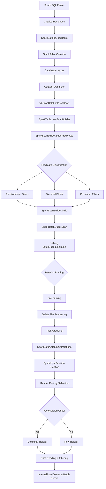
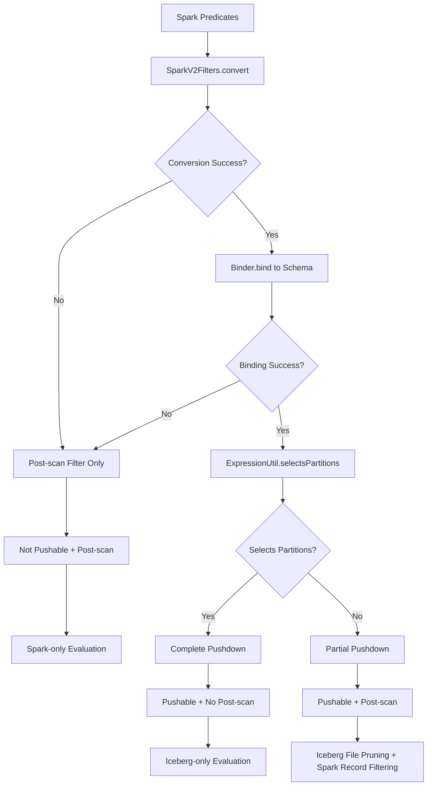
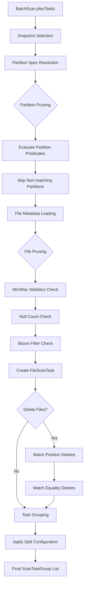

# 2025-10-03_Spark_SQL查询Iceberg数据深度执行流程与调用栈技术分析

## 1. 概述

本文档深入分析Spark SQL查询Iceberg数据的完整执行过程，从SQL解析到数据读取的每个环节，包括谓词下推、分区剪枝、文件扫描等关键优化机制。通过源码级别的调用栈分析，揭示查询执行的内部机制。

## 2. 查询示例场景

以下面的SQL查询为例进行分析：
```sql
SELECT customer_id, order_date, amount
FROM catalog.db.orders
WHERE order_date >= '2024-01-01'
  AND order_date < '2024-02-01'
  AND status = 'COMPLETED'
  AND amount > 100.0
```

假设表orders按order_date分区，包含以下字段：
- customer_id (BIGINT)
- order_date (DATE) - 分区键
- amount (DECIMAL)
- status (STRING)
- created_at (TIMESTAMP)

## 3. 完整调用栈深度分析

### 3.1 SQL解析与Catalog解析阶段

```
1. Spark SQL解析器
   └── org.apache.spark.sql.catalyst.parser.CatalystSqlParser.parseTableIdentifier()
       └── 解析表名 "catalog.db.orders"

2. Catalog查找与表加载
   └── org.apache.spark.sql.connector.catalog.CatalogManager.catalog()
       └── org.apache.iceberg.spark.SparkCatalog.loadTable()           [Line: 167]
           ├── SparkCatalog.load()                                     [Line: 838]
           │   ├── buildIdentifier(ident)                             [转换表标识符]
           │   ├── icebergCatalog.loadTable(identifier)               [底层catalog加载]
           │   └── new SparkTable(table, !cacheEnabled)               [Line: 845]
           └── SparkTable构造函数初始化
               ├── 保存Iceberg Table引用
               ├── 获取表Schema和PartitionSpec
               └── 设置refresh策略和缓存控制

3. 表元数据解析
   └── SparkTable初始化过程
       ├── schema() -> 返回Spark StructType                          [SchemaUtil转换]
       ├── partitioning() -> 返回Spark Transform[]                   [分区规格转换]
       └── capabilities() -> 返回TableCapability集合                  [表能力声明]
```

**核心源码位置**：
- `SparkCatalog.loadTable()`: `/spark/v3.5/spark/src/main/java/org/apache/iceberg/spark/SparkCatalog.java:167`
- `SparkTable构造`: `/spark/v3.5/spark/src/main/java/org/apache/iceberg/spark/source/SparkTable.java:119`

### 3.2 逻辑计划生成与优化阶段

```
4. Spark Catalyst逻辑计划生成
   └── org.apache.spark.sql.catalyst.analysis.Analyzer.execute()
       ├── ResolveRelations.apply()                                   [表解析]
       │   └── SparkCatalog.loadTable() -> SparkTable
       ├── ResolveReferences.apply()                                 [字段解析]
       └── ResolveFilters.apply()                                    [过滤条件解析]

5. Catalyst优化器执行
   └── org.apache.spark.sql.catalyst.optimizer.Optimizer.execute()
       ├── ConstantFolding.apply()                                   [常量折叠]
       ├── PredictPushDown.apply()                                   [谓词下推]
       ├── PartitionPruning.apply()                                  [分区剪枝]
       └── V2ScanRelationPushDown.apply()                           [V2下推优化]
           └── 调用SparkTable.newScanBuilder()

6. ScanBuilder创建与配置
   └── SparkTable.newScanBuilder(options)                           [Line: 281]
       ├── 检查是否为staged scan                                    [Line: 282-284]
       ├── 表刷新策略处理                                           [Line: 286-288]
       ├── 快照ID/分支配置                                          [Line: 290-291]
       └── new SparkScanBuilder(spark, table, branch, schema, options) [Line: 292-293]
```

**关键设计点**：
- **懒加载机制**: 表元数据在需要时才加载，支持refreshEagerly配置
- **时间旅行支持**: 支持通过snapshotId、timestamp、branch、tag查询历史数据
- **Catalyst集成**: 完全集成Spark的Catalyst优化器框架

### 3.3 谓词下推与过滤优化阶段

```
7. 谓词下推核心实现
   └── SparkScanBuilder.pushPredicates(predicates)                  [Line: 148]
       ├── 遍历所有谓词条件                                         [Line: 163]
       │   ├── SparkV2Filters.convert(predicate)                    [转换Spark谓词为Iceberg表达式]
       │   ├── Binder.bind(schema.asStruct(), expr, caseSensitive)  [Line: 169, 绑定表达式到Schema]
       │   └── 分类谓词处理                                         [Line: 174-181]
       │       ├── 完全下推: ExpressionUtil.selectsPartitions()     [分区级过滤]
       │       ├── 部分下推: 文件级过滤，需要Spark后处理
       │       └── 无法下推: 完全由Spark处理
       ├── 构建过滤表达式列表                                       [Line: 188]
       │   └── this.filterExpressions = expressions
       ├── 记录已下推谓词                                           [Line: 189]
       │   └── this.pushedPredicates = pushableFilters.toArray()
       └── 返回需要Spark处理的谓词                                   [Line: 191]
           └── return postScanFilters.toArray()

8. 谓词分类详细逻辑 (Line: 174-181)
   ├── 类型1: 完全下推谓词 (分区级过滤)
   │   ├── 条件: expr != null && ExpressionUtil.selectsPartitions(expr, table, caseSensitive)
   │   ├── 效果: 完全由Iceberg处理，Spark无需再过滤
   │   └── 日志: "Evaluating completely on Iceberg side"
   ├── 类型2: 部分下推谓词 (文件级过滤)
   │   ├── 条件: expr != null && !selectsPartitions
   │   ├── 效果: Iceberg用于文件剪枝，Spark仍需记录级过滤
   │   └── 同时在pushableFilters和postScanFilters中
   └── 类型3: 无法下推谓词
       ├── 条件: expr == null (转换失败或不支持)
       ├── 效果: 完全由Spark处理
       └── 仅在postScanFilters中

9. 支持的谓词类型 (SparkV2Filters.convert)
   ├── 比较运算: =, !=, <, <=, >, >=, <=>
   ├── 逻辑运算: AND, OR, NOT
   ├── 集合运算: IN, NOT IN
   ├── 模式匹配: LIKE, NOT LIKE
   ├── 空值检查: IS NULL, IS NOT NULL
   ├── 字符串函数: STARTS_WITH
   └── 范围检查: BETWEEN (转换为 >= AND <=)
```

**优化效果分析**：
```sql
-- 示例SQL的谓词分类
WHERE order_date >= '2024-01-01'      -- 类型1: 分区剪枝，完全下推
  AND order_date < '2024-02-01'       -- 类型1: 分区剪枝，完全下推
  AND status = 'COMPLETED'            -- 类型2: 文件过滤，部分下推
  AND amount > 100.0                  -- 类型2: 文件过滤，部分下推
```

### 3.4 物理计划生成与扫描构建阶段

```
10. 物理计划转换
    └── org.apache.spark.sql.execution.SparkStrategies.DataSourceV2Strategy.apply()
        └── SparkScanBuilder.build()                                [Line: 398]
            ├── 检查本地扫描缓存                                    [Line: 399-401]
            └── buildBatchScan()                                    [Line: 402, 406]
                ├── schemaWithMetadataColumns()                     [构建期望Schema]
                └── new SparkBatchQueryScan(...)                   [Line: 408-415]

11. Iceberg扫描计划构建
    └── buildIcebergBatchScan(false, expectedSchema)               [Line: 411]
        ├── 读取配置参数                                           [Line: 419-422]
        │   ├── snapshotId = readConf.snapshotId()
        │   ├── asOfTimestamp = readConf.asOfTimestamp()
        │   ├── branch = readConf.branch()
        │   └── tag = readConf.tag()
        ├── 参数验证                                               [Line: 424-456]
        │   ├── 快照ID与时间戳互斥检查
        │   ├── 增量扫描参数检查
        │   └── 批量扫描参数验证
        └── 选择扫描类型                                           [Line: 458-462]
            ├── 增量扫描: buildIncrementalAppendScan()
            └── 批量扫描: buildBatchScan()

12. 批量扫描详细构建
    └── buildBatchScan(snapshotId, asOfTimestamp, branch, tag, withStats, expectedSchema) [Line: 465]
        ├── 创建BatchScan                                          [Line: 472-477]
        │   └── newBatchScan()
        │       ├── .caseSensitive(caseSensitive)                  [大小写敏感设置]
        │       ├── .filter(filterExpression())                   [应用过滤表达式]
        │       ├── .project(expectedSchema)                      [列投影]
        │       └── .metricsReporter(metricsReporter)             [指标收集]
        ├── 条件配置                                               [Line: 479-497]
        │   ├── includeColumnStats() [统计信息]
        │   ├── useSnapshot(snapshotId) [快照选择]
        │   ├── asOfTime(asOfTimestamp) [时间点查询]
        │   ├── useRef(branch) [分支选择]
        │   └── useRef(tag) [标签选择]
        └── configureSplitPlanning(scan)                           [Line: 499, 配置任务分割]

13. 扫描任务分割配置
    └── configureSplitPlanning(scan)
        ├── 读取split相关配置
        │   ├── lookback = readConf.splitLookback()
        │   ├── openFileCost = readConf.splitOpenFileCost()
        │   └── size = readConf.splitSize()
        └── 配置split策略
            ├── scan.option(SPLIT_LOOKBACK, lookback)
            ├── scan.option(SPLIT_OPEN_FILE_COST, openFileCost)
            └── scan.option(SPLIT_SIZE, size)
```

**关键配置参数**：
- `split-size`: 每个split的目标大小(默认128MB)
- `split-lookback`: 组合文件时的回看数量(默认10)
- `split-open-file-cost`: 文件打开开销估算(默认4MB)

### 3.5 文件扫描与任务分配阶段

```
14. SparkBatchQueryScan初始化
    └── SparkBatchQueryScan构造函数                               [Line: 77-93]
        ├── 保存扫描配置和过滤条件                               [Line: 85]
        ├── 提取快照和时间配置                                   [Line: 87-91]
        └── 初始化运行时过滤表达式                               [Line: 92]

15. 批处理任务生成
    └── SparkBatchQueryScan.toBatch()                           [父类SparkPartitioningAwareScan]
        ├── 任务组获取: taskGroups()                            [懒加载]
        │   └── 如果未缓存则调用buildTaskGroups()
        │       ├── tasks() -> 获取原始任务列表
        │       │   └── 如果未缓存则调用scan.planTasks()       [Iceberg核心扫描]
        │       └── TableScanUtil.planTaskGroups(...)          [任务分组]
        │           ├── 根据split-size合并小任务
        │           ├── 考虑split-open-file-cost
        │           └── 应用split-lookback策略
        └── new SparkBatch(sparkContext, table, readConf, ...)

16. Iceberg核心文件扫描
    └── BatchScan.planTasks()                                   [Iceberg核心]
        ├── 快照验证和选择                                      [基于snapshotId/timestamp/branch]
        ├── 分区剪枝: PartitionPruning                          [基于分区谓词]
        │   ├── 构建分区过滤器
        │   ├── 评估分区表达式
        │   └── 跳过不匹配的分区
        ├── 文件级过滤: DataFilePruning                         [基于文件统计信息]
        │   ├── 读取文件元数据统计
        │   ├── 应用min/max过滤
        │   ├── 应用null count过滤
        │   └── 构建FileScanTask列表
        └── 删除文件处理: DeleteFilePlanning                    [V2表支持]
            ├── 匹配position deletes
            ├── 匹配equality deletes
            └── 构建最终扫描任务

17. 任务分配与本地性优化
    └── SparkBatch.planInputPartitions()                       [Line: 82]
        ├── 广播表元数据                                        [Line: 84-85]
        │   └── sparkContext.broadcast(SerializableTableWithSize.copyOf(table))
        ├── 序列化期望Schema                                    [Line: 86]
        │   └── SchemaParser.toJson(expectedSchema)
        ├── 计算首选位置                                        [Line: 87]
        │   └── computePreferredLocations()
        │       ├── 数据本地性: SparkPlanningUtil.fetchBlockLocations() [Line: 108]
        │       └── 执行器缓存: SparkPlanningUtil.assignExecutors() [Line: 113]
        └── 创建输入分区数组                                    [Line: 89-103]
            └── new SparkInputPartition(...)
                ├── groupingKeyType [分组键类型]
                ├── taskGroups.get(index) [任务组]
                ├── tableBroadcast [广播表]
                ├── expectedSchemaString [Schema字符串]
                └── locations [首选位置]
```

**本地性优化策略**：
1. **数据本地性**: 根据HDFS块位置分配任务到对应节点
2. **执行器缓存**: 利用执行器缓存提高性能
3. **任务分组**: 相邻文件合并为一个任务减少开销

### 3.6 数据读取与序列化阶段

```
18. 读取器工厂选择
    └── SparkBatch.createReaderFactory()                       [Line: 121]
        ├── 向量化读取检查                                      [Line: 122-133]
        │   ├── Comet读取: useCometBatchReads()                [Line: 175-180]
        │   ├── Parquet向量化: useParquetBatchReads()          [Line: 151-155]
        │   ├── ORC向量化: useOrcBatchReads()                  [Line: 192-195]
        │   └── 行级读取: SparkRowReaderFactory()              [Line: 132]
        └── 返回对应的ReaderFactory

19. 向量化读取条件检查
    ├── Parquet向量化条件 (Line: 151-155)
    │   ├── parquetVectorizationEnabled = true
    │   ├── 只包含原始类型或元数据列
    │   ├── 所有任务都是FileScanTask
    │   └── 所有文件都是Parquet格式
    ├── ORC向量化条件 (Line: 192-195)
    │   ├── orcVectorizationEnabled = true
    │   ├── 所有任务都是FileScanTask
    │   ├── 所有文件都是ORC格式
    │   └── 没有删除文件
    └── Comet向量化条件 (Line: 175-180)
        ├── parquetVectorizationEnabled = true
        ├── parquetReaderType = COMET
        ├── 支持的原始类型(不包括UUID)
        └── 不包括特定元数据列

20. 行级读取器创建
    └── SparkRowReaderFactory.createReader(inputPartition)     [Line: 36]
        ├── 类型验证: SparkInputPartition                      [Line: 37-40]
        ├── 任务类型判断                                       [Line: 44-56]
        │   ├── FileScanTask: new RowDataReader(partition)     [Line: 45]
        │   ├── ChangelogScanTask: new ChangelogRowReader()    [Line: 47]
        │   └── PositionDeletesScanTask: new PositionDeletesRowReader() [Line: 50]
        └── 返回对应的PartitionReader

21. 数据行读取实现
    └── RowDataReader.next()                                   [数据行迭代]
        ├── 获取下一个FileScanTask
        ├── 打开文件读取器
        │   ├── Parquet: ParquetReader
        │   ├── ORC: OrcReader
        │   └── Avro: AvroReader
        ├── 应用残余过滤器                                      [记录级过滤]
        │   ├── 评估未下推的谓词
        │   └── 过滤不符合条件的记录
        ├── 应用投影                                           [列选择]
        │   └── 只读取需要的列
        ├── 处理删除文件                                       [V2表]
        │   ├── 应用position deletes
        │   └── 应用equality deletes
        └── 转换为Spark InternalRow格式

22. 向量化读取实现 (如果满足条件)
    └── SparkColumnarReaderFactory.createReader()
        ├── 批量读取配置
        │   ├── batchSize配置
        │   └── readerType配置
        ├── 列式存储优化
        │   ├── 列级裁剪
        │   ├── 列级过滤
        │   └── 列级压缩
        └── 返回ColumnarBatch
```

**性能优化特性**：
1. **向量化执行**: 批量处理提高CPU效率
2. **列级优化**: 只读取需要的列，减少I/O
3. **过滤下推**: 在存储层过滤数据，减少传输
4. **压缩感知**: 直接处理压缩数据，减少解压开销

## 4. 核心执行流程图

### 4.1 完整查询流程图



### 4.2 谓词下推详细流程图



### 4.3 文件扫描与剪枝流程图



## 5. 关键优化机制深度解析

### 5.1 分区剪枝 (Partition Pruning) 机制

**实现位置**: `ExpressionUtil.selectsPartitions()`

```java
// 源码分析: ExpressionUtil.selectsPartitions()实现原理
public static boolean selectsPartitions(Expression expr, Table table, boolean caseSensitive) {
    // 1. 获取表的所有分区规格
    List<PartitionSpec> specs = table.specs().values();

    // 2. 对每个分区规格评估表达式
    for (PartitionSpec spec : specs) {
        if (spec.isPartitioned()) {
            // 3. 创建分区投影
            Expression projected = Projections.inclusive(spec, caseSensitive).project(expr);

            // 4. 检查投影后的表达式是否为恒真
            if (projected != Expressions.alwaysTrue()) {
                return true;  // 可以进行分区剪枝
            }
        }
    }
    return false;  // 无法进行分区剪枝
}
```

**分区剪枝效果**:
```sql
-- 示例: orders表按order_date(日期)分区
WHERE order_date >= '2024-01-01' AND order_date < '2024-02-01'

-- 分区剪枝结果:
-- ✓ 只扫描2024年1月的分区文件
-- ✗ 跳过其他月份的分区
-- 效果: 大幅减少扫描的文件数量
```

### 5.2 文件级过滤 (File Pruning) 机制

**实现原理**: 基于文件统计信息的过滤

```java
// 伪代码: 文件过滤逻辑
boolean shouldScanFile(DataFile file, Expression filter) {
    // 1. 获取文件统计信息
    Map<Integer, Long> valueCounts = file.valueCounts();
    Map<Integer, Long> nullValueCounts = file.nullValueCounts();
    Map<Integer, ByteBuffer> lowerBounds = file.lowerBounds();
    Map<Integer, ByteBuffer> upperBounds = file.upperBounds();

    // 2. 创建统计信息评估器
    StrictMetricsEvaluator evaluator = new StrictMetricsEvaluator(
        schema, filter, caseSensitive);

    // 3. 评估是否需要扫描文件
    return evaluator.eval(file);
}
```

**文件过滤示例**:
```sql
WHERE amount > 100.0

-- 文件统计信息检查:
-- File A: min_amount=50.0, max_amount=80.0   -> 跳过 (max < 100)
-- File B: min_amount=90.0, max_amount=150.0  -> 扫描 (范围重叠)
-- File C: min_amount=120.0, max_amount=200.0 -> 扫描 (min > 100)
```

### 5.3 任务分组 (Task Grouping) 优化

**配置参数**:
- `split-size`: 目标分组大小 (默认128MB)
- `split-lookback`: 回看文件数量 (默认10)
- `split-open-file-cost`: 文件打开开销 (默认4MB)

**分组算法**:
```java
// 任务分组伪代码
List<ScanTaskGroup> planTaskGroups(List<FileScanTask> tasks, long splitSize) {
    List<ScanTaskGroup> groups = new ArrayList<>();
    ScanTaskGroup currentGroup = new ScanTaskGroup();
    long currentSize = 0;

    for (FileScanTask task : tasks) {
        long taskSize = task.length() + splitOpenFileCost;

        if (currentSize + taskSize <= splitSize || currentGroup.isEmpty()) {
            // 添加到当前组
            currentGroup.add(task);
            currentSize += taskSize;
        } else {
            // 开始新组
            groups.add(currentGroup);
            currentGroup = new ScanTaskGroup();
            currentGroup.add(task);
            currentSize = taskSize;
        }
    }

    if (!currentGroup.isEmpty()) {
        groups.add(currentGroup);
    }

    return groups;
}
```

### 5.4 向量化执行优化

**向量化条件检查**:
```java
// Parquet向量化条件
private boolean useParquetBatchReads() {
    return readConf.parquetVectorizationEnabled()                    // 开启向量化
        && expectedSchema.columns().stream().allMatch(this::supportsParquetBatchReads) // 支持的列类型
        && taskGroups.stream().allMatch(this::supportsParquetBatchReads);              // 支持的任务类型
}

private boolean supportsParquetBatchReads(Types.NestedField field) {
    return field.type().isPrimitiveType()                            // 原始类型
        || MetadataColumns.isMetadataColumn(field.fieldId());        // 元数据列
}
```

**向量化性能优势**:
1. **SIMD指令**: 利用CPU向量指令加速计算
2. **缓存友好**: 列式存储提高缓存命中率
3. **批量处理**: 减少函数调用开销
4. **压缩感知**: 直接操作压缩数据

## 6. 性能调优参数详解

### 6.1 核心配置参数

| 参数名 | 默认值 | 说明 | 调优建议 |
|--------|--------|------|----------|
| `read.split-size` | 128MB | 每个任务的目标大小 | 大文件场景增大到256MB-512MB |
| `read.split-lookback` | 10 | 合并任务时的回看数量 | 小文件多时增大到20-50 |
| `read.split-open-file-cost` | 4MB | 文件打开开销估算 | 对象存储场景增大到16MB |
| `read.parquet.vectorization.enabled` | true | Parquet向量化开关 | 数值计算密集时保持开启 |
| `read.orc.vectorization.enabled` | false | ORC向量化开关 | ORC文件场景开启 |
| `read.parquet.vectorization.batch-size` | 4096 | 向量化批处理大小 | 内存充足时增大到8192 |

### 6.2 查询优化建议

#### 6.2.1 分区策略优化
```sql
-- ✓ 好的分区查询模式
SELECT * FROM orders
WHERE order_date BETWEEN '2024-01-01' AND '2024-01-31'  -- 分区键范围查询

-- ✗ 差的分区查询模式
SELECT * FROM orders
WHERE YEAR(order_date) = 2024  -- 函数调用导致无法分区剪枝
```

#### 6.2.2 列投影优化
```sql
-- ✓ 只选择需要的列
SELECT customer_id, amount FROM orders WHERE ...

-- ✗ 避免不必要的SELECT *
SELECT * FROM orders WHERE ...  -- 读取所有列
```

#### 6.2.3 过滤条件优化
```sql
-- ✓ 支持下推的过滤条件
WHERE status = 'COMPLETED'           -- 等值比较
WHERE amount BETWEEN 100 AND 1000   -- 范围比较
WHERE customer_id IN (1,2,3)        -- IN操作

-- ✗ 无法下推的复杂条件
WHERE UPPER(status) = 'COMPLETED'   -- 函数调用
WHERE amount + tax > 100            -- 表达式计算
```

## 7. 监控与故障排查

### 7.1 关键监控指标

**Spark UI中的关键指标**:
1. **任务数量**: 反映分区剪枝效果
2. **数据读取量**: 反映文件过滤效果
3. **Task执行时间**: 反映数据本地性
4. **Shuffle数据量**: 应该为0(无JOIN/聚合)

**Iceberg指标收集**:
```java
// 在查询中启用指标收集
spark.conf.set("spark.sql.adaptive.enabled", "true")
spark.conf.set("spark.sql.adaptive.coalescePartitions.enabled", "true")

// 查看查询计划
df.explain(true)  // 显示完整执行计划
df.explain("cost") // 显示成本信息
```

### 7.2 常见性能问题诊断

#### 7.2.1 分区剪枝失效
**症状**: 扫描了过多的分区
**原因**:
- 分区列上使用了函数
- 谓词无法转换为Iceberg表达式
- 分区键类型不匹配

**解决方案**:
```sql
-- 问题: 使用函数导致无法分区剪枝
WHERE YEAR(order_date) = 2024

-- 解决: 使用范围查询
WHERE order_date >= '2024-01-01' AND order_date < '2025-01-01'
```

#### 7.2.2 小文件问题
**症状**: Task数量过多，每个Task处理数据很少
**原因**:
- split-size设置过小
- 文件本身就很小

**解决方案**:
```scala
// 调整split配置
spark.conf.set("spark.sql.sources.v2.bucketing.enabled", "true")
spark.read
  .option("split-size", "268435456")  // 256MB
  .option("split-lookback", "20")
  .table("catalog.db.orders")
```

#### 7.2.3 数据倾斜问题
**症状**: 部分Task执行时间很长
**原因**:
- 分区数据分布不均匀
- 个别文件过大

**解决方案**:
```scala
// 启用自适应查询执行
spark.conf.set("spark.sql.adaptive.enabled", "true")
spark.conf.set("spark.sql.adaptive.skewJoin.enabled", "true")
spark.conf.set("spark.sql.adaptive.skewJoin.skewedPartitionThresholdInBytes", "256MB")
```

## 8. 与其他查询引擎对比

### 8.1 与Spark原生Parquet对比

| 特性 | Spark Parquet | Spark + Iceberg |
|------|---------------|-----------------|
| 分区剪枝 | 基于目录结构 | 基于元数据 + 统计信息 |
| 文件过滤 | 有限支持 | 丰富的统计信息过滤 |
| Schema演化 | 不支持 | 完全支持 |
| 时间旅行 | 不支持 | 原生支持 |
| 并发写入 | 困难 | ACID支持 |
| 元数据管理 | 文件系统 | 专用catalog |

### 8.2 与Presto/Trino对比

| 特性 | Spark + Iceberg | Presto/Trino + Iceberg |
|------|-----------------|------------------------|
| 向量化执行 | 部分支持 | 全面支持 |
| 过滤下推 | 完全支持 | 完全支持 |
| 投影下推 | 完全支持 | 完全支持 |
| 动态过滤 | 有限支持 | 丰富支持 |
| Cost-based优化 | Catalyst框架 | 原生CBO |

## 9. 总结与最佳实践

### 9.1 核心技术优势

1. **智能谓词下推**: 三层过滤机制最大化查询性能
2. **高效分区剪枝**: 基于元数据的快速分区跳过
3. **文件级优化**: 统计信息驱动的文件过滤
4. **向量化执行**: CPU友好的批量处理
5. **自适应优化**: 运行时动态调整执行策略

### 9.2 最佳实践建议

#### 9.2.1 表设计最佳实践
```sql
-- 1. 合理的分区策略
CREATE TABLE orders (
  customer_id BIGINT,
  order_date DATE,
  amount DECIMAL(10,2),
  status STRING
) USING ICEBERG
PARTITIONED BY (days(order_date))  -- 按天分区

-- 2. 适当的排序策略
ALTER TABLE orders WRITE ORDERED BY (customer_id, order_date)
```

#### 9.2.2 查询编写最佳实践
```sql
-- 1. 分区键优先过滤
SELECT customer_id, amount
FROM orders
WHERE order_date >= '2024-01-01'     -- 分区剪枝
  AND order_date < '2024-02-01'
  AND status = 'COMPLETED'           -- 文件过滤
  AND customer_id IN (1,2,3)         -- 记录过滤

-- 2. 避免复杂表达式
WHERE amount > 100                   -- ✓ 好
WHERE amount * 1.1 > 110            -- ✗ 差

-- 3. 合理使用IN操作
WHERE customer_id IN (1,2,3,4,5)    -- ✓ 小集合
WHERE customer_id IN (SELECT ...)   -- ✗ 大集合，考虑JOIN
```

#### 9.2.3 配置调优最佳实践
```scala
// 1. 基础配置
spark.conf.set("spark.sql.adaptive.enabled", "true")
spark.conf.set("spark.sql.adaptive.coalescePartitions.enabled", "true")

// 2. Iceberg特定配置
spark.conf.set("spark.sql.iceberg.vectorization.enabled", "true")
spark.conf.set("spark.sql.iceberg.split-size", "268435456")  // 256MB

// 3. 内存优化
spark.conf.set("spark.sql.adaptive.advisoryPartitionSizeInBytes", "128MB")
spark.conf.set("spark.sql.adaptive.maxNumPostShufflePartitions", "200")
```

### 9.3 性能监控与调优

1. **建立监控体系**: 跟踪关键性能指标
2. **定期性能评估**: 分析查询计划和执行时间
3. **配置参数调优**: 根据工作负载特征调整参数
4. **表维护策略**: 定期压缩和清理优化查询性能

通过这套完整的执行流程分析和优化建议，可以充分发挥Spark + Iceberg的查询性能优势，实现高效的大数据分析处理。