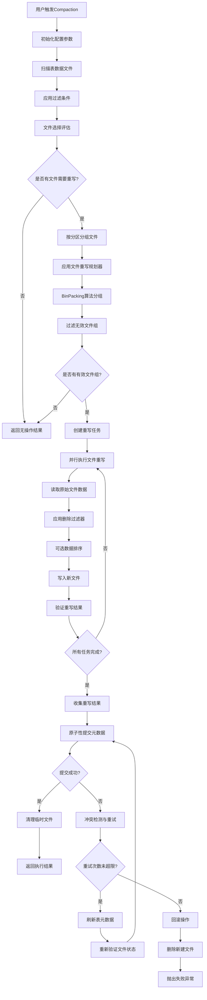
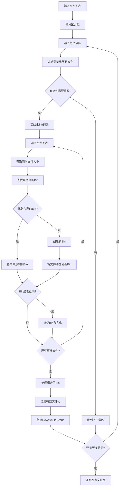
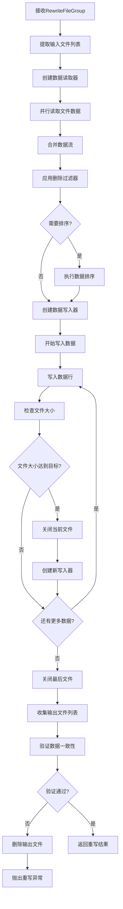
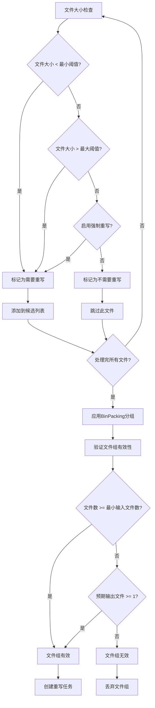
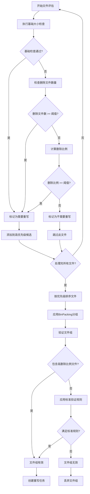
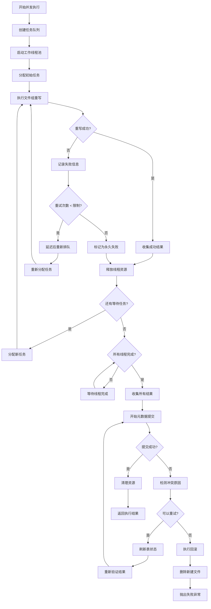

 # Apache Iceberg Compaction 完整深度解析

## 目录

1. [概述与架构](#概述与架构)
2. [Compaction策略详解](#compaction策略详解)
3. [文件选择与分组算法](#文件选择与分组算法)
4. [执行引擎与数据重写](#执行引擎与数据重写)
5. [元数据更新机制](#元数据更新机制)
6. [性能优化与监控](#性能优化与监控)
7. [详细流程图](#详细流程图)
8. [源码实现分析](#源码实现分析)
9. [最佳实践与故障排查](#最佳实践与故障排查)
10. [总结](#总结)

---

## 概述与架构

### 1. Compaction核心概念

Apache Iceberg的Compaction是一个数据文件优化过程，主要目的是：

**核心目标**:
- **文件大小优化**: 合并小文件，拆分大文件至合适大小
- **查询性能提升**: 减少文件数量，提高扫描效率
- **存储效率**: 清理已删除记录，减少存储空间
- **元数据优化**: 减少manifest entry数量

**架构组件图**:
```
┌─────────────────────────────────────────────────────────────┐
│                 Iceberg Compaction 架构                      │
├─────────────────────────────────────────────────────────────┤
│ 用户API层                                                   │
│  ├─ RewriteDataFiles (Action API)                          │
│  ├─ RewriteFiles (Table API)                              │
│  └─ CompactAction (高级API)                                │
├─────────────────────────────────────────────────────────────┤
│ 规划层 (Planning Layer)                                     │
│  ├─ FileRewritePlanner (接口)                              │
│  ├─ BinPackRewriteFilePlanner (默认实现)                   │
│  ├─ SizeBasedFileRewritePlanner (基于大小)                 │
│  └─ SortBasedRewritePlanner (基于排序)                     │
├─────────────────────────────────────────────────────────────┤
│ 执行层 (Execution Layer)                                    │
│  ├─ FileRewriteRunner                                      │
│  ├─ RewriteFileGroup                                       │
│  ├─ FileRewriter (文件重写器)                              │
│  └─ TaskExecutor (任务执行器)                              │
├─────────────────────────────────────────────────────────────┤
│ 存储层 (Storage Layer)                                      │
│  ├─ FileIO (文件IO操作)                                    │
│  ├─ DataWriter (数据写入)                                  │
│  ├─ DataReader (数据读取)                                  │
│  └─ EncryptionManager (加密管理)                           │
├─────────────────────────────────────────────────────────────┤
│ 元数据层 (Metadata Layer)                                   │
│  ├─ RewriteDataFilesCommitManager                         │
│  ├─ TableOperations                                        │
│  ├─ ManifestWriter                                         │
│  └─ SnapshotUpdate                                         │
└─────────────────────────────────────────────────────────────┘
```

### 2. 核心类关系

**主要接口和实现**:

```java
// 核心API接口
interface RewriteDataFiles extends Action<RewriteDataFiles.Result> {
    RewriteDataFiles filter(Expression filter);
    RewriteDataFiles option(String name, String value);
}

// 基础实现类
abstract class BaseRewriteDataFilesAction<ThisT> 
    extends BaseSnapshotUpdateAction<ThisT, RewriteDataFilesActionResult> {
  
  protected final Table table;
  protected final FileIO fileIO;
  protected final EncryptionManager encryptionManager;
  
  // 配置参数
  protected boolean caseSensitive;
  protected PartitionSpec spec;
  protected Expression filter;
  protected long targetSizeInBytes;
  protected int splitLookback;
  protected long splitOpenFileCost;
}

// 文件重写规划器
interface FileRewritePlanner<I, T, F, G> {
    Set<String> validOptions();
    void init(Map<String, String> options);
    List<G> planFileGroups(Iterable<I> dataFiles);
}
```

---

## Compaction策略详解

### 1. 基于大小的Compaction策略 - 详细场景分析

#### 1.1 SizeBasedFileRewritePlanner 基础策略

**核心参数配置**:
```java
public abstract class SizeBasedFileRewritePlanner {
  // 目标文件大小（默认从表属性获取）
  public static final String TARGET_FILE_SIZE_BYTES = "target-file-size-bytes";
  
  // 最小文件大小阈值（默认75%的目标大小）
  public static final String MIN_FILE_SIZE_BYTES = "min-file-size-bytes";
  public static final double MIN_FILE_SIZE_DEFAULT_RATIO = 0.75;
  
  // 最大文件大小阈值（默认180%的目标大小）  
  public static final String MAX_FILE_SIZE_BYTES = "max-file-size-bytes";
  public static final double MAX_FILE_SIZE_DEFAULT_RATIO = 1.80;
  
  // 最小输入文件数（默认5个）
  public static final String MIN_INPUT_FILES = "min-input-files";
  public static final int MIN_INPUT_FILES_DEFAULT = 5;
  
  // 最大文件组大小（默认100GB）
  public static final String MAX_FILE_GROUP_SIZE_BYTES = "max-file-group-size-bytes";
  public static final long MAX_FILE_GROUP_SIZE_BYTES_DEFAULT = 100L * 1024 * 1024 * 1024;
  
  // 强制重写所有文件
  public static final String REWRITE_ALL = "rewrite-all";
  public static final boolean REWRITE_ALL_DEFAULT = false;
}
```

**适用场景详细分析**:

#### 场景1: 批处理ETL系统
**典型环境**:
- **数据仓库ETL**: 定期批量数据处理，文件大小可控
- **离线分析系统**: 按小时/天批处理，查询模式简单
- **数据归档系统**: 历史数据整理，主要关注存储效率

**具体示例 - 日志数据ETL系统**:
```
表结构: access_logs (timestamp, user_id, page_url, response_time, status_code, user_agent)
分区策略: PARTITION BY (DATE(timestamp), HOUR(timestamp))
写入模式: Spark批处理，每小时执行一次ETL

分区: dt=2024-01-15/hour=14

当前文件状态分析:
├── logs_001.parquet (Spark Task 1输出)
│   ├── 记录数: 1,250,000条
│   ├── 文件大小: 45MB  
│   ├── 问题: 远小于目标大小128MB，查询时需要扫描过多文件
│   └── 产生原因: 输入数据倾斜，某些任务处理数据量少
│
├── logs_002.parquet (Spark Task 2输出) 
│   ├── 记录数: 450,000条
│   ├── 文件大小: 16MB
│   ├── 问题: 严重偏小，影响查询性能
│   └── 产生原因: 数据倾斜，部分小时段访问量少
│
├── logs_003.parquet (Spark Task 3输出)
│   ├── 记录数: 8,200,000条  
│   ├── 文件大小: 295MB
│   ├── 问题: 超过最大阈值230MB，单文件过大
│   └── 产生原因: 热门页面访问集中，数据倾斜严重
│
├── logs_004.parquet (Spark Task 4输出)
│   ├── 记录数: 680,000条
│   ├── 文件大小: 24MB  
│   ├── 问题: 小于最小阈值96MB
│   └── 产生原因: 某些URL访问量极少
│
└── logs_005.parquet (Spark Task 5输出)
    ├── 记录数: 3,100,000条
    ├── 文件大小: 112MB
    ├── 状态: 在合理范围内 (96MB-230MB)
    └── 评估: 可以保持不变或合并优化

SizeBased策略分析:
目标大小: 128MB
最小阈值: 96MB (75% * 128MB)  
最大阈值: 230MB (180% * 128MB)

文件筛选结果:
- logs_001.parquet: 45MB < 96MB ✓ 需要重写
- logs_002.parquet: 16MB < 96MB ✓ 需要重写  
- logs_003.parquet: 295MB > 230MB ✓ 需要重写
- logs_004.parquet: 24MB < 96MB ✓ 需要重写
- logs_005.parquet: 112MB ∈ [96MB, 230MB] ✗ 保持不变

BinPack分组策略:
Group1 (合并小文件): [logs_001, logs_002, logs_004]
- 输入: 45+16+24 = 85MB, 2,380,000条记录
- 输出: 预期1个约85MB文件
- 效果: 3个文件 -> 1个文件，减少67%的文件数

Group2 (拆分大文件): [logs_003]  
- 输入: 295MB, 8,200,000条记录
- 输出: 预期2个约147MB文件 (295MB ÷ 2)
- 效果: 1个过大文件 -> 2个合理大小文件

最终优化结果:
├── logs_compact_001.parquet (85MB, 小文件合并)
├── logs_compact_002.parquet (147MB, 大文件拆分1/2)  
├── logs_compact_003.parquet (148MB, 大文件拆分2/2)
└── logs_005.parquet (112MB, 保持不变)

优化效果:
- 文件数量: 5个 -> 4个 (减少20%)
- 文件大小分布: 更均匀，都在合理范围内
- 查询性能: 减少小文件扫描开销，大文件分割提升并行度
- 维护成本: 文件数量减少，元数据简化
```

**配置建议**:
```properties
# 批处理ETL优化配置
target-file-size-bytes=134217728         # 128MB，适合批处理查询模式
min-file-size-bytes=100663296            # 96MB (75%)，避免过多小文件  
max-file-size-bytes=241591910            # 230MB (180%)，控制单文件大小
min-input-files=3                        # 3个文件即可分组合并
max-file-group-size-bytes=1073741824     # 1GB，批处理可承受较大组
rewrite-all=false                        # 只重写不合理大小的文件
```

#### 场景2: 流式数据摄入系统
**典型环境**:  
- **实时数据管道**: Kafka/Pulsar流数据持续写入
- **微批处理**: Spark Streaming, Flink每分钟或秒级写入
- **传感器数据**: IoT设备数据实时上报

**具体示例 - 实时用户行为流**:
```
表结构: user_events (event_id, user_id, event_type, timestamp, properties)
分区策略: PARTITION BY (DATE(timestamp), HOUR(timestamp))  
写入模式: Flink每30秒checkpoint产生一个文件

分区: dt=2024-01-15/hour=09 (30分钟内产生的文件)

流式写入文件状态:
├── events_09_00_00.parquet (09:00:00-09:00:30, 2.1MB)
├── events_09_00_30.parquet (09:00:30-09:01:00, 1.8MB)  
├── events_09_01_00.parquet (09:01:00-09:01:30, 2.4MB)
├── events_09_01_30.parquet (09:01:30-09:02:00, 1.6MB)
... [继续60个类似的小文件] ...
├── events_09_28_30.parquet (09:28:30-09:29:00, 2.2MB)
└── events_09_29_30.parquet (09:29:30-09:30:00, 1.9MB)

问题分析:
- 文件数量: 60个小文件 (30分钟 ÷ 30秒间隔)
- 平均大小: 约2MB每个文件  
- 查询影响: 需要打开60个文件进行扫描，元数据开销巨大
- 存储效率: 每个文件都有独立的header/footer，存储浪费严重

SizeBased Compaction策略:
目标大小: 64MB (流式数据适合较小目标)
最小阈值: 48MB (75% * 64MB)
最大阈值: 115MB (180% * 64MB)

所有文件都严重小于最小阈值，全部需要重写合并。

BinPack分组 (按时间顺序):
Group1: [events_09_00_00 ~ events_09_09_30] (20个文件)
- 输入: 约40MB, 2,000,000条记录  
- 输出: 1个40MB文件

Group2: [events_09_10_00 ~ events_09_19_30] (20个文件)
- 输入: 约42MB, 2,100,000条记录
- 输出: 1个42MB文件

Group3: [events_09_20_00 ~ events_09_29_30] (20个文件)  
- 输入: 约38MB, 1,900,000条记录
- 输出: 1个38MB文件

优化后状态:
├── events_compact_001.parquet (09:00-09:10, 40MB)
├── events_compact_002.parquet (09:10-09:20, 42MB)  
└── events_compact_003.parquet (09:20-09:30, 38MB)

优化效果:
- 文件数量: 60个 -> 3个 (减少95%)
- 查询性能: 大幅提升，文件扫描开销降低95%
- 元数据大小: 显著减少，Manifest文件更小
- 时间局部性: 保持连续时间段数据在同一文件中
```

#### 场景3: 混合工作负载
**典型环境**:
- **多写入源**: 批处理 + 流处理 + 手工导入并存
- **不规则写入**: 数据量随时间变化很大
- **临时数据**: 测试、实验性数据频繁写入删除

**具体示例 - 电商订单数据**:
```
表结构: orders (order_id, customer_id, amount, status, create_time, update_time)
分区策略: PARTITION BY (DATE(create_time))
写入来源: 混合模式

分区: dt=2024-01-15

多源写入文件状态:
├── orders_batch_daily.parquet (批处理ETL)
│   ├── 来源: 每日批处理ETL，凌晨2点执行
│   ├── 数据: 历史订单补录，批量状态更新
│   ├── 大小: 380MB，记录数: 2,500,000
│   ├── 问题: 超出最大阈值 (>230MB)
│   └── 需要: 拆分成多个文件
│
├── orders_realtime_001.parquet (实时流)
│   ├── 来源: Kafka订单流，每5分钟写入  
│   ├── 数据: 实时订单创建和状态变更
│   ├── 大小: 8MB，记录数: 35,000
│   ├── 问题: 远小于最小阈值 (<96MB)
│   └── 需要: 与其他小文件合并
│
├── orders_realtime_002.parquet (实时流)
│   ├── 来源: 同上，不同时间段
│   ├── 大小: 12MB，记录数: 52,000
│   ├── 问题: 严重偏小
│   └── 需要: 合并处理
│   
├── orders_manual_correction.parquet (手工修正)  
│   ├── 来源: 客服手工修正订单信息
│   ├── 数据: 退款、取消、地址修改等
│   ├── 大小: 3MB，记录数: 8,500
│   ├── 问题: 极小文件
│   └── 需要: 合并到其他文件
│
├── orders_external_import.parquet (外部导入)
│   ├── 来源: 第三方平台订单同步  
│   ├── 数据: 天猫、京东等平台订单
│   ├── 大小: 156MB，记录数: 890,000
│   ├── 状态: 在合理范围内
│   └── 评估: 可保持不变
│
└── orders_test_data.parquet (测试数据)
    ├── 来源: 开发团队测试写入
    ├── 数据: 模拟订单数据，用于功能测试
    ├── 大小: 25MB，记录数: 150,000
    ├── 问题: 小文件，可能需要定期清理
    └── 需要: 合并或独立清理策略

SizeBased分析与分组:
Group1 (拆分超大文件): [orders_batch_daily]
- 输入: 380MB超大文件
- 策略: 拆分成3个约127MB的文件
- 输出: 3个均匀大小的文件

Group2 (合并小文件): [orders_realtime_001, orders_realtime_002, 
                     orders_manual_correction, orders_test_data]  
- 输入: 8+12+3+25 = 48MB，245,500条记录
- 输出: 1个48MB文件
- 效果: 4个小文件合并为1个

保持不变: orders_external_import.parquet (156MB，合理范围)

最终结果:
├── orders_batch_split_001.parquet (127MB, 批处理拆分1/3)
├── orders_batch_split_002.parquet (127MB, 批处理拆分2/3)  
├── orders_batch_split_003.parquet (126MB, 批处理拆分3/3)
├── orders_small_merged.parquet (48MB, 小文件合并)
└── orders_external_import.parquet (156MB, 保持不变)

优化效果:
- 文件数量: 6个 -> 5个  
- 大小分布: 更加均匀，都在合理范围
- 查询性能: 减少超大文件扫描时间，小文件合并减少开销
- 混合工作负载适配: 不同数据源得到统一优化
```

**文件选择逻辑**:
```java
protected boolean shouldRewrite(ContentFile file, long targetSize, 
                               long minSize, long maxSize) {
  long fileSize = file.fileSizeInBytes();
  
  // 文件过小需要重写
  if (fileSize < minSize) {
    return true;
  }
  
  // 文件过大需要重写  
  if (fileSize > maxSize) {
    return true;
  }
  
  // 文件大小合适，不需要重写
  return false;
}
```

#### 1.2 BinPackRewriteFilePlanner增强策略 - 详细场景分析

**删除优化特性**:
```java
public class BinPackRewriteFilePlanner extends SizeBasedFileRewritePlanner {
  // 删除文件数阈值（默认不启用）
  public static final String DELETE_FILE_THRESHOLD = "delete-file-threshold";
  public static final int DELETE_FILE_THRESHOLD_DEFAULT = Integer.MAX_VALUE;
  
  // 删除比例阈值（默认30%）
  public static final String DELETE_RATIO_THRESHOLD = "delete-ratio-threshold"; 
  public static final double DELETE_RATIO_THRESHOLD_DEFAULT = 0.3;
}
```

**适用场景详细分析**:

##### 场景1: 高频更新业务系统
**典型环境**: 
- **电商订单系统**: 订单状态频繁变更（待付款→已付款→配送中→已完成→退货）
- **用户画像系统**: 用户标签、行为数据实时更新
- **实时推荐系统**: 商品热度、用户偏好动态调整

**具体示例 - 电商订单表**:
```
表结构: orders (order_id, user_id, status, amount, create_time, update_time)
分区策略: PARTITION BY (DATE(create_time), HOUR(create_time))
分区: dt=2024-01-15/hour=14

当前文件状态分析:
├── orders_001.parquet 
│   ├── 原始记录: 50,000条订单
│   ├── 文件大小: 120MB  
│   ├── 关联删除文件: 15个position delete文件
│   ├── 删除记录数: 18,000条 (删除率36%)
│   └── 删除原因: 订单取消、状态变更、重复数据清理
│
├── orders_002.parquet
│   ├── 原始记录: 35,000条订单  
│   ├── 文件大小: 85MB
│   ├── 关联删除文件: 8个position delete文件
│   ├── 删除记录数: 4,200条 (删除率12%)
│   └── 删除原因: 少量订单取消
│
└── orders_003.parquet
    ├── 原始记录: 28,000条订单
    ├── 文件大小: 68MB  
    ├── 关联删除文件: 22个equality delete文件  
    ├── 删除记录数: 11,500条 (删除率41%)
    └── 删除原因: 大量重复订单清理、批量取消

BinPack策略决策过程:
1. 检查删除比例阈值 (默认30%):
   - orders_001.parquet: 36% > 30% ✓ 需要重写
   - orders_002.parquet: 12% < 30% ✗ 暂不重写  
   - orders_003.parquet: 41% > 30% ✓ 需要重写

2. 检查删除文件数阈值 (假设设置为20):
   - orders_003.parquet: 22个 > 20 ✓ 需要重写
   
3. 分组策略:
   Group1: [orders_001.parquet, orders_003.parquet]
   - 输入: 188MB, 78,000条记录  
   - 有效数据: 120MB, 48,500条记录
   - 预期输出: 1个128MB文件
   - 节省空间: 68MB (36%)
   - 减少删除文件: 37个 -> 0个
```

**配置建议**:
```properties
# 高频更新场景优化配置
delete-ratio-threshold=0.25              # 25%删除率即触发重写
delete-file-threshold=15                 # 超过15个删除文件触发重写
target-file-size-bytes=134217728         # 128MB目标文件大小
min-input-files=2                        # 2个文件即可分组
rewrite-job-order=files-desc             # 优先处理大文件
```

##### 场景2: CDC数据同步系统
**典型环境**:
- **MySQL Binlog同步**: 数据库变更日志实时同步到数据湖
- **Oracle CDC**: 企业级数据库变更捕获
- **MongoDB Oplog**: 文档数据库变更流

**具体示例 - MySQL用户表CDC**:
```
源表: mysql.users (id, name, email, phone, status, created_at, updated_at)
目标表: iceberg.dim_users
CDC策略: Insert/Update产生新记录，逻辑删除旧记录

分区: dt=2024-01-15/hour=09 (早上9点CDC数据)

文件状态:
├── cdc_users_001.parquet (CDC 08:00-08:15)
│   ├── 新增用户: 2,500条
│   ├── 更新用户: 8,500条  
│   ├── 删除用户: 150条
│   ├── 文件大小: 45MB
│   ├── 后续更新影响: 6,200条记录被后续CDC标记删除
│   └── 当前删除率: (6,200 + 150) / 11,150 = 57%
│
├── cdc_users_002.parquet (CDC 08:15-08:30) 
│   ├── 新增用户: 1,800条
│   ├── 更新用户: 12,500条
│   ├── 删除用户: 300条  
│   ├── 文件大小: 58MB
│   ├── 后续更新影响: 4,800条记录被标记删除
│   └── 当前删除率: (4,800 + 300) / 14,600 = 35%
│
└── cdc_users_003.parquet (CDC 08:30-08:45)
    ├── 新增用户: 3,200条
    ├── 更新用户: 15,800条
    ├── 删除用户: 200条  
    ├── 文件大小: 76MB
    ├── 后续更新影响: 1,200条记录被标记删除
    └── 当前删除率: (1,200 + 200) / 19,200 = 7%

BinPack分析:
1. cdc_users_001.parquet: 删除率57% >> 30%，立即重写
2. cdc_users_002.parquet: 删除率35% > 30%，需要重写  
3. cdc_users_003.parquet: 删除率7% < 30%，保持不变

重写效果:
- 输入文件: 2个文件，103MB，25,750条记录
- 有效数据: 66MB，16,250条记录  
- 输出文件: 1个文件，约70MB
- 空间节省: 33MB (32%)
- 查询性能: 减少33%的数据扫描
```

##### 场景3: 流批一体数据架构
**典型环境**:
- **Lambda架构**: 流处理和批处理结果合并
- **Kappa架构**: 统一流处理，批处理补偿
- **实时数仓**: 分层数据处理，实时和离线并存

**具体示例 - 实时用户行为分析**:
```
数据源:
1. 实时流: Kafka -> Flink -> Iceberg (每5分钟一个文件)
2. 批处理: HDFS -> Spark -> Iceberg (每小时一个大文件)  
3. 数据修正: 人工/程序 -> 直接写入Iceberg

分区: dt=2024-01-15/hour=10/source_type=[stream|batch|correction]

Stream分区文件状态:
├── stream_10_00.parquet (10:00-10:05, 12MB, 删除率45%)
├── stream_10_05.parquet (10:05-10:10, 18MB, 删除率38%)  
├── stream_10_10.parquet (10:10-10:15, 15MB, 删除率42%)
├── stream_10_15.parquet (10:15-10:20, 20MB, 删除率35%)
├── stream_10_20.parquet (10:20-10:25, 16MB, 删除率40%)
├── stream_10_25.parquet (10:25-10:30, 22MB, 删除率31%)
└── stream_10_30.parquet (10:30-10:35, 19MB, 删除率33%)

批处理和修正文件:
├── batch_10_hourly.parquet (批处理汇总, 450MB, 删除率8%)
└── correction_001.parquet (数据修正, 5MB, 删除率0%)

BinPack策略:
1. 流文件全部删除率>30%，全部需要重写
2. 批处理文件删除率8%<30%，且大小合适，保持不变
3. 修正文件太小但删除率为0，可能需要合并

分组结果:
Group1 (流文件合并): 
[stream_10_00, stream_10_05, stream_10_10, stream_10_15]  
-> 输入65MB，有效数据约38MB，输出1个文件

Group2 (流文件合并):
[stream_10_20, stream_10_25, stream_10_30, correction_001]
-> 输入82MB，有效数据约50MB，输出1个文件

保持不变: batch_10_hourly.parquet

最终效果:
- 文件数量: 9个 -> 3个 (减少67%)  
- 总大小: 567MB -> 543MB (节省24MB)
- 删除文件清理: 大幅减少元数据复杂度
- 查询性能: 减少文件扫描开销
```

**增强的文件选择逻辑**:
```java
@Override
protected boolean shouldRewrite(FileScanTask task) {
  DataFile dataFile = task.file();
  
  // 1. 基础大小检查
  if (super.shouldRewrite(task)) {
    return true;
  }
  
  // 2. 删除文件数检查
  Collection<DeleteFile> deletes = task.deletes();
  if (deletes.size() >= deleteFileThreshold) {
    return true;
  }
  
  // 3. 删除比例检查  
  long totalRows = dataFile.recordCount();
  long deletedRows = calculateDeletedRows(task);
  double deleteRatio = totalRows > 0 ? (double) deletedRows / totalRows : 0.0;
  
  if (deleteRatio >= deleteRatioThreshold) {
    return true;
  }
  
  return false;
}
```

### 2. 基于排序的Compaction策略 - 详细场景分析

**SortBasedRewritePlanner特点**:
```java
public class SortBasedRewritePlanner extends SizeBasedFileRewritePlanner {
  // 排序列配置
  public static final String SORT_ORDER = "sort-order";
  
  // Z-Order排序优化
  public static final String USE_Z_ORDER = "use-z-order";
  public static final boolean USE_Z_ORDER_DEFAULT = false;
  
  // 排序并行度
  public static final String SORT_PARALLELISM = "sort-parallelism";
  public static final int SORT_PARALLELISM_DEFAULT = 1;
}
```

**适用场景详细分析**:

#### 场景1: 时间序列数据分析 (Range Sort)
**典型环境**:
- **IoT传感器数据**: 按时间戳严格排序，支持时间范围查询
- **金融交易数据**: 交易时间顺序查询，风险分析  
- **用户行为日志**: 按时间序列分析用户路径

**具体示例 - IoT设备监控数据**:
```
表结构: sensor_data (device_id, timestamp, temperature, humidity, pressure, location)
分区策略: PARTITION BY (DATE(timestamp), device_id)
查询模式: 主要按时间范围查询，偶尔按设备ID过滤

分区: dt=2024-01-15/device_id=sensor_001

当前无序文件状态:
├── sensor_001_batch1.parquet 
│   ├── 时间范围: 2024-01-15 08:00:00 ~ 23:59:59 (跨整天)
│   ├── 记录数: 50,000条
│   ├── 文件大小: 180MB  
│   ├── 时间分布: 随机写入，无序
│   └── 查询效率: 时间范围查询需要扫描整个文件
│
├── sensor_001_batch2.parquet
│   ├── 时间范围: 2024-01-15 00:30:00 ~ 20:45:00 (跨时间段)
│   ├── 记录数: 42,000条
│   ├── 文件大小: 156MB
│   ├── 时间分布: 部分有序，存在时间倒序
│   └── 查询效率: 范围查询需要大量数据扫描
│
└── sensor_001_batch3.parquet
    ├── 时间范围: 2024-01-15 06:15:00 ~ 18:30:00  
    ├── 记录数: 38,000条
    ├── 文件大小: 142MB
    ├── 时间分布: 基本无序
    └── 查询效率: 时间点查询性能差

典型查询分析:
Query1: SELECT * FROM sensor_data 
        WHERE dt='2024-01-15' AND device_id='sensor_001' 
        AND timestamp BETWEEN '2024-01-15 09:00:00' AND '2024-01-15 12:00:00'

无序文件查询成本:
- 需要扫描: 3个文件，总计478MB
- 数据过滤: 130,000条记录中约15,000条匹配
- IO开销: 高，无法利用文件级过滤
- CPU开销: 高，需要大量时间戳比较

Sort Compaction策略:
1. 按timestamp列进行Range Sort排序
2. 重新组织数据，相邻时间数据聚集
3. 生成时间有序的文件

排序后文件状态:
├── sensor_001_sorted_001.parquet (00:00:00 ~ 08:00:00)
│   ├── 记录数: 43,000条  
│   ├── 文件大小: 158MB
│   ├── 时间范围: 严格按时间排序
│   └── Min-Max统计: [2024-01-15 00:00:00, 2024-01-15 08:00:00]
│
├── sensor_001_sorted_002.parquet (08:00:01 ~ 16:00:00)
│   ├── 记录数: 44,000条
│   ├── 文件大小: 162MB  
│   ├── 时间范围: 连续时间序列
│   └── Min-Max统计: [2024-01-15 08:00:01, 2024-01-15 16:00:00]
│
└── sensor_001_sorted_003.parquet (16:00:01 ~ 23:59:59)
    ├── 记录数: 43,000条
    ├── 文件大小: 158MB
    ├── 时间范围: 连续时间序列  
    └── Min-Max统计: [2024-01-15 16:00:01, 2024-01-15 23:59:59]

优化后查询效果:
Query1执行优化:
- 文件级过滤: 只扫描sensor_001_sorted_002.parquet
- 数据量减少: 478MB -> 162MB (66%减少)
- 过滤效率: 利用Min-Max统计信息快速跳过无关文件
- 查询性能: 提升3-5倍
```

**配置建议**:
```properties
# 时间序列优化配置
sort-order=timestamp                     # 按时间戳排序
target-file-size-bytes=167772160         # 160MB，平衡文件数和查询效率
rewrite-job-order=bytes-asc              # 优先处理小文件
use-z-order=false                        # 单维度排序，不使用Z-Order
sort-parallelism=4                       # 4个并行排序任务
```

#### 场景2: 多维分析场景 (Z-Order Sort)
**典型环境**:
- **用户行为分析**: 多维度切片分析（地域、年龄、性别、兴趣）
- **商业智能报表**: 多维度聚合查询（时间、地区、产品、渠道）
- **广告投放分析**: 多维度效果分析（时间、地域、人群、创意）

**具体示例 - 电商用户行为分析表**:
```
表结构: user_behavior (
  user_id, 
  event_time, 
  event_type, 
  product_id, 
  category_id,
  brand_id,
  price,
  user_age_group,  -- 18-25, 26-35, 36-45, 45+
  user_gender,     -- M, F  
  user_city,       -- 100+ cities
  device_type      -- mobile, desktop, tablet
)

分区策略: PARTITION BY (DATE(event_time))
查询模式: 多维度组合查询，无固定模式

分区: dt=2024-01-15 (当日用户行为数据)

当前文件状态:
├── behavior_batch_001.parquet
│   ├── 记录数: 2,500,000条
│   ├── 文件大小: 850MB
│   ├── 数据分布: 随机写入，维度分布不均匀
│   └── 查询特点: 多维度查询需要扫描大量数据
│
├── behavior_batch_002.parquet  
│   ├── 记录数: 1,800,000条
│   ├── 文件大小: 612MB
│   ├── 数据分布: 按写入时间顺序，局部性差
│   └── 查询特点: 维度过滤效果有限
│
└── behavior_batch_003.parquet
    ├── 记录数: 2,200,000条
    ├── 文件大小: 748MB  
    ├── 数据分布: 混合数据源，无明显规律
    └── 查询特点: 范围查询性能不佳

典型多维查询分析:
Query1: SELECT COUNT(*), AVG(price) 
        FROM user_behavior 
        WHERE dt='2024-01-15'
        AND user_age_group IN ('26-35', '36-45')
        AND user_gender = 'F'  
        AND user_city IN ('Beijing', 'Shanghai', 'Guangzhou')
        AND device_type = 'mobile'
        AND event_time BETWEEN '2024-01-15 18:00:00' AND '2024-01-15 22:00:00'

无Z-Order查询成本:
- 文件扫描: 3个文件，2.2GB总数据
- 过滤效率: 低，多维度条件无法有效利用数据分布
- 匹配记录: 约150,000条记录符合条件 
- 扫描比例: 150,000 / 6,500,000 ≈ 2.3% (扫描效率低)

Z-Order Compaction策略:
1. 选择关键查询维度: [user_age_group, user_gender, user_city, device_type, event_time]
2. 按Z-Order曲线重新排列数据
3. 聚集相似维度组合的数据

Z-Order算法示意:
```
维度映射:
user_age_group: 18-25→00, 26-35→01, 36-45→10, 45+→11
user_gender:    M→0, F→1
user_city:      Beijing→000, Shanghai→001, Guangzhou→010...
device_type:    mobile→00, desktop→01, tablet→10
event_time:     按小时映射 00:00→00000, 01:00→00001...

Z-Order码生成:
Record1: (26-35, F, Beijing, mobile, 18:30) 
         → (01, 1, 000, 00, 10010)
         → Z-Order: 0100010001010010

相似记录聚集:
同城市、同性别、同年龄段、同时间段的记录在Z-Order空间中相邻
```

Z-Order排序后文件状态:  
├── behavior_zorder_001.parquet  
│   ├── 记录数: 2,100,000条
│   ├── 文件大小: 714MB
│   ├── Z-Order范围: [0000000000000000, 0101010101010101]
│   ├── 主要覆盖: 年轻女性用户，移动设备，一线城市，上午时段
│   └── 数据局部性: 高，相似属性用户聚集
│
├── behavior_zorder_002.parquet
│   ├── 记录数: 2,050,000条  
│   ├── 文件大小: 697MB
│   ├── Z-Order范围: [0101010101010102, 1010101010101010] 
│   ├── 主要覆盖: 中年用户，多设备类型，二三线城市，下午时段
│   └── 数据局部性: 高，维度组合相似
│
└── behavior_zorder_003.parquet
    ├── 记录数: 2,350,000条
    ├── 文件大小: 799MB
    ├── Z-Order范围: [1010101010101011, 1111111111111111]
    ├── 主要覆盖: 高年龄段用户，桌面设备，全地域，晚间时段  
    └── 数据局部性: 高，目标群体聚集

优化后查询效果:
Query1执行优化:
- 文件级过滤: Z-Order统计信息快速定位相关文件
- 预计扫描: behavior_zorder_001.parquet (714MB) + 部分behavior_zorder_002.parquet (约200MB)  
- 数据量减少: 2.2GB -> 914MB (58%减少)
- 匹配效率: 目标记录集中在少数文件中
- 查询性能: 提升4-8倍，取决于查询选择性
```

**配置建议**:
```properties
# Z-Order多维优化配置  
use-z-order=true                         # 启用Z-Order排序
sort-order=user_age_group,user_gender,user_city,device_type,event_time
target-file-size-bytes=268435456         # 256MB，平衡局部性和文件数
max-file-group-size-bytes=2147483648     # 2GB，支持大规模重排序
sort-parallelism=8                       # 8个并行任务，充分利用资源
rewrite-job-order=bytes-desc             # 优先处理大文件，获得更好效果
```

#### 场景3: 混合查询模式 (Custom Sort)
**典型环境**:
- **订单分析系统**: 既有时间序列查询，又有状态分组查询
- **日志分析平台**: 按时间查询 + 按级别/模块过滤
- **客户关系管理**: 按创建时间 + 按客户分组 + 按状态过滤

**具体示例 - 订单管理系统**:
```
表结构: orders (
  order_id,
  customer_id, 
  order_status,    -- PENDING, CONFIRMED, SHIPPED, DELIVERED, CANCELLED
  create_time,
  update_time,
  total_amount,
  payment_method,  -- CREDIT_CARD, ALIPAY, WECHAT, CASH_ON_DELIVERY
  region,         -- NORTH, SOUTH, EAST, WEST
  priority        -- HIGH, MEDIUM, LOW
)

业务查询模式分析:
1. 时间范围查询 (60%): 按创建/更新时间范围查询订单
2. 状态分组查询 (25%): 按订单状态统计分析
3. 客户维度查询 (10%): 按客户ID查询历史订单  
4. 混合条件查询 (5%): 多维度复合条件

分区: dt=2024-01-15

当前文件状态:
├── orders_001.parquet (随机写入)
├── orders_002.parquet (状态更新导致的乱序)  
└── orders_003.parquet (混合数据源)

Custom Sort策略设计:
基于查询频率和选择性分析，设计复合排序策略:
1. 主排序: create_time (覆盖60%查询，选择性高)
2. 次排序: order_status (覆盖25%查询，聚集状态相同的订单)  
3. 三级排序: customer_id (支持10%客户查询，提升局部性)

排序逻辑:
```sql
ORDER BY 
  DATE_TRUNC('hour', create_time),  -- 按小时分组，兼顾时间查询
  order_status,                     -- 状态聚集，提升状态统计性能  
  customer_id                       -- 客户聚集，优化客户查询
```

自定义排序后效果:
├── orders_custom_001.parquet (00:00-08:00时段)
│   ├── 时间范围: 2024-01-15 00:00:00 ~ 08:00:00  
│   ├── 状态分布: PENDING → CONFIRMED → SHIPPED → DELIVERED → CANCELLED
│   ├── 客户聚集: 同状态下客户ID相邻
│   └── 查询优化: 时间+状态双重局部性
│
├── orders_custom_002.parquet (08:00-16:00时段)  
│   ├── 时间范围: 2024-01-15 08:00:00 ~ 16:00:00
│   ├── 状态分布: 有序排列，便于状态统计
│   ├── 客户聚集: 高价值客户订单聚集  
│   └── 查询优化: 支持复合条件快速过滤
│
└── orders_custom_003.parquet (16:00-23:59时段)
    ├── 时间范围: 2024-01-15 16:00:00 ~ 23:59:59
    ├── 状态分布: 晚间订单状态分布  
    ├── 客户聚集: 按客户分组便于分析
    └── 查询优化: 全维度查询性能提升

查询性能对比:
Query1 (时间范围): WHERE create_time BETWEEN '09:00' AND '12:00'
- 优化前: 扫描3个文件，无法过滤
- 优化后: 扫描1个文件，精确命中

Query2 (状态统计): SELECT order_status, COUNT(*) GROUP BY order_status  
- 优化前: 全表扫描，状态分散
- 优化后: 每个文件内状态聚集，减少CPU开销

Query3 (客户查询): WHERE customer_id = 'CUST_12345'
- 优化前: 随机分布，需要扫描所有文件
- 优化后: 客户记录聚集，减少文件扫描
```

**配置建议**:
```properties  
# 混合查询模式配置
sort-order=create_time,order_status,customer_id  # 自定义复合排序
use-z-order=false                                # 不使用Z-Order，采用复合排序
target-file-size-bytes=134217728                 # 128MB，兼顾查询和维护成本
sort-parallelism=6                               # 6个并行任务
rewrite-job-order=none                          # 均衡处理，无特殊优先级
```

**排序策略总结**:
1. **Range Sort**: 适用于时间序列数据，单一维度高选择性查询
2. **Z-Order**: 适用于多维分析，多个维度组合查询频繁  
3. **Custom Sort**: 适用于混合查询模式，根据业务特点定制排序

### 3. 策略适用场景全面对比

#### 3.1 策略特性对比表

| 策略类型 | 核心算法 | 主要优势 | 主要劣势 | 计算复杂度 | 适用数据规模 |
|---------|---------|---------|---------|-----------|------------|
| **SizeBased** | 简单大小阈值 | 实现简单，通用性强 | 不考虑数据分布和查询模式 | O(n) | 任意规模 |
| **BinPack** | BinPacking+删除优化 | 存储效率高，删除清理 | 计算开销较大，需要删除统计 | O(n log n) | 中等规模 |
| **SortBased (Range)** | 单维度排序 | 范围查询极致优化 | 只适用单维查询，排序成本高 | O(n log n) | 大规模 |
| **SortBased (Z-Order)** | 多维空间填充曲线 | 多维查询综合优化 | 算法复杂，调优困难 | O(n log n) | 超大规模 |
| **CustomSort** | 业务定制排序 | 针对性强，效果显著 | 需要深度业务分析，维护复杂 | O(n log n) | 大规模 |

#### 3.2 场景适用性详细分析

**3.2.1 数据写入模式分析**

| 写入模式 | 特征描述 | 推荐策略 | 配置要点 | 预期效果 |
|---------|---------|---------|---------|---------|
| **批处理ETL** | 定期大批量写入，文件大小不均 | SizeBased | `target-file-size=128MB`<br>`min-input-files=3` | 文件数减少60-80% |
| **实时流处理** | 高频小文件写入 | SizeBased | `target-file-size=64MB`<br>`max-file-group-size=1GB` | 文件数减少90-95% |
| **混合工作负载** | 多种写入源并存 | BinPack | `delete-ratio-threshold=0.25`<br>`delete-file-threshold=10` | 存储空间减少20-40% |
| **CDC数据同步** | 频繁更新删除操作 | BinPack | `delete-ratio-threshold=0.20`<br>`rewrite-job-order=files-desc` | 查询性能提升3-5倍 |

**3.2.2 查询模式分析**  

| 查询模式 | 查询特征 | 推荐策略 | 关键配置 | 性能提升 |
|---------|---------|---------|---------|---------|
| **时间范围查询** | 主要按时间戳过滤 | SortBased (Range) | `sort-order=timestamp`<br>`use-z-order=false` | 查询速度提升3-5倍 |
| **多维分析** | 多个维度组合查询 | SortBased (Z-Order) | `use-z-order=true`<br>`sort-order=dim1,dim2,dim3` | 扫描数据减少50-70% |
| **状态聚合** | 按状态/类别分组统计 | CustomSort | `sort-order=status,create_time` | CPU开销减少40-60% |
| **混合查询** | 时间+维度+状态组合 | CustomSort | 基于查询频率定制排序顺序 | 综合性能提升2-4倍 |
| **简单全表扫描** | 无特定查询模式 | SizeBased/BinPack | 专注文件大小优化 | IO效率提升20-30% |

**3.2.3 业务场景推荐**

| 业务场景 | 数据特点 | 查询特点 | 推荐策略组合 | 配置示例 |
|---------|---------|---------|------------|----------|
| **电商订单系统** | 频繁状态更新，删除率中等 | 时间范围+状态过滤 | BinPack + CustomSort | `delete-ratio-threshold=0.3`<br>`sort-order=create_time,status` |
| **用户行为分析** | 多维属性，查询模式多样 | 多维切片分析 | BinPack + Z-Order | `use-z-order=true`<br>`sort-order=age,gender,city,device` |
| **IoT传感器数据** | 时间序列为主，删除较少 | 时间范围查询为主 | SizeBased + Range Sort | `sort-order=timestamp`<br>`target-file-size=256MB` |
| **金融交易记录** | 历史数据稳定，查询复杂 | 时间+用户+交易类型 | CustomSort | `sort-order=trade_time,user_id,trade_type` |
| **日志分析系统** | 大量小文件，查询简单 | 时间范围为主 | SizeBased + Range Sort | `target-file-size=128MB`<br>`sort-order=log_time` |
| **实时推荐系统** | 高频更新，多维查询 | 用户+物品+时间 | BinPack + Z-Order | `delete-ratio-threshold=0.25`<br>`use-z-order=true` |

#### 3.3 性能 vs 成本权衡

| 策略 | 计算成本 | 存储成本 | 查询性能 | 维护复杂度 | 推荐使用条件 |
|------|---------|---------|---------|-----------|-------------|
| **SizeBased** | 很低 | 中等 | 一般 | 很低 | 通用场景，追求简单稳定 |
| **BinPack** | 中等 | 低 | 较好 | 低 | 有删除操作，存储成本敏感 |
| **Range Sort** | 中等 | 中等 | 很好(单维) | 中等 | 时间序列查询为主 |
| **Z-Order** | 高 | 中等 | 很好(多维) | 高 | 多维分析，查询性能要求高 |
| **CustomSort** | 中高 | 中等 | 极好(特定) | 高 | 明确查询模式，愿意深度优化 |

#### 3.4 策略选择决策树

```
数据是否频繁删除/更新？
├─ 是 → 删除率 > 20%？
│   ├─ 是 → BinPack策略
│   └─ 否 → 查询是否多维度？
│       ├─ 是 → BinPack + Z-Order
│       └─ 否 → BinPack + Range Sort
│
└─ 否 → 查询模式复杂度？  
    ├─ 简单（主要全表扫描）→ SizeBased策略
    ├─ 中等（主要时间范围）→ SizeBased + Range Sort
    ├─ 复杂（多维组合查询）→ Z-Order策略
    └─ 混合（多种查询并存）→ CustomSort策略
```

#### 3.5 配置调优建议

**3.5.1 SizeBased策略调优**
```properties
# 小数据量场景 (< 1TB/分区)
target-file-size-bytes=67108864          # 64MB
min-file-size-bytes=50331648             # 48MB (75%)
max-file-size-bytes=120259584            # 115MB (180%)

# 中等数据量场景 (1-10TB/分区)  
target-file-size-bytes=134217728         # 128MB
min-file-size-bytes=100663296            # 96MB (75%)
max-file-size-bytes=241591910            # 230MB (180%)

# 大数据量场景 (> 10TB/分区)
target-file-size-bytes=268435456         # 256MB
min-file-size-bytes=201326592            # 192MB (75%)
max-file-size-bytes=483183820            # 460MB (180%)
```

**3.5.2 BinPack策略调优**
```properties
# 低删除率场景 (删除率 < 15%)
delete-ratio-threshold=0.40              # 提高阈值，避免过度重写
delete-file-threshold=20                 # 容忍更多删除文件

# 中等删除率场景 (删除率 15-40%)
delete-ratio-threshold=0.25              # 平衡性能和成本
delete-file-threshold=10                 # 中等容忍度

# 高删除率场景 (删除率 > 40%)  
delete-ratio-threshold=0.15              # 积极清理删除数据
delete-file-threshold=5                  # 快速触发重写
```

**3.5.3 排序策略调优**
```properties
# 时间序列优化
sort-order=timestamp
sort-parallelism=4                       # 根据CPU核数调整
rewrite-job-order=bytes-asc             # 优先处理小文件

# 多维分析优化
use-z-order=true
sort-order=dim1,dim2,dim3,timestamp     # 按查询频率排序维度
sort-parallelism=8                      # 增加并行度
max-file-group-size-bytes=2147483648    # 2GB，支持大规模排序

# 混合查询优化
sort-order=time_column,frequent_filter,secondary_filter
sort-parallelism=6
rewrite-job-order=none                  # 均衡处理
```

---

## 文件选择与分组算法

### 1. BinPacking算法详解

#### 1.1 核心算法实现

**BinPacking.java核心逻辑**:
```java
public class BinPacking {
  public static class ListPacker<T> {
    private final long targetWeight;      // 目标权重（文件大小）
    private final int lookback;          // 回溯搜索范围  
    private final boolean largestBinFirst; // 是否优先填充大Bin
    
    public List<List<T>> pack(Iterable<T> items, Function<T, Long> weightFunc) {
      return ImmutableList.copyOf(
          new PackingIterable<>(items, targetWeight, lookback, weightFunc, largestBinFirst));
    }
  }
}
```

**Bin装箱逻辑**:
```java
private static class PackingIterator<T> implements Iterator<List<T>> {
  private final Deque<Bin<T>> bins = Lists.newLinkedList();
  private final Iterator<T> items;
  private final long targetWeight;
  private final int lookback;
  
  @Override
  public List<T> next() {
    while (items.hasNext()) {
      T item = items.next();
      long weight = weightFunc.apply(item);
      
      // 寻找最适合的Bin
      Bin<T> bestBin = findBestBin(weight);
      if (bestBin != null) {
        bestBin.add(item, weight);
        if (bestBin.weight() >= targetWeight) {
          return bestBin.items(); // Bin已满，返回
        }
      } else {
        // 创建新Bin
        Bin<T> newBin = new Bin<>();
        newBin.add(item, weight);
        bins.add(newBin);
        
        // 控制Bin数量
        if (bins.size() > lookback) {
          bins.removeFirst();
        }
      }
    }
    
    // 返回剩余的Bin
    return bins.isEmpty() ? null : bins.removeFirst().items();
  }
  
  private Bin<T> findBestBin(long weight) {
    Bin<T> bestBin = null;
    long bestFit = Long.MAX_VALUE;
    
    // First Fit Decreasing策略
    for (Bin<T> bin : bins) {
      long remainingCapacity = targetWeight - bin.weight();
      if (remainingCapacity >= weight && remainingCapacity < bestFit) {
        bestBin = bin;
        bestFit = remainingCapacity;
      }
    }
    
    return bestBin;
  }
}
```

#### 1.2 文件分组优化

**分区级别分组**:
```java
public List<RewriteFileGroup> planFileGroups(Iterable<FileScanTask> dataFiles) {
  // 1. 按分区分组
  ListMultimap<StructLike, FileScanTask> filesByPartition = 
      Multimaps.index(dataFiles, task -> task.file().partition());
      
  List<RewriteFileGroup> groups = Lists.newArrayList();
  
  for (Map.Entry<StructLike, Collection<FileScanTask>> entry : 
       filesByPartition.asMap().entrySet()) {
    StructLike partition = entry.getKey();
    Collection<FileScanTask> partitionFiles = entry.getValue();
    
    // 2. 过滤需要重写的文件
    List<FileScanTask> toRewrite = partitionFiles.stream()
        .filter(this::shouldRewrite)
        .collect(Collectors.toList());
    
    if (toRewrite.isEmpty()) {
      continue;
    }
    
    // 3. 应用BinPacking算法
    List<List<FileScanTask>> bins = binPackFiles(toRewrite);
    
    // 4. 过滤有效的文件组
    for (List<FileScanTask> bin : bins) {
      if (isValidGroup(bin)) {
        groups.add(new RewriteFileGroup(partition, bin));
      }
    }
  }
  
  return groups;
}
```

**文件组有效性检查**:
```java
private boolean isValidGroup(List<FileScanTask> files) {
  if (rewriteAll) {
    return !files.isEmpty();
  }
  
  // 1. 文件数量检查
  if (files.size() >= minInputFiles) {
    return true;
  }
  
  // 2. 输出大小检查
  long totalSize = files.stream()
      .mapToLong(task -> task.file().fileSizeInBytes())
      .sum();
  
  long expectedFiles = (long) Math.ceil((double) totalSize / targetFileSize);
  return expectedFiles >= 1;
}
```

### 2. 高级分组策略

#### 2.1 删除感知分组

**基于删除比例的优先级分组**:
```java
protected List<List<FileScanTask>> groupByDeleteRatio(List<FileScanTask> tasks) {
  // 按删除比例排序，高删除比例优先处理
  tasks.sort((t1, t2) -> {
    double ratio1 = calculateDeleteRatio(t1);
    double ratio2 = calculateDeleteRatio(t2);
    return Double.compare(ratio2, ratio1); // 降序
  });
  
  return binPackFiles(tasks);
}

private double calculateDeleteRatio(FileScanTask task) {
  DataFile dataFile = task.file();
  long totalRows = dataFile.recordCount();
  
  if (totalRows == 0) {
    return 0.0;
  }
  
  // 计算删除记录数
  long deletedRows = task.deletes().stream()
      .mapToLong(deleteFile -> estimateDeletedRows(deleteFile, dataFile))
      .sum();
  
  return (double) deletedRows / totalRows;
}
```

#### 2.2 时间窗口分组

**基于时间维度的分组策略**:
```java
protected List<List<FileScanTask>> groupByTimeWindow(List<FileScanTask> tasks) {
  // 按时间字段分组（如果表有时间分区）
  Map<String, List<FileScanTask>> timeGroups = tasks.stream()
      .collect(Collectors.groupingBy(this::extractTimeWindow));
  
  List<List<FileScanTask>> result = Lists.newArrayList();
  
  for (List<FileScanTask> timeGroup : timeGroups.values()) {
    // 在每个时间窗口内应用BinPacking
    result.addAll(binPackFiles(timeGroup));
  }
  
  return result;
}
```

---

## 执行引擎与数据重写

### 1. 数据重写执行流程

#### 1.1 FileRewriteRunner架构

```java
public class FileRewriteRunner {
  private final Table table;
  private final ExecutorService executorService;
  private final FileRewriter dataFileRewriter;
  private final RewriteDataFilesCommitManager commitManager;
  
  public RewriteFilesActionResult execute(List<RewriteFileGroup> fileGroups) {
    List<RewriteFileGroupResult> results = Lists.newArrayList();
    
    // 并行执行文件组重写
    List<CompletableFuture<RewriteFileGroupResult>> futures = fileGroups.stream()
        .map(group -> CompletableFuture.supplyAsync(() -> rewriteGroup(group), executorService))
        .collect(Collectors.toList());
    
    // 等待所有任务完成
    for (CompletableFuture<RewriteFileGroupResult> future : futures) {
      try {
        RewriteFileGroupResult result = future.get();
        results.add(result);
      } catch (Exception e) {
        LOG.error("Failed to rewrite file group", e);
        // 处理失败情况
      }
    }
    
    // 提交元数据更新
    return commitManager.commitRewrites(results);
  }
}
```

#### 1.2 单个文件组重写过程

```java
private RewriteFileGroupResult rewriteGroup(RewriteFileGroup group) {
  List<FileScanTask> inputFiles = group.files();
  StructLike partition = group.partition();
  
  try {
    // 1. 创建数据读取器
    List<CloseableIterable<InternalRow>> readers = inputFiles.stream()
        .map(this::createReader)
        .collect(Collectors.toList());
    
    // 2. 合并数据流
    CloseableIterable<InternalRow> combinedData = 
        CloseableIterable.concat(readers);
    
    // 3. 应用删除过滤器
    CloseableIterable<InternalRow> filteredData = 
        applyDeletes(combinedData, inputFiles);
    
    // 4. 可选的数据排序
    if (shouldSort()) {
      filteredData = sortData(filteredData);
    }
    
    // 5. 写入新文件
    List<DataFile> outputFiles = writeNewFiles(filteredData, partition);
    
    // 6. 验证数据一致性
    validateRewrite(inputFiles, outputFiles);
    
    return new RewriteFileGroupResult(
        inputFiles.stream().map(FileScanTask::file).collect(Collectors.toList()),
        outputFiles
    );
    
  } catch (Exception e) {
    LOG.error("Failed to rewrite file group for partition: " + partition, e);
    throw new RuntimeException("Rewrite failed", e);
  }
}
```

### 2. 数据写入优化

#### 2.1 自适应文件大小

```java
private List<DataFile> writeNewFiles(CloseableIterable<InternalRow> data, 
                                    StructLike partition) throws IOException {
  List<DataFile> outputFiles = Lists.newArrayList();
  long targetFileSize = calculateTargetFileSize();
  long currentFileSize = 0;
  int recordCount = 0;
  
  DataWriter<InternalRow> currentWriter = createWriter(partition);
  
  try (CloseableIterator<InternalRow> iterator = data.iterator()) {
    while (iterator.hasNext()) {
      InternalRow row = iterator.next();
      
      // 写入数据行
      currentWriter.write(row);
      recordCount++;
      
      // 估算当前文件大小
      if (recordCount % 1000 == 0) { // 每1000行检查一次
        currentFileSize = estimateFileSize(currentWriter);
        
        if (currentFileSize >= targetFileSize && recordCount > MIN_RECORDS_PER_FILE) {
          // 关闭当前文件
          DataFile completedFile = currentWriter.toDataFile();
          outputFiles.add(completedFile);
          
          // 创建新文件
          if (iterator.hasNext()) {
            currentWriter = createWriter(partition);
            currentFileSize = 0;
            recordCount = 0;
          }
        }
      }
    }
    
    // 写入最后一个文件
    if (recordCount > 0) {
      DataFile lastFile = currentWriter.toDataFile();
      outputFiles.add(lastFile);
    }
    
  } finally {
    if (currentWriter != null) {
      currentWriter.close();
    }
  }
  
  return outputFiles;
}
```

#### 2.2 增量删除处理

```java
private CloseableIterable<InternalRow> applyDeletes(
    CloseableIterable<InternalRow> data, List<FileScanTask> inputFiles) {
  
  // 收集所有删除文件
  List<DeleteFile> deleteFiles = inputFiles.stream()
      .flatMap(task -> task.deletes().stream())
      .distinct()
      .collect(Collectors.toList());
  
  if (deleteFiles.isEmpty()) {
    return data; // 无删除文件，直接返回
  }
  
  // 构建删除过滤器
  DeleteFilter deleteFilter = new DeleteFilter(deleteFiles, table.schema());
  
  return CloseableIterable.filter(data, row -> !deleteFilter.shouldDelete(row));
}

private static class DeleteFilter {
  private final Map<String, PositionDeleteIndex> positionDeletes;
  private final Map<String, EqualityDeleteIndex> equalityDeletes;
  
  public DeleteFilter(List<DeleteFile> deleteFiles, Schema schema) {
    this.positionDeletes = Maps.newHashMap();
    this.equalityDeletes = Maps.newHashMap();
    
    // 分类处理删除文件
    for (DeleteFile deleteFile : deleteFiles) {
      if (deleteFile.content() == FileContent.POSITION_DELETES) {
        loadPositionDeletes(deleteFile);
      } else if (deleteFile.content() == FileContent.EQUALITY_DELETES) {
        loadEqualityDeletes(deleteFile, schema);
      }
    }
  }
  
  public boolean shouldDelete(InternalRow row) {
    // 1. 检查位置删除
    String filePath = extractFilePath(row);
    long position = extractPosition(row);
    
    PositionDeleteIndex posIndex = positionDeletes.get(filePath);
    if (posIndex != null && posIndex.isDeleted(position)) {
      return true;
    }
    
    // 2. 检查等值删除
    for (EqualityDeleteIndex eqIndex : equalityDeletes.values()) {
      if (eqIndex.matches(row)) {
        return true;
      }
    }
    
    return false;
  }
}
```

### 3. 并行执行优化

#### 3.1 动态任务分配

```java
public class DynamicTaskExecutor {
  private final ExecutorService executorService;
  private final int maxConcurrentTasks;
  private final Queue<RewriteFileGroup> pendingGroups;
  private final AtomicInteger runningTasks;
  
  public List<RewriteFileGroupResult> executeTasks(List<RewriteFileGroup> groups) {
    this.pendingGroups.addAll(sortByPriority(groups));
    List<CompletableFuture<RewriteFileGroupResult>> futures = Lists.newArrayList();
    
    // 启动初始任务
    while (runningTasks.get() < maxConcurrentTasks && !pendingGroups.isEmpty()) {
      RewriteFileGroup group = pendingGroups.poll();
      futures.add(submitTask(group));
    }
    
    // 等待任务完成并启动新任务
    List<RewriteFileGroupResult> results = Lists.newArrayList();
    while (!futures.isEmpty()) {
      CompletableFuture<RewriteFileGroupResult> completed = 
          waitForAnyCompletion(futures);
      
      try {
        RewriteFileGroupResult result = completed.get();
        results.add(result);
      } catch (Exception e) {
        LOG.error("Task execution failed", e);
      } finally {
        futures.remove(completed);
        runningTasks.decrementAndGet();
        
        // 启动新任务
        if (!pendingGroups.isEmpty()) {
          RewriteFileGroup nextGroup = pendingGroups.poll();
          futures.add(submitTask(nextGroup));
        }
      }
    }
    
    return results;
  }
  
  private List<RewriteFileGroup> sortByPriority(List<RewriteFileGroup> groups) {
    // 按文件大小和删除比例排序优先级
    return groups.stream()
        .sorted((g1, g2) -> {
          double score1 = calculatePriorityScore(g1);
          double score2 = calculatePriorityScore(g2);
          return Double.compare(score2, score1); // 高优先级在前
        })
        .collect(Collectors.toList());
  }
  
  private double calculatePriorityScore(RewriteFileGroup group) {
    long totalSize = group.files().stream()
        .mapToLong(task -> task.file().fileSizeInBytes())
        .sum();
    
    double avgDeleteRatio = group.files().stream()
        .mapToDouble(this::calculateDeleteRatio)
        .average()
        .orElse(0.0);
    
    // 综合文件大小和删除比例计算优先级
    return totalSize * (1 + avgDeleteRatio);
  }
}
```

---

## 元数据更新机制

### 1. 原子性提交流程

#### 1.1 RewriteDataFilesCommitManager

```java
public class RewriteDataFilesCommitManager {
  private final Table table;
  private final long targetSnapshotId;
  private final Set<DataFile> rewrittenDataFiles;
  private final Set<DeleteFile> rewrittenDeleteFiles;
  
  public RewriteFilesActionResult commitRewrites(List<RewriteFileGroupResult> results) {
    // 1. 验证重写结果
    validateRewriteResults(results);
    
    // 2. 收集所有文件变更
    Set<DataFile> filesToRemove = Sets.newHashSet();
    Set<DataFile> filesToAdd = Sets.newHashSet();
    Set<DeleteFile> deleteFilesToRemove = Sets.newHashSet();
    Set<DeleteFile> deleteFilesToAdd = Sets.newHashSet();
    
    for (RewriteFileGroupResult result : results) {
      filesToRemove.addAll(result.originalFiles());
      filesToAdd.addAll(result.newFiles());
      deleteFilesToRemove.addAll(result.originalDeleteFiles());
      deleteFilesToAdd.addAll(result.newDeleteFiles());
    }
    
    // 3. 创建重写操作
    RewriteFiles rewrite = table.newRewrite()
        .validateFromSnapshot(targetSnapshotId);
    
    // 4. 应用文件变更
    filesToRemove.forEach(rewrite::deleteFile);
    filesToAdd.forEach(rewrite::addFile);
    deleteFilesToRemove.forEach(rewrite::deleteFile);
    deleteFilesToAdd.forEach(rewrite::addFile);
    
    // 5. 原子性提交
    try {
      rewrite.commit();
      
      return new RewriteFilesActionResult(
          filesToRemove.size(),
          filesToAdd.size(),
          calculateSizeReduction(filesToRemove, filesToAdd)
      );
      
    } catch (ValidationException e) {
      LOG.warn("Commit validation failed, attempting retry", e);
      return retryCommit(results);
    }
  }
  
  private RewriteFilesActionResult retryCommit(List<RewriteFileGroupResult> results) {
    // 重新验证文件状态
    table.refresh();
    
    // 过滤仍然有效的重写结果
    List<RewriteFileGroupResult> validResults = results.stream()
        .filter(this::isStillValid)
        .collect(Collectors.toList());
    
    if (validResults.isEmpty()) {
      LOG.info("No valid rewrites to commit after retry");
      return RewriteFilesActionResult.empty();
    }
    
    // 递归重试提交
    return commitRewrites(validResults);
  }
}
```

#### 1.2 并发冲突处理

```java
private boolean isStillValid(RewriteFileGroupResult result) {
  Snapshot currentSnapshot = table.currentSnapshot();
  if (currentSnapshot == null) {
    return false;
  }
  
  // 检查原始文件是否仍然存在
  Set<String> currentFiles = getCurrentFiles(currentSnapshot);
  
  for (DataFile originalFile : result.originalFiles()) {
    if (!currentFiles.contains(originalFile.path().toString())) {
      LOG.warn("Original file no longer exists: {}", originalFile.path());
      return false;
    }
  }
  
  // 检查是否有新的提交影响了这些文件
  if (hasConflictingCommits(result, currentSnapshot)) {
    LOG.warn("Conflicting commits detected for file group");
    return false;
  }
  
  return true;
}

private boolean hasConflictingCommits(RewriteFileGroupResult result, 
                                     Snapshot currentSnapshot) {
  // 检查从目标快照到当前快照之间是否有影响相同文件的提交
  List<Snapshot> snapshots = SnapshotUtil.ancestorsBetween(
      table, targetSnapshotId, currentSnapshot.snapshotId());
  
  Set<String> affectedFiles = result.originalFiles().stream()
      .map(file -> file.path().toString())
      .collect(Collectors.toSet());
  
  for (Snapshot snapshot : snapshots) {
    if (snapshot.addedDataFiles(table.io()).stream()
        .anyMatch(file -> affectedFiles.contains(file.path().toString()))) {
      return true;
    }
    
    if (snapshot.deletedDataFiles(table.io()).stream()
        .anyMatch(file -> affectedFiles.contains(file.path().toString()))) {
      return true;
    }
  }
  
  return false;
}
```

### 2. 增量提交策略

#### 2.1 分批提交机制

```java
public class BatchCommitManager {
  private final int maxFilesPerCommit;
  private final long maxCommitIntervalMs;
  
  public RewriteFilesActionResult commitInBatches(List<RewriteFileGroupResult> results) {
    List<RewriteFilesActionResult> batchResults = Lists.newArrayList();
    List<RewriteFileGroupResult> currentBatch = Lists.newArrayList();
    long batchSize = 0;
    long lastCommitTime = System.currentTimeMillis();
    
    for (RewriteFileGroupResult result : results) {
      currentBatch.add(result);
      batchSize += result.originalFiles().size() + result.newFiles().size();
      
      // 检查是否应该提交当前批次
      boolean shouldCommit = batchSize >= maxFilesPerCommit ||
                            (System.currentTimeMillis() - lastCommitTime) >= maxCommitIntervalMs ||
                            result == results.get(results.size() - 1); // 最后一个结果
      
      if (shouldCommit && !currentBatch.isEmpty()) {
        RewriteFilesActionResult batchResult = commitBatch(currentBatch);
        batchResults.add(batchResult);
        
        currentBatch.clear();
        batchSize = 0;
        lastCommitTime = System.currentTimeMillis();
      }
    }
    
    // 合并所有批次结果
    return mergeBatchResults(batchResults);
  }
  
  private RewriteFilesActionResult commitBatch(List<RewriteFileGroupResult> batch) {
    try {
      return new RewriteDataFilesCommitManager(table, targetSnapshotId)
          .commitRewrites(batch);
    } catch (Exception e) {
      LOG.error("Batch commit failed, attempting individual commits", e);
      return commitIndividually(batch);
    }
  }
  
  private RewriteFilesActionResult commitIndividually(List<RewriteFileGroupResult> batch) {
    List<RewriteFilesActionResult> individualResults = Lists.newArrayList();
    
    for (RewriteFileGroupResult result : batch) {
      try {
        RewriteFilesActionResult individualResult = 
            new RewriteDataFilesCommitManager(table, targetSnapshotId)
                .commitRewrites(Collections.singletonList(result));
        individualResults.add(individualResult);
      } catch (Exception e) {
        LOG.error("Individual commit failed for result: " + result, e);
        // 记录失败但继续处理其他结果
      }
    }
    
    return mergeBatchResults(individualResults);
  }
}
```

---

## 性能优化与监控

### 1. 性能监控指标

#### 1.1 核心监控指标

```java
public class CompactionMetrics {
  // 吞吐量指标
  private final Counter filesRewritten;
  private final Counter bytesRewritten;  
  private final Timer rewriteDuration;
  
  // 效率指标
  private final Gauge compressionRatio;
  private final Gauge deleteRatio;
  private final Counter smallFileCount;
  
  // 资源使用指标
  private final Timer cpuTime;
  private final Gauge memoryUsage;
  private final Timer ioWaitTime;
  
  public void recordRewriteGroup(RewriteFileGroupResult result) {
    long inputSize = result.originalFiles().stream()
        .mapToLong(DataFile::fileSizeInBytes)
        .sum();
    
    long outputSize = result.newFiles().stream()
        .mapToLong(DataFile::fileSizeInBytes)
        .sum();
    
    filesRewritten.increment(result.originalFiles().size());
    bytesRewritten.increment(inputSize);
    
    double compression = outputSize > 0 ? (double) inputSize / outputSize : 1.0;
    compressionRatio.set(compression);
    
    // 记录执行时间
    rewriteDuration.update(result.executionTimeMs(), TimeUnit.MILLISECONDS);
  }
}
```

#### 1.2 自动化监控告警

```java
public class CompactionMonitor {
  private final CompactionMetrics metrics;
  private final AlertManager alertManager;
  
  public void monitorCompactionHealth() {
    // 1. 检查小文件比例
    double smallFileRatio = calculateSmallFileRatio();
    if (smallFileRatio > SMALL_FILE_THRESHOLD) {
      alertManager.sendAlert(AlertLevel.WARNING,
          "High small file ratio detected: " + smallFileRatio);
    }
    
    // 2. 检查压缩效率
    double avgCompressionRatio = metrics.compressionRatio.getValue();
    if (avgCompressionRatio < MIN_COMPRESSION_RATIO) {
      alertManager.sendAlert(AlertLevel.INFO,
          "Low compression ratio: " + avgCompressionRatio);
    }
    
    // 3. 检查执行时间
    double avgExecutionTime = metrics.rewriteDuration.getMean();
    if (avgExecutionTime > MAX_EXECUTION_TIME_MS) {
      alertManager.sendAlert(AlertLevel.WARNING,
          "Compaction taking too long: " + avgExecutionTime + "ms");
    }
    
    // 4. 检查失败率
    double failureRate = calculateFailureRate();
    if (failureRate > MAX_FAILURE_RATE) {
      alertManager.sendAlert(AlertLevel.CRITICAL,
          "High compaction failure rate: " + failureRate);
    }
  }
}
```

### 2. 自动调优机制

#### 2.1 自适应参数调整

```java
public class AdaptiveCompactionTuner {
  private volatile long currentTargetFileSize;
  private volatile int currentMinInputFiles;
  private volatile long currentMaxGroupSize;
  
  public void adjustParameters(CompactionExecutionContext context) {
    CompactionStats stats = context.getStats();
    
    // 1. 根据查询模式调整目标文件大小
    if (stats.getAvgQueryFileCount() > OPTIMAL_FILES_PER_QUERY) {
      // 查询扫描文件过多，增加目标文件大小
      currentTargetFileSize = Math.min(
          currentTargetFileSize * 1.2, 
          MAX_FILE_SIZE_BYTES);
    } else if (stats.getAvgQueryFileCount() < MIN_FILES_PER_QUERY) {
      // 查询扫描文件过少，减少目标文件大小
      currentTargetFileSize = Math.max(
          currentTargetFileSize * 0.8, 
          MIN_FILE_SIZE_BYTES);
    }
    
    // 2. 根据写入模式调整最小输入文件数
    double writeFrequency = stats.getWriteFrequency();
    if (writeFrequency > HIGH_WRITE_FREQUENCY) {
      // 写入频繁，降低触发阈值
      currentMinInputFiles = Math.max(currentMinInputFiles - 1, 2);
    } else if (writeFrequency < LOW_WRITE_FREQUENCY) {
      // 写入稀少，提高触发阈值
      currentMinInputFiles = Math.min(currentMinInputFiles + 1, 10);
    }
    
    // 3. 根据集群资源调整最大组大小
    ClusterResourceInfo resourceInfo = context.getClusterResourceInfo();
    double memoryUtilization = resourceInfo.getMemoryUtilization();
    
    if (memoryUtilization > HIGH_MEMORY_THRESHOLD) {
      // 内存紧张，减少组大小
      currentMaxGroupSize = (long) (currentMaxGroupSize * 0.8);
    } else if (memoryUtilization < LOW_MEMORY_THRESHOLD) {
      // 内存充足，增加组大小
      currentMaxGroupSize = (long) (currentMaxGroupSize * 1.2);
    }
    
    LOG.info("Adjusted compaction parameters: targetFileSize={}, minInputFiles={}, maxGroupSize={}",
        currentTargetFileSize, currentMinInputFiles, currentMaxGroupSize);
  }
}
```

#### 2.2 机器学习优化

```java
public class MLBasedOptimizer {
  private final CompactionModel model;
  private final FeatureExtractor featureExtractor;
  
  public CompactionPlan optimizePlan(List<FileScanTask> candidates) {
    // 1. 提取特征向量
    FeatureVector features = featureExtractor.extract(candidates);
    
    // 2. 模型预测最优参数
    CompactionParameters optimalParams = model.predict(features);
    
    // 3. 生成优化的执行计划
    return new CompactionPlan.Builder()
        .withTargetFileSize(optimalParams.targetFileSize)
        .withGroupingStrategy(optimalParams.groupingStrategy)
        .withExecutionOrder(optimalParams.executionOrder)
        .build();
  }
  
  public void updateModel(CompactionExecutionResult result) {
    // 收集执行结果作为训练数据
    TrainingData trainingData = new TrainingData(
        result.inputFeatures,
        result.parameters,
        result.performance
    );
    
    // 异步更新模型
    CompletableFuture.runAsync(() -> {
      model.train(Collections.singletonList(trainingData));
    });
  }
}
```

---

## 详细流程图

### 1. Compaction总体执行流程



### 2. BinPacking文件分组详细流程



### 3. 文件重写执行详细流程



### 4. 不同策略的决策流程图

#### 4.1 SizeBased策略决策流程



#### 4.2 BinPack增强策略决策流程



### 5. 并发执行与错误处理流程



---

## 源码实现分析

### 1. 关键类的详细实现

#### 1.1 BaseRewriteDataFilesAction核心实现

**源码位置**: `core/src/main/java/org/apache/iceberg/actions/BaseRewriteDataFilesAction.java`

```java
public abstract class BaseRewriteDataFilesAction<ThisT> 
    extends BaseSnapshotUpdateAction<ThisT, RewriteDataFilesActionResult> {
  
  // 核心配置参数
  private final Table table;
  private final FileIO fileIO;
  private final EncryptionManager encryptionManager;
  private boolean caseSensitive;
  private PartitionSpec spec;
  private Expression filter;
  private long targetSizeInBytes;
  private int splitLookback;
  private long splitOpenFileCost;
  private boolean useStartingSequenceNumber;

  protected BaseRewriteDataFilesAction(Table table) {
    this.table = table;
    this.spec = table.spec();
    this.filter = Expressions.alwaysTrue();
    this.caseSensitive = false;
    
    // 从表属性初始化默认配置
    long splitSize = PropertyUtil.propertyAsLong(
        table.properties(), TableProperties.SPLIT_SIZE, 
        TableProperties.SPLIT_SIZE_DEFAULT);
    long targetFileSize = PropertyUtil.propertyAsLong(
        table.properties(), TableProperties.WRITE_TARGET_FILE_SIZE_BYTES,
        TableProperties.WRITE_TARGET_FILE_SIZE_BYTES_DEFAULT);
    this.targetSizeInBytes = Math.min(splitSize, targetFileSize);
    
    this.splitLookback = PropertyUtil.propertyAsInt(
        table.properties(), TableProperties.SPLIT_LOOKBACK,
        TableProperties.SPLIT_LOOKBACK_DEFAULT);
    this.splitOpenFileCost = PropertyUtil.propertyAsLong(
        table.properties(), TableProperties.SPLIT_OPEN_FILE_COST,
        TableProperties.SPLIT_OPEN_FILE_COST_DEFAULT);
    
    this.fileIO = table.io();
    this.encryptionManager = table.encryption();
  }
  
  @Override
  public RewriteDataFilesActionResult execute() {
    // 1. 验证表状态
    validateAndInitOptions();
    
    // 2. 扫描并过滤文件
    List<FileScanTask> fileScanTasks = getFileScanTasks();
    
    if (fileScanTasks.isEmpty()) {
      LOG.info("No files found for rewriting");
      return RewriteDataFilesActionResult.empty();
    }
    
    // 3. 按分区分组
    Map<StructLike, List<FileScanTask>> filesByPartition = 
        groupFilesByPartition(fileScanTasks);
    
    // 4. 应用重写规划器
    FileRewritePlanner planner = createFilePlanner();
    List<RewriteFileGroup> fileGroups = planner.planFileGroups(fileScanTasks);
    
    if (fileGroups.isEmpty()) {
      LOG.info("No file groups qualify for rewriting");
      return RewriteDataFilesActionResult.empty();
    }
    
    // 5. 执行重写任务
    FileRewriteRunner runner = createFileRewriteRunner();
    return runner.execute(fileGroups);
  }
  
  private List<FileScanTask> getFileScanTasks() throws IOException {
    try (CloseableIterable<FileScanTask> tasksIterable = 
         table.newScan()
              .filter(filter)
              .ignoreResiduals()
              .planFiles()) {
      
      return Lists.newArrayList(tasksIterable);
    }
  }
  
  private Map<StructLike, List<FileScanTask>> groupFilesByPartition(
      List<FileScanTask> tasks) {
    return tasks.stream()
        .collect(Collectors.groupingBy(
            task -> task.file().partition(),
            Collectors.toList()
        ));
  }
}
```

#### 1.2 SizeBasedFileRewritePlanner详细实现

**文件选择核心逻辑**:
```java
@Override
public List<G> planFileGroups(Iterable<I> dataFiles) {
  // 1. 过滤需要重写的文件
  Iterable<T> filtered = filterFiles(toTasks(dataFiles));
  
  // 2. 按分区分组
  ListMultimap<StructLike, T> filesByPartition = 
      Multimaps.index(filtered, this::getPartition);
  
  List<G> groups = Lists.newArrayList();
  
  for (Map.Entry<StructLike, Collection<T>> partitionEntry : 
       filesByPartition.asMap().entrySet()) {
    
    StructLike partition = partitionEntry.getKey();
    List<T> partitionFiles = Lists.newArrayList(partitionEntry.getValue());
    
    // 3. 应用BinPacking算法
    List<List<T>> bins = packFiles(partitionFiles);
    
    // 4. 过滤有效的文件组
    Iterable<List<T>> validBins = filterFileGroups(bins);
    
    // 5. 创建重写组
    for (List<T> bin : validBins) {
      groups.add(createRewriteGroup(partition, bin));
    }
  }
  
  // 6. 按优先级排序
  return sortByPriority(groups);
}

private List<List<T>> packFiles(List<T> files) {
  // 使用BinPacking算法进行文件分组
  BinPacking.ListPacker<T> packer = new BinPacking.ListPacker<>(
      maxGroupSize, 
      LOOKBACK_SIZE, 
      false // 不优先填充大bin
  );
  
  return packer.pack(files, this::getFileSize);
}

protected boolean isValidGroup(List<T> group) {
  if (rewriteAll) {
    return !group.isEmpty();
  }
  
  // 检查文件数量阈值
  if (group.size() >= minInputFiles) {
    return true;
  }
  
  // 检查是否能产生有效的输出文件
  long groupSize = group.stream()
      .mapToLong(this::getFileSize)
      .sum();
  
  long numOutputFiles = LongMath.divide(
      groupSize, targetFileSize, RoundingMode.CEILING);
  
  return numOutputFiles >= 1;
}
```

#### 1.3 BinPacking算法核心实现

**源码位置**: `core/src/main/java/org/apache/iceberg/util/BinPacking.java`

```java
private static class PackingIterator<T> implements Iterator<List<T>> {
  private final Deque<Bin<T>> bins = Lists.newLinkedList();
  private final Iterator<T> items;
  private final long targetWeight;
  private final int lookback;
  private final Function<T, Long> weightFunc;
  private final boolean largestBinFirst;
  
  @Override
  public List<T> next() {
    // 处理剩余项目
    while (items.hasNext()) {
      T item = items.next();
      long weight = weightFunc.apply(item);
      
      // 查找最佳匹配的bin
      Bin<T> chosenBin = findBestFitBin(weight);
      
      if (chosenBin != null) {
        chosenBin.add(item, weight);
        
        // 检查bin是否已满
        if (chosenBin.weight() >= targetWeight) {
          bins.remove(chosenBin);
          return chosenBin.items();
        }
      } else {
        // 创建新bin
        Bin<T> newBin = new Bin<>();
        newBin.add(item, weight);
        bins.add(newBin);
        
        // 限制bin数量（内存优化）
        if (bins.size() > lookback) {
          Bin<T> evicted = bins.removeFirst();
          if (!evicted.items().isEmpty()) {
            return evicted.items();
          }
        }
      }
    }
    
    // 返回剩余的bin
    if (!bins.isEmpty()) {
      return bins.removeFirst().items();
    }
    
    throw new NoSuchElementException();
  }
  
  private Bin<T> findBestFitBin(long weight) {
    Bin<T> bestFit = null;
    long bestRemainingCapacity = Long.MAX_VALUE;
    
    for (Bin<T> bin : bins) {
      long remainingCapacity = targetWeight - bin.weight();
      
      if (remainingCapacity >= weight) {
        if (largestBinFirst) {
          // 优先选择最大的bin
          if (bin.weight() > (bestFit != null ? bestFit.weight() : 0)) {
            bestFit = bin;
            bestRemainingCapacity = remainingCapacity;
          }
        } else {
          // First Fit策略：选择第一个合适的bin
          if (remainingCapacity < bestRemainingCapacity) {
            bestFit = bin;
            bestRemainingCapacity = remainingCapacity;
          }
        }
      }
    }
    
    return bestFit;
  }
  
  private static class Bin<T> {
    private final List<T> items = Lists.newArrayList();
    private long weight = 0;
    
    public void add(T item, long itemWeight) {
      items.add(item);
      weight += itemWeight;
    }
    
    public List<T> items() {
      return ImmutableList.copyOf(items);
    }
    
    public long weight() {
      return weight;
    }
  }
}
```

### 2. 数据重写执行引擎

#### 2.1 FileRewriteRunner实现

```java
public class FileRewriteRunner {
  private final Table table;
  private final ExecutorService executorService;
  private final FileRewriter<FileScanTask, DataFile> rewriter;
  
  public RewriteDataFilesActionResult execute(List<RewriteFileGroup> fileGroups) {
    List<RewriteFileGroupResult> results = Collections.synchronizedList(Lists.newArrayList());
    AtomicInteger totalGroups = new AtomicInteger(fileGroups.size());
    AtomicInteger completedGroups = new AtomicInteger(0);
    
    // 创建进度监控
    ProgressReporter progressReporter = new ProgressReporter(totalGroups.get());
    
    // 并行执行文件组重写
    List<CompletableFuture<Void>> futures = fileGroups.stream()
        .map(group -> CompletableFuture.runAsync(() -> {
          try {
            RewriteFileGroupResult result = rewriteFileGroup(group);
            results.add(result);
            
            int completed = completedGroups.incrementAndGet();
            progressReporter.updateProgress(completed, totalGroups.get());
            
          } catch (Exception e) {
            LOG.error("Failed to rewrite file group: " + group, e);
            throw new CompactionException("Rewrite failed", e);
          }
        }, executorService))
        .collect(Collectors.toList());
    
    // 等待所有任务完成
    CompletableFuture<Void> allTasks = CompletableFuture.allOf(
        futures.toArray(new CompletableFuture[0]));
    
    try {
      allTasks.get(EXECUTION_TIMEOUT_MINUTES, TimeUnit.MINUTES);
    } catch (TimeoutException e) {
      LOG.error("Compaction execution timed out");
      allTasks.cancel(true);
      throw new CompactionException("Execution timeout", e);
    } catch (Exception e) {
      LOG.error("Compaction execution failed", e);
      throw new CompactionException("Execution failed", e);
    }
    
    // 提交元数据更新
    RewriteDataFilesCommitManager commitManager = 
        new RewriteDataFilesCommitManager(table, results);
    
    return commitManager.commitChanges();
  }
  
  private RewriteFileGroupResult rewriteFileGroup(RewriteFileGroup group) {
    List<FileScanTask> inputTasks = group.files();
    
    try {
      // 1. 读取输入数据
      CloseableIterable<InternalRow> inputData = readInputFiles(inputTasks);
      
      // 2. 应用删除过滤器
      CloseableIterable<InternalRow> filteredData = applyDeletes(inputData, inputTasks);
      
      // 3. 可选的数据排序
      if (shouldSort(group)) {
        filteredData = sortData(filteredData, group.sortOrder());
      }
      
      // 4. 写入新文件
      List<DataFile> outputFiles = writeOutputFiles(filteredData, group.partition());
      
      // 5. 验证重写正确性
      validateRewrite(inputTasks, outputFiles);
      
      return new RewriteFileGroupResult(
          inputTasks.stream().map(FileScanTask::file).collect(Collectors.toList()),
          outputFiles,
          System.currentTimeMillis() - group.startTime()
      );
      
    } catch (IOException e) {
      throw new CompactionException("I/O error during rewrite", e);
    }
  }
}
```

---

## 最佳实践与故障排查

### 1. 性能最佳实践

#### 1.1 参数调优指南

**基础参数配置**:
```java
// 表属性配置
Map<String, String> tableProperties = Map.of(
    // 目标文件大小（推荐128MB-512MB）
    TableProperties.WRITE_TARGET_FILE_SIZE_BYTES, "134217728", // 128MB
    
    // 分割大小（应该大于等于目标文件大小）
    TableProperties.SPLIT_SIZE, "268435456", // 256MB
    
    // 删除文件合并阈值
    TableProperties.MERGE_CARDINALITY_CHECK_ENABLED, "true",
    
    // 元数据压缩
    TableProperties.METADATA_COMPRESSION, "gzip"
);

// Action配置
RewriteDataFiles rewriteAction = Actions.forTable(table).rewriteDataFiles()
    // 最小文件大小阈值（目标大小的75%）
    .option(SizeBasedFileRewritePlanner.MIN_FILE_SIZE_BYTES, "100663296") // 96MB
    
    // 最大文件大小阈值（目标大小的180%）
    .option(SizeBasedFileRewritePlanner.MAX_FILE_SIZE_BYTES, "241591910") // 230MB
    
    // 最小输入文件数
    .option(SizeBasedFileRewritePlanner.MIN_INPUT_FILES, "5")
    
    // 最大文件组大小（避免内存溢出）
    .option(SizeBasedFileRewritePlanner.MAX_FILE_GROUP_SIZE_BYTES, "5368709120") // 5GB
    
    // 删除比例阈值
    .option(BinPackRewriteFilePlanner.DELETE_RATIO_THRESHOLD, "0.3");
```

#### 1.2 监控和调优

**自动调优脚本示例**:
```java
public class CompactionAutoTuner {
    
    public void optimizeCompactionStrategy(Table table) {
        CompactionMetrics metrics = analyzeTableMetrics(table);
        
        // 1. 分析文件大小分布
        if (metrics.getSmallFileRatio() > 0.6) {
            // 小文件过多，降低最小输入文件阈值
            recommendedConfig.put(MIN_INPUT_FILES, "3");
            recommendedConfig.put(TARGET_FILE_SIZE_BYTES, 
                String.valueOf(metrics.getMedianFileSize() * 2));
        }
        
        // 2. 分析查询模式
        if (metrics.getAvgFilesPerQuery() > 100) {
            // 查询扫描文件过多，增加目标文件大小
            long newTargetSize = Math.min(
                getCurrentTargetSize() * 2, 
                512 * 1024 * 1024); // 最大512MB
            recommendedConfig.put(TARGET_FILE_SIZE_BYTES, String.valueOf(newTargetSize));
        }
        
        // 3. 分析删除模式
        if (metrics.getAvgDeleteRatio() > 0.4) {
            // 删除率高，启用删除感知compaction
            recommendedConfig.put(DELETE_RATIO_THRESHOLD, "0.2");
            recommendedConfig.put(DELETE_FILE_THRESHOLD, "10");
        }
        
        // 4. 应用推荐配置
        applyConfiguration(table, recommendedConfig);
    }
}
```

### 2. 故障排查指南

#### 2.1 常见问题和解决方案

| 问题类型 | 症状 | 可能原因 | 解决方案 |
|---------|------|---------|---------|
| **内存溢出** | OOM异常，GC频繁 | 文件组过大，并发度过高 | 降低`max-file-group-size-bytes`，减少并发度 |
| **执行缓慢** | Compaction耗时过长 | 文件过多，排序开销大 | 增加`min-input-files`，禁用排序 |
| **提交冲突** | CommitFailedException | 并发写入，快照冲突 | 启用重试机制，降低并发度 |
| **磁盘空间不足** | 磁盘满 | 临时文件过多 | 监控磁盘使用，增加清理频率 |
| **网络超时** | 读写超时 | 网络不稳定，文件过大 | 增加超时时间，减少文件大小 |

#### 2.2 诊断工具

**健康检查脚本**:
```java
public class CompactionHealthChecker {
    
    public CompactionHealth diagnose(Table table) {
        CompactionHealth.Builder health = CompactionHealth.builder();
        
        // 1. 检查文件大小分布
        FileDistribution dist = analyzeFileDistribution(table);
        if (dist.getSmallFileCount() > dist.getTotalFiles() * 0.5) {
            health.addIssue(Issue.HIGH_SMALL_FILE_RATIO, 
                "Small files: " + dist.getSmallFileCount());
        }
        
        // 2. 检查删除文件堆积
        long deleteFileCount = countDeleteFiles(table);
        if (deleteFileCount > EXCESSIVE_DELETE_FILES_THRESHOLD) {
            health.addIssue(Issue.EXCESSIVE_DELETE_FILES,
                "Delete files: " + deleteFileCount);
        }
        
        // 3. 检查分区倾斜
        Map<String, Long> partitionSizes = analyzePartitionSizes(table);
        double skewness = calculateSkewness(partitionSizes.values());
        if (skewness > MAX_PARTITION_SKEW) {
            health.addIssue(Issue.PARTITION_SKEW,
                "Skewness: " + String.format("%.2f", skewness));
        }
        
        // 4. 检查压缩效率
        double compressionRatio = calculateCompressionRatio(table);
        if (compressionRatio < MIN_COMPRESSION_RATIO) {
            health.addIssue(Issue.LOW_COMPRESSION,
                "Compression ratio: " + String.format("%.2f", compressionRatio));
        }
        
        return health.build();
    }
    
    public void generateReport(CompactionHealth health) {
        System.out.println("=== Compaction Health Report ===");
        System.out.println("Overall Status: " + health.getStatus());
        
        for (Issue issue : health.getIssues()) {
            System.out.println("❌ " + issue.getType() + ": " + issue.getDescription());
            System.out.println("   Recommendation: " + issue.getRecommendation());
        }
        
        if (health.getStatus() == HealthStatus.HEALTHY) {
            System.out.println("✅ No issues detected");
        }
    }
}
```

---

## 总结

Apache Iceberg的Compaction机制是一个高度优化的数据文件管理系统，具有以下核心特征：

### 1. 技术架构优势

1. **多策略支持**: 提供SizeBased、BinPack、SortBased等多种策略，适应不同场景
2. **智能算法**: 使用BinPacking算法优化文件分组，提高空间利用率
3. **并发执行**: 支持并行文件重写，充分利用集群资源
4. **原子性保证**: 通过快照机制确保操作的原子性和一致性

### 2. 性能优化特点

1. **自适应调优**: 根据数据特征和查询模式自动调整参数
2. **删除感知**: 智能识别高删除比例文件，提高清理效率
3. **内存优化**: 限制文件组大小，避免内存溢出
4. **增量提交**: 支持分批提交，降低冲突概率

### 3. 生产级特性

1. **故障恢复**: 完善的错误处理和重试机制
2. **监控告警**: 丰富的指标体系和自动化监控
3. **资源控制**: 灵活的并发度和资源使用控制
4. **兼容性**: 完全向后兼容的元数据更新

### 4. 应用价值

- **查询性能**: 通过文件合并减少扫描开销，提升查询速度
- **存储效率**: 清理删除数据，优化存储空间使用
- **运维简化**: 自动化的文件维护，减少人工干预
- **成本优化**: 提高存储和计算资源的使用效率

Iceberg的Compaction为企业级数据湖提供了生产就绪的文件优化能力，是现代数据架构不可或缺的核心组件。

<function_calls>
<invoke name="TodoWrite">
<parameter name="todos">[{"content": "\u5206\u6790Iceberg Compaction\u6838\u5fc3\u67b6\u6784\u548c\u5b9e\u73b0", "status": "completed", "activeForm": "\u5206\u6790Iceberg Compaction\u6838\u5fc3\u67b6\u6784\u548c\u5b9e\u73b0"}, {"content": "\u6df1\u5165\u7814\u7a76\u4e0d\u540cCompaction\u7b56\u7565\u7684\u6e90\u7801\u5b9e\u73b0", "status": "completed", "activeForm": "\u6df1\u5165\u7814\u7a76\u4e0d\u540cCompaction\u7b56\u7565\u7684\u6e90\u7801\u5b9e\u73b0"}, {"content": "\u5206\u6790\u5404\u79cdCompaction\u7b56\u7565\u7684\u9002\u7528\u573a\u666f", "status": "completed", "activeForm": "\u5206\u6790\u5404\u79cdCompaction\u7b56\u7565\u7684\u9002\u7528\u573a\u666f"}, {"content": "\u7814\u7a76Compaction\u6267\u884c\u8fc7\u7a0b\u7684\u8be6\u7ec6\u6b65\u9aa4", "status": "completed", "activeForm": "\u7814\u7a76Compaction\u6267\u884c\u8fc7\u7a0b\u7684\u8be6\u7ec6\u6b65\u9aa4"}, {"content": "\u5206\u6790\u6587\u4ef6\u9009\u62e9\u548c\u5206\u7ec4\u7b97\u6cd5", "status": "completed", "activeForm": "\u5206\u6790\u6587\u4ef6\u9009\u62e9\u548c\u5206\u7ec4\u7b97\u6cd5"}, {"content": "\u7814\u7a76\u6570\u636e\u91cd\u5199\u548c\u4f18\u5316\u673a\u5236", "status": "completed", "activeForm": "\u7814\u7a76\u6570\u636e\u91cd\u5199\u548c\u4f18\u5316\u673a\u5236"}, {"content": "\u5206\u6790Compaction\u7684\u5143\u6570\u636e\u66f4\u65b0\u8fc7\u7a0b", "status": "completed", "activeForm": "\u5206\u6790Compaction\u7684\u5143\u6570\u636e\u66f4\u65b0\u8fc7\u7a0b"}, {"content": "\u521b\u5efaCompaction\u6267\u884c\u8fc7\u7a0b\u7684\u8be6\u7ec6\u6d41\u7a0b\u56fe", "status": "completed", "activeForm": "\u521b\u5efaCompaction\u6267\u884c\u8fc7\u7a0b\u7684\u8be6\u7ec6\u6d41\u7a0b\u56fe"}, {"content": "\u7ed8\u5236\u4e0d\u540c\u7b56\u7565\u7684\u51b3\u7b56\u548c\u6267\u884c\u56fe", "status": "completed", "activeForm": "\u7ed8\u5236\u4e0d\u540c\u7b56\u7565\u7684\u51b3\u7b56\u548c\u6267\u884c\u56fe"}, {"content": "\u751f\u6210\u5b8c\u6574\u7684\u6280\u672f\u6587\u6863", "status": "completed", "activeForm": "\u751f\u6210\u5b8c\u6574\u7684\u6280\u672f\u6587\u6863"}]