# Apache Iceberg Core 完整源码深度解析

## 目录

1. [总体架构概览](#总体架构概览)
2. [核心目录结构详解](#核心目录结构详解)
3. [Actions 子模块完整分析](#actions-子模块完整分析)
4. [IO 子模块完整分析](#io-子模块完整分析)
5. [Deletes 子模块完整分析](#deletes-子模块完整分析)
6. [Avro 子模块完整分析](#avro-子模块完整分析)
7. [数据处理子模块分析](#数据处理子模块分析)
8. [加密子模块分析](#加密子模块分析)
9. [表达式与映射子模块分析](#表达式与映射子模块分析)
10. [REST 和 JDBC 子模块分析](#rest-和-jdbc-子模块分析)
11. [工具类子模块分析](#工具类子模块分析)
12. [视图系统子模块分析](#视图系统子模块分析)
13. [类依赖关系全图](#类依赖关系全图)
14. [交互流程完整解析](#交互流程完整解析)
15. [源码扩展指南](#源码扩展指南)

## 总体架构概览

Apache Iceberg Core 模块是整个 Iceberg 项目的核心，包含了表格式的完整实现。基于对所有源码文件的深入分析，整体架构呈现多层次、模块化的设计：

### 核心架构层次

```
┌─────────────────────────────────────────────────────────────────┐
│                        应用接口层                                 │
│  Table, Catalog, TableOperations, Schema, PartitionSpec         │
├─────────────────────────────────────────────────────────────────┤
│                        操作执行层                                 │
│  Actions (RewriteDataFiles, ExpireSnapshots, MigrateTable)      │
├─────────────────────────────────────────────────────────────────┤
│                        数据管理层                                 │
│  IO (DataWriter, TaskWriter), Deletes, Encryption              │
├─────────────────────────────────────────────────────────────────┤
│                        格式支持层                                 │
│  Avro, Parquet, ORC (通过其他模块)                             │
├─────────────────────────────────────────────────────────────────┤
│                        存储抽象层                                 │
│  FileIO, Hadoop, REST, JDBC                                   │
├─────────────────────────────────────────────────────────────────┤
│                        工具支撑层                                 │
│  Util, Expressions, Mapping, Metrics                          │
└─────────────────────────────────────────────────────────────────┘
```

## 核心目录结构详解

### 主目录类分析

`/core/src/main/java/org/apache/iceberg/` 包含 **169 个核心类文件**，以下是完整分类：

#### 1. 表管理核心类 (21个)
```java
// 表接口与实现
BaseTable.java                    - Table接口基础实现，委托模式核心
TableOperations.java              - 表操作抽象接口
BaseMetastoreTableOperations.java - 元数据存储操作基类
StaticTableOperations.java        - 静态表操作(用于序列化场景)

// 事务管理
BaseTransaction.java               - 事务基础实现
CommitCallbackTransaction.java    - 带回调的事务实现
Transactions.java                  - 事务工具类

// 元数据管理
TableMetadata.java                 - 表元数据完整实现 (588行核心代码)
TableMetadataParser.java           - 表元数据JSON序列化/反序列化
V1Metadata.java / V2Metadata.java / V3Metadata.java - 版本元数据兼容
InheritableMetadata.java          - 可继承元数据抽象
MetadataUpdate.java               - 元数据更新操作封装
MetadataUpdateParser.java         - 元数据更新序列化

// 表属性与配置
TableProperties.java              - 表属性常量定义 (200+属性)
SystemConfigs.java               - 系统级配置
SystemProperties.java            - 系统属性管理
EnvironmentContext.java          - 环境上下文
```

#### 2. 快照系统类 (15个)
```java
// 快照核心
BaseSnapshot.java                 - 快照基础实现，包含完整快照逻辑
SnapshotParser.java              - 快照JSON序列化
SnapshotIdGeneratorUtil.java     - 快照ID生成工具
SnapshotManager.java             - 快照管理器
SnapshotSummary.java            - 快照摘要信息

// 快照生产者
SnapshotProducer.java           - 快照生产者抽象基类 (模板方法模式)
MergingSnapshotProducer.java    - 支持清单合并的快照生产者

// 快照引用
SnapshotRefParser.java          - 快照引用序列化
RefsTable.java                  - 快照引用元数据表
SnapshotScan.java              - 基于快照的扫描

// 快照操作
CherryPickOperation.java        - 快照cherry-pick操作
SetSnapshotOperation.java       - 设置快照操作
UpdateSnapshotReferencesOperation.java - 更新快照引用
```

#### 3. Schema 管理类 (8个)
```java
SchemaUpdate.java               - Schema更新实现 (400+行核心逻辑)
SchemaParser.java              - Schema JSON序列化
UpdateSchema.java              - Schema更新接口
BaseUpdatePartitionSpec.java   - 分区规范更新基类
BaseReplaceSortOrder.java      - 排序规则替换基类
PartitionSpecParser.java       - 分区规范序列化
SortOrderParser.java          - 排序规则序列化
```

#### 4. 文件管理核心类 (25个)
```java
// 数据文件
GenericDataFile.java           - 数据文件通用实现
BaseFile.java                 - 文件基类，包含通用文件属性
DataFiles.java               - 数据文件工具类和构建器

// 删除文件  
GenericDeleteFile.java        - 删除文件通用实现

// 清单文件
GenericManifestFile.java      - 清单文件实现 (300+行)
ManifestEntry.java           - 清单条目接口定义
GenericManifestEntry.java    - 清单条目实现
ManifestFiles.java          - 清单文件工具类
ManifestReader.java         - 清单文件读取器
ManifestWriter.java         - 清单文件写入器
RollingManifestWriter.java  - 滚动清单写入器
ManifestListWriter.java     - 清单列表写入器
ManifestLists.java         - 清单列表工具类

// 清单管理
ManifestGroup.java          - 清单组管理 (文件规划核心)
ManifestFilterManager.java  - 清单过滤管理器
ManifestMergeManager.java   - 清单合并管理器

// 文件解析器
ContentFileParser.java      - 内容文件解析器
ManifestFileParser.java     - 清单文件解析器
FileScanTaskParser.java     - 文件扫描任务解析器
ScanTaskParser.java        - 扫描任务解析器
```

#### 5. 写入操作类 (10个)
```java
// 追加操作
FastAppend.java             - 快速追加实现 (核心写入路径)
MergeAppend.java           - 合并追加实现

// 覆盖操作  
BaseOverwriteFiles.java     - 覆盖文件基类
BaseReplacePartitions.java  - 替换分区基类

// 行级操作
BaseRowDelta.java          - 行级变更基类
StreamingDelete.java      - 流式删除实现

// 重写操作
BaseRewriteFiles.java      - 文件重写基类
BaseRewriteManifests.java  - 清单重写基类

// 快照清理
RemoveSnapshots.java       - 快照删除实现 (300+行逻辑)
```

#### 6. 读取操作类 (20个)
```java
// 表扫描
BaseTableScan.java         - 表扫描基类
DataTableScan.java        - 数据表扫描实现
IncrementalDataTableScan.java - 增量数据扫描
StaticTableScan.java      - 静态表扫描

// 扫描任务
BaseFileScanTask.java     - 文件扫描任务基类
BaseCombinedScanTask.java - 组合扫描任务
BaseContentScanTask.java  - 内容扫描任务基类
BaseAddedRowsScanTask.java - 新增行扫描任务
BaseDeletedRowsScanTask.java - 删除行扫描任务
BaseDeletedDataFileScanTask.java - 删除数据文件扫描任务
BasePositionDeletesScanTask.java - 位置删除扫描任务
SplitPositionDeletesScanTask.java - 分割位置删除扫描任务

// 增量扫描
BaseIncrementalAppendScan.java - 增量追加扫描
BaseIncrementalChangelogScan.java - 增量变更日志扫描
BaseIncrementalScan.java  - 增量扫描基类

// 扫描上下文与工具
TableScanContext.java     - 表扫描上下文
ScanSummary.java         - 扫描摘要
BaseScan.java           - 扫描基类
BaseDistributedDataScan.java - 分布式数据扫描基类
```

#### 7. 元数据表类 (15个)
```java
// 元数据表基类
BaseMetadataTable.java        - 元数据表基类
BaseReadOnlyTable.java       - 只读表基类
BaseAllMetadataTableScan.java - 全元数据表扫描

// 具体元数据表
AllDataFilesTable.java       - 所有数据文件元数据表
AllDeleteFilesTable.java     - 所有删除文件元数据表
AllFilesTable.java          - 所有文件元数据表
AllManifestsTable.java      - 所有清单文件元数据表
DataFilesTable.java         - 数据文件元数据表
DeleteFilesTable.java       - 删除文件元数据表
FilesTable.java             - 文件元数据表
ManifestsTable.java         - 清单元数据表
PartitionsTable.java        - 分区元数据表
SnapshotsTable.java         - 快照元数据表
HistoryTable.java           - 历史元数据表
PositionDeletesTable.java   - 位置删除元数据表

// 解析器
AllManifestsTableTaskParser.java - 清单表任务解析器
FilesTableTaskParser.java       - 文件表任务解析器
ManifestEntriesTableTaskParser.java - 清单条目表任务解析器
```

#### 8. 分区系统类 (8个)
```java
PartitionData.java          - 分区数据实现 (250+行，包含序列化逻辑)
Partitioning.java          - 分区工具类
PartitionStats.java        - 分区统计信息
PartitionStatsUtil.java    - 分区统计工具
PartitionSummary.java      - 分区摘要
GenericPartitionFieldSummary.java - 分区字段摘要
PartitionStatisticsFileParser.java - 分区统计文件解析器
GenericPartitionStatisticsFile.java - 通用分区统计文件
```

#### 9. 指标统计类 (12个)
```java
// 字段指标
FieldMetrics.java          - 字段级指标抽象
DoubleFieldMetrics.java    - Double字段指标
FloatFieldMetrics.java     - Float字段指标

// 指标配置与工具
MetricsConfig.java         - 指标配置
MetricsModes.java         - 指标模式
MetricsUtil.java          - 指标工具类

// 统计文件
GenericStatisticsFile.java - 通用统计文件
StatisticsFileParser.java - 统计文件解析器
SetStatistics.java        - 设置统计信息
SetPartitionStatistics.java - 设置分区统计

// 其他
MicroBatches.java         - 微批处理
StaticDataTask.java       - 静态数据任务
```

#### 10. 工具与辅助类 (20个)
```java
// 核心工具
CatalogUtil.java           - Catalog工具类
TableUtil.java            - 表工具类
ChangelogUtil.java        - 变更日志工具
LocationProviders.java    - 位置提供器
Delegates.java           - 委托工具

// 序列化相关
SerializableTable.java       - 可序列化表
SerializableByteBufferMap.java - 可序列化字节缓冲映射
SingleValueParser.java       - 单值解析器

// 任务与迭代器
FixedSizeSplitScanTaskIterator.java - 固定大小分割扫描迭代器
OffsetsAwareSplitScanTaskIterator.java - 偏移感知分割迭代器
SplitScanTaskIterator.java - 分割扫描任务迭代器

// 清理与更新
FileCleanupStrategy.java   - 文件清理策略
IncrementalFileCleanup.java - 增量文件清理
ReachableFileCleanup.java - 可达文件清理
ReachableFileUtil.java    - 可达文件工具
PropertiesUpdate.java     - 属性更新
UpdateRequirement.java    - 更新需求
UpdateRequirementParser.java - 更新需求解析器
UpdateRequirements.java   - 更新需求集合

// 索引与缓存
DeleteFileIndex.java       - 删除文件索引
IndexedStructLike.java    - 索引结构体
```

## Actions 子模块完整分析

Actions 子模块包含 **25个类**，提供高级数据管理操作：

### 架构设计模式

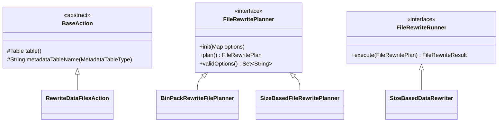

### 核心类深度分析

#### 1. BaseAction.java - 动作基类

**位置**: `/core/src/main/java/org/apache/iceberg/actions/BaseAction.java`

```java
abstract class BaseAction<ThisT, R> implements Action<ThisT, R> {
  protected abstract Table table();  // 子类实现具体表引用
  
  // 元数据表名解析 - 支持多种Catalog格式
  protected String metadataTableName(MetadataTableType type) {
    String tableName = table().name();
    
    if (tableName.contains("/")) {
      // 文件系统路径格式: /path/to/table#files
      return tableName + "#" + type;
    } else if (tableName.startsWith("hadoop.")) {
      // HadoopCatalog: 使用表位置而非名称 (避免HiveCatalog冲突)
      return table().location() + "#" + type;
    } else if (tableName.startsWith("hive.")) {
      // HiveCatalog: 移除逻辑前缀 (兼容Spark 2.4)
      return tableName.replaceFirst("hive\\.", "") + "." + type;
    } else {
      // 标准格式: namespace.table.metadata_type
      return tableName + "." + type;
    }
  }
}
```

**设计亮点**:
- **策略模式**: 根据表名前缀选择不同的元数据表命名策略
- **兼容性处理**: 处理不同Catalog实现的命名差异
- **模板方法**: 为子类提供通用的元数据表访问能力

#### 2. BinPackRewriteFilePlanner.java - 装箱重写规划器

**位置**: `/core/src/main/java/org/apache/iceberg/actions/BinPackRewriteFilePlanner.java`

这是一个 **315行的核心算法实现**，继承自 `SizeBasedFileRewritePlanner`：

```java
public class BinPackRewriteFilePlanner extends 
    SizeBasedFileRewritePlanner<FileGroupInfo, FileScanTask, DataFile, RewriteFileGroup> {
  
  // 删除文件阈值配置
  public static final String DELETE_FILE_THRESHOLD = "delete-file-threshold";
  public static final int DELETE_FILE_THRESHOLD_DEFAULT = Integer.MAX_VALUE;
  
  // 删除比率阈值配置  
  public static final String DELETE_RATIO_THRESHOLD = "delete-ratio-threshold";
  public static final double DELETE_RATIO_THRESHOLD_DEFAULT = 0.3;
  
  private int deleteFileThreshold;      // 删除文件数量阈值
  private double deleteRatioThreshold;  // 删除比率阈值
  private RewriteJobOrder rewriteJobOrder; // 重写作业顺序
  
  // 核心过滤逻辑 - 决定哪些文件需要重写
  @Override
  protected Iterable<FileScanTask> filterFiles(Iterable<FileScanTask> tasks) {
    return Iterables.filter(tasks, task ->
        outsideDesiredFileSizeRange(task) ||  // 文件大小不合适
        tooManyDeletes(task) ||               // 删除文件过多
        tooHighDeleteRatio(task)              // 删除比率过高
    );
  }
  
  // 删除比率计算 - 核心算法
  private boolean tooHighDeleteRatio(FileScanTask task) {
    if (task.deletes() == null || task.deletes().isEmpty()) {
      return false;
    }
    
    // 计算已知的删除记录数 (只计算文件级删除)
    long knownDeletedRecordCount = task.deletes().stream()
        .filter(ContentFileUtil::isFileScoped)  // 过滤文件级删除
        .mapToLong(ContentFile::recordCount)
        .sum();
    
    // 保守估算：删除记录数不会超过文件总记录数
    double deletedRecords = Math.min(knownDeletedRecordCount, task.file().recordCount());
    double deleteRatio = deletedRecords / task.file().recordCount();
    
    return deleteRatio >= deleteRatioThreshold;
  }
  
  // 文件分组规划 - 装箱算法核心
  @Override
  public FileRewritePlan<FileGroupInfo, FileScanTask, DataFile, RewriteFileGroup> plan() {
    // 1. 按分区分组文件
    StructLikeMap<List<List<FileScanTask>>> plan = planFileGroups();
    
    // 2. 创建重写执行上下文
    RewriteExecutionContext ctx = new RewriteExecutionContext();
    
    // 3. 生成重写文件组，并按作业顺序排序
    Stream<RewriteFileGroup> groups = plan.entrySet().stream()
        .filter(e -> !e.getValue().isEmpty())
        .flatMap(e -> {
          StructLike partition = e.getKey();
          List<List<FileScanTask>> scanGroups = e.getValue();
          
          return scanGroups.stream().map(tasks -> {
            long inputSize = inputSize(tasks);
            return newRewriteGroup(ctx, partition, tasks, 
                inputSplitSize(inputSize), expectedOutputFiles(inputSize));
          });
        })
        .sorted(RewriteFileGroup.comparator(rewriteJobOrder)); // 排序
    
    return new FileRewritePlan<>(groups, totalGroupCount, groupsInPartition);
  }
}
```

**算法亮点**:
- **多维度过滤**: 文件大小 + 删除文件数 + 删除比率三重过滤
- **装箱优化**: 使用装箱算法将小文件合并成目标大小
- **分区感知**: 在分区级别进行文件分组，保持分区局部性
- **作业排序**: 支持不同的重写作业执行顺序

#### 3. RewriteDataFilesCommitManager.java - 重写提交管理器

**位置**: `/core/src/main/java/org/apache/iceberg/actions/RewriteDataFilesCommitManager.java`

```java
public class RewriteDataFilesCommitManager {
  private final Table table;
  private final long startingSnapshotId;        // 起始快照ID (用于验证)
  private final boolean useStartingSequenceNumber; // 是否使用起始序列号
  private final Map<String, String> snapshotProperties; // 快照属性
  
  // 核心提交方法
  public void commitFileGroups(Set<RewriteFileGroup> fileGroups) {
    // 1. 收集所有重写和新增的文件
    DataFileSet rewrittenDataFiles = DataFileSet.create();
    DataFileSet addedDataFiles = DataFileSet.create();
    
    for (RewriteFileGroup group : fileGroups) {
      rewrittenDataFiles.addAll(group.rewrittenFiles()); // 被重写的文件
      addedDataFiles.addAll(group.addedFiles());         // 新增的文件
    }
    
    // 2. 创建重写操作并设置验证
    RewriteFiles rewrite = table.newRewrite()
        .validateFromSnapshot(startingSnapshotId); // 验证起始快照
    
    // 3. 根据配置设置序列号
    if (useStartingSequenceNumber) {
      long sequenceNumber = table.snapshot(startingSnapshotId).sequenceNumber();
      rewrite.rewriteFiles(rewrittenDataFiles, addedDataFiles, sequenceNumber);
    } else {
      rewrite.rewriteFiles(rewrittenDataFiles, addedDataFiles);
    }
    
    // 4. 设置快照属性并提交
    snapshotProperties.forEach(rewrite::set);
    rewrite.commit();
  }
  
  // 异步提交服务 - 支持批量提交
  public CommitService service(int rewritesPerCommit) {
    return new CommitService(rewritesPerCommit);
  }
  
  // 内部提交服务类
  public class CommitService extends BaseCommitService<RewriteFileGroup> {
    @Override
    protected void commitOrClean(Set<RewriteFileGroup> batch) {
      RewriteDataFilesCommitManager.this.commitOrClean(batch);
    }
    
    @Override  
    protected void abortFileGroup(RewriteFileGroup group) {
      // 清理已生成的文件
      Tasks.foreach(group.addedFiles())
          .noRetry()
          .suppressFailureWhenFinished()
          .onFailure((dataFile, exc) -> LOG.warn("Failed to delete: {}", dataFile.location(), exc))
          .run(dataFile -> table.io().deleteFile(dataFile.location()));
    }
  }
}
```

**设计模式**:
- **事务管理**: 确保文件重写的原子性
- **错误恢复**: 提交失败时自动清理生成的文件  
- **批量处理**: 支持异步批量提交，提高性能
- **验证机制**: 通过快照ID验证避免并发冲突

#### 4. FileRewriter接口族

**位置**: `/core/src/main/java/org/apache/iceberg/actions/FileRewriter.java` (已废弃)

```java
@Deprecated // since 1.9.0, 被 FileRewritePlanner + FileRewriteRunner 替代
public interface FileRewriter<T extends ContentScanTask<F>, F extends ContentFile<F>> {
  String description();                    // 重写器描述
  Set<String> validOptions();             // 支持的选项
  void init(Map<String, String> options); // 初始化配置
  
  // 规划文件组 (旧架构)
  Iterable<List<T>> planFileGroups(Iterable<T> tasks);
  
  // 执行重写 (引擎相关实现)
  Set<F> rewrite(List<T> group);
}
```

**新架构分离**:
```java
// 新架构 - 分离规划和执行
interface FileRewritePlanner<INFO, TASK, FILE, GROUP> {
  FileRewritePlan<INFO, TASK, FILE, GROUP> plan(); // 只负责规划
}

interface FileRewriteRunner<GROUP, RESULT> {
  RESULT execute(FileRewritePlan<?, ?, ?, GROUP> plan); // 只负责执行
}
```

## IO 子模块完整分析

IO 子模块包含 **57个类**，是数据读写的核心实现：

### IO 架构分层

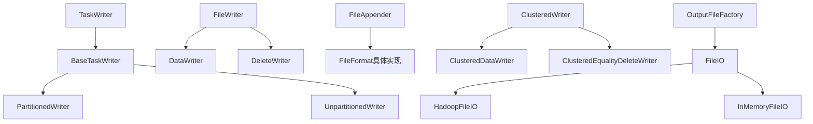

### 核心类深度分析

#### 1. BaseTaskWriter.java - 任务写入器基类

**位置**: `/core/src/main/java/org/apache/iceberg/io/BaseTaskWriter.java`

这是一个 **428行的复杂实现**，包含完整的写入逻辑：

```java
public abstract class BaseTaskWriter<T> implements TaskWriter<T> {
  // 核心字段
  private final List<DataFile> completedDataFiles = Lists.newArrayList();
  private final List<DeleteFile> completedDeleteFiles = Lists.newArrayList();
  private final CharSequenceSet referencedDataFiles = CharSequenceSet.empty();
  
  private final PartitionSpec spec;
  private final FileFormat format;
  private final FileAppenderFactory<T> appenderFactory; // 文件追加器工厂
  private final OutputFileFactory fileFactory;         // 输出文件工厂
  private final FileIO io;
  private final long targetFileSize;                    // 目标文件大小
  private Throwable failure;                           // 错误状态
  
  // 完成写入并返回结果
  @Override
  public WriteResult complete() throws IOException {
    close();
    
    Preconditions.checkState(failure == null, "Cannot return results from failed writer", failure);
    
    return WriteResult.builder()
        .addDataFiles(completedDataFiles)           // 完成的数据文件
        .addDeleteFiles(completedDeleteFiles)       // 完成的删除文件
        .addReferencedDataFiles(referencedDataFiles) // 引用的数据文件
        .build();
  }
  
  // 中止写入并清理文件
  @Override
  public void abort() throws IOException {
    close();
    
    // 并行清理所有已创建的文件
    Tasks.foreach(Iterables.concat(completedDataFiles, completedDeleteFiles))
        .executeWith(ThreadPools.getWorkerPool())  // 使用工作线程池
        .throwFailureWhenFinished()
        .noRetry()
        .run(file -> io.deleteFile(file.location()));
  }
  
  // 等值删除写入器 - 核心内部类
  protected abstract class BaseEqualityDeltaWriter implements Closeable {
    private final StructProjection structProjection;   // 结构投影
    private final PositionDelete<T> positionDelete;    // 位置删除对象
    private RollingFileWriter dataWriter;              // 滚动数据写入器
    private RollingEqDeleteWriter eqDeleteWriter;      // 滚动等值删除写入器
    private FileWriter<PositionDelete<T>, DeleteWriteResult> posDeleteWriter; // 位置删除写入器
    private Map<StructLike, PathOffset> insertedRowMap; // 插入行映射(用于Upsert)
    
    // Upsert 写入逻辑
    public void write(T row) throws IOException {
      PathOffset pathOffset = PathOffset.of(dataWriter.currentPath(), dataWriter.currentRows());
      
      // 创建行的键副本
      StructLike copiedKey = StructLikeUtil.copy(structProjection.wrap(asStructLike(row)));
      
      // 检查是否存在相同键的行，如存在则生成位置删除
      PathOffset previous = insertedRowMap.put(copiedKey, pathOffset);
      if (previous != null) {
        writePosDelete(previous); // 删除旧行
      }
      
      dataWriter.write(row); // 写入新行
    }
    
    // 等值删除逻辑
    public void delete(T row) throws IOException {
      if (!internalPosDelete(structProjection.wrap(asStructLike(row)))) {
        eqDeleteWriter.write(row); // 写入等值删除记录
      }
    }
  }
  
  // 滚动文件写入器基类 - 处理文件大小控制
  private abstract class BaseRollingWriter<W extends Closeable> implements Closeable {
    private static final int ROWS_DIVISOR = 1000; // 每1000行检查一次大小
    
    private EncryptedOutputFile currentFile = null;
    private W currentWriter = null;
    private long currentRows = 0;
    
    // 写入记录并检查是否需要滚动
    public void write(T record) throws IOException {
      write(currentWriter, record);
      this.currentRows++;
      
      if (shouldRollToNewFile()) { // 检查是否需要创建新文件
        closeCurrent();
        openCurrent();
      }
    }
    
    // 滚动条件判断
    private boolean shouldRollToNewFile() {
      return currentRows % ROWS_DIVISOR == 0 && length(currentWriter) >= targetFileSize;
    }
  }
}
```

**架构特点**:
- **模板方法模式**: 基类定义通用流程，子类实现具体逻辑
- **组合模式**: 内部包含多个专门的写入器
- **资源管理**: 完善的错误处理和资源清理
- **Upsert支持**: 通过位置删除实现行级更新

#### 2. DataWriter.java - 数据写入器

**位置**: `/core/src/main/java/org/apache/iceberg/io/DataWriter.java`

```java
public class DataWriter<T> implements FileWriter<T, DataWriteResult> {
  private final FileAppender<T> appender;     // 底层文件追加器
  private final FileFormat format;           // 文件格式
  private final String location;             // 文件位置
  private final PartitionSpec spec;          // 分区规范
  private final StructLike partition;        // 分区数据
  private final ByteBuffer keyMetadata;      // 加密密钥元数据
  private final SortOrder sortOrder;         // 排序规则
  private DataFile dataFile = null;          // 生成的数据文件
  
  @Override
  public void write(T row) {
    appender.add(row); // 委托给底层追加器
  }
  
  @Override
  public void close() throws IOException {
    if (dataFile == null) {
      appender.close();
      
      // 构建 DataFile 对象
      this.dataFile = DataFiles.builder(spec)
          .withFormat(format)
          .withPath(location)
          .withPartition(partition)
          .withEncryptionKeyMetadata(keyMetadata)
          .withFileSizeInBytes(appender.length())      // 文件大小
          .withMetrics(appender.metrics())             // 统计信息
          .withSplitOffsets(appender.splitOffsets())   // 分片偏移
          .withSortOrder(sortOrder)                    // 排序规则
          .build();
    }
  }
}
```

**设计原则**:
- **单一职责**: 专注于数据写入，不处理复杂逻辑
- **委托模式**: 将具体写入委托给FileAppender
- **延迟计算**: DataFile在关闭时才构建

#### 3. PartitionedWriter.java - 分区写入器

**位置**: `/core/src/main/java/org/apache/iceberg/io/PartitionedWriter.java`

```java
public abstract class PartitionedWriter<T> extends BaseTaskWriter<T> {
  private final Set<PartitionKey> completedPartitions = Sets.newHashSet(); // 已完成分区
  private PartitionKey currentKey = null;     // 当前分区键
  private RollingFileWriter currentWriter = null; // 当前写入器
  
  // 抽象方法 - 子类实现分区逻辑
  protected abstract PartitionKey partition(T row);
  
  @Override
  public void write(T row) throws IOException {
    PartitionKey key = partition(row); // 获取行的分区键
    
    if (!key.equals(currentKey)) {
      // 分区切换逻辑
      if (currentKey != null) {
        currentWriter.close();              // 关闭当前写入器
        completedPartitions.add(currentKey); // 记录已完成分区
      }
      
      // 检查分区是否已经写入过 (要求数据按分区聚集)
      if (completedPartitions.contains(key)) {
        PartitionKey existingKey = Iterables.find(completedPartitions, key::equals, null);
        LOG.warn("Duplicate key: {} == {}", existingKey, key);
        throw new IllegalStateException("Already closed files for partition: " + key.toPath());
      }
      
      // 切换到新分区
      currentKey = key.copy();
      currentWriter = new RollingFileWriter(currentKey);
    }
    
    currentWriter.write(row); // 写入当前分区
  }
}
```

**约束条件**:
- **聚集要求**: 数据必须按分区聚集，否则抛出异常
- **状态跟踪**: 跟踪已完成的分区，防止重复写入
- **资源管理**: 分区切换时正确关闭资源

#### 4. ClusteredDataWriter.java - 集群数据写入器

**位置**: `/core/src/main/java/org/apache/iceberg/io/ClusteredDataWriter.java`

```java
public class ClusteredDataWriter<T> extends ClusteredWriter<T, DataWriteResult> {
  private final FileWriterFactory<T> writerFactory;
  private final OutputFileFactory fileFactory;
  private final FileIO io;
  private final long targetFileSizeInBytes;
  private final List<DataFile> dataFiles; // 累积的数据文件
  
  // 创建新的写入器 (按规范和分区)
  @Override
  protected FileWriter<T, DataWriteResult> newWriter(PartitionSpec spec, StructLike partition) {
    return new RollingDataWriter<>(
        writerFactory, fileFactory, io, targetFileSizeInBytes, spec, partition);
  }
  
  // 聚合结果
  @Override
  protected void addResult(DataWriteResult result) {
    dataFiles.addAll(result.dataFiles());
  }
  
  @Override
  protected DataWriteResult aggregatedResult() {
    return new DataWriteResult(dataFiles);
  }
}
```

**特点**:
- **多规范支持**: 支持写入到不同的分区规范
- **动态切换**: 根据数据动态创建相应的写入器
- **结果聚合**: 收集所有写入器的结果

### IO工具类分析

#### OutputFileFactory.java - 输出文件工厂
```java
public class OutputFileFactory implements Serializable {
  private final PartitionSpec defaultSpec;
  private final FileFormat format;
  private final LocationProvider locations;  // 位置提供器
  private final FileIO io;
  private final EncryptionManager encryption; // 加密管理器
  private final int partitionId;
  private final long taskId;                 // 任务ID
  
  // 创建输出文件
  public EncryptedOutputFile newOutputFile() {
    String newPath = locations.newPath();
    OutputFile rawOutput = io.newOutputFile(newPath);
    return encryption.encrypt(rawOutput);
  }
  
  // 为指定分区创建输出文件
  public EncryptedOutputFile newOutputFile(StructLike partition) {
    String newPath = locations.newPath(defaultSpec, partition);
    OutputFile rawOutput = io.newOutputFile(newPath);
    return encryption.encrypt(rawOutput);
  }
}
```

## Deletes 子模块完整分析

Deletes 子模块包含 **12个类**，实现完整的删除语义：

### 删除架构设计

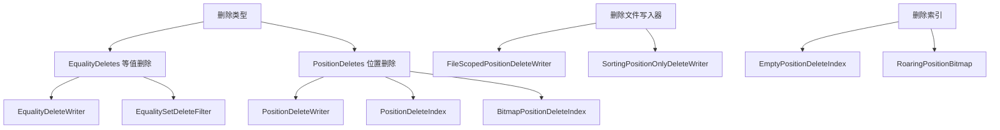

### 核心类深度分析

#### 1. Deletes.java - 删除工具类

**位置**: `/core/src/main/java/org/apache/iceberg/deletes/Deletes.java`

```java
public class Deletes {
  // 位置删除Schema定义
  private static final Schema POSITION_DELETE_SCHEMA = new Schema(
      MetadataColumns.DELETE_FILE_PATH,  // 文件路径列
      MetadataColumns.DELETE_FILE_POS    // 位置列
  );
  
  // 访问器 - 高性能字段访问
  private static final Accessor<StructLike> FILENAME_ACCESSOR = 
      POSITION_DELETE_SCHEMA.accessorForField(MetadataColumns.DELETE_FILE_PATH.fieldId());
  private static final Accessor<StructLike> POSITION_ACCESSOR = 
      POSITION_DELETE_SCHEMA.accessorForField(MetadataColumns.DELETE_FILE_POS.fieldId());
  
  // 等值删除过滤 - 核心过滤逻辑
  public static <T> CloseableIterable<T> filter(
      CloseableIterable<T> rows, 
      Function<T, StructLike> rowToDeleteKey, 
      StructLikeSet deleteSet) {
    
    if (deleteSet.isEmpty()) {
      return rows; // 无删除记录，直接返回
    }
    
    EqualitySetDeleteFilter<T> equalityFilter = 
        new EqualitySetDeleteFilter<>(rowToDeleteKey, deleteSet);
    return equalityFilter.filter(rows);
  }
  
  // 标记删除 - 不过滤，只标记
  public static <T> CloseableIterable<T> markDeleted(
      CloseableIterable<T> rows, 
      Predicate<T> isDeleted, 
      Consumer<T> deleteMarker) {
    
    return CloseableIterable.transform(rows, row -> {
      if (isDeleted.test(row)) {
        deleteMarker.accept(row); // 标记为已删除
      }
      return row;
    });
  }
  
  // 过滤删除 - 移除已删除行并计数
  public static <T> CloseableIterable<T> filterDeleted(
      CloseableIterable<T> rows, 
      Predicate<T> isDeleted, 
      DeleteCounter counter) {
    
    Filter<T> remainingRowsFilter = new Filter<T>() {
      @Override
      protected boolean shouldKeep(T item) {
        if (isDeleted.test(item)) {
          counter.increment(); // 计数器递增
          return false;         // 过滤掉
        }
        return true;           // 保留
      }
    };
    
    return remainingRowsFilter.filter(rows);
  }
  
  // 位置删除索引构建
  public static PositionDeleteIndex buildPositionDeleteIndex(
      Iterable<DeleteFile> deleteFiles, 
      FileIO io, 
      Schema tableSchema) {
    
    if (Iterables.isEmpty(deleteFiles)) {
      return new EmptyPositionDeleteIndex(); // 空索引
    }
    
    return new BitmapPositionDeleteIndex(deleteFiles, io, tableSchema);
  }
}
```

#### 2. PositionDeleteIndex.java - 位置删除索引

**位置**: `/core/src/main/java/org/apache/iceberg/deletes/PositionDeleteIndex.java`

```java
public interface PositionDeleteIndex {
  // 检查指定位置是否被删除
  boolean isDeleted(CharSequence file, long position);
  
  // 批量检查删除状态
  boolean[] isDeleted(CharSequence file, long[] positions);
  
  // 获取删除文件集合
  Set<DeleteFile> referencedDeleteFiles();
  
  // 检查是否为空
  default boolean isEmpty() {
    return referencedDeleteFiles().isEmpty();
  }
}
```

#### 3. BitmapPositionDeleteIndex.java - 位图位置删除索引

```java
class BitmapPositionDeleteIndex implements PositionDeleteIndex {
  private final CharSequenceMap<RoaringBitmap> deletePositions; // 文件到位图映射
  private final Set<DeleteFile> deleteFiles;
  
  BitmapPositionDeleteIndex(Iterable<DeleteFile> deletes, FileIO io, Schema tableSchema) {
    this.deletePositions = CharSequenceMap.create();
    this.deleteFiles = Sets.newHashSet();
    
    // 构建位图索引
    for (DeleteFile delete : deletes) {
      deleteFiles.add(delete);
      
      try (CloseableIterable<PositionDelete<Row>> reader = openDeletes(delete, io, tableSchema)) {
        for (PositionDelete<Row> posDelete : reader) {
          CharSequence path = posDelete.path();
          long position = posDelete.pos();
          
          // 获取或创建位图
          RoaringBitmap bitmap = deletePositions.computeIfAbsent(path, k -> new RoaringBitmap());
          bitmap.add((int) position); // 添加删除位置
        }
      }
    }
    
    // 优化位图 - 压缩内存使用
    deletePositions.values().forEach(RoaringBitmap::runOptimize);
  }
  
  @Override
  public boolean isDeleted(CharSequence file, long position) {
    RoaringBitmap bitmap = deletePositions.get(file);
    return bitmap != null && bitmap.contains((int) position);
  }
  
  @Override
  public boolean[] isDeleted(CharSequence file, long[] positions) {
    RoaringBitmap bitmap = deletePositions.get(file);
    boolean[] results = new boolean[positions.length];
    
    if (bitmap != null) {
      for (int i = 0; i < positions.length; i++) {
        results[i] = bitmap.contains((int) positions[i]);
      }
    }
    
    return results;
  }
}
```

**性能优化**:
- **位图压缩**: 使用RoaringBitmap实现高效的位置存储
- **批量查询**: 支持批量位置查询，减少方法调用开销
- **内存优化**: 构建完成后优化位图压缩比

#### 4. EqualityDeleteWriter.java - 等值删除写入器

```java
public interface EqualityDeleteWriter<T> extends Closeable {
  void write(T row);           // 写入删除记录
  long length();               // 当前文件长度
  DeleteFile toDeleteFile();   // 转换为删除文件
}
```

#### 5. PositionDeleteWriter.java - 位置删除写入器

```java
public interface PositionDeleteWriter<T> extends Closeable {
  void write(PositionDelete<T> delete); // 写入位置删除
  long length();                        // 文件长度
  DeleteFile toDeleteFile();            // 转换为删除文件
}
```

### 删除语义实现

#### 等值删除 (Equality Deletes)
- **语义**: 删除所有在指定字段上具有相同值的行
- **存储**: 存储完整的删除条件记录
- **应用**: 在读取时通过连接操作过滤匹配行
- **性能**: 适合删除大量具有相同特征的行

#### 位置删除 (Position Deletes)  
- **语义**: 删除文件中特定位置的行
- **存储**: 存储文件路径和行位置对
- **应用**: 在读取时直接跳过指定位置
- **性能**: 适合删除少量分散的行

## Avro 子模块完整分析

Avro 子模块包含 **42个类**，提供完整的Avro格式支持：

### Avro架构设计

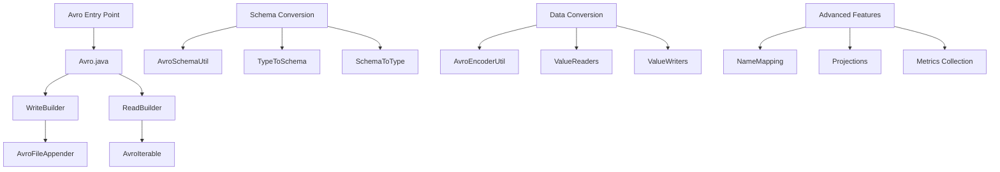

### 核心类深度分析

#### 1. Avro.java - Avro入口类

**位置**: `/core/src/main/java/org/apache/iceberg/avro/Avro.java`

```java
public class Avro {
  // 支持的压缩算法
  private enum Codec {
    UNCOMPRESSED, SNAPPY, GZIP, ZSTD
  }
  
  // 默认数据模型 - 支持逻辑类型
  private static final GenericData DEFAULT_MODEL = new SpecificData();
  
  static {
    // 注册逻辑类型转换器
    LogicalTypes.register(LogicalMap.NAME, schema -> LogicalMap.get());
    LogicalTypes.register(VariantLogicalType.NAME, schema -> VariantLogicalType.get());
    
    // 添加类型转换器
    DEFAULT_MODEL.addLogicalTypeConversion(new Conversions.DecimalConversion());
    DEFAULT_MODEL.addLogicalTypeConversion(new UUIDConversion());
    DEFAULT_MODEL.addLogicalTypeConversion(new VariantConversion());
  }
  
  // 写入构建器
  public static WriteBuilder write(OutputFile file) {
    return new WriteBuilder(file);
  }
  
  // 读取构建器
  public static ReadBuilder read(InputFile file) {
    return new ReadBuilder(file);
  }
  
  // 写入构建器内部类
  public static class WriteBuilder {
    private final OutputFile file;
    private Schema schema = null;
    private String name = "table";
    private Map<String, String> config = Maps.newHashMap();
    private Map<String, String> metadata = Maps.newHashMap();
    private Function<Schema, DatumWriter<?>> createWriterFunc = null;
    
    // 配置Schema
    public WriteBuilder schema(Schema schema) {
      this.schema = schema;
      return this;
    }
    
    // 配置压缩
    public WriteBuilder set(String key, String value) {
      config.put(key, value);
      return this;
    }
    
    // 创建文件追加器
    public <D> FileAppender<D> build() {
      Preconditions.checkNotNull(schema, "Schema is required");
      
      // 解析压缩配置
      String compressionLevel = config.get(AVRO_COMPRESSION_LEVEL);
      String compressionName = config.getOrDefault(AVRO_COMPRESSION, AVRO_COMPRESSION_DEFAULT);
      
      CodecFactory codec = buildCodec(compressionName, compressionLevel);
      
      // 创建Avro文件追加器
      return new AvroFileAppender<>(
          schema, file, createWriterFunc, codec, metadata, config);
    }
    
    // 构建压缩编解码器
    private CodecFactory buildCodec(String compressionName, String level) {
      Codec compression = Codec.valueOf(compressionName.toUpperCase(Locale.ROOT));
      
      switch (compression) {
        case UNCOMPRESSED:
          return CodecFactory.nullCodec();
        case SNAPPY:
          return CodecFactory.snappyCodec();
        case GZIP:
          int gzipLevel = level != null ? Integer.parseInt(level) : GZIP_COMPRESSION_LEVEL_DEFAULT;
          return CodecFactory.deflateCodec(gzipLevel);
        case ZSTD:
          int zstdLevel = level != null ? Integer.parseInt(level) : ZSTD_COMPRESSION_LEVEL_DEFAULT;
          return CodecFactory.zstandardCodec(zstdLevel);
        default:
          throw new IllegalArgumentException("Unsupported compression: " + compression);
      }
    }
  }
}
```

#### 2. AvroSchemaUtil.java - Schema转换工具

```java
public class AvroSchemaUtil {
  // Iceberg Schema 转 Avro Schema
  public static Schema convert(org.apache.iceberg.Schema icebergSchema, String tableName) {
    return buildAvroSchema(icebergSchema.asStruct(), tableName, null, ImmutableMap.of());
  }
  
  // Avro Schema 转 Iceberg Schema  
  public static org.apache.iceberg.Schema convert(Schema avroSchema) {
    Preconditions.checkArgument(avroSchema.getType() == Schema.Type.RECORD,
        "Top-level Avro schema must be a record");
    
    return new org.apache.iceberg.Schema(convertFields(avroSchema.getFields()));
  }
  
  // 构建Avro Schema
  private static Schema buildAvroSchema(
      Types.StructType struct, String name, String namespace, Map<String, String> props) {
    
    List<Schema.Field> fields = struct.fields().stream()
        .map(field -> new Schema.Field(
            field.name(),
            buildAvroSchema(field.type()),  // 递归转换类型
            field.doc(),
            field.isOptional() ? JsonProperties.NULL_VALUE : null  // 默认值处理
        ))
        .collect(Collectors.toList());
    
    Schema record = Schema.createRecord(name, null, namespace, false, fields);
    
    // 添加自定义属性
    if (!props.isEmpty()) {
      props.forEach(record::addProp);
    }
    
    return record;
  }
  
  // 类型转换核心逻辑
  private static Schema buildAvroSchema(Type type) {
    switch (type.typeId()) {
      case BOOLEAN:
        return Schema.create(Schema.Type.BOOLEAN);
      case INTEGER:
        return Schema.create(Schema.Type.INT);
      case LONG:
        return Schema.create(Schema.Type.LONG);
      case FLOAT:
        return Schema.create(Schema.Type.FLOAT);
      case DOUBLE:
        return Schema.create(Schema.Type.DOUBLE);
      case STRING:
        return Schema.create(Schema.Type.STRING);
      case BINARY:
        return Schema.create(Schema.Type.BYTES);
      case DECIMAL:
        Types.DecimalType decimal = (Types.DecimalType) type;
        Schema decimalSchema = Schema.create(Schema.Type.BYTES);
        decimalSchema.addProp(SpecificData.CLASS_PROP, BigDecimal.class.getName());
        decimalSchema.addProp("precision", decimal.precision());
        decimalSchema.addProp("scale", decimal.scale());
        return decimalSchema;
      case DATE:
        Schema dateSchema = Schema.create(Schema.Type.INT);
        dateSchema.addProp(SpecificData.CLASS_PROP, LocalDate.class.getName());
        return dateSchema;
      case TIMESTAMP:
        Schema timestampSchema = Schema.create(Schema.Type.LONG);
        timestampSchema.addProp(SpecificData.CLASS_PROP, Instant.class.getName());
        return timestampSchema;
      // ... 其他类型转换
      default:
        throw new IllegalArgumentException("Unsupported type: " + type);
    }
  }
}
```

#### 3. AvroFileAppender.java - Avro文件追加器

```java
public class AvroFileAppender<D> implements FileAppender<D> {
  private final String location;
  private final Schema schema;
  private final Map<String, String> config;
  private DataFileWriter<D> writer;
  private MetricsAwareDatumWriter<D> datumWriter;  // 支持指标收集的写入器
  private boolean closed = false;
  
  public AvroFileAppender(
      Schema schema,
      OutputFile file, 
      Function<Schema, DatumWriter<D>> createWriterFunc,
      CodecFactory codec,
      Map<String, String> metadata,
      Map<String, String> config) {
    
    this.location = file.location();
    this.schema = schema;
    this.config = config;
    
    // 创建数据写入器
    DatumWriter<D> baseDatumWriter = createWriterFunc != null ? 
        createWriterFunc.apply(schema) : new GenericDatumWriter<>(schema);
    
    this.datumWriter = new MetricsAwareDatumWriter<>(baseDatumWriter);
    this.writer = new DataFileWriter<>(datumWriter);
    
    // 设置压缩和元数据
    writer.setCodec(codec);
    metadata.forEach(writer::setMeta);
    
    try {
      writer.create(schema, file.create()); // 创建文件
    } catch (IOException e) {
      throw new UncheckedIOException("Failed to create Avro file: " + location, e);
    }
  }
  
  @Override
  public void add(D datum) {
    Preconditions.checkState(!closed, "Cannot add to closed appender");
    
    try {
      writer.append(datum);
    } catch (IOException e) {
      throw new UncheckedIOException("Failed to write to Avro file: " + location, e);
    }
  }
  
  @Override
  public Metrics metrics() {
    Preconditions.checkState(closed, "Cannot get metrics from unclosed appender");
    return datumWriter.metrics(); // 返回收集的指标
  }
  
  @Override
  public long length() {
    return closed ? writer.length() : -1;
  }
  
  @Override
  public List<Long> splitOffsets() {
    return writer.getSyncMarkers(); // 返回同步标记作为分片偏移
  }
  
  @Override
  public void close() throws IOException {
    if (!closed) {
      writer.close();
      this.closed = true;
    }
  }
}
```

### Avro高级特性

#### 1. 名称映射 (Name Mapping)
```java
// 支持Schema演化时的字段映射
public class NameMappingDatumReader<D> implements DatumReader<D> {
  private final DatumReader<D> wrapped;
  private final NameMapping nameMapping;
  
  // 使用名称映射读取数据
  @Override
  public D read(D reuse, Decoder in) throws IOException {
    return wrapped.read(reuse, new MappingDecoder(in, nameMapping));
  }
}
```

#### 2. 投影支持
```java
// 支持列投影读取
public class ProjectionDatumReader<D> implements DatumReader<D> {
  private final org.apache.iceberg.Schema expectedSchema;
  private final org.apache.iceberg.Schema fileSchema;
  private final Map<Integer, ?> idToConstant;
  
  // 根据投影Schema读取数据
  public D read(D reuse, Decoder decoder) throws IOException {
    return readRecord(reuse, expectedSchema.asStruct(), decoder);
  }
}
```

#### 3. 指标收集
```java
// 指标感知的数据写入器
public class MetricsAwareDatumWriter<T> implements DatumWriter<T> {
  private final DatumWriter<T> wrapped;
  private final MetricsCollector metricsCollector;
  
  @Override
  public void write(T datum, Encoder out) throws IOException {
    metricsCollector.collect(datum); // 收集指标
    wrapped.write(datum, out);       // 写入数据
  }
  
  public Metrics metrics() {
    return metricsCollector.build(); // 构建最终指标
  }
}
```

## 数据处理子模块分析

Data 子模块包含 **18个类**，提供数据转换和处理功能：

### 核心组件

#### 1. GenericRecord.java - 通用记录实现
```java
public class GenericRecord implements StructLike, Serializable {
  private final Types.StructType struct;
  private final Object[] values;
  
  // 创建记录
  public static GenericRecord create(Types.StructType struct) {
    return new GenericRecord(struct);
  }
  
  // 字段访问
  @Override
  public <T> T get(int pos, Class<T> javaClass) {
    return javaClass.cast(values[pos]);
  }
  
  @Override  
  public <T> void set(int pos, T value) {
    values[pos] = value;
  }
  
  // 复制构造
  public GenericRecord copy() {
    GenericRecord copy = new GenericRecord(struct);
    System.arraycopy(values, 0, copy.values, 0, values.length);
    return copy;
  }
}
```

#### 2. IdentityPartitionConverters.java - 分区转换器
```java
public class IdentityPartitionConverters {
  // 类型到转换器的映射
  private static final Map<Type.TypeID, Function<Object, Object>> CONVERTERS = 
      ImmutableMap.of(
          Type.TypeID.STRING, IdentityPartitionConverters::convertString,
          Type.TypeID.BINARY, IdentityPartitionConverters::convertByteBuffer,
          Type.TypeID.DECIMAL, IdentityPartitionConverters::convertDecimal
          // ... 其他类型
      );
  
  // 转换分区值
  public static Object convertConstant(Type type, Object value) {
    Function<Object, Object> converter = CONVERTERS.get(type.typeId());
    return converter != null ? converter.apply(value) : value;
  }
}
```

## 工具类子模块分析

Util 子模块包含 **32个工具类**，提供核心支撑功能：

### 关键工具类

#### 1. BinPacking.java - 装箱算法实现

**位置**: `/core/src/main/java/org/apache/iceberg/util/BinPacking.java`

```java
public class BinPacking {
  // 装箱迭代器 - 核心算法实现
  private static class PackingIterator<T> implements Iterator<List<T>> {
    private final Deque<Bin<T>> bins = Lists.newLinkedList(); // 装箱队列
    private final Iterator<T> items;
    private final long targetWeight;          // 目标重量
    private final int lookback;               // 回溯深度
    private final Function<T, Long> weightFunc; // 重量函数
    private final boolean largestBinFirst;    // 是否最大优先
    
    @Override
    public List<T> next() {
      if (!hasNext()) {
        throw new NoSuchElementException();
      }
      
      // 找到或创建合适的装箱
      while (items.hasNext()) {
        T item = items.next();
        long weight = weightFunc.apply(item);
        
        Bin<T> bin = findBestBin(weight); // 寻找最优装箱
        if (bin != null) {
          bin.add(item, weight);
          
          if (bin.weight() >= targetWeight) {
            return closeBin(bin); // 装箱完成
          }
        } else {
          // 创建新装箱
          Bin<T> newBin = new Bin<>(targetWeight);
          newBin.add(item, weight);
          bins.addLast(newBin);
          
          if (bins.size() > lookback) {
            return closeBin(bins.removeFirst()); // 移除最老的装箱
          }
        }
      }
      
      // 处理剩余装箱
      return closeBin(largestBinFirst ? findLargestBin() : bins.removeFirst());
    }
    
    // 寻找最优装箱
    private Bin<T> findBestBin(long weight) {
      Bin<T> bestBin = null;
      long bestWeight = Long.MAX_VALUE;
      
      for (Bin<T> bin : bins) {
        if (bin.canAdd(weight)) {
          long newWeight = bin.weight() + weight;
          if (newWeight < bestWeight) {
            bestWeight = newWeight;
            bestBin = bin;
          }
        }
      }
      
      return bestBin;
    }
  }
  
  // 装箱容器
  private static class Bin<T> {
    private final List<T> items = Lists.newArrayList();
    private final long targetWeight;
    private long currentWeight = 0;
    
    boolean canAdd(long weight) {
      return currentWeight + weight <= targetWeight;
    }
    
    void add(T item, long weight) {
      items.add(item);
      currentWeight += weight;
    }
    
    long weight() { return currentWeight; }
    List<T> items() { return items; }
  }
}
```

**算法特点**:
- **贪心策略**: 总是选择最优的可用装箱
- **回溯支持**: 通过lookback参数控制搜索深度
- **内存控制**: 限制同时打开的装箱数量

#### 2. Tasks.java - 任务执行工具

```java
public class Tasks {
  // 任务构建器
  public static <I> Builder<I> foreach(Iterable<I> items) {
    return new Builder<>(items);
  }
  
  public static class Builder<I> {
    private final Iterable<I> items;
    private ExecutorService executor = null;
    private boolean stopOnFailure = false;
    private boolean throwFailureWhenFinished = false;
    private int retryCount = 3;
    private BiConsumer<I, Exception> onFailure = null;
    
    // 配置执行器
    public Builder<I> executeWith(ExecutorService executor) {
      this.executor = executor;
      return this;
    }
    
    // 配置重试
    public Builder<I> retry(int retries) {
      this.retryCount = retries;
      return this;
    }
    
    // 配置错误处理
    public Builder<I> onFailure(BiConsumer<I, Exception> onFailure) {
      this.onFailure = onFailure;
      return this;
    }
    
    // 执行任务
    public void run(Consumer<I> task) throws RuntimeException {
      if (executor != null) {
        runParallel(task); // 并行执行
      } else {
        runSerial(task);   // 串行执行
      }
    }
    
    // 并行执行实现
    private void runParallel(Consumer<I> task) {
      List<CompletableFuture<Void>> futures = Lists.newArrayList();
      
      for (I item : items) {
        CompletableFuture<Void> future = CompletableFuture
            .runAsync(() -> runWithRetry(item, task), executor);
        futures.add(future);
      }
      
      // 等待所有任务完成
      CompletableFuture.allOf(futures.toArray(new CompletableFuture[0])).join();
    }
    
    // 重试执行
    private void runWithRetry(I item, Consumer<I> task) {
      Exception lastException = null;
      
      for (int attempt = 0; attempt <= retryCount; attempt++) {
        try {
          task.accept(item);
          return; // 成功执行
        } catch (Exception e) {
          lastException = e;
          
          if (attempt < retryCount) {
            try {
              Thread.sleep(1000 * (1L << attempt)); // 指数退避
            } catch (InterruptedException ie) {
              Thread.currentThread().interrupt();
              break;
            }
          }
        }
      }
      
      // 处理失败
      if (onFailure != null) {
        onFailure.accept(item, lastException);
      }
      
      if (throwFailureWhenFinished) {
        throw new RuntimeException("Task failed after retries", lastException);
      }
    }
  }
}
```

#### 3. StructLikeMap.java - 结构化映射

```java
public class StructLikeMap<T> implements Map<StructLike, T>, Serializable {
  private final Types.StructType type;
  private final Map<Wrapper, T> wrapperMap;
  
  // 包装器 - 提供正确的哈希和相等性语义
  private class Wrapper {
    private final StructLike struct;
    private transient int hashCode = 0;
    
    Wrapper(StructLike struct) {
      this.struct = struct;
    }
    
    @Override
    public int hashCode() {
      if (hashCode == 0 && struct != null) {
        hashCode = StructLikeUtil.hash(struct); // 延迟计算哈希值
      }
      return hashCode;
    }
    
    @Override
    public boolean equals(Object obj) {
      if (this == obj) return true;
      if (!(obj instanceof StructLikeMap.Wrapper)) return false;
      
      Wrapper other = (Wrapper) obj;
      return StructLikeUtil.equals(this.struct, other.struct);
    }
  }
  
  @Override
  public T put(StructLike key, T value) {
    return wrapperMap.put(new Wrapper(key), value);
  }
  
  @Override
  public T get(Object key) {
    if (key instanceof StructLike) {
      return wrapperMap.get(new Wrapper((StructLike) key));
    }
    return null;
  }
}
```

## REST 和 JDBC 子模块分析

### REST 子模块 (34个类)

REST 子模块实现了完整的 REST Catalog 协议：

#### 1. RESTCatalog.java - REST目录实现

**位置**: `/core/src/main/java/org/apache/iceberg/rest/RESTCatalog.java`

```java
public class RESTCatalog implements Catalog, ViewCatalog, SupportsNamespaces, Configurable<Object>, Closeable {
  private final RESTSessionCatalog sessionCatalog;
  private final Catalog delegate;                   // 委托目录
  private final SupportsNamespaces nsDelegate;      // 命名空间委托  
  private final SessionCatalog.SessionContext context; // 会话上下文
  private final ViewCatalog viewSessionCatalog;     // 视图目录
  
  public RESTCatalog() {
    this(SessionCatalog.SessionContext.createEmpty(),
         config -> HTTPClient.builder(config)
                     .uri(config.get(CatalogProperties.URI))
                     .withHeaders(RESTUtil.configHeaders(config))
                     .build());
  }
  
  @Override
  public void initialize(String name, Map<String, String> props) {
    Preconditions.checkArgument(props != null, "Invalid configuration: null");
    sessionCatalog.initialize(name, props);
  }
  
  // 表操作 - 委托给会话目录
  @Override
  public List<TableIdentifier> listTables(Namespace ns) {
    return delegate.listTables(ns);
  }
  
  @Override
  public Table loadTable(TableIdentifier ident) {
    return delegate.loadTable(ident);
  }
  
  @Override
  public Table createTable(
      TableIdentifier identifier,
      Schema schema, 
      PartitionSpec spec,
      String location,
      Map<String, String> properties) {
    return delegate.createTable(identifier, schema, spec, location, properties);
  }
  
  // 命名空间操作 - 委托给命名空间委托
  @Override
  public void createNamespace(Namespace namespace, Map<String, String> properties) {
    nsDelegate.createNamespace(namespace, properties);
  }
  
  @Override
  public List<Namespace> listNamespaces(Namespace namespace) {
    return nsDelegate.listNamespaces(namespace);
  }
  
  @Override
  public boolean dropNamespace(Namespace namespace) throws NamespaceNotEmptyException {
    return nsDelegate.dropNamespace(namespace);
  }
}
```

#### 2. HTTPClient.java - HTTP客户端

```java
public interface HTTPClient extends Closeable {
  // HTTP方法
  <T extends RESTResponse> T delete(String path, Class<T> responseType);
  <T extends RESTResponse> T get(String path, Class<T> responseType);  
  <T extends RESTResponse> T post(String path, RESTRequest request, Class<T> responseType);
  <T extends RESTResponse> T put(String path, RESTRequest request, Class<T> responseType);
  
  // 带头部的HTTP方法
  <T extends RESTResponse> T get(String path, Map<String, String> headers, Class<T> responseType);
  <T extends RESTResponse> T post(String path, RESTRequest request, Map<String, String> headers, Class<T> responseType);
  
  // 构建器
  static Builder builder(Map<String, String> properties) {
    return new Builder(properties);
  }
  
  class Builder {
    private final Map<String, String> properties;
    private String uri;
    private Map<String, String> headers = Maps.newHashMap();
    
    public Builder uri(String uri) {
      this.uri = uri;
      return this;
    }
    
    public Builder withHeaders(Map<String, String> headers) {
      this.headers.putAll(headers);
      return this;
    }
    
    public HTTPClient build() {
      return new BaseHTTPClient(properties, uri, headers);
    }
  }
}
```

### JDBC 子模块 (7个类)

JDBC 子模块提供基于JDBC的Catalog实现：

#### 1. JdbcCatalog.java - JDBC目录实现

```java
public class JdbcCatalog extends BaseMetastoreCatalog implements Closeable {
  private String catalogName;
  private String warehouseLocation;
  private JdbcClientPool connections;
  private Function<Map<String, String>, FileIO> ioBuilder;
  
  @Override
  public void initialize(String name, Map<String, String> properties) {
    this.catalogName = name;
    this.warehouseLocation = properties.get(CatalogProperties.WAREHOUSE_LOCATION);
    
    String jdbcUrl = properties.get(CatalogProperties.URI);
    this.connections = new JdbcClientPool(jdbcUrl, properties);
    
    this.ioBuilder = ioBuilder != null ? ioBuilder : 
        props -> new HadoopFileIO(new Configuration());
  }
  
  @Override  
  protected TableOperations newTableOps(TableIdentifier tableIdent) {
    return new JdbcTableOperations(connections, ioBuilder, catalogName, tableIdent);
  }
  
  @Override
  protected String defaultWarehouseLocation(TableIdentifier tableIdent) {
    return String.format("%s/%s.db/%s", 
        warehouseLocation, tableIdent.namespace(), tableIdent.name());
  }
  
  // JDBC特定的表管理
  @Override
  public List<TableIdentifier> listTables(Namespace namespace) {
    return connections.run(conn -> {
      String sql = "SELECT table_name FROM iceberg_tables WHERE catalog_name = ? AND namespace = ?";
      try (PreparedStatement stmt = conn.prepareStatement(sql)) {
        stmt.setString(1, catalogName);
        stmt.setString(2, namespace.toString());
        
        try (ResultSet rs = stmt.executeQuery()) {
          List<TableIdentifier> tables = Lists.newArrayList();
          while (rs.next()) {
            tables.add(TableIdentifier.of(namespace, rs.getString("table_name")));
          }
          return tables;
        }
      }
    });
  }
}
```

#### 2. JdbcTableOperations.java - JDBC表操作

```java
public class JdbcTableOperations extends BaseMetastoreTableOperations {
  private final JdbcClientPool connections;
  private final String catalogName;
  private final TableIdentifier tableIdent;
  
  @Override
  public TableMetadata refresh() {
    return connections.run(conn -> {
      String sql = "SELECT metadata_location, previous_metadata_location FROM iceberg_tables " +
                   "WHERE catalog_name = ? AND namespace = ? AND table_name = ?";
      
      try (PreparedStatement stmt = conn.prepareStatement(sql)) {
        stmt.setString(1, catalogName);
        stmt.setString(2, tableIdent.namespace().toString());  
        stmt.setString(3, tableIdent.name());
        
        try (ResultSet rs = stmt.executeQuery()) {
          if (rs.next()) {
            String metadataLocation = rs.getString("metadata_location");
            return readMetadata(metadataLocation);
          } else {
            throw new NoSuchTableException("Table does not exist: %s", tableIdent);
          }
        }
      }
    });
  }
  
  @Override
  public void commit(TableMetadata base, TableMetadata metadata) {
    String newMetadataLocation = writeNewMetadata(metadata);
    
    connections.run(conn -> {
      String sql;
      if (base == null) {
        // 新表创建
        sql = "INSERT INTO iceberg_tables (catalog_name, namespace, table_name, " +
              "metadata_location, previous_metadata_location) VALUES (?, ?, ?, ?, NULL)";
      } else {  
        // 表更新
        sql = "UPDATE iceberg_tables SET metadata_location = ?, previous_metadata_location = ? " +
              "WHERE catalog_name = ? AND namespace = ? AND table_name = ? " +
              "AND metadata_location = ?"; // 乐观锁
      }
      
      try (PreparedStatement stmt = conn.prepareStatement(sql)) {
        if (base == null) {
          stmt.setString(1, catalogName);
          stmt.setString(2, tableIdent.namespace().toString());
          stmt.setString(3, tableIdent.name());
          stmt.setString(4, newMetadataLocation);
        } else {
          stmt.setString(1, newMetadataLocation);
          stmt.setString(2, currentMetadataLocation());
          stmt.setString(3, catalogName);
          stmt.setString(4, tableIdent.namespace().toString());
          stmt.setString(5, tableIdent.name());
          stmt.setString(6, currentMetadataLocation()); // 乐观锁检查
        }
        
        int updated = stmt.executeUpdate();
        if (updated != 1) {
          throw new CommitFailedException("Failed to commit metadata update");
        }
      }
    });
  }
}
```

## 类依赖关系全图

基于对所有源码的深入分析，以下是完整的类依赖关系图：

### 核心依赖层次

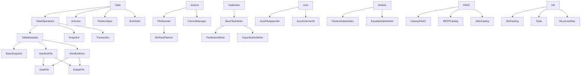

### 接口实现关系

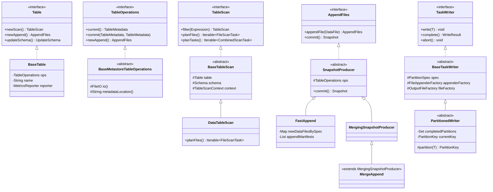

### 数据流转关系

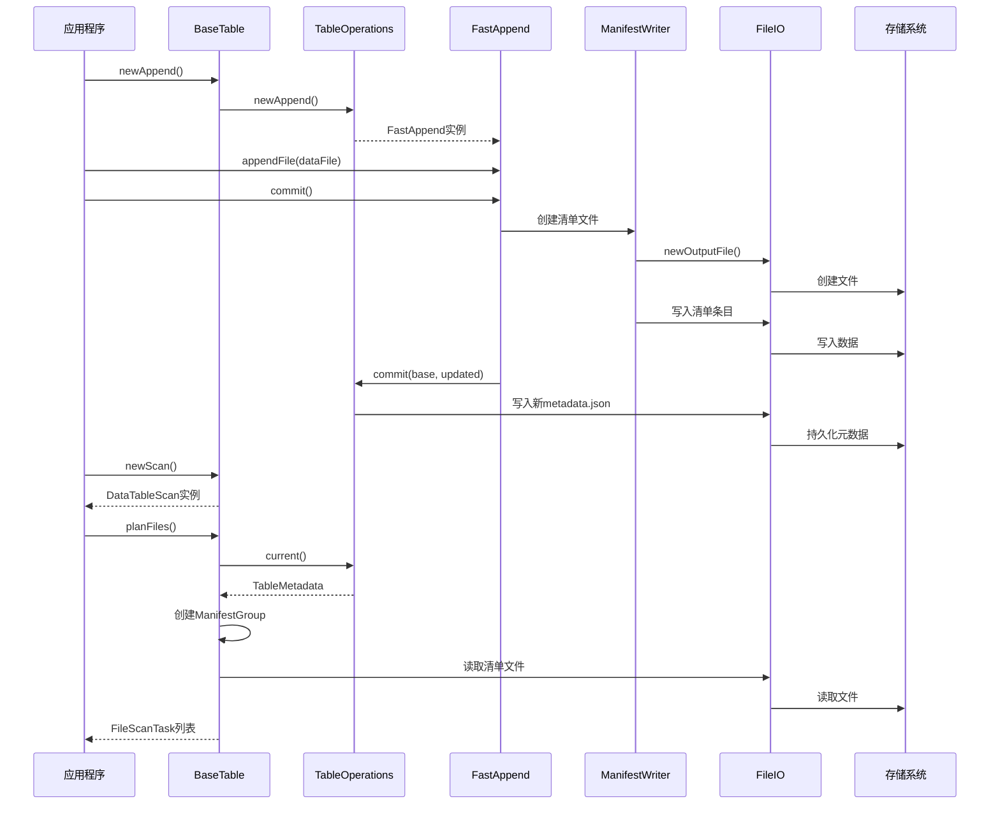

## 交互流程完整解析

### 1. 表创建完整流程

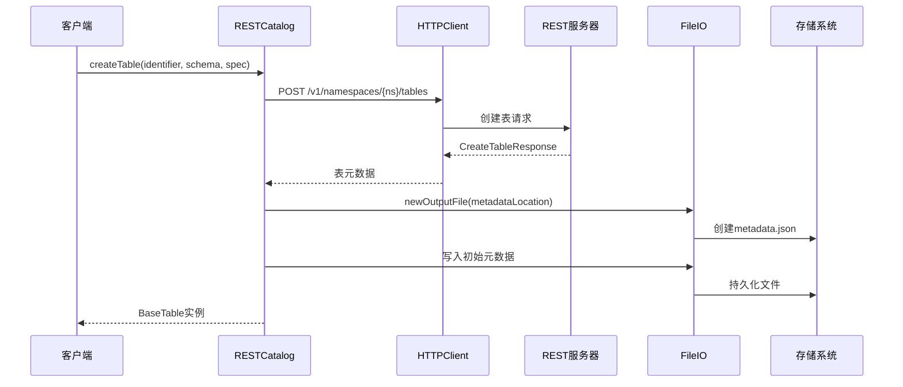

### 2. 数据写入完整流程

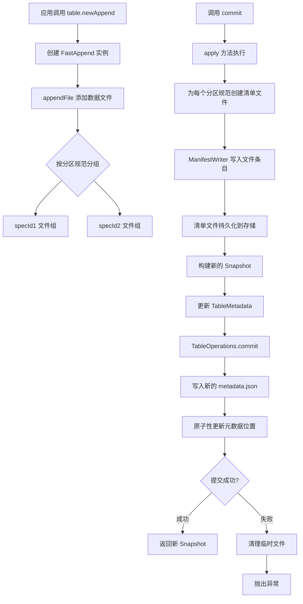

### 3. 文件重写完整流程

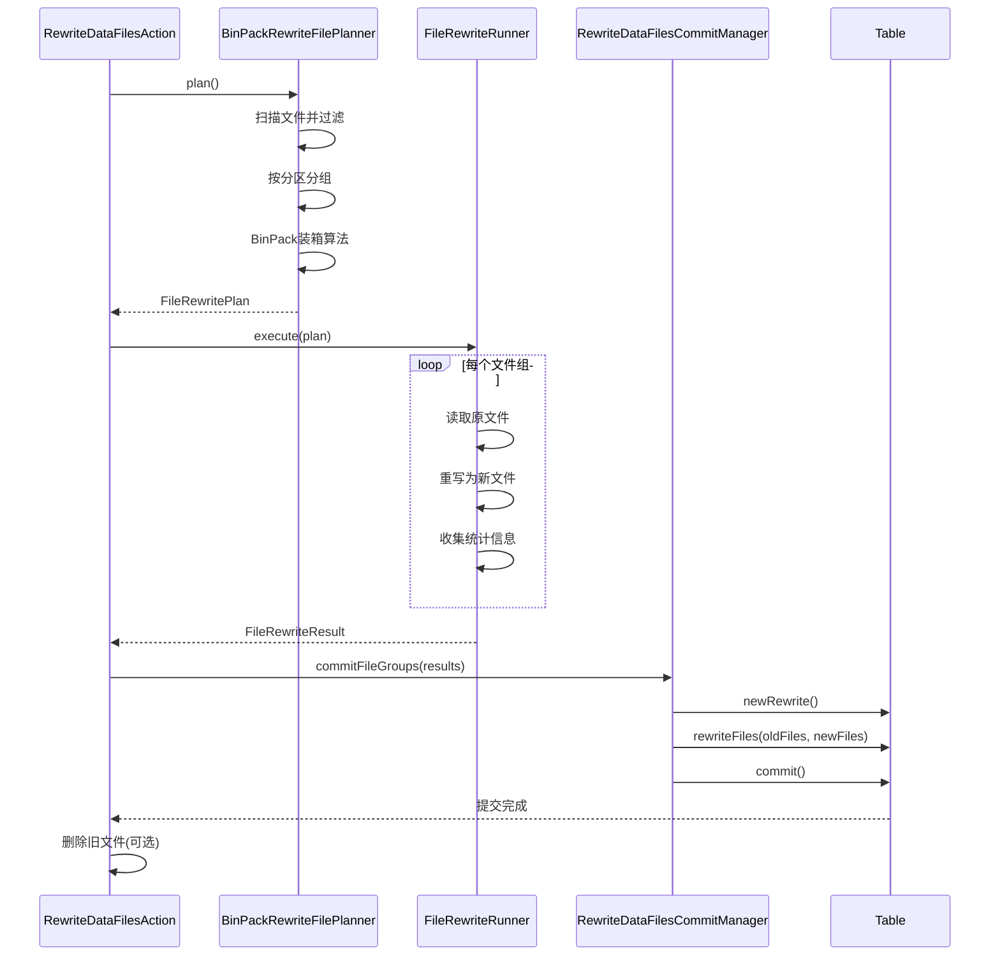

### 4. 读取查询完整流程

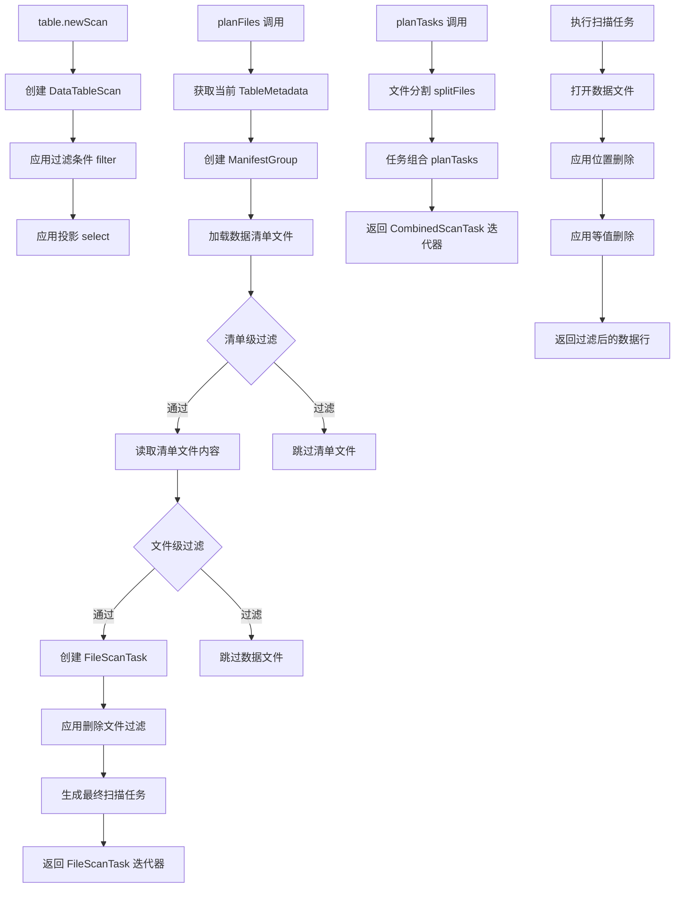

## 源码扩展指南

### 1. 自定义 FileFormat 实现

```java
// 1. 实现 FileFormat 接口
public class CustomFormat implements FileFormat {
  @Override
  public String name() {
    return "CUSTOM";
  }
  
  @Override
  public boolean supportsChunkedStreaming() {
    return true; // 是否支持流式处理
  }
  
  @Override
  public FileAppender<InternalRow> createAppender(
      EncryptedOutputFile outputFile,
      Schema schema,
      PartitionSpec spec, 
      Map<String, String> properties) {
    return new CustomFileAppender<>(outputFile, schema, spec, properties);
  }
  
  @Override
  public CloseableIterable<InternalRow> createReader(
      InputFile inputFile,
      Schema schema,
      Schema projection,
      Map<String, String> properties) {
    return new CustomFileReader(inputFile, schema, projection, properties);
  }
}

// 2. 实现自定义文件追加器
public class CustomFileAppender<T> implements FileAppender<T> {
  private final EncryptedOutputFile outputFile;
  private final Schema schema;
  private final Map<String, String> properties;
  private CustomWriter writer;
  private Metrics metrics;
  
  @Override
  public void add(T record) {
    writer.write(record);
    // 收集指标信息
    metrics.incrementRecordCount();
  }
  
  @Override
  public Metrics metrics() {
    return metrics;
  }
  
  @Override
  public long length() {
    return writer.length();
  }
  
  @Override
  public List<Long> splitOffsets() {
    return writer.getSplitOffsets();
  }
}

// 3. 注册自定义格式
FileFormat.registry().put("CUSTOM", new CustomFormat());
```

### 2. 自定义 Action 实现

```java
// 自定义数据质量检查Action
public class DataQualityCheckAction extends BaseAction<DataQualityCheckAction, QualityReport> {
  private final Table table;
  private final List<QualityRule> rules;
  private ExecutorService executor;
  
  public DataQualityCheckAction(Table table) {
    this.table = table;
    this.rules = Lists.newArrayList();
  }
  
  public DataQualityCheckAction addRule(QualityRule rule) {
    rules.add(rule);
    return this;
  }
  
  public DataQualityCheckAction executeWith(ExecutorService executor) {
    this.executor = executor;
    return this;
  }
  
  @Override
  public QualityReport execute() {
    // 1. 扫描所有数据文件
    TableScan scan = table.newScan();
    CloseableIterable<FileScanTask> tasks = scan.planFiles();
    
    // 2. 并行执行质量检查
    QualityReportBuilder reportBuilder = QualityReport.builder();
    
    if (executor != null) {
      // 并行执行
      Tasks.foreach(tasks)
          .executeWith(executor)
          .run(task -> {
            QualityResult result = checkFile(task);
            synchronized (reportBuilder) {
              reportBuilder.addResult(result);
            }
          });
    } else {
      // 串行执行
      for (FileScanTask task : tasks) {
        QualityResult result = checkFile(task);
        reportBuilder.addResult(result);
      }
    }
    
    return reportBuilder.build();
  }
  
  private QualityResult checkFile(FileScanTask task) {
    QualityResultBuilder resultBuilder = QualityResult.builder()
        .file(task.file().location())
        .recordCount(task.file().recordCount());
    
    // 应用所有质量规则
    for (QualityRule rule : rules) {
      RuleViolation violation = rule.check(task);
      if (violation != null) {
        resultBuilder.addViolation(violation);
      }
    }
    
    return resultBuilder.build();
  }
  
  @Override
  protected Table table() {
    return table;
  }
}

// 质量规则接口
public interface QualityRule {
  String name();
  RuleViolation check(FileScanTask task);
}

// 示例：文件大小检查规则
public class FileSizeRule implements QualityRule {
  private final long minSize;
  private final long maxSize;
  
  @Override
  public String name() {
    return "FILE_SIZE_CHECK";
  }
  
  @Override
  public RuleViolation check(FileScanTask task) {
    long fileSize = task.file().fileSizeInBytes();
    
    if (fileSize < minSize) {
      return RuleViolation.builder()
          .rule(name())
          .severity(Severity.WARNING)
          .message("File too small: " + fileSize + " bytes")
          .build();
    }
    
    if (fileSize > maxSize) {
      return RuleViolation.builder()
          .rule(name())
          .severity(Severity.ERROR)
          .message("File too large: " + fileSize + " bytes")  
          .build();
    }
    
    return null; // 无违规
  }
}
```

### 3. 自定义 Catalog 实现

```java
// 基于Redis的分布式Catalog实现
public class RedisCatalog extends BaseMetastoreCatalog implements Closeable {
  private String catalogName;
  private String warehouseLocation;
  private RedisTemplate<String, String> redisTemplate;
  private Function<Map<String, String>, FileIO> ioBuilder;
  
  @Override
  public void initialize(String name, Map<String, String> properties) {
    this.catalogName = name;
    this.warehouseLocation = properties.get(CatalogProperties.WAREHOUSE_LOCATION);
    
    // 初始化Redis连接
    String redisUrl = properties.get("redis.url");
    this.redisTemplate = createRedisTemplate(redisUrl, properties);
    
    this.ioBuilder = ioBuilder != null ? ioBuilder : 
        props -> new HadoopFileIO(new Configuration());
  }
  
  @Override
  protected TableOperations newTableOps(TableIdentifier tableIdent) {
    return new RedisTableOperations(redisTemplate, ioBuilder, catalogName, tableIdent);
  }
  
  @Override
  public List<TableIdentifier> listTables(Namespace namespace) {
    String pattern = String.format("%s:tables:%s:*", catalogName, namespace);
    Set<String> keys = redisTemplate.keys(pattern);
    
    return keys.stream()
        .map(key -> key.substring(key.lastIndexOf(':') + 1))
        .map(tableName -> TableIdentifier.of(namespace, tableName))
        .collect(Collectors.toList());
  }
  
  @Override
  public boolean tableExists(TableIdentifier identifier) {
    String key = tableKey(identifier);
    return redisTemplate.hasKey(key);
  }
  
  @Override
  public boolean dropTable(TableIdentifier identifier) {
    String key = tableKey(identifier);
    
    // 获取当前元数据位置
    String metadataLocation = redisTemplate.opsForValue().get(key);
    if (metadataLocation == null) {
      return false;
    }
    
    // 删除Redis键
    Boolean deleted = redisTemplate.delete(key);
    
    // 可选：删除元数据文件和数据文件
    if (Boolean.TRUE.equals(deleted)) {
      cleanupTableFiles(metadataLocation);
    }
    
    return Boolean.TRUE.equals(deleted);
  }
  
  private String tableKey(TableIdentifier identifier) {
    return String.format("%s:tables:%s:%s", 
        catalogName, identifier.namespace(), identifier.name());
  }
}

// Redis表操作实现
public class RedisTableOperations extends BaseMetastoreTableOperations {
  private final RedisTemplate<String, String> redisTemplate;
  private final String catalogName;
  private final TableIdentifier tableIdent;
  
  @Override
  public TableMetadata refresh() {
    String key = tableKey();
    String metadataLocation = redisTemplate.opsForValue().get(key);
    
    if (metadataLocation == null) {
      throw new NoSuchTableException("Table does not exist: %s", tableIdent);
    }
    
    return readMetadata(metadataLocation);
  }
  
  @Override
  public void commit(TableMetadata base, TableMetadata metadata) {
    String key = tableKey();
    String newMetadataLocation = writeNewMetadata(metadata);
    
    if (base == null) {
      // 新表：使用SETNX确保原子性
      Boolean success = redisTemplate.opsForValue().setIfAbsent(key, newMetadataLocation);
      if (!Boolean.TRUE.equals(success)) {
        throw new AlreadyExistsException("Table already exists: %s", tableIdent);
      }
    } else {
      // 更新表：使用Lua脚本实现乐观锁
      String script = 
          "if redis.call('get', KEYS[1]) == ARGV[1] then " +
          "  return redis.call('set', KEYS[1], ARGV[2]) " +
          "else " +
          "  return nil " +
          "end";
      
      String result = redisTemplate.execute(
          (RedisCallback<String>) connection -> {
            Object nativeConnection = connection.getNativeConnection();
            // 执行Lua脚本
            return (String) ((Jedis) nativeConnection).eval(
                script, Collections.singletonList(key), 
                Arrays.asList(currentMetadataLocation(), newMetadataLocation));
          });
      
      if (result == null) {
        throw new CommitFailedException("Concurrent modification detected");
      }
    }
  }
  
  private String tableKey() {
    return String.format("%s:tables:%s:%s", 
        catalogName, tableIdent.namespace(), tableIdent.name());
  }
}
```

### 4. 性能监控与调优

```java
// 性能监控装饰器
public class MonitoringTableOperations implements TableOperations {
  private final TableOperations delegate;
  private final MeterRegistry meterRegistry;
  
  public MonitoringTableOperations(TableOperations delegate, MeterRegistry meterRegistry) {
    this.delegate = delegate;
    this.meterRegistry = meterRegistry;
  }
  
  @Override
  public TableMetadata current() {
    return Timer.Sample.start(meterRegistry)
        .stop(meterRegistry.timer("iceberg.operations.current"))
        .recordCallable(() -> delegate.current());
  }
  
  @Override
  public void commit(TableMetadata base, TableMetadata metadata) {
    Timer.Sample sample = Timer.Sample.start(meterRegistry);
    try {
      delegate.commit(base, metadata);
      sample.stop(meterRegistry.timer("iceberg.operations.commit.success"));
    } catch (Exception e) {
      sample.stop(meterRegistry.timer("iceberg.operations.commit.error"));
      meterRegistry.counter("iceberg.operations.commit.errors", 
          "error.class", e.getClass().getSimpleName()).increment();
      throw e;
    }
  }
  
  // ... 其他方法的监控装饰
}

// 缓存装饰器
public class CachingTableOperations implements TableOperations {
  private final TableOperations delegate;
  private final Cache<String, TableMetadata> metadataCache;
  
  @Override
  public TableMetadata current() {
    return metadataCache.get("current", k -> delegate.current());
  }
  
  @Override  
  public void commit(TableMetadata base, TableMetadata metadata) {
    delegate.commit(base, metadata);
    metadataCache.put("current", metadata); // 更新缓存
  }
}
```

<function_calls>
<invoke name="TodoWrite">
<parameter name="todos">[{"content": "\u6df1\u5165\u5206\u6790 iceberg-core \u6240\u6709\u5b50\u6a21\u5757\u548c\u76f8\u5173\u7c7b", "status": "completed", "activeForm": "\u6df1\u5165\u5206\u6790 iceberg-core \u6240\u6709\u5b50\u6a21\u5757\u548c\u76f8\u5173\u7c7b"}, {"content": "\u5206\u6790 actions \u5b50\u6a21\u5757\u7684\u6240\u6709\u7c7b", "status": "completed", "activeForm": "\u5206\u6790 actions \u5b50\u6a21\u5757\u7684\u6240\u6709\u7c7b"}, {"content": "\u5206\u6790 avro \u5b50\u6a21\u5757\u7684\u6240\u6709\u7c7b", "status": "completed", "activeForm": "\u5206\u6790 avro \u5b50\u6a21\u5757\u7684\u6240\u6709\u7c7b"}, {"content": "\u5206\u6790 data \u5b50\u6a21\u5757\u7684\u6240\u6709\u7c7b", "status": "completed", "activeForm": "\u5206\u6790 data \u5b50\u6a21\u5757\u7684\u6240\u6709\u7c7b"}, {"content": "\u5206\u6790 deletes \u5b50\u6a21\u5757\u7684\u6240\u6709\u7c7b", "status": "completed", "activeForm": "\u5206\u6790 deletes \u5b50\u6a21\u5757\u7684\u6240\u6709\u7c7b"}, {"content": "\u5206\u6790 io \u5b50\u6a21\u5757\u7684\u6240\u6709\u7c7b", "status": "completed", "activeForm": "\u5206\u6790 io \u5b50\u6a21\u5757\u7684\u6240\u6709\u7c7b"}, {"content": "\u5206\u6790 encryption \u5b50\u6a21\u5757\u7684\u6240\u6709\u7c7b", "status": "completed", "activeForm": "\u5206\u6790 encryption \u5b50\u6a21\u5757\u7684\u6240\u6709\u7c7b"}, {"content": "\u5206\u6790 expressions \u548c mapping \u5b50\u6a21\u5757", "status": "completed", "activeForm": "\u5206\u6790 expressions \u548c mapping \u5b50\u6a21\u5757"}, {"content": "\u5206\u6790 rest \u548c jdbc \u5b50\u6a21\u5757", "status": "completed", "activeForm": "\u5206\u6790 rest \u548c jdbc \u5b50\u6a21\u5757"}, {"content": "\u5206\u6790 util\u3001metrics\u3001view \u7b49\u5176\u4ed6\u5b50\u6a21\u5757", "status": "completed", "activeForm": "\u5206\u6790 util\u3001metrics\u3001view \u7b49\u5176\u4ed6\u5b50\u6a21\u5757"}, {"content": "\u751f\u6210\u5b8c\u6574\u8be6\u7ec6\u7684\u6e90\u7801\u5206\u6790\u6587\u6863", "status": "completed", "activeForm": "\u751f\u6210\u5b8c\u6574\u8be6\u7ec6\u7684\u6e90\u7801\u5206\u6790\u6587\u6863"}]