# Apache Iceberg Core 源码深度解析

## 目录

1. [概述](#概述)
2. [iceberg-core 整体架构](#iceberg-core-整体架构)
3. [核心模块深度分析](#核心模块深度分析)
4. [元数据管理系统](#元数据管理系统)
5. [数据文件管理系统](#数据文件管理系统)
6. [读取操作核心实现](#读取操作核心实现)
7. [写入操作核心实现](#写入操作核心实现)
8. [压缩操作核心实现](#压缩操作核心实现)
9. [Schema 变更管理](#schema-变更管理)
10. [分区与视图系统](#分区与视图系统)
11. [类依赖关系分析](#类依赖关系分析)
12. [交互流程深度解析](#交互流程深度解析)
13. [最佳实践与扩展指南](#最佳实践与扩展指南)

## 概述

Apache Iceberg 是一个高性能的开源表格式，专为大型分析数据集设计。iceberg-core 模块是整个 Iceberg 项目的核心，包含了表格式的核心实现、元数据管理、文件操作、读写逻辑等关键功能。

本文档基于 Apache Iceberg v1.9.x 源码，深入分析 iceberg-core 模块的每个重要组件，揭示各类之间的复杂依赖关系和交互机制。

### 核心特性

- **ACID 事务支持**: 通过 Snapshot 机制保证事务特性
- **Schema 演化**: 支持添加、删除、重命名列而不影响现有数据
- **时间旅行**: 通过 Snapshot 支持历史数据查询
- **分区演化**: 支持分区规范的动态调整
- **高效压缩**: 内置多种数据和元数据压缩策略
- **多格式支持**: 支持 Parquet、Avro、ORC 等文件格式

## iceberg-core 整体架构

### 目录结构解析

```
iceberg-core/src/main/java/org/apache/iceberg/
├── [核心表操作]
│   ├── BaseTable.java                    # Table 接口的基础实现
│   ├── TableMetadata.java                # 表元数据管理
│   ├── TableOperations.java              # 表操作接口
│   └── TableProperties.java              # 表属性配置
│
├── [元数据管理]
│   ├── BaseSnapshot.java                 # 快照基础实现
│   ├── SnapshotParser.java              # 快照解析器
│   ├── SchemaParser.java                # Schema 解析器
│   ├── PartitionSpecParser.java          # 分区规范解析器
│   └── MetadataUpdate.java               # 元数据更新操作
│
├── [数据文件管理]
│   ├── GenericDataFile.java              # 数据文件实现
│   ├── GenericDeleteFile.java            # 删除文件实现
│   ├── GenericManifestFile.java          # 清单文件实现
│   ├── ManifestEntry.java                # 清单条目接口
│   ├── ManifestFiles.java                # 清单文件工具类
│   ├── ManifestReader.java               # 清单文件读取器
│   ├── ManifestWriter.java               # 清单文件写入器
│   └── DataFiles.java                    # 数据文件工具类
│
├── [读取操作]
│   ├── BaseTableScan.java                # 表扫描基础实现
│   ├── DataTableScan.java                # 数据表扫描实现
│   ├── BaseFileScanTask.java             # 文件扫描任务基类
│   ├── FileScanTaskParser.java           # 扫描任务解析器
│   └── ScanTaskParser.java               # 扫描任务解析器
│
├── [写入操作]
│   ├── FastAppend.java                   # 快速追加实现
│   ├── MergeAppend.java                  # 合并追加实现
│   ├── BaseOverwriteFiles.java          # 覆盖文件基类
│   ├── BaseRowDelta.java                 # 行级变更基类
│   └── MergingSnapshotProducer.java      # 合并快照生产者
│
├── [压缩操作]
│   ├── BaseRewriteFiles.java             # 文件重写基类
│   ├── BaseRewriteManifests.java         # 清单重写基类
│   ├── RemoveSnapshots.java              # 快照清理
│   └── ReachableFileCleanup.java         # 可达文件清理
│
├── [Schema 变更]
│   ├── SchemaUpdate.java                 # Schema 更新实现
│   ├── BaseUpdatePartitionSpec.java      # 分区规范更新基类
│   └── BaseReplaceSortOrder.java         # 排序规则替换基类
│
├── [分区系统]
│   ├── PartitionData.java                # 分区数据实现
│   ├── Partitioning.java                # 分区工具类
│   ├── PartitionStats.java               # 分区统计信息
│   └── PartitionSummary.java             # 分区摘要
│
├── [子模块]
│   ├── actions/                          # 高级数据管理操作
│   ├── avro/                            # Avro 格式支持
│   ├── catalog/                         # 目录实现
│   ├── data/                            # 数据处理工具
│   ├── deletes/                         # 删除操作支持
│   ├── encryption/                      # 加密支持
│   ├── expressions/                     # 表达式解析
│   ├── hadoop/                          # Hadoop 集成
│   ├── inmemory/                        # 内存实现
│   ├── io/                              # I/O 操作
│   ├── jdbc/                            # JDBC 目录实现
│   ├── mapping/                         # 字段映射
│   ├── metrics/                         # 指标收集
│   ├── puffin/                          # Puffin 索引格式
│   ├── rest/                            # REST 目录实现
│   ├── schema/                          # Schema 工具
│   ├── types/                           # 类型系统
│   ├── util/                            # 通用工具类
│   ├── variants/                        # 变体类型支持
│   └── view/                            # 视图支持
```

### 架构分层设计

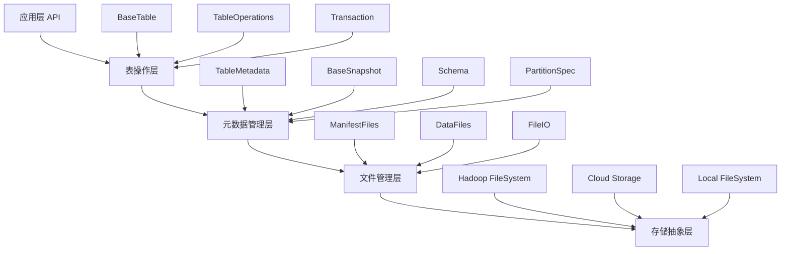

## 核心模块深度分析

### 1. 表管理核心 (Table Management Core)

#### BaseTable.java 深度分析

`BaseTable` 是 Iceberg 表的核心实现，基于 `/core/src/main/java/org/apache/iceberg/BaseTable.java`：

```java
public class BaseTable implements Table, HasTableOperations, Serializable {
  private final TableOperations ops;          // 表操作接口
  private final String name;                  // 表名
  private final MetricsReporter reporter;     // 指标报告器

  // 核心方法分析：
  
  // 1. 创建扫描操作
  public TableScan newScan() {
    return new DataTableScan(
        this, schema(), 
        ImmutableTableScanContext.builder()
            .metricsReporter(reporter).build()
    );
  }
  
  // 2. 创建增量扫描
  public IncrementalAppendScan newIncrementalAppendScan() {
    return new BaseIncrementalAppendScan(
        this, schema(), 
        ImmutableTableScanContext.builder()
            .metricsReporter(reporter).build()
    );
  }
  
  // 3. 创建写入操作
  public AppendFiles newAppend() {
    return ops.newAppend();
  }
  
  // 4. 创建覆盖操作  
  public OverwriteFiles newOverwrite() {
    return ops.newOverwrite();
  }
}
```

**关键特性**:
- **操作委托模式**: 通过 `TableOperations` 将具体操作委托给不同的实现
- **序列化支持**: 支持分布式环境下的表对象传输
- **指标集成**: 内置指标收集和报告功能
- **扫描工厂**: 提供多种类型的数据扫描操作

#### TableOperations.java 抽象接口

```java
public interface TableOperations {
  TableMetadata current();                    // 获取当前元数据
  TableMetadata refresh();                    // 刷新元数据
  void commit(TableMetadata base, TableMetadata metadata); // 提交元数据变更
  
  // 操作工厂方法
  AppendFiles newAppend();
  RewriteFiles newRewrite();
  OverwriteFiles newOverwrite();
  RowDelta newRowDelta();
  ReplacePartitions newReplacePartitions();
  DeleteFiles newDelete();
  UpdateSchema updateSchema();
  UpdatePartitionSpec updateSpec();
  // ... 更多操作
}
```

### 2. 元数据系统核心

#### TableMetadata.java 深度分析

`TableMetadata` 是表元数据的完整表示，基于 `/core/src/main/java/org/apache/iceberg/TableMetadata.java`：

```java
public class TableMetadata implements Serializable {
  // 核心元数据字段
  private final int formatVersion;                    // 表格式版本 (1, 2, 3)
  private final String uuid;                         // 表唯一标识符
  private final String location;                     // 表存储位置
  private final long lastSequenceNumber;             // 最后序列号
  private final long lastUpdatedMillis;              // 最后更新时间
  private final int lastColumnId;                    // 最后列 ID
  private final Schema schema;                       // 当前 Schema
  private final int defaultSpecId;                   // 默认分区规范 ID
  private final PartitionSpec defaultSpec;           // 默认分区规范
  private final int defaultSortOrderId;              // 默认排序规则 ID
  private final SortOrder defaultSortOrder;          // 默认排序规则
  private final Map<String, String> properties;      // 表属性
  private final long currentSnapshotId;              // 当前快照 ID
  private final List<Snapshot> snapshots;            // 快照列表
  private final List<HistoryEntry> snapshotLog;      // 快照历史
  private final List<MetadataLogEntry> metadataLog;  // 元数据变更日志
  private final Map<String, SnapshotRef> refs;       // 分支和标签引用
  
  // 核心构造方法
  public static TableMetadata newTableMetadata(
      Schema schema,
      PartitionSpec spec, 
      SortOrder sortOrder,
      String location, 
      Map<String, String> properties,
      int formatVersion
  ) {
    // 初始化新表元数据
    return new TableMetadata(
        formatVersion,
        uuid,
        location,
        INITIAL_SEQUENCE_NUMBER,
        timestampMillis,
        INITIAL_SCHEMA_ID,
        schema,
        INITIAL_SPEC_ID, 
        ImmutableList.of(spec),
        INITIAL_SORT_ORDER_ID,
        ImmutableList.of(sortOrder),
        persistedProperties(properties),
        -1L,
        ImmutableList.of(),
        ImmutableList.of(),
        ImmutableList.of(),
        ImmutableMap.of()
    );
  }
  
  // 元数据更新方法
  public TableMetadata updateSchema(Schema newSchema, int newLastColumnId) {
    if (newSchema.sameSchema(schema) && newLastColumnId == lastColumnId) {
      return this; // 无变更则返回当前实例
    }
    
    // 创建新的元数据实例
    return new TableMetadata(
        formatVersion, uuid, location,
        lastSequenceNumber, System.currentTimeMillis(), newLastColumnId,
        newSchema, defaultSpecId, specs, defaultSortOrderId, sortOrders,
        properties, currentSnapshotId, snapshots, snapshotLog, 
        metadataLog, refs
    );
  }
}
```

**元数据版本演进**:
- **V1**: 基础表格式，支持不可变文件
- **V2**: 引入行级删除支持
- **V3**: 扩展数据类型、默认值支持、多参数转换等

## 数据文件管理系统

### 数据文件抽象层次

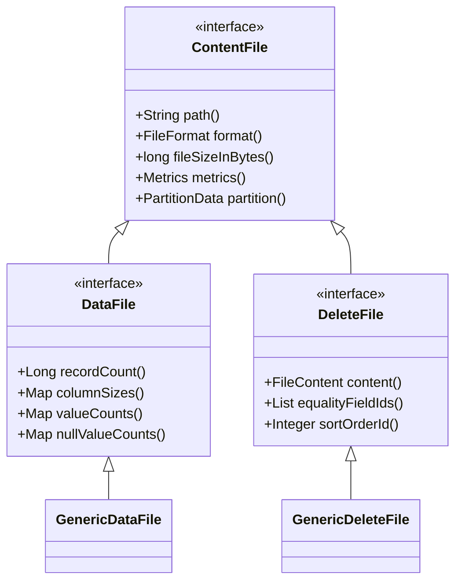

### GenericDataFile.java 深度分析

基于 `/core/src/main/java/org/apache/iceberg/GenericDataFile.java`：

```java
class GenericDataFile extends BaseFile<DataFile> implements DataFile {
  // 继承自 BaseFile 的核心字段：
  // - int specId: 分区规范ID  
  // - FileContent content: 文件内容类型(DATA)
  // - String filePath: 文件路径
  // - FileFormat format: 文件格式(PARQUET/AVRO/ORC)
  // - PartitionData partition: 分区数据
  // - long fileSizeInBytes: 文件大小
  // - Metrics metrics: 文件统计信息
  
  // 构造数据文件
  GenericDataFile(
      int specId,                    // 分区规范ID
      String filePath,               // 文件路径  
      FileFormat format,             // 文件格式
      PartitionData partition,       // 分区信息
      long fileSizeInBytes,         // 文件大小
      Metrics metrics,              // 统计信息
      ByteBuffer keyMetadata,       // 加密密钥元数据
      List<Long> splitOffsets,      // 分片偏移量
      Integer sortOrderId,          // 排序规则ID
      Long firstRowId               // 首行ID(用于行溯源)
  ) {
    super(
        specId, FileContent.DATA, filePath, format,
        partition, fileSizeInBytes, metrics.recordCount(),
        metrics.columnSizes(), metrics.valueCounts(),
        metrics.nullValueCounts(), metrics.nanValueCounts(),
        metrics.lowerBounds(), metrics.upperBounds(),
        splitOffsets, null /* no equality field IDs */,
        sortOrderId, keyMetadata, firstRowId,
        null, null, null
    );
  }
  
  // 统计信息复制(用于投影和过滤)
  public DataFile copyWithStats(Set<Integer> requestedColumnIds) {
    return new GenericDataFile(this, true, requestedColumnIds);
  }
  
  // 去除统计信息(减少内存占用)
  public DataFile copyWithoutStats() {
    return new GenericDataFile(this, false, null);
  }
}
```

### ManifestFile 系统

#### GenericManifestFile.java 深度分析

基于 `/core/src/main/java/org/apache/iceberg/GenericManifestFile.java`：

```java
public class GenericManifestFile implements ManifestFile, StructLike {
  // 核心字段
  private InputFile file;                      // 清单文件输入流
  private String manifestPath;                 // 清单文件路径
  private Long length;                         // 文件长度
  private int specId;                         // 分区规范ID
  private ManifestContent content;            // 清单内容类型(DATA/DELETES)
  private long sequenceNumber;                // 数据序列号
  private long minSequenceNumber;             // 最小序列号
  private Long snapshotId;                    // 所属快照ID
  private Integer addedFilesCount;            // 新增文件数
  private Integer existingFilesCount;         // 现有文件数  
  private Integer deletedFilesCount;          // 删除文件数
  private Long addedRowsCount;               // 新增行数
  private Long existingRowsCount;            // 现有行数
  private Long deletedRowsCount;             // 删除行数
  private PartitionFieldSummary[] partitions; // 分区字段摘要
  private byte[] keyMetadata;                // 加密密钥元数据
  
  // 创建清单文件读取器
  public ManifestReader<DataFile> openDataManifestReader(FileIO io) {
    if (content == ManifestContent.DATA) {
      return ManifestFiles.read(this, io);
    }
    throw new IllegalArgumentException("Cannot read data files from delete manifest");
  }
  
  // 创建清单文件写入器  
  public static ManifestWriter<DataFile> writeDataManifest(
      int specId, EncryptedOutputFile outputFile, Long snapshotId) {
    return ManifestFiles.write(
        formatVersion, specId, outputFile, snapshotId);
  }
}
```

### ManifestEntry 系统

#### ManifestEntry.java 接口分析

基于 `/core/src/main/java/org/apache/iceberg/ManifestEntry.java`：

```java
interface ManifestEntry<F extends ContentFile<F>> {
  // 文件状态枚举
  enum Status {
    EXISTING(0),    // 现有文件(未变更)
    ADDED(1),       // 新增文件
    DELETED(2);     // 删除文件
  }
  
  // 核心字段定义
  Types.NestedField STATUS = required(0, "status", Types.IntegerType.get());
  Types.NestedField SNAPSHOT_ID = optional(1, "snapshot_id", Types.LongType.get());
  Types.NestedField SEQUENCE_NUMBER = optional(3, "sequence_number", Types.LongType.get());
  Types.NestedField FILE_SEQUENCE_NUMBER = optional(4, "file_sequence_number", Types.LongType.get());
  
  // 核心方法
  Status status();                    // 文件状态
  Long snapshotId();                 // 快照ID
  Long dataSequenceNumber();         // 数据序列号
  Long fileSequenceNumber();         // 文件序列号
  F file();                          // 关联的文件对象
  
  // 生存性检查
  default boolean isLive() {
    return status() == Status.ADDED || status() == Status.EXISTING;
  }
}
```

## 读取操作核心实现

### 扫描架构设计

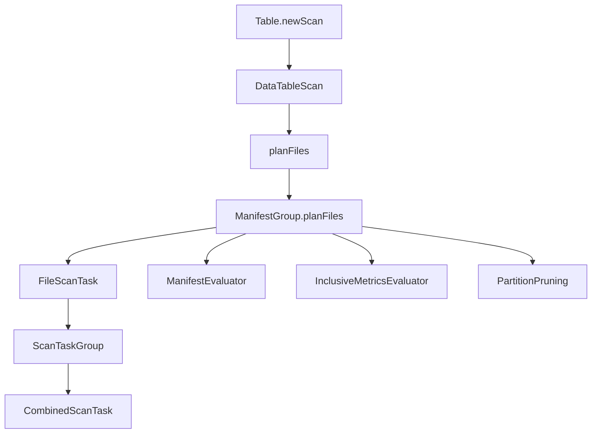

### BaseTableScan.java 深度分析

基于 `/core/src/main/java/org/apache/iceberg/BaseTableScan.java`：

```java
abstract class BaseTableScan extends SnapshotScan<TableScan, FileScanTask, CombinedScanTask>
    implements TableScan {
  
  protected BaseTableScan(Table table, Schema schema, TableScanContext context) {
    super(table, schema, context);
  }
  
  // 规划扫描任务
  @Override
  public CloseableIterable<CombinedScanTask> planTasks() {
    CloseableIterable<FileScanTask> fileScanTasks = planFiles();  // 1. 规划文件扫描任务
    CloseableIterable<FileScanTask> splitFiles =                  // 2. 分割大文件
        TableScanUtil.splitFiles(fileScanTasks, targetSplitSize());
    return TableScanUtil.planTasks(                               // 3. 组合扫描任务
        splitFiles, targetSplitSize(), splitLookback(), splitOpenFileCost());
  }
  
  // 增量扫描支持
  @Override 
  public TableScan appendsBetween(long fromSnapshotId, long toSnapshotId) {
    throw new UnsupportedOperationException("Incremental scan is not supported");
  }
}
```

### DataTableScan.java 实现分析

```java
class DataTableScan extends BaseTableScan {
  // 核心扫描逻辑
  @Override
  public CloseableIterable<FileScanTask> planFiles() {
    Snapshot snapshot = snapshot();
    if (snapshot == null) {
      return CloseableIterable.empty();
    }
    
    // 创建清单组用于文件规划
    ManifestGroup manifestGroup = new ManifestGroup(io(), snapshot.dataManifests(io()))
        .caseSensitive(isCaseSensitive())
        .select(scanColumns())
        .filterData(filter())
        .specsById(table().specs())
        .ignoreDeleted()
        .ignoreExisting();
    
    if (shouldIgnoreResiduals()) {
      manifestGroup = manifestGroup.ignoreResiduals();
    }
    
    if (newScanColumnsProjection.size() < schema().columns().size()) {
      manifestGroup = manifestGroup.project(newScanColumnsProjection);  
    }
    
    return manifestGroup.planFiles();
  }
}
```

### FileScanTask 任务系统

#### BaseFileScanTask.java 深度分析

```java  
class BaseFileScanTask implements FileScanTask {
  private final DataFile file;                    // 数据文件
  private final DeleteFile[] deletes;             // 删除文件数组
  private final String schemaString;              // Schema 字符串表示
  private final String specString;                // 分区规范字符串表示
  private final ResidualEvaluator residuals;      // 残留表达式求值器
  
  // 核心构造方法
  BaseFileScanTask(
      DataFile file, 
      DeleteFile[] deletes,
      String schemaString, 
      String specString, 
      ResidualEvaluator residuals
  ) {
    this.file = file;
    this.deletes = deletes;
    this.schemaString = schemaString;
    this.specString = specString;
    this.residuals = residuals;
  }
  
  // 获取估计行数
  @Override
  public long estimatedRowsCount() {
    long totalRows = file.recordCount();
    
    // 减去删除文件影响的行数
    for (DeleteFile delete : deletes) {
      if (delete.content() == FileContent.POSITION_DELETES) {
        totalRows -= delete.recordCount();
      }
      // 对等值删除无法精确估计，保守处理
    }
    
    return Math.max(0, totalRows);
  }
  
  // 分割大文件任务
  @Override
  public List<FileScanTask> split(long splitSize) {
    if (file.fileSizeInBytes() <= splitSize) {
      return ImmutableList.of(this);
    }
    
    // 根据分片偏移量分割文件
    List<Long> splitOffsets = file.splitOffsets();
    if (splitOffsets == null || splitOffsets.isEmpty()) {
      return ImmutableList.of(this);  // 无法分割
    }
    
    // 创建分割任务列表  
    List<FileScanTask> splitTasks = Lists.newArrayList();
    // ... 分割逻辑实现
    return splitTasks;
  }
}
```

## 写入操作核心实现

### 写入操作架构

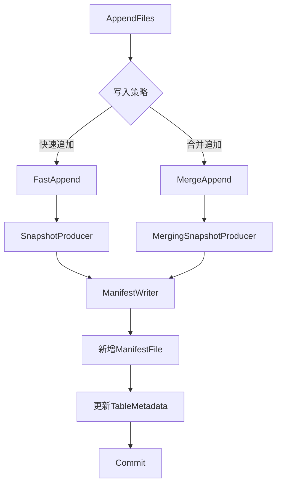

### FastAppend.java 深度分析

基于 `/core/src/main/java/org/apache/iceberg/FastAppend.java`：

```java
class FastAppend extends SnapshotProducer<AppendFiles> implements AppendFiles {
  private final String tableName;                              // 表名
  private final SnapshotSummary.Builder summaryBuilder;        // 快照摘要构建器
  private final Map<Integer, DataFileSet> newDataFilesBySpec;  // 按分区规范分组的新文件
  private final List<ManifestFile> appendManifests;           // 追加的清单文件
  private final List<ManifestFile> rewrittenAppendManifests;  // 重写的追加清单
  private final List<ManifestFile> newManifests;              // 新清单文件
  private boolean hasNewFiles = false;                         // 是否有新文件
  
  // 添加数据文件
  @Override
  public FastAppend appendFile(DataFile file) {
    Preconditions.checkNotNull(file, "Invalid data file: null");
    PartitionSpec spec = spec(file.specId());
    Preconditions.checkArgument(
        spec != null,
        "Cannot find partition spec %s for data file: %s", 
        file.specId(), file.location()
    );
    
    // 按分区规范分组文件
    DataFileSet dataFiles = newDataFilesBySpec.computeIfAbsent(
        spec.specId(), ignored -> DataFileSet.create()
    );
    
    if (dataFiles.add(file)) {
      this.hasNewFiles = true;
      summaryBuilder.addedFile(spec, file);  // 更新摘要统计
    }
    
    return this;
  }
  
  // 添加清单文件
  @Override
  public AppendFiles appendManifest(ManifestFile manifest) {
    Preconditions.checkArgument(
        !manifest.hasExistingFiles(), "Cannot append manifest with existing files");
    Preconditions.checkArgument(
        !manifest.hasDeletedFiles(), "Cannot append manifest with deleted files");
    
    appendManifests.add(manifest);
    summaryBuilder.addedManifest(manifest);
    return this;
  }
  
  // 应用操作 - 生成新快照
  @Override
  public List<ManifestFile> apply(TableMetadata base, Snapshot snapshot) {
    List<ManifestFile> newManifests = Lists.newArrayList();
    
    try {
      // 1. 处理新数据文件，为每个分区规范创建清单文件
      for (Map.Entry<Integer, DataFileSet> entry : newDataFilesBySpec.entrySet()) {
        int specId = entry.getKey();
        DataFileSet files = entry.getValue();
        
        ManifestFile manifest = writeManifest(files, specId, snapshot);
        newManifests.add(manifest);
      }
      
      // 2. 处理追加的清单文件
      for (ManifestFile manifest : appendManifests) {
        ManifestFile rewritten = writeAddedFilesManifest(manifest, snapshot);
        newManifests.add(rewritten);
      }
      
      // 3. 保留现有清单文件
      if (snapshot != null) {
        newManifests.addAll(snapshot.dataManifests(ops().io()));
      }
      
      return newManifests;
      
    } catch (IOException e) {
      throw new RuntimeIOException(e, "Failed to close manifest writer");
    }
  }
  
  // 写入数据文件清单
  private ManifestFile writeManifest(
      DataFileSet files, int specId, Snapshot snapshot) throws IOException {
    
    OutputFile manifestFile = outputPath();
    ManifestWriter<DataFile> writer = ManifestFiles.write(
        formatVersion(), specId, manifestFile, snapshotId()
    );
    
    try {
      for (DataFile file : files) {
        writer.add(file);  // 添加文件条目
      }
    } finally {
      writer.close();
    }
    
    return writer.toManifestFile();
  }
}
```

### MergeAppend.java 深度分析

基于 `/core/src/main/java/org/apache/iceberg/MergeAppend.java`：

```java
class MergeAppend extends MergingSnapshotProducer<AppendFiles> implements AppendFiles {
  
  MergeAppend(String tableName, TableOperations ops) {
    super(tableName, ops);
  }
  
  @Override
  public MergeAppend appendFile(DataFile file) {
    add(file);  // 委托给父类的统一添加方法
    return this;
  }
  
  @Override
  public AppendFiles appendManifest(ManifestFile manifest) {
    // 验证清单文件状态
    Preconditions.checkArgument(
        !manifest.hasExistingFiles(), "Cannot append manifest with existing files");
    Preconditions.checkArgument(
        !manifest.hasDeletedFiles(), "Cannot append manifest with deleted files");
    Preconditions.checkArgument(
        manifest.snapshotId() == null || manifest.snapshotId() == -1,
        "Snapshot id must be assigned during commit");
        
    add(manifest);  // 委托给父类处理
    return this;
  }
}
```

### MergingSnapshotProducer.java 核心逻辑

```java
abstract class MergingSnapshotProducer<T> extends SnapshotProducer<T> {
  private final ManifestMergeManager mergeManager;  // 清单合并管理器
  private final Map<Integer, List<DataFile>> newFiles;     // 新数据文件
  private final Map<Integer, List<DeleteFile>> newDeletes; // 新删除文件
  private final List<ManifestFile> newManifests;          // 新清单文件
  
  // 添加数据文件
  protected void add(DataFile file) {
    int specId = file.specId();
    List<DataFile> files = newFiles.computeIfAbsent(specId, k -> Lists.newArrayList());
    files.add(file);
    hasNewFiles = true;
  }
  
  // 应用合并策略
  @Override 
  public List<ManifestFile> apply(TableMetadata base, Snapshot snapshot) {
    List<ManifestFile> targetManifests = Lists.newArrayList();
    
    // 1. 写入新文件的清单
    for (Map.Entry<Integer, List<DataFile>> entry : newFiles.entrySet()) {
      int specId = entry.getKey();
      List<DataFile> files = entry.getValue();
      
      ManifestFile newManifest = writeDataManifest(specId, files);
      targetManifests.add(newManifest);
    }
    
    // 2. 合并现有清单文件
    if (snapshot != null) {
      List<ManifestFile> existingManifests = snapshot.dataManifests(ops().io());
      List<ManifestFile> mergedManifests = mergeManager.merge(
          existingManifests, targetManifests
      );
      targetManifests.addAll(mergedManifests);
    }
    
    return targetManifests;
  }
}
```

## 压缩操作核心实现

### 压缩架构设计

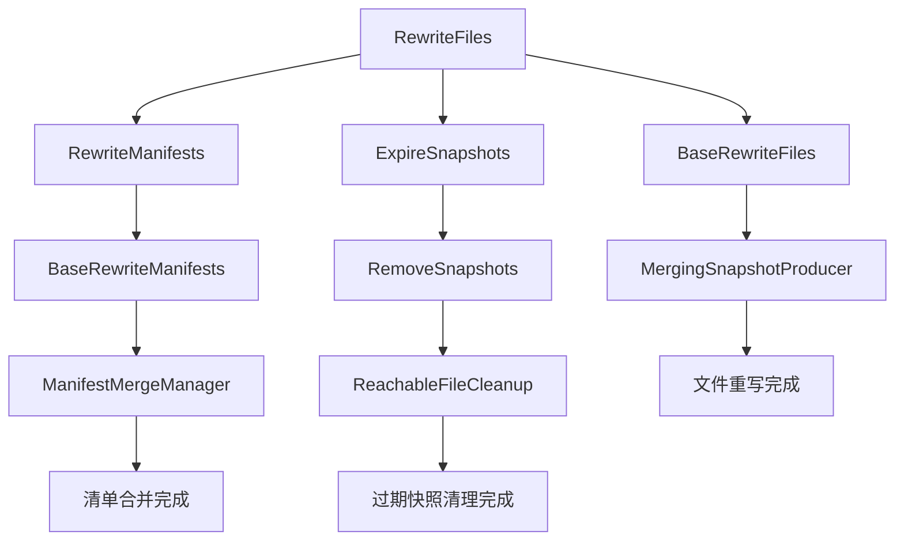

### BaseRewriteFiles.java 深度分析

基于 `/core/src/main/java/org/apache/iceberg/BaseRewriteFiles.java`：

```java
class BaseRewriteFiles extends MergingSnapshotProducer<RewriteFiles> 
    implements RewriteFiles {
  
  private final DataFileSet replacedDataFiles = DataFileSet.create(); // 被替换的数据文件
  private Long startingSnapshotId = null;                            // 起始快照ID
  
  BaseRewriteFiles(String tableName, TableOperations ops) {
    super(tableName, ops);
    // 重写操作必须在删除路径缺失时失败
    failMissingDeletePaths();
  }
  
  // 删除数据文件
  @Override
  public RewriteFiles deleteFile(DataFile dataFile) {
    replacedDataFiles.add(dataFile);  // 记录被替换文件
    delete(dataFile);                 // 标记为删除
    return self();
  }
  
  // 添加新数据文件  
  @Override
  public RewriteFiles addFile(DataFile dataFile) {
    add(dataFile);  // 添加到新文件列表
    return self();
  }
  
  // 批量重写文件
  @Override
  public RewriteFiles rewriteFiles(
      Set<DataFile> dataFilesToReplace,    // 要替换的数据文件
      Set<DeleteFile> deleteFilesToReplace, // 要替换的删除文件  
      Set<DataFile> dataFilesToAdd,        // 要添加的数据文件
      Set<DeleteFile> deleteFilesToAdd     // 要添加的删除文件
  ) {
    
    Preconditions.checkNotNull(dataFilesToReplace, "Replaced data files can't be null");
    Preconditions.checkNotNull(deleteFilesToReplace, "Replaced delete files can't be null");
    Preconditions.checkNotNull(dataFilesToAdd, "Added data files can't be null");
    Preconditions.checkNotNull(deleteFilesToAdd, "Added delete files can't be null");
    
    // 记录替换文件
    for (DataFile file : dataFilesToReplace) {
      replacedDataFiles.add(file);
      delete(file);
    }
    
    for (DeleteFile file : deleteFilesToReplace) {
      delete(file);
    }
    
    // 添加新文件
    for (DataFile file : dataFilesToAdd) {
      add(file);
    }
    
    for (DeleteFile file : deleteFilesToAdd) {
      add(file);
    }
    
    return this;
  }
  
  // 验证重写操作的有效性
  @Override
  protected void validate(TableMetadata base, Snapshot parent) {
    if (startingSnapshotId != null) {
      // 验证起始快照是否为当前快照的祖先
      validateSnapshotInHistory(base, startingSnapshotId);
    }
    
    // 验证所有被删除文件在当前快照中存在
    Set<DataFile> currentFiles = currentDataFiles(base);  
    for (DataFile file : replacedDataFiles) {
      if (!currentFiles.contains(file)) {
        throw new ValidationException(
            "Cannot commit, file to replace is not in table: " + file.path());
      }
    }
  }
}
```

### BaseRewriteManifests.java 深度分析

```java
class BaseRewriteManifests extends SnapshotProducer<RewriteManifests> 
    implements RewriteManifests {
  
  private final List<ManifestFile> rewrittenManifests = Lists.newArrayList(); // 重写的清单
  private final Set<ManifestFile> deletedManifests = Sets.newHashSet();      // 删除的清单  
  private Predicate<ManifestFile> predicate;                                 // 筛选谓词
  
  @Override
  public RewriteManifests rewriteIf(Predicate<ManifestFile> pred) {
    this.predicate = pred;
    return this;
  }
  
  // 应用清单重写
  @Override
  public List<ManifestFile> apply(TableMetadata base, Snapshot snapshot) {
    if (snapshot == null) {
      return ImmutableList.of();
    }
    
    List<ManifestFile> currentDataManifests = snapshot.dataManifests(ops().io());
    List<ManifestFile> currentDeleteManifests = snapshot.deleteManifests(ops().io());
    
    // 重写数据清单  
    List<ManifestFile> newDataManifests = rewriteManifests(
        currentDataManifests, ManifestContent.DATA
    );
    
    // 重写删除清单
    List<ManifestFile> newDeleteManifests = rewriteManifests(
        currentDeleteManifests, ManifestContent.DELETES  
    );
    
    List<ManifestFile> newManifests = Lists.newArrayList();
    newManifests.addAll(newDataManifests);
    newManifests.addAll(newDeleteManifests);
    
    return newManifests;
  }
  
  // 重写指定类型的清单文件
  private List<ManifestFile> rewriteManifests(
      List<ManifestFile> manifests, ManifestContent content) {
    
    List<ManifestFile> newManifests = Lists.newArrayList();
    List<ManifestFile> toRewrite = Lists.newArrayList();
    
    // 根据谓词筛选需要重写的清单
    for (ManifestFile manifest : manifests) {
      if (predicate != null && predicate.test(manifest)) {
        toRewrite.add(manifest);
      } else {
        newManifests.add(manifest);  // 保持不变
      }
    }
    
    if (toRewrite.isEmpty()) {
      return newManifests;
    }
    
    // 合并需要重写的清单文件
    ManifestFile rewrittenManifest = mergeManifests(toRewrite, content);
    newManifests.add(rewrittenManifest);
    
    // 记录删除的清单文件用于清理
    deletedManifests.addAll(toRewrite);
    
    return newManifests;
  }
  
  // 合并多个清单文件
  private ManifestFile mergeManifests(
      List<ManifestFile> toMerge, ManifestContent content) {
    
    OutputFile outputFile = manifestPath(content);
    ManifestWriter<? extends ContentFile<?>> writer;
    
    if (content == ManifestContent.DATA) {
      writer = ManifestFiles.write(formatVersion(), outputFile, snapshotId());
    } else {
      writer = ManifestFiles.writeDeleteManifest(
          formatVersion(), outputFile, snapshotId());
    }
    
    try {
      for (ManifestFile manifest : toMerge) {
        try (ManifestReader<? extends ContentFile<?>> reader = 
                 ManifestFiles.read(manifest, ops().io())) {
          for (ManifestEntry<? extends ContentFile<?>> entry : reader.entries()) {
            if (entry.status() == ManifestEntry.Status.DELETED) {
              continue;  // 跳过已删除条目
            }
            writer.existing(entry.file());
          }
        }
      }
    } finally {
      writer.close();
    }
    
    return writer.toManifestFile();
  }
}
```

### RemoveSnapshots.java 深度分析

```java
class RemoveSnapshots extends SnapshotProducer<ExpireSnapshots> 
    implements ExpireSnapshots {
  
  private final Set<Long> idsToRemove = Sets.newHashSet();        // 要删除的快照ID
  private final Consumer<String> deleteFunc;                     // 删除函数
  private long expireOlderThan = Long.MAX_VALUE;                 // 过期时间戳
  private int retainLast = 1;                                    // 保留最近N个快照
  private boolean cleanExpiredFiles = true;                      // 是否清理过期文件
  
  @Override
  public ExpireSnapshots expireSnapshotId(long snapshotId) {
    idsToRemove.add(snapshotId);
    return this;
  }
  
  @Override
  public ExpireSnapshots expireOlderThan(long timestampMillis) {
    this.expireOlderThan = timestampMillis; 
    return this;
  }
  
  @Override
  public ExpireSnapshots retainLast(int numSnapshots) {
    Preconditions.checkArgument(numSnapshots > 0, "Must retain at least 1 snapshot");
    this.retainLast = numSnapshots;
    return this;
  }
  
  // 应用快照过期逻辑
  @Override
  public List<ManifestFile> apply(TableMetadata base, Snapshot snapshot) {
    Set<Long> toDelete = findSnapshotsToExpire(base);
    
    if (toDelete.isEmpty()) {
      return snapshot != null ? 
          snapshot.allManifests(ops().io()) : ImmutableList.of();
    }
    
    // 删除过期快照
    Set<String> manifestsToDelete = Sets.newHashSet();
    Set<String> manifestListsToDelete = Sets.newHashSet();
    
    for (Long id : toDelete) {
      Snapshot expired = base.snapshot(id);
      if (expired != null) {
        String manifestList = expired.manifestListLocation();
        if (manifestList != null) {
          manifestListsToDelete.add(manifestList);
          
          // 收集需要删除的清单文件
          for (ManifestFile manifest : expired.allManifests(ops().io())) {
            manifestsToDelete.add(manifest.path());
          }
        }
      }
    }
    
    // 执行文件清理
    if (cleanExpiredFiles) {
      ReachableFileUtil.deleteReachableFiles(
          ops().io(), manifestsToDelete, manifestListsToDelete, deleteFunc);
    }
    
    // 返回保留的清单文件
    return snapshot != null ? 
        snapshot.allManifests(ops().io()) : ImmutableList.of();
  }
  
  // 查找需要过期的快照
  private Set<Long> findSnapshotsToExpire(TableMetadata base) {
    Set<Long> toDelete = Sets.newHashSet();
    List<Snapshot> snapshots = base.snapshots();
    
    // 1. 添加显式指定的快照ID
    toDelete.addAll(idsToRemove);
    
    // 2. 根据时间过期
    for (Snapshot snap : snapshots) {
      if (snap.timestampMillis() < expireOlderThan) {
        toDelete.add(snap.snapshotId());
      }
    }
    
    // 3. 保留最近的N个快照
    List<Snapshot> sortedSnapshots = Lists.newArrayList(snapshots);
    sortedSnapshots.sort((s1, s2) -> 
        Long.compare(s2.timestampMillis(), s1.timestampMillis()));
    
    for (int i = 0; i < Math.min(retainLast, sortedSnapshots.size()); i++) {
      toDelete.remove(sortedSnapshots.get(i).snapshotId());
    }
    
    // 4. 保护当前快照和引用的快照
    if (base.currentSnapshot() != null) {
      toDelete.remove(base.currentSnapshot().snapshotId());
    }
    
    for (SnapshotRef ref : base.refs().values()) {
      toDelete.remove(ref.snapshotId());
    }
    
    return toDelete;
  }
}
```

## Schema 变更管理

### Schema 变更架构

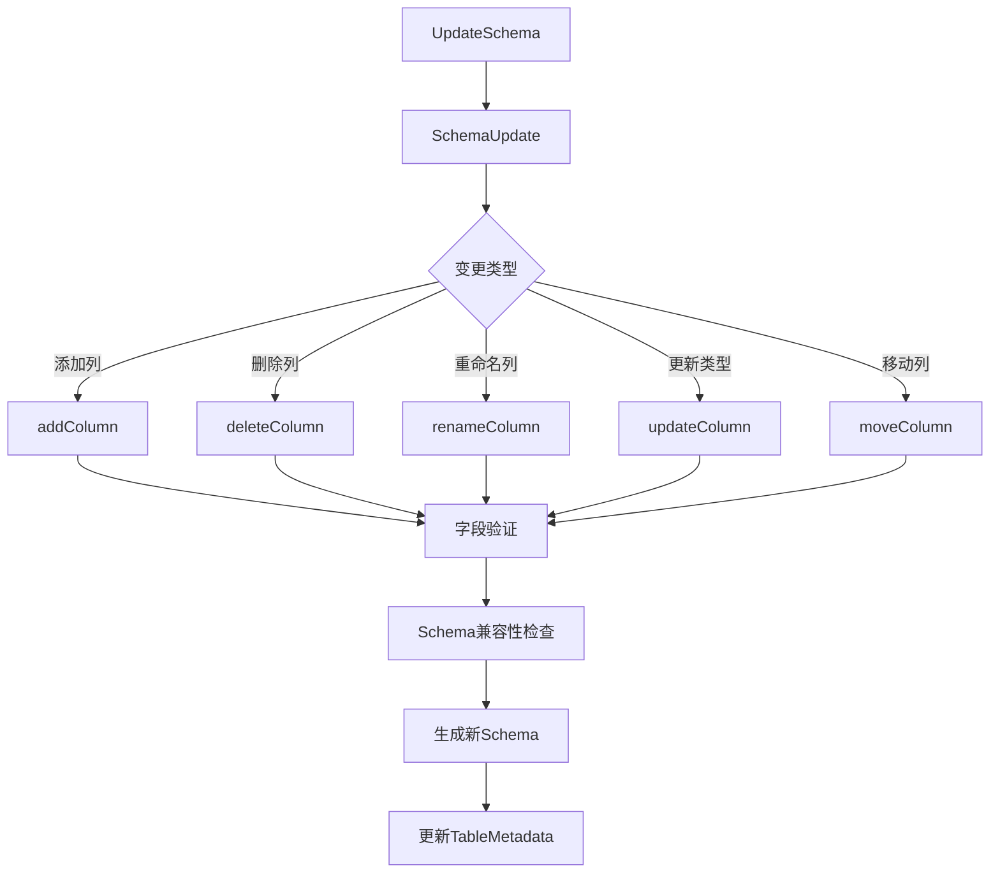

### SchemaUpdate.java 深度分析

基于 `/core/src/main/java/org/apache/iceberg/SchemaUpdate.java`：

```java
class SchemaUpdate implements UpdateSchema {
  private static final Logger LOG = LoggerFactory.getLogger(SchemaUpdate.class);
  private static final int TABLE_ROOT_ID = -1;
  
  private final TableOperations ops;                          // 表操作接口
  private final TableMetadata base;                          // 基础元数据  
  private final Schema schema;                               // 当前Schema
  private final Map<Integer, Integer> idToParent;            // ID到父级映射
  private final List<Integer> deletes = Lists.newArrayList(); // 删除的字段ID
  private final Map<Integer, Types.NestedField> updates = Maps.newHashMap(); // 字段更新
  private final Multimap<Integer, Integer> parentToAddedIds = // 父级到新增ID映射
      Multimaps.newListMultimap(Maps.newHashMap(), Lists::newArrayList);
  private final Map<String, Integer> addedNameToId = Maps.newHashMap(); // 名称到ID映射
  private final Multimap<Integer, Move> moves = // 字段移动操作  
      Multimaps.newListMultimap(Maps.newHashMap(), Lists::newArrayList);
  private int lastColumnId;                                  // 最后列ID
  private boolean allowIncompatibleChanges = false;          // 是否允许不兼容变更
  private Set<String> identifierFieldNames;                  // 标识符字段名
  private boolean caseSensitive = true;                      // 大小写敏感
  
  // 添加列
  @Override
  public UpdateSchema addColumn(
      String parent, String name, Type type, String doc, Literal<?> defaultValue) {
    internalAddColumn(parent, name, true, type, doc, defaultValue);
    return this;
  }
  
  // 内部添加列实现
  private void internalAddColumn(
      String parent, String name, boolean required, Type type, 
      String doc, Literal<?> defaultValue) {
    
    int parentId = TABLE_ROOT_ID;
    Types.NestedField parentField = null;
    
    // 解析父级字段
    if (parent != null) {
      parentField = schema.findField(parent, caseSensitive);
      Preconditions.checkArgument(parentField != null, 
          "Cannot find parent struct: %s", parent);
      Preconditions.checkArgument(parentField.type().isStructType(),
          "Cannot add column '%s' to non-struct: %s", name, parent);
      parentId = parentField.fieldId();
    }
    
    // 验证字段名不冲突
    if (parentField != null) {
      Types.StructType parentStruct = parentField.type().asStructType();
      for (Types.NestedField field : parentStruct.fields()) {
        if (caseSensitive ? field.name().equals(name) : 
            field.name().equalsIgnoreCase(name)) {
          throw new IllegalArgumentException(
              String.format("Cannot add column, name already exists: %s.%s", parent, name));
        }
      }
    }
    
    // 分配新的字段ID
    int newId = assignNewColumnId();
    
    // 验证默认值类型兼容性
    if (defaultValue != null) {
      Preconditions.checkArgument(
          defaultValue.to(type).equals(defaultValue),
          "Invalid default value for %s field %s: %s (cannot cast to %s)",
          required ? "required" : "optional", name, defaultValue, type);
    }
    
    // 创建新字段
    Types.NestedField newField = required ? 
        Types.NestedField.required(newId, name, type, doc, defaultValue) :
        Types.NestedField.optional(newId, name, type, doc, defaultValue);
    
    // 记录添加操作  
    parentToAddedIds.put(parentId, newId);
    addedNameToId.put(name, newId);
    updates.put(newId, newField);
  }
  
  // 删除列  
  @Override
  public UpdateSchema deleteColumn(String name) {
    Types.NestedField field = schema.findField(name, caseSensitive);
    Preconditions.checkArgument(field != null, "Cannot find field to delete: %s", name);
    
    // 检查是否为标识符字段
    if (identifierFieldNames.contains(field.name())) {
      throw new IllegalArgumentException(
          "Cannot delete identifier field " + field.name());
    }
    
    deletes.add(field.fieldId());
    return this;
  }
  
  // 重命名列
  @Override  
  public UpdateSchema renameColumn(String name, String newName) {
    Types.NestedField field = schema.findField(name, caseSensitive);
    Preconditions.checkArgument(field != null, "Cannot find field to rename: %s", name);
    
    // 检查新名称是否冲突
    if (schema.findField(newName, caseSensitive) != null) {
      throw new IllegalArgumentException("Cannot rename column to existing column: " + newName);
    }
    
    // 创建重命名字段
    Types.NestedField renamedField = Types.NestedField.of(
        field.fieldId(), field.isOptional(), newName, field.type(), field.doc());
    
    updates.put(field.fieldId(), renamedField);
    return this;  
  }
  
  // 更新列类型
  @Override
  public UpdateSchema updateColumn(String name, Type.PrimitiveType newType) {
    Types.NestedField field = schema.findField(name, caseSensitive);
    Preconditions.checkArgument(field != null, "Cannot find field to update: %s", name);
    Preconditions.checkArgument(field.type().isPrimitiveType(),
        "Cannot update non-primitive field: %s", name);
    
    // 检查类型提升的兼容性
    if (!allowIncompatibleChanges) {
      if (!TypeUtil.isPromotionAllowed(field.type().asPrimitiveType(), newType)) {
        throw new IllegalArgumentException(String.format(
            "Cannot change column type: %s is not a valid type promotion from %s",
            newType, field.type()));
      }
    }
    
    // 创建更新字段
    Types.NestedField updatedField = Types.NestedField.of(
        field.fieldId(), field.isOptional(), field.name(), newType, field.doc());
    
    updates.put(field.fieldId(), updatedField);
    return this;
  }
  
  // 移动列位置
  @Override
  public UpdateSchema moveFirst(String name) {
    Types.NestedField field = schema.findField(name, caseSensitive);
    Preconditions.checkArgument(field != null, "Cannot find field to move: %s", name);
    
    int parentId = idToParent.get(field.fieldId());
    moves.put(parentId, Move.first(name));
    return this;
  }
  
  @Override  
  public UpdateSchema moveAfter(String name, String afterName) {
    Types.NestedField field = schema.findField(name, caseSensitive);
    Types.NestedField afterField = schema.findField(afterName, caseSensitive);
    
    Preconditions.checkArgument(field != null, "Cannot find field to move: %s", name);
    Preconditions.checkArgument(afterField != null, "Cannot find field to move after: %s", afterName);
    
    int parentId = idToParent.get(field.fieldId());
    moves.put(parentId, Move.after(name, afterName));
    return this;
  }
  
  // 提交Schema变更
  @Override  
  public void commit() {
    TableMetadata updated = apply();
    ops.commit(base, updated);
  }
  
  // 应用所有变更生成新Schema
  public TableMetadata apply() {
    Schema newSchema = applyChanges(schema);
    
    if (newSchema.sameSchema(schema) && lastColumnId == base.lastColumnId()) {
      return base; // 无变更
    }
    
    return base.updateSchema(newSchema, lastColumnId);
  }
  
  // 应用变更到Schema
  private Schema applyChanges(Schema schema) {
    Types.StructType newStruct = applyChanges(
        schema.asStruct(), TABLE_ROOT_ID).asStructType();
    
    if (schema.getAliases() != null) {
      return new Schema(schema.schemaId(), newStruct.fields(), schema.getAliases());
    } else {
      return new Schema(schema.schemaId(), newStruct.fields());
    }
  }
  
  // 递归应用变更到结构类型
  private Type applyChanges(Type type, int parentId) {
    if (type.isPrimitiveType()) {
      return type; // 原始类型无需处理
    }
    
    switch (type.typeId()) {
      case STRUCT:
        return applyChangesToStruct(type.asStructType(), parentId);
      case LIST:  
        Types.ListType listType = type.asListType();
        Type newElementType = applyChanges(listType.elementType(), listType.elementId());
        if (listType.elementType() == newElementType) {
          return listType;
        }
        return Types.ListType.ofOptional(listType.elementId(), newElementType);
      case MAP:
        Types.MapType mapType = type.asMapType(); 
        Type newKeyType = applyChanges(mapType.keyType(), mapType.keyId());
        Type newValueType = applyChanges(mapType.valueType(), mapType.valueId());
        if (mapType.keyType() == newKeyType && mapType.valueType() == newValueType) {
          return mapType;
        }
        return Types.MapType.ofOptional(mapType.keyId(), mapType.valueId(), 
            newKeyType, newValueType);
      default:
        throw new UnsupportedOperationException("Unknown type: " + type);
    }
  }
  
  // 分配新的列ID
  private int assignNewColumnId() {
    int next = Math.max(lastColumnId, base.lastColumnId()) + 1;
    this.lastColumnId = next;
    return next;
  }
}
```

## 分区与视图系统

### 分区系统架构

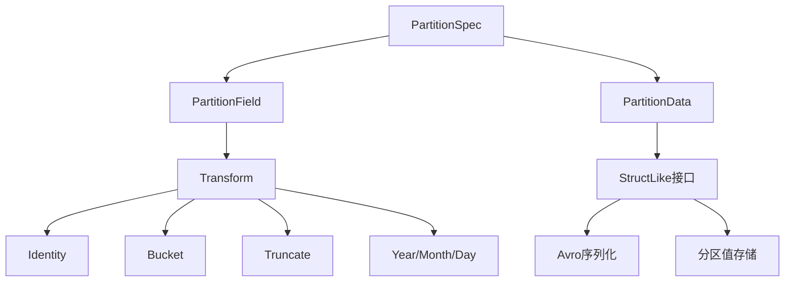

### PartitionData.java 深度分析

基于 `/core/src/main/java/org/apache/iceberg/PartitionData.java`：

```java
public class PartitionData 
    implements IndexedRecord, StructLike, SpecificData.SchemaConstructable, Serializable {
  
  private final Types.StructType partitionType;    // 分区类型结构
  private final int size;                         // 分区字段数量
  private final Object[] data;                    // 分区值数组
  private final String stringSchema;             // Schema字符串表示
  private transient Schema schema;                // Avro Schema对象
  
  // 构造方法 - 基于分区类型
  public PartitionData(Types.StructType partitionType) {
    // 验证分区类型只能包含原始类型
    for (Types.NestedField field : partitionType.fields()) {
      Preconditions.checkArgument(
          field.type().isPrimitiveType(),
          "Partitions cannot contain nested types: %s", field.type());
    }
    
    this.partitionType = partitionType;
    this.size = partitionType.fields().size();
    this.data = new Object[size];
    this.schema = partitionDataSchema(partitionType);
    this.stringSchema = schema.toString();
  }
  
  // 获取分区值
  @Override
  public <T> T get(int pos, Class<T> javaClass) {
    Object value = data[pos];
    if (value == null || javaClass.isInstance(value)) {
      return javaClass.cast(value);
    }
    
    // 处理类型转换
    Types.NestedField field = partitionType.fields().get(pos);
    return TypeUtil.convertValue(field.type(), javaClass, value);
  }
  
  // 设置分区值  
  @Override
  public <T> void set(int pos, T value) {
    if (pos >= size) {
      throw new ArrayIndexOutOfBoundsException(
          "Cannot set position " + pos + " in partition data with " + size + " fields");
    }
    
    Types.NestedField field = partitionType.fields().get(pos);
    
    if (value == null) {
      data[pos] = null;
    } else {
      // 类型验证和转换
      data[pos] = convertPartitionValue(field.type(), value);
    }
  }
  
  // 分区值类型转换
  private Object convertPartitionValue(Type type, Object value) {
    switch (type.typeId()) {
      case BOOLEAN:
      case INTEGER:  
      case LONG:
      case FLOAT:
      case DOUBLE:
        return value; // 直接支持的类型
      case DECIMAL:
        if (value instanceof BigDecimal) {
          return value;
        }
        break;
      case STRING:
        if (value instanceof CharSequence) {
          return value.toString();
        }
        break;
      case FIXED:
      case BINARY:
        if (value instanceof byte[]) {
          return ByteBuffer.wrap((byte[]) value);
        } else if (value instanceof ByteBuffer) {
          return value;
        }
        break;
      case DATE:
        if (value instanceof Integer) {
          return value;
        }
        break;
      case TIME:
        if (value instanceof Long) {
          return value;  
        }
        break;
      case TIMESTAMP:
        if (value instanceof Long) {
          return value;
        }
        break;
    }
    
    throw new IllegalArgumentException(
        "Cannot convert partition value " + value + " to type " + type);
  }
  
  // 复制构造方法
  public PartitionData copy() {
    return new PartitionData(this);
  }
  
  // 哈希计算(用于分区键)
  @Override
  public int hashCode() {
    if (partitionType.fields().isEmpty()) {
      return 0;
    }
    
    Hasher hasher = Hashing.murmur3_32().newHasher();
    
    for (int i = 0; i < data.length; i++) {
      Object value = data[i];
      if (value != null) {
        Types.NestedField field = partitionType.fields().get(i);
        hashValue(hasher, field.type(), value);
      } else {
        hasher.putInt(0); // null值哈希
      }
    }
    
    return hasher.hash().asInt();
  }
  
  // 值哈希计算
  private void hashValue(Hasher hasher, Type type, Object value) {
    switch (type.typeId()) {
      case BOOLEAN:
        hasher.putBoolean((Boolean) value);
        break;
      case INTEGER:
      case DATE:
        hasher.putInt((Integer) value);
        break;  
      case LONG:
      case TIME:
      case TIMESTAMP:
        hasher.putLong((Long) value);
        break;
      case FLOAT:
        hasher.putFloat((Float) value);
        break;
      case DOUBLE:
        hasher.putDouble((Double) value);
        break;
      case STRING:
        hasher.putUnencodedChars(value.toString());
        break;
      case BINARY:
      case FIXED:
        if (value instanceof ByteBuffer) {
          hasher.putBytes(ByteBuffers.toByteArray((ByteBuffer) value));
        } else {
          hasher.putBytes((byte[]) value);
        }
        break;
      case DECIMAL:
        hasher.putUnencodedChars(value.toString());
        break;
    }
  }
  
  // 相等性比较
  @Override
  public boolean equals(Object other) {
    if (this == other) {
      return true;
    }
    if (other == null || getClass() != other.getClass()) {
      return false;
    }
    
    PartitionData that = (PartitionData) other;
    return Objects.equal(partitionType, that.partitionType) &&
           Arrays.equals(data, that.data);
  }
}
```

### View 视图系统深度分析

#### BaseView.java 核心实现

```java
public class BaseView implements View, Serializable {
  private final ViewOperations ops;           // 视图操作接口
  private final String name;                  // 视图名称
  
  public BaseView(ViewOperations ops, String name) {
    this.ops = ops;
    this.name = name;
  }
  
  @Override
  public String name() {
    return name;
  }
  
  @Override
  public Schema schema() {
    return ops.current().schema();
  }
  
  @Override
  public Map<String, String> properties() {
    return ops.current().properties();
  }
  
  @Override
  public String location() {
    return ops.current().location();
  }
  
  @Override
  public Iterable<ViewVersion> versions() {
    return ops.current().versions();
  }
  
  @Override
  public ViewVersion currentVersion() {
    return ops.current().currentVersion();
  }
  
  // 视图版本历史  
  @Override
  public Iterable<ViewHistoryEntry> history() {
    return ops.current().history();
  }
  
  // 更新视图属性
  @Override
  public UpdateViewProperties updateProperties() {
    return new PropertiesUpdate(ops);
  }
  
  // 替换视图版本
  @Override
  public ReplaceViewVersion replaceVersion() {
    return new ViewVersionReplace(ops);
  }
  
  // 刷新视图元数据
  @Override
  public void refresh() {
    ops.refresh();
  }
}
```

#### ViewMetadata.java 视图元数据

```java
public class ViewMetadata implements Serializable {
  private final int formatVersion;                      // 格式版本
  private final String location;                        // 存储位置
  private final Schema schema;                         // Schema定义
  private final int currentVersionId;                   // 当前版本ID
  private final List<ViewVersion> versions;            // 版本列表
  private final List<ViewHistoryEntry> versionLog;     // 版本历史日志
  private final Map<String, String> properties;        // 视图属性
  
  // 创建新视图元数据
  public static ViewMetadata newViewMetadata(
      Schema schema,
      ViewVersion version,
      String location, 
      Map<String, String> properties) {
    
    return new ViewMetadata(
        1, // format version
        location,
        schema,
        version.versionId(),
        ImmutableList.of(version),
        ImmutableList.of(
            new BaseViewHistoryEntry(
                System.currentTimeMillis(), version.versionId())),
        properties != null ? properties : ImmutableMap.of()
    );
  }
  
  // 添加新版本
  public ViewMetadata addVersion(ViewVersion newVersion) {
    List<ViewVersion> newVersions = ImmutableList.<ViewVersion>builder()
        .addAll(versions)
        .add(newVersion)
        .build();
    
    List<ViewHistoryEntry> newVersionLog = ImmutableList.<ViewHistoryEntry>builder()
        .addAll(versionLog)  
        .add(new BaseViewHistoryEntry(
            System.currentTimeMillis(), newVersion.versionId()))
        .build();
    
    return new ViewMetadata(
        formatVersion, location, schema, newVersion.versionId(),
        newVersions, newVersionLog, properties);
  }
  
  // 更新属性
  public ViewMetadata updateProperties(Map<String, String> newProperties) {
    return new ViewMetadata(
        formatVersion, location, schema, currentVersionId,
        versions, versionLog, newProperties);
  }
}
```

## 类依赖关系分析

### 核心依赖关系图

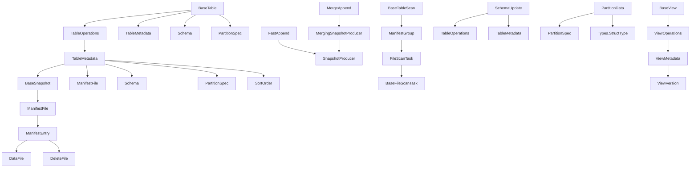

### 关键接口与实现关系

#### 1. 表操作接口层次

```java
// 顶层接口
interface Table {
  TableScan newScan();
  AppendFiles newAppend(); 
  OverwriteFiles newOverwrite();
  // ... 其他操作
}

// 基础实现
class BaseTable implements Table, HasTableOperations {
  private final TableOperations ops;  // 委托模式
  
  public AppendFiles newAppend() {
    return ops.newAppend(); // 委托给操作接口
  }
}

// 操作接口
interface TableOperations {  
  AppendFiles newAppend();     // 创建追加操作
  RewriteFiles newRewrite();   // 创建重写操作
  TableMetadata current();    // 获取当前元数据
  void commit(TableMetadata base, TableMetadata metadata); // 提交变更
}
```

#### 2. 快照操作层次

```java  
// 抽象基类
abstract class SnapshotProducer<T> {
  protected final TableOperations ops;
  
  // 模板方法
  public final Snapshot commit() {
    TableMetadata base = ops.current();
    Snapshot parent = base.currentSnapshot();
    List<ManifestFile> manifests = apply(base, parent); // 子类实现
    
    TableMetadata updated = base.addSnapshot(
        buildSnapshot(manifests, parent));
    ops.commit(base, updated);
    return updated.currentSnapshot();
  }
  
  // 抽象方法 - 子类实现具体逻辑
  protected abstract List<ManifestFile> apply(TableMetadata base, Snapshot parent);
}

// 快速追加实现
class FastAppend extends SnapshotProducer<AppendFiles> {
  @Override
  protected List<ManifestFile> apply(TableMetadata base, Snapshot parent) {
    // 实现快速追加逻辑
    return createNewManifests();
  }
}

// 合并追加实现  
class MergeAppend extends MergingSnapshotProducer<AppendFiles> {
  // 继承合并逻辑
}
```

#### 3. 文件管理层次

```java
// 内容文件接口
interface ContentFile<F extends ContentFile<F>> {
  String path();
  FileFormat format(); 
  long fileSizeInBytes();
  PartitionData partition();
  // ... 其他属性
}

// 数据文件接口  
interface DataFile extends ContentFile<DataFile> {
  Long recordCount();
  Map<Integer, Long> columnSizes();
  // ... 统计信息
}

// 删除文件接口
interface DeleteFile extends ContentFile<DeleteFile> {
  FileContent content(); // POSITION_DELETES 或 EQUALITY_DELETES
  List<Integer> equalityFieldIds();
}

// 基础文件实现
abstract class BaseFile<F extends ContentFile<F>> implements ContentFile<F> {
  private final int specId;
  private final FileContent content;
  private final String filePath;
  private final FileFormat format;
  private final PartitionData partition;
  private final long fileSizeInBytes;
  // ... 其他字段和方法
}

// 具体实现
class GenericDataFile extends BaseFile<DataFile> implements DataFile {
  // 数据文件具体实现
}

class GenericDeleteFile extends BaseFile<DeleteFile> implements DeleteFile {
  // 删除文件具体实现  
}
```

### 依赖注入与工厂模式

#### 1. FileIO 抽象

```java
interface FileIO extends Serializable, Closeable {
  InputFile newInputFile(String path);
  OutputFile newOutputFile(String path);
}

// Hadoop实现
class HadoopFileIO implements FileIO {
  private final SerializableConfiguration conf;
  
  @Override
  public InputFile newInputFile(String path) {
    return new HadoopInputFile(new Path(path), conf.get());
  }
}

// 内存实现  
class InMemoryFileIO implements FileIO {
  private final Map<String, ByteArrayOutputStream> files = Maps.newConcurrentMap();
  
  @Override
  public InputFile newInputFile(String path) {
    return new InMemoryInputFile(path, files.get(path));
  }
}
```

#### 2. Catalog 抽象

```java
interface Catalog {
  Table loadTable(TableIdentifier identifier);
  Table createTable(TableIdentifier identifier, Schema schema, PartitionSpec spec);
  boolean dropTable(TableIdentifier identifier);
}

// Hadoop Catalog实现
class HadoopCatalog implements Catalog {
  private final Configuration conf;
  private final String warehouseLocation;
  
  @Override
  public Table loadTable(TableIdentifier identifier) {
    TableOperations ops = new HadoopTableOperations(
        conf, resolvePath(identifier));
    return new BaseTable(ops, identifier.toString());
  }
}

// REST Catalog实现
class RESTCatalog implements Catalog {
  private final RESTClient client;
  
  @Override  
  public Table loadTable(TableIdentifier identifier) {
    TableOperations ops = new RESTTableOperations(
        client, identifier);
    return new BaseTable(ops, identifier.toString());  
  }
}
```

## 交互流程深度解析

### 表创建流程

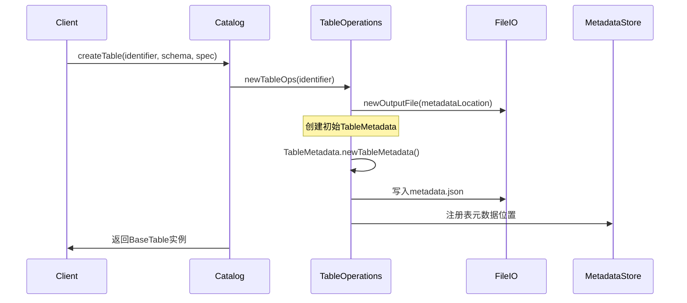

### 数据写入流程

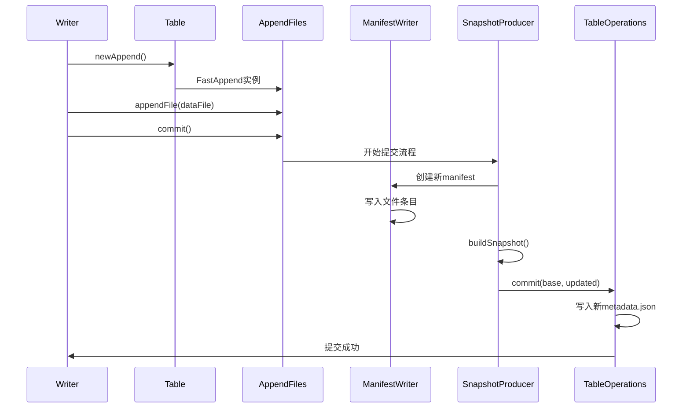

### 数据读取流程

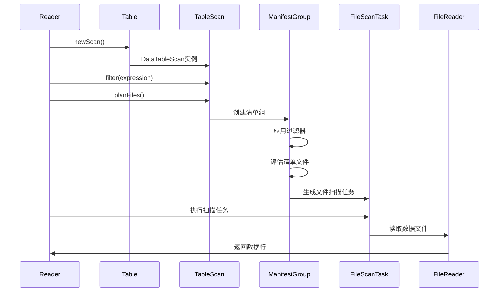

### Schema 变更流程

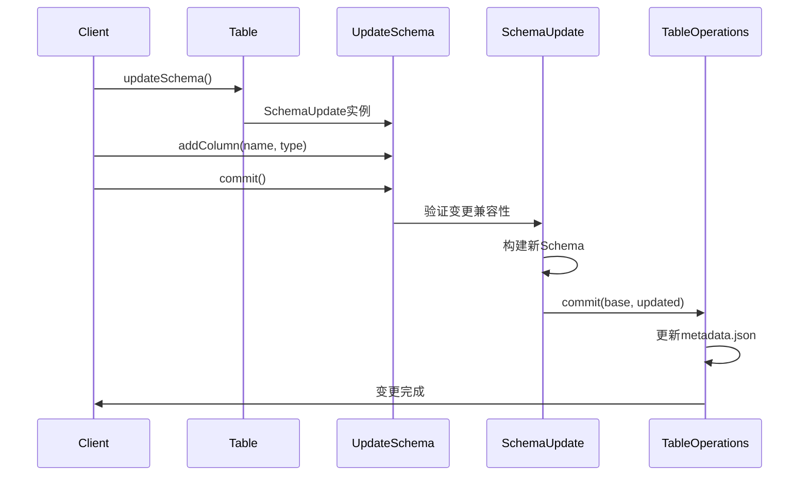

### 压缩操作流程

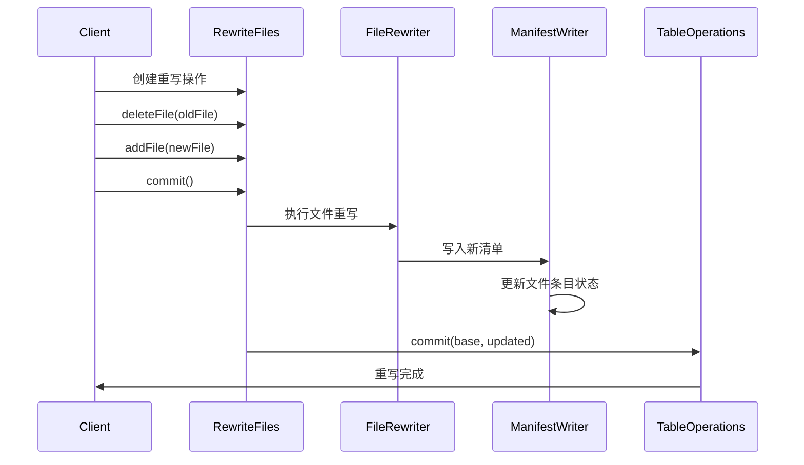

## 最佳实践与扩展指南

### 1. 自定义 TableOperations 实现

```java
public class CustomTableOperations implements TableOperations {
  private final String tableName;
  private final CustomMetadataStore metadataStore;
  private final FileIO fileIO;
  private TableMetadata currentMetadata;
  
  @Override
  public TableMetadata current() {
    if (currentMetadata == null) {
      refresh();
    }
    return currentMetadata;
  }
  
  @Override
  public TableMetadata refresh() {
    String metadataLocation = metadataStore.getTableMetadataLocation(tableName);
    InputFile metadataFile = fileIO.newInputFile(metadataLocation);
    this.currentMetadata = TableMetadataParser.read(fileIO, metadataFile);
    return currentMetadata;
  }
  
  @Override
  public void commit(TableMetadata base, TableMetadata metadata) {
    // 1. 验证基础元数据版本
    if (base != current()) {
      throw new CommitFailedException("Table metadata has changed");
    }
    
    // 2. 写入新的元数据文件
    String newMetadataPath = newMetadataLocation();
    OutputFile outputFile = fileIO.newOutputFile(newMetadataPath);
    TableMetadataParser.write(metadata, outputFile);
    
    // 3. 原子性更新元数据位置
    if (!metadataStore.updateTableMetadataLocation(tableName, newMetadataPath)) {
      throw new CommitFailedException("Failed to update metadata location");
    }
    
    this.currentMetadata = metadata;
  }
}
```

### 2. 自定义文件格式支持

```java  
public class CustomFileFormat implements FileFormat {
  
  @Override
  public String name() {
    return "CUSTOM";
  }
  
  @Override
  public FileAppender<InternalRow> createAppender(
      EncryptedOutputFile outputFile,
      Schema schema,
      PartitionSpec spec,
      Map<String, String> properties) {
    
    return new CustomFileAppender(outputFile, schema, spec, properties);
  }
  
  @Override
  public CloseableIterable<InternalRow> createReader(
      InputFile inputFile,
      Schema schema,
      Map<String, String> properties) {
    
    return new CustomFileReader(inputFile, schema, properties);
  }
}
```

### 3. 高级过滤器实现

```java
public class CustomManifestEvaluator {
  private final Expression expression;
  private final Schema schema;
  private final boolean caseSensitive;
  
  public boolean eval(ManifestFile manifest) {
    // 1. 检查分区过滤
    if (!evalPartitionFilter(manifest)) {
      return false;
    }
    
    // 2. 检查统计信息过滤  
    if (!evalMetricsFilter(manifest)) {
      return false;
    }
    
    // 3. 自定义业务逻辑过滤
    if (!evalCustomLogic(manifest)) {
      return false;
    }
    
    return true;
  }
  
  private boolean evalPartitionFilter(ManifestFile manifest) {
    // 实现分区级别过滤逻辑
    return true;
  }
  
  private boolean evalMetricsFilter(ManifestFile manifest) {
    // 实现统计信息过滤逻辑
    return true;  
  }
  
  private boolean evalCustomLogic(ManifestFile manifest) {
    // 实现自定义过滤逻辑
    return true;
  }
}
```

### 4. 自定义压缩策略

```java
public class CustomRewriteStrategy implements RewriteStrategy {
  
  @Override
  public List<List<FileScanTask>> planFileGroups(Iterable<FileScanTask> files) {
    List<List<FileScanTask>> fileGroups = Lists.newArrayList();
    
    // 1. 按分区分组
    Map<PartitionData, List<FileScanTask>> partitionGroups = 
        StreamSupport.stream(files.spliterator(), false)
            .collect(Collectors.groupingBy(task -> task.file().partition()));
    
    // 2. 每个分区内按大小分组
    for (List<FileScanTask> partitionFiles : partitionGroups.values()) {
      List<List<FileScanTask>> sizeGroups = groupBySize(partitionFiles);
      fileGroups.addAll(sizeGroups);
    }
    
    return fileGroups;
  }
  
  private List<List<FileScanTask>> groupBySize(List<FileScanTask> files) {
    // 实现基于文件大小的分组逻辑
    List<List<FileScanTask>> groups = Lists.newArrayList();
    
    // 排序并分组逻辑
    files.sort(Comparator.comparingLong(task -> task.file().fileSizeInBytes()));
    
    List<FileScanTask> currentGroup = Lists.newArrayList();
    long currentSize = 0;
    long targetSize = 128 * 1024 * 1024; // 128MB目标大小
    
    for (FileScanTask task : files) {
      if (currentSize + task.file().fileSizeInBytes() > targetSize && !currentGroup.isEmpty()) {
        groups.add(currentGroup);
        currentGroup = Lists.newArrayList();
        currentSize = 0;
      }
      
      currentGroup.add(task);
      currentSize += task.file().fileSizeInBytes();
    }
    
    if (!currentGroup.isEmpty()) {
      groups.add(currentGroup);
    }
    
    return groups;
  }
}
```

### 5. 性能优化建议

#### 元数据优化
```java
// 1. 使用适当的清单文件大小
properties.put(TableProperties.MANIFEST_TARGET_SIZE_BYTES, "8388608"); // 8MB

// 2. 控制清单列表大小
properties.put(TableProperties.MANIFEST_MIN_MERGE_COUNT, "100");

// 3. 启用元数据压缩  
properties.put(TableProperties.MANIFEST_LISTS_ENABLED, "true");
```

#### 读取优化
```java
// 1. 启用统计信息收集
properties.put(TableProperties.DEFAULT_WRITE_METRICS_MODE, "full");

// 2. 合理设置分片大小
TableScan scan = table.newScan()
    .option(TableProperties.SPLIT_SIZE, "134217728"); // 128MB

// 3. 使用列投影
scan = scan.select("col1", "col2", "col3");

// 4. 使用分区过滤
scan = scan.filter(Expressions.equal("partition_col", "value"));
```

#### 写入优化
```java
// 1. 批量写入
AppendFiles append = table.newAppend();
for (DataFile file : dataFiles) {
  append.appendFile(file);
}
append.commit(); // 一次性提交

// 2. 使用合适的文件大小
properties.put(TableProperties.WRITE_TARGET_FILE_SIZE_BYTES, "134217728"); // 128MB

// 3. 启用写入时排序
properties.put(TableProperties.WRITE_SORT_ORDER, "column1,column2");
```

### 6. 监控与诊断

#### 元数据监控
```java
public class TableMetricsCollector {
  
  public TableMetrics collect(Table table) {
    TableMetadata metadata = ((HasTableOperations) table).operations().current();
    
    return ImmutableTableMetrics.builder()
        .snapshotCount(metadata.snapshots().size())
        .manifestCount(getCurrentManifestCount(metadata))
        .fileCount(getCurrentFileCount(metadata))
        .totalSize(getCurrentTotalSize(metadata))
        .build();
  }
  
  private long getCurrentManifestCount(TableMetadata metadata) {
    if (metadata.currentSnapshot() == null) {
      return 0;
    }
    return metadata.currentSnapshot().allManifests(null).size();
  }
  
  // ... 其他指标收集方法
}
```

#### 性能分析
```java
public class PerformanceProfiler {
  
  public ScanProfile profileScan(TableScan scan) {
    long startTime = System.currentTimeMillis();
    
    // 执行文件规划
    long planStartTime = System.currentTimeMillis();
    CloseableIterable<FileScanTask> tasks = scan.planFiles();
    long planDuration = System.currentTimeMillis() - planStartTime;
    
    // 统计任务信息
    int taskCount = 0;
    long totalFileSize = 0;
    
    for (FileScanTask task : tasks) {
      taskCount++;
      totalFileSize += task.file().fileSizeInBytes();
    }
    
    long totalDuration = System.currentTimeMillis() - startTime;
    
    return ImmutableScanProfile.builder()
        .planDurationMs(planDuration)
        .totalDurationMs(totalDuration)  
        .taskCount(taskCount)
        .totalFileSize(totalFileSize)
        .build();
  }
}
```

<function_calls>
<invoke name="TodoWrite">
<parameter name="todos">[{"content": "\u5206\u6790 iceberg-core \u76ee\u5f55\u7ed3\u6784\u548c\u6574\u4f53\u67b6\u6784", "status": "completed", "activeForm": "\u5206\u6790 iceberg-core \u76ee\u5f55\u7ed3\u6784\u548c\u6574\u4f53\u67b6\u6784"}, {"content": "\u6df1\u5165\u5206\u6790\u5143\u6570\u636e\u76f8\u5173\u7c7b\uff08TableMetadata\u3001Schema\u3001PartitionSpec\uff09", "status": "completed", "activeForm": "\u6df1\u5165\u5206\u6790\u5143\u6570\u636e\u76f8\u5173\u7c7b"}, {"content": "\u5206\u6790\u6570\u636e\u6587\u4ef6\u76f8\u5173\u7c7b\uff08DataFile\u3001ContentFile\u3001ManifestFile\uff09", "status": "completed", "activeForm": "\u5206\u6790\u6570\u636e\u6587\u4ef6\u76f8\u5173\u7c7b"}, {"content": "\u5206\u6790\u8bfb\u53d6\u64cd\u4f5c\u76f8\u5173\u7c7b\uff08TableScan\u3001FileScanTask\u3001ScanTask\uff09", "status": "completed", "activeForm": "\u5206\u6790\u8bfb\u53d6\u64cd\u4f5c\u76f8\u5173\u7c7b"}, {"content": "\u5206\u6790\u5199\u5165\u64cd\u4f5c\u76f8\u5173\u7c7b\uff08FastAppend\u3001MergeAppend\u3001OverwriteFiles\uff09", "status": "completed", "activeForm": "\u5206\u6790\u5199\u5165\u64cd\u4f5c\u76f8\u5173\u7c7b"}, {"content": "\u5206\u6790\u538b\u7f29\u76f8\u5173\u7c7b\uff08RewriteFiles\u3001RewriteManifests\u3001ExpireSnapshots\uff09", "status": "completed", "activeForm": "\u5206\u6790\u538b\u7f29\u76f8\u5173\u7c7b"}, {"content": "\u5206\u6790 Schema \u53d8\u66f4\u76f8\u5173\u7c7b\uff08SchemaUpdate\u3001UpdateSchema\uff09", "status": "completed", "activeForm": "\u5206\u6790 Schema \u53d8\u66f4\u76f8\u5173\u7c7b"}, {"content": "\u5206\u6790 Partition \u548c View \u76f8\u5173\u7c7b", "status": "completed", "activeForm": "\u5206\u6790 Partition \u548c View \u76f8\u5173\u7c7b"}, {"content": "\u68b3\u7406\u5404\u4e2a\u7c7b\u4e4b\u95f4\u7684\u4f9d\u8d56\u5173\u7cfb\u548c\u4ea4\u4e92\u5173\u7cfb", "status": "completed", "activeForm": "\u68b3\u7406\u5404\u4e2a\u7c7b\u4e4b\u95f4\u7684\u4f9d\u8d56\u5173\u7cfb\u548c\u4ea4\u4e92\u5173\u7cfb"}, {"content": "\u751f\u6210\u5b8c\u6574\u7684\u6280\u672f\u6587\u6863", "status": "completed", "activeForm": "\u751f\u6210\u5b8c\u6574\u7684\u6280\u672f\u6587\u6863"}]