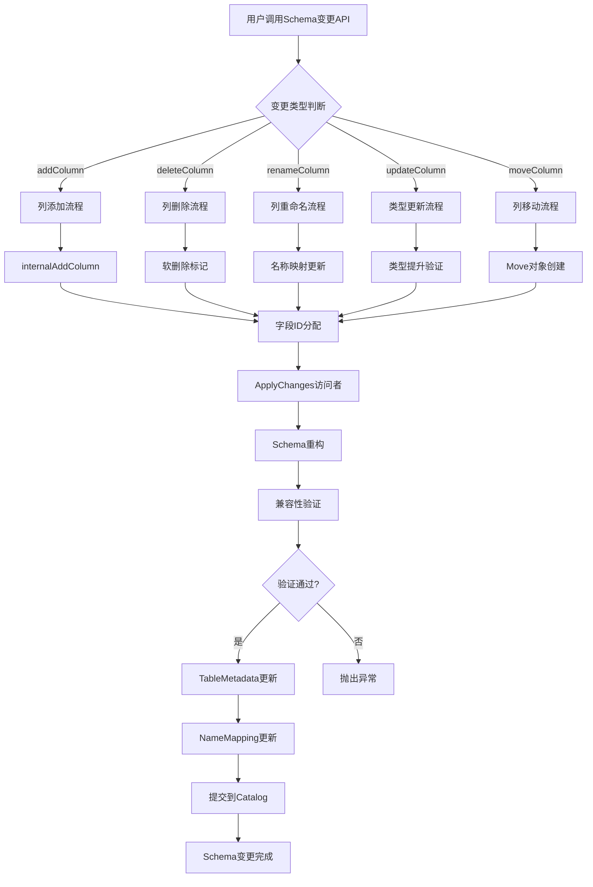
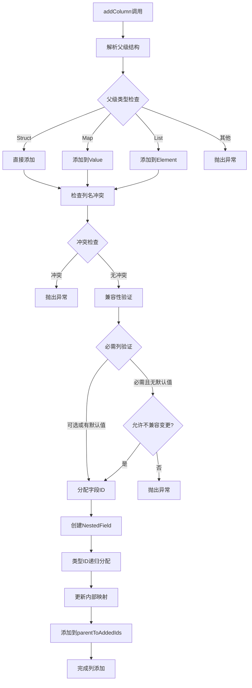
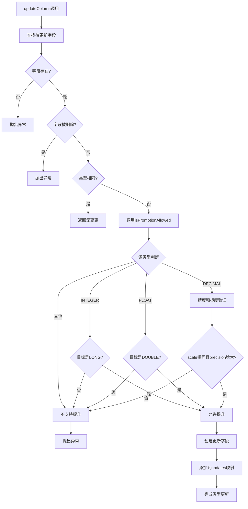
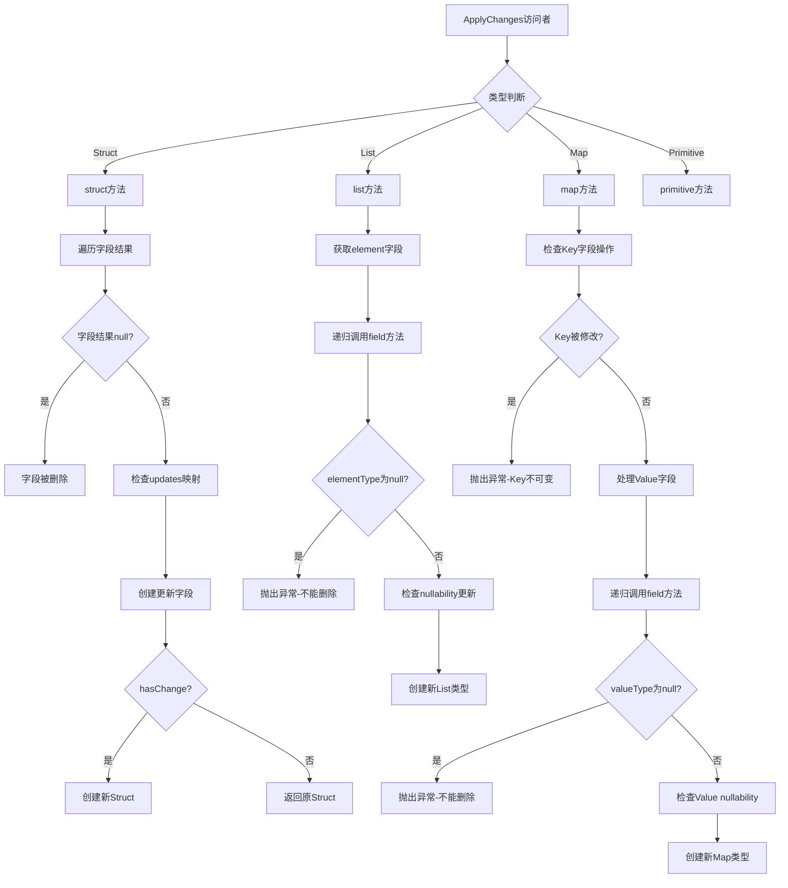
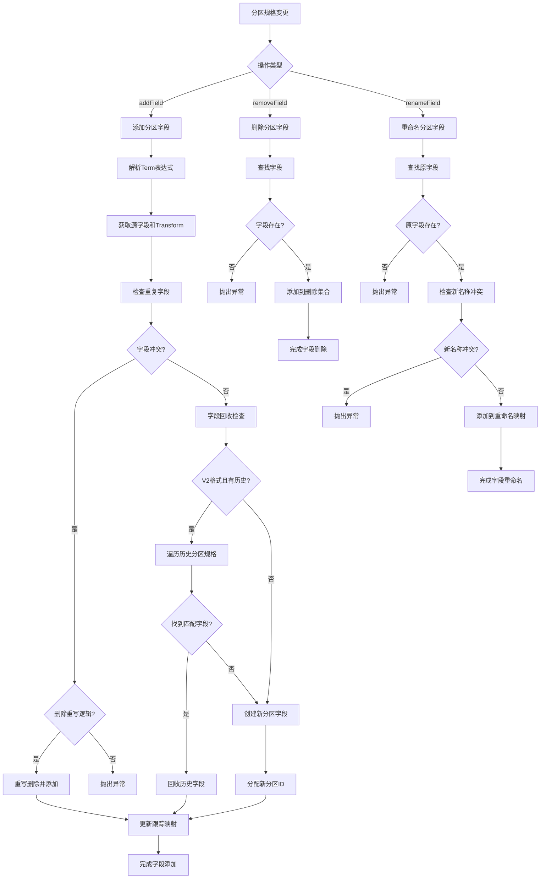
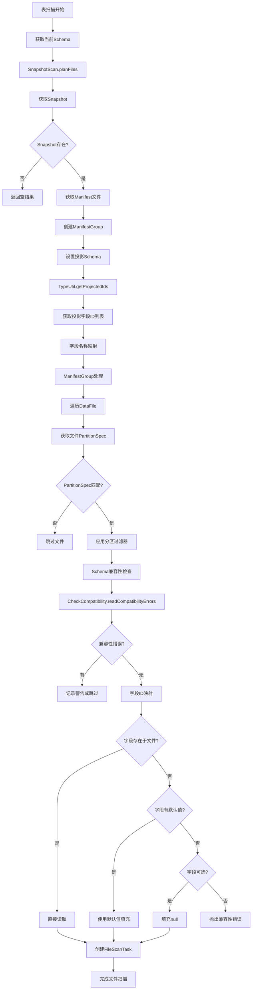

# Apache Iceberg Schema Evolution 完整源码深度解析

## 目录

1. [概述与架构](#概述与架构)
2. [Schema变更类型全解析](#schema变更类型全解析)
3. [数据读取与兼容性机制](#数据读取与兼容性机制)
4. [嵌套结构演化详解](#嵌套结构演化详解)
5. [分区演化机制深入分析](#分区演化机制深入分析)
6. [类型提升规则与实现](#类型提升规则与实现)
7. [默认值处理机制](#默认值处理机制)
8. [标识符字段与约束处理](#标识符字段与约束处理)
9. [详细流程图](#详细流程图)
10. [完整代码示例](#完整代码示例)
11. [性能优化与最佳实践](#性能优化与最佳实践)
12. [故障排查与诊断](#故障排查与诊断)

---

## 概述与架构

### 1. 核心架构概览

Apache Iceberg的Schema Evolution系统由以下核心组件构成：

```
┌─────────────────────────────────────────────────────────────┐
│                    Schema Evolution 架构                     │
├─────────────────────────────────────────────────────────────┤
│ 用户API Layer                                              │
│  ├─ UpdateSchema (接口)                                     │
│  ├─ UpdatePartitionSpec (接口)                             │
│  └─ PendingUpdate (基础接口)                                │
├─────────────────────────────────────────────────────────────┤
│ 实现Layer                                                  │
│  ├─ SchemaUpdate (核心实现)                                │
│  ├─ BaseUpdatePartitionSpec (分区更新)                     │
│  └─ ApplyChanges (访问者模式)                               │
├─────────────────────────────────────────────────────────────┤
│ 类型系统Layer                                              │
│  ├─ TypeUtil (类型工具)                                    │
│  ├─ CheckCompatibility (兼容性检查)                         │
│  └─ Types.NestedField (字段定义)                           │
├─────────────────────────────────────────────────────────────┤
│ 元数据Layer                                                │
│  ├─ TableMetadata (表元数据)                               │
│  ├─ Schema (模式定义)                                      │
│  └─ PartitionSpec (分区规格)                               │
├─────────────────────────────────────────────────────────────┤
│ 存储Layer                                                  │
│  ├─ TableOperations (表操作)                               │
│  ├─ ManifestGroup (清单组)                                 │
│  └─ FileScanTask (文件扫描)                                │
└─────────────────────────────────────────────────────────────┘
```

### 2. 字段ID管理机制

**源码位置**: `SchemaUpdate.java:476-480`

```java
private int assignNewColumnId() {
  int next = lastColumnId + 1;
  this.lastColumnId = next;
  return next;
}
```

**核心原则**:
- 字段ID全局唯一且单调递增
- 删除的字段ID永不复用
- 字段ID是Schema演化的稳定标识符

---

## Schema变更类型全解析

### 1. 列添加 (Column Addition)

#### 1.1 可选列添加

**源码位置**: `SchemaUpdate.java:111-185`

```java
private void internalAddColumn(
    String parent, String name, boolean isOptional,
    Type type, String doc, Literal<?> defaultValue) {
  
  // 步骤1: 解析父级结构
  int parentId = TABLE_ROOT_ID;
  String fullName;
  if (parent != null) {
    Types.NestedField parentField = findField(parent);
    Preconditions.checkArgument(parentField != null, 
        "Cannot find parent struct: %s", parent);
    
    // 处理复杂嵌套类型
    Type parentType = parentField.type();
    if (parentType.isNestedType()) {
      Type.NestedType nested = parentType.asNestedType();
      if (nested.isMapType()) {
        parentField = nested.asMapType().fields().get(1); // Map的value
      } else if (nested.isListType()) {
        parentField = nested.asListType().fields().get(0); // List的element
      }
    }
    
    parentId = parentField.fieldId();
    fullName = schema.findColumnName(parentId) + "." + name;
  } else {
    fullName = name;
  }
  
  // 步骤2: 兼容性验证
  Preconditions.checkArgument(
      defaultValue != null || isOptional || allowIncompatibleChanges,
      "Incompatible change: cannot add required column without default: %s",
      fullName);
  
  // 步骤3: 分配新ID并创建字段
  int newId = assignNewColumnId();
  Types.NestedField newField = Types.NestedField.builder()
      .withName(name)
      .isOptional(isOptional)
      .withId(newId)
      .ofType(TypeUtil.assignFreshIds(type, this::assignNewColumnId))
      .withDoc(doc)
      .withInitialDefault(defaultValue)
      .withWriteDefault(defaultValue)
      .build();
  
  // 步骤4: 更新内部映射
  updates.put(newId, newField);
  parentToAddedIds.put(parentId, newId);
  addedNameToId.put(fullName, newId);
  if (parentId != TABLE_ROOT_ID) {
    idToParent.put(newId, parentId);
  }
}
```

#### 1.2 必需列添加的特殊处理

**关键约束**:
```java
// 必需列必须有默认值或明确允许不兼容变更
Preconditions.checkArgument(
    defaultValue != null || isOptional || allowIncompatibleChanges,
    "Incompatible change: cannot add required column without default: %s", fullName);
```

**数据读取兼容性**:
- **历史文件**: 不存在该列的文件使用默认值填充
- **新文件**: 按照新schema写入数据
- **查询处理**: 通过字段ID映射确保正确读取

### 2. 列删除 (Column Deletion)

#### 2.1 软删除机制

**源码位置**: `SchemaUpdate.java:187-200`

```java
public UpdateSchema deleteColumn(String name) {
  Types.NestedField field = findField(name);
  Preconditions.checkArgument(field != null, "Cannot delete missing column: %s", name);
  
  // 检查依赖性
  Preconditions.checkArgument(
      !parentToAddedIds.containsKey(field.fieldId()),
      "Cannot delete a column that has additions: %s", name);
  Preconditions.checkArgument(
      !updates.containsKey(field.fieldId()), 
      "Cannot delete a column that has updates: %s", name);
  
  // 添加到删除列表（软删除）
  deletes.add(field.fieldId());
  return this;
}
```

#### 2.2 删除处理机制

**ApplyChanges访问者模式处理**:
```java
@Override
public Type field(Types.NestedField field, Type fieldResult) {
  int fieldId = field.fieldId();
  if (deletes.contains(fieldId)) {
    return null; // 返回null表示删除该字段
  }
  // ... 其他处理
}
```

**数据读取影响**:
- **Manifest扫描**: 已删除列不参与扫描
- **投影优化**: 查询计划中自动排除已删除列
- **存储优化**: Compaction过程中物理删除数据

### 3. 列重命名 (Column Rename)

#### 3.1 重命名实现

**源码位置**: `SchemaUpdate.java:202-225`

```java
public UpdateSchema renameColumn(String name, String newName) {
  Types.NestedField field = findField(name);
  Preconditions.checkArgument(field != null, "Cannot rename missing column: %s", name);
  Preconditions.checkArgument(newName != null, "Cannot rename a column to null");
  Preconditions.checkArgument(
      !deletes.contains(field.fieldId()),
      "Cannot rename a column that will be deleted: %s", field.name());
  
  // 合并现有更新
  int fieldId = field.fieldId();
  Types.NestedField update = updates.get(fieldId);
  Types.NestedField newField = Types.NestedField.from(update != null ? update : field)
      .withName(newName)
      .build();
  updates.put(fieldId, newField);
  
  // 处理标识符字段重命名
  if (identifierFieldNames.contains(name)) {
    identifierFieldNames.remove(name);
    identifierFieldNames.add(newName);
  }
  
  return this;
}
```

#### 3.2 重命名对读取的影响

**Name Mapping更新**:
```java
// 源码位置: SchemaUpdate.java:482-503
private TableMetadata applyChangesToMetadata(TableMetadata metadata) {
  String mappingJson = metadata.property(TableProperties.DEFAULT_NAME_MAPPING, null);
  if (mappingJson != null) {
    try {
      NameMapping mapping = NameMappingParser.fromJson(mappingJson);
      NameMapping updated = MappingUtil.update(mapping, updates, parentToAddedIds);
      
      Map<String, String> updatedProperties = Maps.newHashMap();
      updatedProperties.putAll(metadata.properties());
      updatedProperties.put(TableProperties.DEFAULT_NAME_MAPPING, 
          NameMappingParser.toJson(updated));
      
      newMetadata = metadata.replaceProperties(updatedProperties);
    } catch (RuntimeException e) {
      LOG.warn("Failed to update external schema mapping: {}", mappingJson, e);
    }
  }
  return newMetadata;
}
```

### 4. 列重排序 (Column Reordering)

#### 4.1 移动操作定义

**Move类实现**:
```java
private static class Move {
  private enum MoveType {
    FIRST,    // 移到开头
    BEFORE,   // 移到指定列之前
    AFTER     // 移到指定列之后
  }
  
  private final int fieldId;          // 要移动的字段ID
  private final int referenceFieldId; // 参考字段ID
  private final MoveType type;        // 移动类型
  
  static Move first(int fieldId) {
    return new Move(fieldId, -1, MoveType.FIRST);
  }
  
  static Move before(int fieldId, int referenceFieldId) {
    return new Move(fieldId, referenceFieldId, MoveType.BEFORE);
  }
  
  static Move after(int fieldId, int referenceFieldId) {
    return new Move(fieldId, referenceFieldId, MoveType.AFTER);
  }
}
```

#### 4.2 字段移动实现

**源码位置**: `SchemaUpdate.java:778-813`

```java
@SuppressWarnings({"checkstyle:IllegalType", "JdkObsolete"})
private static List<Types.NestedField> moveFields(
    List<Types.NestedField> fields, Collection<Move> moves) {
  LinkedList<Types.NestedField> reordered = Lists.newLinkedList(fields);
  
  for (Move move : moves) {
    // 查找要移动的字段
    Types.NestedField toMove = Iterables.find(reordered, 
        field -> field.fieldId() == move.fieldId());
    reordered.remove(toMove);
    
    switch (move.type()) {
      case FIRST:
        reordered.addFirst(toMove);
        break;
        
      case BEFORE:
        Types.NestedField before = Iterables.find(reordered, 
            field -> field.fieldId() == move.referenceFieldId());
        int beforeIndex = reordered.indexOf(before);
        reordered.add(beforeIndex, toMove);
        break;
        
      case AFTER:
        Types.NestedField after = Iterables.find(reordered, 
            field -> field.fieldId() == move.referenceFieldId());
        int afterIndex = reordered.indexOf(after);
        reordered.add(afterIndex + 1, toMove);
        break;
        
      default:
        throw new UnsupportedOperationException("Unknown move type: " + move.type());
    }
  }
  
  return reordered;
}
```

---

## 数据读取与兼容性机制

### 1. 扫描流程详解

#### 1.1 表扫描入口

**DataTableScan.java:64-91**

```java
@Override
public CloseableIterable<FileScanTask> doPlanFiles() {
  Snapshot snapshot = snapshot();
  FileIO io = table().io();
  
  // 获取数据和删除清单文件
  List<ManifestFile> dataManifests = snapshot.dataManifests(io);
  List<ManifestFile> deleteManifests = snapshot.deleteManifests(io);
  
  // 更新统计指标
  scanMetrics().totalDataManifests().increment((long) dataManifests.size());
  scanMetrics().totalDeleteManifests().increment((long) deleteManifests.size());
  
  // 创建清单组进行文件规划
  ManifestGroup manifestGroup = new ManifestGroup(io, dataManifests, deleteManifests)
      .caseSensitive(isCaseSensitive())
      .select(scanColumns())              // Schema投影
      .filterData(filter())               // 数据过滤
      .specsById(table().specs())         // 分区规格映射
      .scanMetrics(scanMetrics())         // 扫描指标
      .ignoreDeleted()                    // 忽略已删除记录
      .columnsToKeepStats(columnsToKeepStats()); // 统计信息保留列
  
  // 性能优化配置
  if (shouldIgnoreResiduals()) {
    manifestGroup = manifestGroup.ignoreResiduals();
  }
  
  if (shouldPlanWithExecutor() && (dataManifests.size() > 1 || deleteManifests.size() > 1)) {
    manifestGroup = manifestGroup.planWith(planExecutor());
  }
  
  return manifestGroup.planFiles();
}
```

#### 1.2 Schema投影机制

**投影字段ID获取**:
```java
// SnapshotScan.java:130-135
List<Integer> projectedFieldIds = Lists.newArrayList(TypeUtil.getProjectedIds(schema()));
List<String> projectedFieldNames = projectedFieldIds.stream()
    .map(schema()::findColumnName)
    .collect(Collectors.toList());
```

**TypeUtil.getProjectedIds实现**:
```java
public static Set<Integer> getProjectedIds(Schema schema) {
  return ImmutableSet.copyOf(getIdsInternal(schema.asStruct(), true));
}

private static Set<Integer> getIdsInternal(Type type, boolean includeStructIds) {
  return visit(type, new GetProjectedIds(includeStructIds));
}
```

### 2. 兼容性检查机制

#### 2.1 读兼容性检查

**CheckCompatibility.java核心逻辑**:

```java
@Override
public List<String> field(Types.NestedField readField, Supplier<List<String>> fieldErrors) {
  Types.StructType struct = currentType.asStructType();
  Types.NestedField field = struct.field(readField.fieldId());
  List<String> errors = Lists.newArrayList();
  
  if (field == null) {
    if (readField.isRequired()) {
      return ImmutableList.of(readField.name() + " is required, but is missing");
    }
    // 可选字段缺失时填充null值
    return NO_ERRORS;
  }
  
  this.currentType = field.type();
  try {
    // 检查nullability兼容性
    if (checkNullability && readField.isRequired() && field.isOptional()) {
      errors.add(readField.name() + " should be required, but is optional");
    }
    
    // 递归检查嵌套字段错误
    for (String error : fieldErrors.get()) {
      if (error.startsWith(":")) {
        errors.add(readField.name() + error);
      } else {
        errors.add(readField.name() + "." + error);
      }
    }
    
    return ImmutableList.copyOf(errors);
  } finally {
    this.currentType = struct;
  }
}
```

#### 2.2 类型兼容性检查

```java
@Override
public List<String> primitive(Type.PrimitiveType readPrimitive) {
  if (currentType.equals(readPrimitive)) {
    return NO_ERRORS;
  }
  
  if (!currentType.isPrimitiveType()) {
    return ImmutableList.of(String.format(
        ": %s cannot be read as a %s",
        currentType.typeId().toString().toLowerCase(Locale.ENGLISH), 
        readPrimitive));
  }
  
  if (!TypeUtil.isPromotionAllowed(currentType.asPrimitiveType(), readPrimitive)) {
    return ImmutableList.of(String.format(
        ": %s cannot be promoted to %s", currentType, readPrimitive));
  }
  
  return NO_ERRORS;
}
```

---

## 嵌套结构演化详解

### 1. Struct类型演化

#### 1.1 Struct字段处理

**ApplyChanges.struct方法**:
```java
@Override
public Type struct(Types.StructType struct, List<Type> fieldResults) {
  boolean hasChange = false;
  List<Types.NestedField> newFields = Lists.newArrayListWithExpectedSize(fieldResults.size());
  
  for (int i = 0; i < fieldResults.size(); i += 1) {
    Type resultType = fieldResults.get(i);
    if (resultType == null) {
      hasChange = true;
      continue; // 字段被删除
    }
    
    Types.NestedField field = struct.fields().get(i);
    Types.NestedField update = updates.get(field.fieldId());
    Types.NestedField updated = Types.NestedField.from(update != null ? update : field)
        .ofType(resultType)
        .build();
    
    if (field.equals(updated)) {
      newFields.add(field);
    } else {
      hasChange = true;
      newFields.add(updated);
    }
  }
  
  if (hasChange) {
    return Types.StructType.of(newFields);
  }
  
  return struct;
}
```

#### 1.2 嵌套字段添加处理

**字段添加到嵌套结构**:
```java
@Override
public Type field(Types.NestedField field, Type fieldResult) {
  int fieldId = field.fieldId();
  
  // 处理删除
  if (deletes.contains(fieldId)) {
    return null;
  }
  
  // 处理类型更新
  Types.NestedField update = updates.get(field.fieldId());
  if (update != null && update.type() != field.type()) {
    return update.type();
  }
  
  // 处理子字段添加
  Collection<Types.NestedField> newFields = parentToAddedIds.get(fieldId)
      .stream().map(updates::get).collect(Collectors.toList());
  Collection<Move> columnsToMove = moves.get(fieldId);
  
  if (!newFields.isEmpty() || !columnsToMove.isEmpty()) {
    List<Types.NestedField> fields = addAndMoveFields(
        fieldResult.asStructType().fields(), newFields, columnsToMove);
    if (fields != null) {
      return Types.StructType.of(fields);
    }
  }
  
  return fieldResult;
}
```

### 2. List类型演化

#### 2.1 List元素类型处理

**ApplyChanges.list方法**:
```java
@Override
public Type list(Types.ListType list, Type elementResult) {
  // 对元素类型应用字段级别的更新
  Types.NestedField elementField = list.fields().get(0);
  Type elementType = field(elementField, elementResult);
  
  if (elementType == null) {
    throw new IllegalArgumentException("Cannot delete element type from list: " + list);
  }
  
  // 检查元素nullability更新
  Types.NestedField elementUpdate = updates.get(elementField.fieldId());
  boolean isElementOptional = elementUpdate != null ? 
      elementUpdate.isOptional() : list.isElementOptional();
  
  // 如果没有变化，返回原list
  if (isElementOptional == elementField.isOptional() && list.elementType() == elementType) {
    return list;
  }
  
  // 创建新的List类型
  if (isElementOptional) {
    return Types.ListType.ofOptional(list.elementId(), elementType);
  } else {
    return Types.ListType.ofRequired(list.elementId(), elementType);
  }
}
```

#### 2.2 List演化约束

**List演化限制**:
- 不能删除List的元素类型
- 可以修改元素的nullability
- 可以对元素类型进行类型提升
- 可以向元素的struct类型添加字段

### 3. Map类型演化

#### 3.1 Map演化严格约束

**ApplyChanges.map方法**:
```java
@Override
public Type map(Types.MapType map, Type kResult, Type valueResult) {
  // Map的key是不可变的
  int keyId = map.fields().get(0).fieldId();
  if (deletes.contains(keyId)) {
    throw new IllegalArgumentException("Cannot delete map keys: " + map);
  } else if (updates.containsKey(keyId)) {
    throw new IllegalArgumentException("Cannot update map keys: " + map);
  } else if (parentToAddedIds.containsKey(keyId)) {
    throw new IllegalArgumentException("Cannot add fields to map keys: " + map);
  } else if (!map.keyType().equals(kResult)) {
    throw new IllegalArgumentException("Cannot alter map keys: " + map);
  }
  
  // Map的value可以演化
  Types.NestedField valueField = map.fields().get(1);
  Type valueType = field(valueField, valueResult);
  if (valueType == null) {
    throw new IllegalArgumentException("Cannot delete value type from map: " + map);
  }
  
  Types.NestedField valueUpdate = updates.get(valueField.fieldId());
  boolean isValueOptional = valueUpdate != null ? 
      valueUpdate.isOptional() : map.isValueOptional();
  
  if (isValueOptional == map.isValueOptional() && map.valueType() == valueType) {
    return map;
  }
  
  if (isValueOptional) {
    return Types.MapType.ofOptional(map.keyId(), map.valueId(), map.keyType(), valueType);
  } else {
    return Types.MapType.ofRequired(map.keyId(), map.valueId(), map.keyType(), valueType);
  }
}
```

#### 3.2 Map演化规则

**Map演化约束**:
- **Key类型**: 完全不可变，不支持任何修改
- **Value类型**: 支持完整的Schema演化
- **Nullability**: Key和Value都可以修改nullability
- **嵌套演化**: Value如果是复杂类型，支持递归演化

---

## 分区演化机制深入分析

### 1. 分区规格更新架构

#### 1.1 BaseUpdatePartitionSpec核心结构

**源码位置**: `BaseUpdatePartitionSpec.java:44-85`

```java
class BaseUpdatePartitionSpec implements UpdatePartitionSpec {
  private final TableOperations ops;
  private final TableMetadata base;
  private final int formatVersion;
  private final PartitionSpec spec;
  private final Schema schema;
  
  // 索引映射
  private final Map<String, PartitionField> nameToField;           // 名称到字段映射
  private final Map<Pair<Integer, String>, PartitionField> transformToField; // 转换到字段映射
  
  // 变更跟踪
  private final List<PartitionField> adds = Lists.newArrayList();              // 新增字段
  private final Map<Integer, PartitionField> addedTimeFields = Maps.newHashMap(); // 时间字段
  private final Map<Pair<Integer, String>, PartitionField> transformToAddedField; // 转换映射
  private final Map<String, PartitionField> nameToAddedField = Maps.newHashMap(); // 名称映射
  private final Set<Object> deletes = Sets.newHashSet();          // 删除字段
  private final Map<String, String> renames = Maps.newHashMap();  // 重命名映射
  
  private boolean caseSensitive;        // 大小写敏感
  private boolean setAsDefault;         // 设为默认规格
  private int lastAssignedPartitionId; // 最后分配的分区ID
}
```

#### 1.2 分区字段回收机制

**字段回收优化**:
```java
private PartitionField recycleOrCreatePartitionField(
    Pair<Integer, Transform<?, ?>> sourceTransform, String name) {
  
  if (formatVersion >= 2 && base != null) {
    int sourceId = sourceTransform.first();
    Transform<?, ?> transform = sourceTransform.second();
    
    // 收集所有历史分区规格中的字段
    Set<PartitionField> allHistoricalFields = Sets.newHashSet();
    for (PartitionSpec partitionSpec : base.specs()) {
      allHistoricalFields.addAll(partitionSpec.fields());
    }
    
    // 尝试找到匹配的历史字段进行回收
    for (PartitionField field : allHistoricalFields) {
      if (field.sourceId() == sourceId && field.transform().equals(transform)) {
        // 如果指定了目标名称，也要匹配
        if (name == null || field.name().equals(name)) {
          return field; // 回收现有字段
        }
      }
    }
  }
  
  // 无法回收，创建新字段
  return new PartitionField(
      sourceTransform.first(), 
      assignFieldId(), 
      name, 
      sourceTransform.second());
}
```

### 2. 分区字段操作详解

#### 2.1 添加分区字段

**addField实现逻辑**:
```java
@Override
public BaseUpdatePartitionSpec addField(String name, Term term) {
  // 检查重复添加
  PartitionField alreadyAdded = nameToAddedField.get(name);
  Preconditions.checkArgument(alreadyAdded == null, 
      "Cannot add duplicate partition field: %s", alreadyAdded);
  
  // 解析源字段和转换
  Pair<Integer, Transform<?, ?>> sourceTransform = resolve(term);
  Pair<Integer, String> validationKey = Pair.of(
      sourceTransform.first(), 
      sourceTransform.second().toString());
  
  // 检查现有字段冲突
  PartitionField existing = transformToField.get(validationKey);
  if (existing != null && deletes.contains(existing.fieldId()) && 
      existing.transform().equals(sourceTransform.second())) {
    return rewriteDeleteAndAddField(existing, name);
  }
  
  Preconditions.checkArgument(
      existing == null || (deletes.contains(existing.fieldId()) && 
          !existing.transform().toString().equals(sourceTransform.second().toString())),
      "Cannot add duplicate partition field %s=%s, conflicts with %s",
      name, term, existing);
  
  // 回收或创建分区字段
  PartitionField newField = recycleOrCreatePartitionField(sourceTransform, name);
  
  // 更新跟踪映射
  adds.add(newField);
  transformToAddedField.put(validationKey, newField);
  nameToAddedField.put(name, newField);
  
  return this;
}
```

#### 2.2 删除分区字段

```java
@Override
public UpdatePartitionSpec removeField(String name) {
  PartitionField field = nameToField.get(name);
  Preconditions.checkArgument(field != null, 
      "Cannot delete missing field: %s", name);
  
  // 检查字段是否已被添加
  Preconditions.checkArgument(!nameToAddedField.containsKey(name), 
      "Cannot delete a field that has been added: %s", name);
  
  deletes.add(field.fieldId());
  return this;
}
```

#### 2.3 重命名分区字段

```java
@Override
public UpdatePartitionSpec renameField(String name, String newName) {
  PartitionField field = nameToField.get(name);
  Preconditions.checkArgument(field != null, 
      "Cannot rename missing field: %s", name);
  Preconditions.checkArgument(newName != null && !newName.isEmpty(), 
      "Cannot rename to null or empty name");
  
  // 检查新名称冲突
  Preconditions.checkArgument(!nameToField.containsKey(newName), 
      "Cannot rename field %s to %s: field already exists", name, newName);
  Preconditions.checkArgument(!nameToAddedField.containsKey(newName), 
      "Cannot rename field %s to %s: field already added", name, newName);
  
  renames.put(name, newName);
  return this;
}
```

### 3. 分区演化对数据读取的影响

#### 3.1 多分区规格文件处理

**ManifestGroup中的处理**:
```java
public ManifestGroup specsById(Map<Integer, PartitionSpec> specsById) {
  this.specsById = specsById;
  return this;
}

// 在文件扫描时根据不同的分区规格进行处理
private void processDataFile(DataFile file) {
  PartitionSpec fileSpec = specsById.get(file.specId());
  if (fileSpec == null) {
    throw new ValidationException("Cannot find partition spec for file: " + file.path());
  }
  
  // 使用对应的分区规格进行过滤和处理
  if (matchesPartitionFilter(file, fileSpec)) {
    // 添加到扫描任务
  }
}
```

#### 3.2 分区过滤器适配

**分区过滤适配逻辑**:
```java
private boolean matchesPartitionFilter(DataFile file, PartitionSpec spec) {
  if (partitionFilter == Expressions.alwaysTrue()) {
    return true;
  }
  
  // 将过滤器转换为适用于当前分区规格的形式
  Expression adapted = Projections.strict(spec).project(partitionFilter);
  if (adapted == Expressions.alwaysFalse()) {
    return false;
  }
  
  // 使用分区数据评估过滤器
  return adapted.bind(spec.partitionType()).eval(file.partition());
}
```

---

## 类型提升规则与实现

### 1. 支持的类型提升

#### 1.1 基础类型提升矩阵

**TypeUtil.isPromotionAllowed实现**:
```java
public static boolean isPromotionAllowed(Type from, Type.PrimitiveType to) {
  // Warning! 修改此函数前确保类型变更不会引入分区兼容性问题
  if (from.equals(to)) {
    return true;
  }
  
  switch (from.typeId()) {
    case INTEGER:
      return to.typeId() == Type.TypeID.LONG;
      
    case FLOAT:
      return to.typeId() == Type.TypeID.DOUBLE;
      
    case DECIMAL:
      Types.DecimalType fromDecimal = (Types.DecimalType) from;
      if (to.typeId() != Type.TypeID.DECIMAL) {
        return false;
      }
      
      Types.DecimalType toDecimal = (Types.DecimalType) to;
      // decimal提升规则：scale相同，precision只能增大
      return fromDecimal.scale() == toDecimal.scale() && 
             fromDecimal.precision() <= toDecimal.precision();
  }
  
  return false;
}
```

#### 1.2 类型提升约束表

| 源类型 | 目标类型 | 是否允许 | 约束条件 |
|--------|----------|----------|----------|
| int | long | ✓ | 无条件允许 |
| float | double | ✓ | 无条件允许 |
| decimal(p1,s) | decimal(p2,s) | ✓ | p2 >= p1, scale相同 |
| int | float | ✗ | 精度丢失 |
| long | int | ✗ | 范围缩小 |
| double | float | ✗ | 精度丢失 |
| string | int | ✗ | 类型不兼容 |

### 2. 类型提升在Schema更新中的应用

#### 2.1 字段类型更新

**updateColumn实现**:
```java
@Override
public UpdateSchema updateColumn(String name, Type.PrimitiveType newType) {
  Types.NestedField field = findForUpdate(name);
  Preconditions.checkArgument(field != null, "Cannot update missing column: %s", name);
  Preconditions.checkArgument(!deletes.contains(field.fieldId()),
      "Cannot update a column that will be deleted: %s", field.name());
  
  if (field.type().equals(newType)) {
    return this; // 类型相同，无需更新
  }
  
  // 验证类型提升的合法性
  Preconditions.checkArgument(
      TypeUtil.isPromotionAllowed(field.type(), newType),
      "Cannot change column type: %s: %s -> %s",
      name, field.type(), newType);
  
  // 创建更新字段
  int fieldId = field.fieldId();
  Types.NestedField newField = Types.NestedField.from(field).ofType(newType).build();
  updates.put(fieldId, newField);
  
  return this;
}
```

### 3. 读取时的类型提升处理

#### 3.1 兼容性读取检查

**CheckCompatibility中的类型检查**:
```java
@Override
public List<String> primitive(Type.PrimitiveType readPrimitive) {
  if (currentType.equals(readPrimitive)) {
    return NO_ERRORS;
  }
  
  if (!currentType.isPrimitiveType()) {
    return ImmutableList.of(String.format(
        ": %s cannot be read as a %s",
        currentType.typeId().toString().toLowerCase(Locale.ENGLISH), 
        readPrimitive));
  }
  
  if (!TypeUtil.isPromotionAllowed(currentType.asPrimitiveType(), readPrimitive)) {
    return ImmutableList.of(String.format(
        ": %s cannot be promoted to %s", currentType, readPrimitive));
  }
  
  // 类型兼容，可以进行提升
  return NO_ERRORS;
}
```

#### 3.2 读取引擎中的类型转换

不同的读取引擎（Parquet、ORC、Avro）在读取时会自动进行类型提升：

**Parquet读取示例**:
```java
// 在Parquet读取器中
if (fileType == INTEGER && readType == LONG) {
  // 自动将int值转换为long
  return convertIntToLong(value);
} else if (fileType == FLOAT && readType == DOUBLE) {
  // 自动将float值转换为double
  return convertFloatToDouble(value);
}
```

---

## 默认值处理机制

### 1. 默认值类型系统

#### 1.1 NestedField中的默认值定义

**两种默认值类型**:
```java
public class NestedField {
  private final Literal<?> initialDefault; // 初始默认值（用于历史数据）
  private final Literal<?> writeDefault;   // 写入默认值（用于新数据）
  
  // 获取初始默认值
  public Object initialDefault() {
    return initialDefault != null ? initialDefault.value() : null;
  }
  
  // 获取写入默认值
  public Object writeDefault() {
    return writeDefault != null ? writeDefault.value() : null;
  }
}
```

#### 1.2 默认值类型转换与验证

**默认值转换机制**:
```java
private static Literal<?> castDefault(Literal<?> defaultValue, Type type) {
  if (type.isNestedType() && defaultValue != null) {
    throw new IllegalArgumentException(String.format(
        "Invalid default value for %s: %s (must be null)", type, defaultValue));
  } else if (defaultValue != null) {
    Literal<?> typedDefault = defaultValue.to(type);
    Preconditions.checkArgument(typedDefault != null, 
        "Cannot cast default value to %s: %s", type, defaultValue);
    return typedDefault;
  }
  return defaultValue;
}
```

**约束规则**:
- 复杂类型（Struct、List、Map）的默认值只能为null
- 基础类型的默认值必须能转换为目标类型
- 默认值的类型必须与字段类型兼容

### 2. 默认值在Schema演化中的应用

#### 2.1 添加必需列时的默认值

**必需列添加约束**:
```java
// 在internalAddColumn中
Preconditions.checkArgument(
    defaultValue != null || isOptional || allowIncompatibleChanges,
    "Incompatible change: cannot add required column without default: %s", fullName);

// 设置默认值
Types.NestedField newField = Types.NestedField.builder()
    .withName(name)
    .isOptional(isOptional)
    .withId(newId)
    .ofType(TypeUtil.assignFreshIds(type, this::assignNewColumnId))
    .withDoc(doc)
    .withInitialDefault(defaultValue)  // 历史数据使用的默认值
    .withWriteDefault(defaultValue)    // 新数据使用的默认值
    .build();
```

#### 2.2 默认值更新机制

**updateColumnDefault实现**:
```java
@Override
public UpdateSchema updateColumnDefault(String name, Literal<?> newDefault) {
  Types.NestedField field = findForUpdate(name);
  Preconditions.checkArgument(field != null, "Cannot update missing column: %s", name);
  Preconditions.checkArgument(!deletes.contains(field.fieldId()),
      "Cannot update a column that will be deleted: %s", field.name());
  
  // 类型转换验证
  Literal<?> converted = newDefault != null ? newDefault.to(field.type()) : null;
  if (converted != null && Objects.equals(field.writeDefault(), converted.value())) {
    return this; // 默认值未变化
  }
  
  // 创建更新字段（注意：只更新writeDefault）
  int fieldId = field.fieldId();
  Types.NestedField newField = Types.NestedField.from(field)
      .withWriteDefault(newDefault)
      .build();
  updates.put(fieldId, newField);
  
  return this;
}
```

### 3. 读取时的默认值处理

#### 3.1 缺失字段的默认值填充

在实际的数据读取引擎中，当遇到schema中存在但文件中不存在的字段时：

**Avro读取器示例**:
```java
public class AvroValueReader {
  public Object readField(NestedField field, GenericRecord record) {
    if (record.hasField(field.name())) {
      return record.get(field.name());
    } else if (field.initialDefault() != null) {
      // 使用初始默认值填充缺失字段
      return field.initialDefault();
    } else if (field.isOptional()) {
      return null;
    } else {
      throw new IllegalStateException("Required field missing and no default: " + field.name());
    }
  }
}
```

#### 3.2 默认值与投影的交互

**投影时保留默认值信息**:
```java
public Schema project(Schema schema, Set<Integer> fieldIds) {
  Type projected = visit(schema.asStruct(), new ProjectionVisitor(fieldIds));
  if (projected != null) {
    List<Types.NestedField> projectedFields = projected.asStructType().fields();
    // 保留字段的默认值信息
    return new Schema(projectedFields, schema.identifierFieldIds());
  }
  return new Schema(Collections.emptyList());
}
```

---

## 标识符字段与约束处理

### 1. 标识符字段系统

#### 1.1 标识符字段定义

**Schema中的标识符字段**:
```java
public class Schema {
  private final Set<Integer> identifierFieldIds; // 标识符字段ID集合
  
  public Set<String> identifierFieldNames() {
    return identifierFieldIds.stream()
        .map(this::findColumnName)
        .filter(Objects::nonNull)
        .collect(Collectors.toSet());
  }
  
  public static void validateIdentifierField(
      int fieldId, Map<Integer, Types.NestedField> idToField, Map<Integer, Integer> idToParent) {
    
    Types.NestedField field = idToField.get(fieldId);
    Preconditions.checkArgument(field != null, 
        "Cannot find identifier field: %d", fieldId);
    Preconditions.checkArgument(field.isRequired(), 
        "Identifier field %s must be required", field.name());
    Preconditions.checkArgument(field.type().isPrimitiveType(), 
        "Identifier field %s must have primitive type: %s", field.name(), field.type());
    
    // 验证标识符字段不在嵌套结构中（根级别字段）
    Integer parentId = idToParent.get(fieldId);
    Preconditions.checkArgument(parentId == null, 
        "Identifier field %s cannot be nested", field.name());
  }
}
```

#### 1.2 标识符字段约束

**标识符字段必须满足的条件**:
1. **必需字段**: 不能为optional
2. **原始类型**: 不能是复杂类型
3. **顶级字段**: 不能嵌套在struct中
4. **唯一性**: 字段名在schema中唯一

### 2. Schema演化中的标识符字段处理

#### 2.1 标识符字段删除保护

**删除验证机制**:
```java
// 在applyChanges中验证标识符字段不被删除
for (String name : identifierFieldNames) {
  Types.NestedField field = caseSensitive ? 
      schema.findField(name) : schema.caseInsensitiveFindField(name);
  if (field != null) {
    Preconditions.checkArgument(!deletes.contains(field.fieldId()),
        "Cannot delete identifier field %s. To force deletion, " +
        "also call setIdentifierFields to update identifier fields.", field);
        
    // 验证父级字段也不被删除
    Integer parentId = idToParent.get(field.fieldId());
    while (parentId != null) {
      Preconditions.checkArgument(!deletes.contains(parentId),
          "Cannot delete field %s as it will delete nested identifier field %s",
          schema.findField(parentId), field);
      parentId = idToParent.get(parentId);
    }
  }
}
```

#### 2.2 标识符字段重命名处理

**重命名时的标识符更新**:
```java
@Override
public UpdateSchema renameColumn(String name, String newName) {
  // ... 基础重命名逻辑 ...
  
  // 处理标识符字段重命名
  if (identifierFieldNames.contains(name)) {
    identifierFieldNames.remove(name);
    identifierFieldNames.add(newName);
  }
  
  return this;
}
```

#### 2.3 标识符字段设置

**setIdentifierFields实现**:
```java
@Override
public UpdateSchema setIdentifierFields(Collection<String> names) {
  this.identifierFieldNames = Sets.newHashSet(names);
  return this;
}

// 在schema应用时验证标识符字段
Map<String, Integer> nameToId = TypeUtil.indexByName(struct);
Set<Integer> freshIdentifierFieldIds = Sets.newHashSet();
for (String name : identifierFieldNames) {
  Preconditions.checkArgument(nameToId.containsKey(name),
      "Cannot add field %s as an identifier field: not found in current schema", name);
  freshIdentifierFieldIds.add(nameToId.get(name));
}

// 对每个标识符字段进行验证
Map<Integer, Types.NestedField> idToField = TypeUtil.indexById(struct);
freshIdentifierFieldIds.forEach(
    id -> Schema.validateIdentifierField(id, idToField, idToParent));
```

### 3. 约束系统与验证

#### 3.1 Schema级别约束

**Schema构造时的约束验证**:
```java
public Schema(List<Types.NestedField> columns, Set<Integer> identifierFieldIds) {
  this.struct = Types.StructType.of(columns);
  this.identifierFieldIds = identifierFieldIds != null ? 
      ImmutableSet.copyOf(identifierFieldIds) : ImmutableSet.of();
  this.nameToId = TypeUtil.indexByName(struct);
  this.idToName = TypeUtil.indexNameById(struct);
  
  // 验证标识符字段
  Map<Integer, Types.NestedField> idToField = TypeUtil.indexById(struct);
  Map<Integer, Integer> idToParent = TypeUtil.indexParents(struct);
  
  for (Integer id : this.identifierFieldIds) {
    validateIdentifierField(id, idToField, idToParent);
  }
}
```

#### 3.2 字段级别约束

**NestedField构造约束**:
```java
private NestedField(boolean isOptional, int id, String name, Type type, String doc,
                   Literal<?> initialDefault, Literal<?> writeDefault) {
  Preconditions.checkNotNull(name, "Name cannot be null");
  Preconditions.checkNotNull(type, "Type cannot be null");
  Preconditions.checkArgument(isOptional || !type.equals(UnknownType.get()),
      "Cannot create required field with unknown type: %s", name);
      
  // 其他验证...
  this.initialDefault = castDefault(initialDefault, type);
  this.writeDefault = castDefault(writeDefault, type);
}
```

---

## 详细流程图

### 1. Schema Evolution 总体流程



### 2. 列添加详细流程



### 3. 类型提升验证流程



### 4. 嵌套结构演化流程



### 5. 分区演化流程



### 6. 数据读取兼容性流程



### 7. 默认值处理流程

```mermaid
graph TD
    A[字段默认值处理] --> B{字段类型判断}
    B -->|复杂类型| C{默认值为null?}
    B -->|基础类型| D[类型转换验证]
    
    C -->|是| E[允许null默认值]
    C -->|否| F[抛出异常-复杂类型只能null]
    
    D --> G[调用literal.to(type)]
    G --> H{转换成功?}
    H -->|是| I[设置转换后默认值]
    H -->|否| J[抛出异常-转换失败]
    
    E --> K[数据读取时处理]
    I --> K
    
    K --> L{读取文件时字段缺失?}
    L -->|否| M[正常读取字段值]
    L -->|是| N{initialDefault存在?}
    
    N -->|是| O[使用initialDefault]
    N -->|否| P{字段可选?}
    
    P -->|是| Q[返回null]
    P -->|否| R[抛出异常-必需字段缺失]
    
    M --> S[完成字段读取]
    O --> S
    Q --> S
```

---

## 完整代码示例

### 1. 基础Schema操作示例

#### 1.1 表创建与初始Schema

```java
// 创建初始Schema
Schema initialSchema = new Schema(
    required(1, "id", Types.LongType.get()),
    optional(2, "name", Types.StringType.get()),
    required(3, "age", Types.IntegerType.get()),
    optional(4, "email", Types.StringType.get())
);

// 创建分区规格
PartitionSpec partitionSpec = PartitionSpec.builderFor(initialSchema)
    .identity("id")
    .build();

// 创建表
Table table = catalog.createTable(
    TableIdentifier.of("db", "users"),
    initialSchema,
    partitionSpec);
```

#### 1.2 列添加操作详解

```java
// 1. 添加简单可选列
table.updateSchema()
    .addColumn("phone", Types.StringType.get(), "用户电话号码")
    .commit();

// 2. 添加带默认值的必需列
table.updateSchema()
    .addRequiredColumn("status", Types.StringType.get(), 
                      "用户状态", Expressions.literal("active"))
    .commit();

// 3. 添加复杂嵌套结构
table.updateSchema()
    .addColumn("address", Types.StructType.of(
        required(101, "street", Types.StringType.get()),
        required(102, "city", Types.StringType.get()),
        optional(103, "zipcode", Types.StringType.get())
    ), "用户地址信息")
    .commit();

// 4. 向嵌套结构添加字段
table.updateSchema()
    .addColumn("address", "country", Types.StringType.get(), 
               "国家信息", Expressions.literal("China"))
    .commit();
```

#### 1.3 列删除与重命名

```java
// 1. 删除不需要的列
table.updateSchema()
    .deleteColumn("phone")
    .commit();

// 2. 重命名列
table.updateSchema()
    .renameColumn("email", "email_address")
    .commit();

// 3. 批量操作
table.updateSchema()
    .renameColumn("name", "full_name")
    .deleteColumn("status")
    .addColumn("is_active", Types.BooleanType.get(), Expressions.literal(true))
    .commit();
```

#### 1.4 类型提升示例

```java
// 1. 数值类型提升
table.updateSchema()
    .updateColumn("age", Types.LongType.get()) // int -> long
    .commit();

// 2. 浮点精度提升
table.updateSchema()
    .updateColumn("salary", Types.DoubleType.get()) // float -> double
    .commit();

// 3. Decimal精度提升
table.updateSchema()
    .updateColumn("price", Types.DecimalType.of(12, 2)) // decimal(10,2) -> decimal(12,2)
    .commit();
```

### 2. 复杂嵌套结构示例

#### 2.1 复杂Schema定义

```java
// 定义复杂的嵌套Schema
Schema complexSchema = new Schema(
    required(1, "user_id", Types.LongType.get()),
    
    // 用户基本信息结构
    optional(2, "profile", Types.StructType.of(
        required(10, "first_name", Types.StringType.get()),
        required(11, "last_name", Types.StringType.get()),
        optional(12, "avatar_url", Types.StringType.get()),
        optional(13, "bio", Types.StringType.get())
    )),
    
    // 地址列表
    optional(3, "addresses", Types.ListType.ofOptional(20, 
        Types.StructType.of(
            required(21, "type", Types.StringType.get()), // home, work, etc.
            required(22, "street", Types.StringType.get()),
            required(23, "city", Types.StringType.get()),
            optional(24, "state", Types.StringType.get()),
            optional(25, "zipcode", Types.StringType.get()),
            required(26, "country", Types.StringType.get())
        )
    )),
    
    // 标签映射
    optional(4, "tags", Types.MapType.ofOptional(30, 31,
        Types.StringType.get(), // key type
        Types.StringType.get()  // value type
    )),
    
    // 时间戳
    required(5, "created_at", Types.TimestampType.withZone()),
    optional(6, "updated_at", Types.TimestampType.withZone())
);
```

#### 2.2 嵌套结构演化操作

```java
// 1. 向profile结构添加新字段
table.updateSchema()
    .addColumn("profile", "middle_name", Types.StringType.get(), "中间名")
    .addColumn("profile", "birth_date", Types.DateType.get(), "出生日期")
    .commit();

// 2. 向地址列表的元素添加字段
table.updateSchema()
    .addColumn("addresses.element", "latitude", Types.DoubleType.get(), "纬度")
    .addColumn("addresses.element", "longitude", Types.DoubleType.get(), "经度")
    .commit();

// 3. 修改嵌套字段类型
table.updateSchema()
    .updateColumn("profile.avatar_url", Types.StringType.get())
    .commit();

// 4. 删除嵌套字段
table.updateSchema()
    .deleteColumn("profile.bio")
    .commit();
```

### 3. 分区演化示例

#### 3.1 分区规格演化

```java
// 初始分区规格：按user_id分区
PartitionSpec initialSpec = PartitionSpec.builderFor(schema)
    .identity("user_id")
    .build();

// 1. 添加时间分区
table.updatePartitionSpec()
    .addField(Expressions.day("created_at"))
    .commit();

// 2. 添加地理位置分区（假设有location字段）
table.updatePartitionSpec()
    .addField("region", Expressions.bucket("location", 16))
    .commit();

// 3. 移除旧的分区字段
table.updatePartitionSpec()
    .removeField("user_id")
    .commit();

// 4. 重命名分区字段
table.updatePartitionSpec()
    .renameField("created_at_day", "day_partition")
    .commit();
```

#### 3.2 高级分区策略

```java
// 分层分区策略
table.updatePartitionSpec()
    .addField(Expressions.year("created_at"))   // 年分区
    .addField(Expressions.month("created_at"))  // 月分区
    .addField(Expressions.bucket("user_id", 64)) // 用户ID哈希分区
    .commit();

// 地理分区策略
table.updatePartitionSpec()
    .addField("country_code", Expressions.truncate("country", 2))
    .addField("city_hash", Expressions.bucket("city", 32))
    .commit();
```

### 4. 标识符字段管理

#### 4.1 设置标识符字段

```java
// 1. 设置单个标识符字段
table.updateSchema()
    .setIdentifierFields("user_id")
    .commit();

// 2. 设置复合标识符字段
table.updateSchema()
    .setIdentifierFields("user_id", "created_at")
    .commit();

// 3. 更新标识符字段集合
table.updateSchema()
    .setIdentifierFields(Arrays.asList("user_id", "email_address"))
    .commit();
```

#### 4.2 标识符字段约束处理

```java
// 错误示例：尝试删除标识符字段
try {
  table.updateSchema()
      .deleteColumn("user_id") // user_id是标识符字段
      .commit();
} catch (IllegalArgumentException e) {
  // 异常：Cannot delete identifier field user_id
  
  // 正确做法：先更新标识符字段集合
  table.updateSchema()
      .setIdentifierFields("email_address") // 更换标识符字段
      .deleteColumn("user_id")
      .commit();
}

// 错误示例：将必需字段改为可选
try {
  table.updateSchema()
      .makeColumnOptional("user_id") // user_id是标识符字段
      .commit();
} catch (IllegalArgumentException e) {
  // 异常：Identifier field must be required
}
```

### 5. 高级Schema演化模式

#### 5.1 Schema合并

```java
// 定义新的Schema
Schema newSchema = new Schema(
    required(1, "user_id", Types.LongType.get()),
    optional(2, "full_name", Types.StringType.get()), // 重命名from name
    required(3, "age", Types.LongType.get()),         // 类型提升from int
    optional(4, "email_address", Types.StringType.get()), // 重命名from email
    optional(5, "phone", Types.StringType.get()),     // 新字段
    optional(6, "is_active", Types.BooleanType.get(), "活跃状态") // 新字段
);

// 使用unionByNameWith进行Schema合并
table.updateSchema()
    .unionByNameWith(newSchema)
    .commit();
```

#### 5.2 批量Schema变更

```java
// 复杂的批量变更操作
table.updateSchema()
    .caseSensitive(false) // 设置大小写不敏感
    
    // 添加新列
    .addColumn("created_by", Types.LongType.get(), "创建者ID")
    .addColumn("metadata", Types.MapType.ofOptional(200, 201,
        Types.StringType.get(), Types.StringType.get()), "元数据")
    
    // 重命名现有列
    .renameColumn("email", "email_address")
    .renameColumn("name", "display_name")
    
    // 类型提升
    .updateColumn("age", Types.LongType.get())
    .updateColumn("score", Types.DoubleType.get())
    
    // 字段重排序
    .moveFirst("user_id")
    .moveAfter("display_name", "user_id")
    .moveBefore("email_address", "created_at")
    
    // 删除不需要的列
    .deleteColumn("old_field")
    
    // 更新标识符字段
    .setIdentifierFields("user_id", "email_address")
    
    .commit(); // 一次性提交所有变更
```

### 6. 数据读取与兼容性验证

#### 6.1 Schema演化后的数据读取

```java
// 获取演化后的表
Table evolvedTable = catalog.loadTable(TableIdentifier.of("db", "users"));

// 1. 全表扫描（自动处理Schema演化）
TableScan fullScan = evolvedTable.newScan();
CloseableIterable<FileScanTask> tasks = fullScan.planFiles();

// 2. 投影扫描（只读取需要的列）
TableScan projectedScan = evolvedTable.newScan()
    .select("user_id", "display_name", "email_address", "created_at");

// 3. 过滤扫描（使用演化后的列名）
TableScan filteredScan = evolvedTable.newScan()
    .filter(Expressions.and(
        Expressions.greaterThan("age", 18),
        Expressions.isNotNull("email_address"),
        Expressions.equal("is_active", true)
    ));

// 4. 时间范围扫描
TableScan timeRangeScan = evolvedTable.newScan()
    .filter(Expressions.and(
        Expressions.greaterThan("created_at", 
            Expressions.literal("2023-01-01T00:00:00Z")),
        Expressions.lessThan("created_at", 
            Expressions.literal("2023-12-31T23:59:59Z"))
    ));
```

#### 6.2 兼容性检查

```java
// 检查写入兼容性
Schema writeSchema = new Schema(
    required(1, "user_id", Types.LongType.get()),
    optional(2, "display_name", Types.StringType.get()),
    optional(4, "email_address", Types.StringType.get()),
    required(5, "age", Types.LongType.get())
);

List<String> writeErrors = CheckCompatibility.writeCompatibilityErrors(
    evolvedTable.schema(), writeSchema);
    
if (!writeErrors.isEmpty()) {
    System.err.println("Write compatibility errors:");
    writeErrors.forEach(System.err::println);
}

// 检查读取兼容性
Schema readSchema = new Schema(
    required(1, "user_id", Types.LongType.get()),
    optional(2, "name", Types.StringType.get()), // 使用旧名称
    optional(3, "age", Types.IntegerType.get())  // 使用旧类型
);

List<String> readErrors = CheckCompatibility.readCompatibilityErrors(
    readSchema, evolvedTable.schema());
    
if (!readErrors.isEmpty()) {
    System.err.println("Read compatibility errors:");
    readErrors.forEach(System.err::println);
}
```

---

## 性能优化与最佳实践

### 1. Schema设计最佳实践

#### 1.1 字段设计原则

**基础原则**:
```java
// 1. 优先使用可选字段，便于后续演化
Schema.builder()
    .required(1, "id", Types.LongType.get())           // 标识符字段必需
    .optional(2, "name", Types.StringType.get())       // 业务字段可选
    .optional(3, "email", Types.StringType.get())      // 预留演化空间
    .build();

// 2. 为新增字段提供合理默认值
table.updateSchema()
    .addColumn("status", Types.StringType.get(), 
               "用户状态", Expressions.literal("active"))
    .addColumn("score", Types.DoubleType.get(), 
               "用户评分", Expressions.literal(0.0))
    .commit();

// 3. 使用合适的数据类型避免后续类型提升
// 推荐：直接使用long而不是int（如果可能需要大数值）
Schema.builder()
    .required(1, "user_id", Types.LongType.get())      // 而不是IntegerType
    .optional(2, "timestamp", Types.TimestampType.withZone()) // 而不是StringType
    .build();
```

#### 1.2 嵌套结构设计

**嵌套结构最佳实践**:
```java
// 合理的嵌套结构深度（建议不超过3层）
Schema wellDesignedSchema = new Schema(
    required(1, "id", Types.LongType.get()),
    
    // 第一层嵌套：用户基本信息
    optional(2, "profile", Types.StructType.of(
        required(10, "name", Types.StringType.get()),
        optional(11, "bio", Types.StringType.get())
    )),
    
    // 第二层嵌套：联系方式
    optional(3, "contact", Types.StructType.of(
        optional(20, "email", Types.StringType.get()),
        optional(21, "address", Types.StructType.of( // 第三层
            required(30, "city", Types.StringType.get()),
            required(31, "country", Types.StringType.get())
        ))
    ))
);

// 避免过深的嵌套结构（可能影响性能和可维护性）
// 不推荐：超过3层的深度嵌套
```

### 2. 性能优化策略

#### 2.1 投影优化

**列投影最佳实践**:
```java
// 1. 只读取必要的列
TableScan optimizedScan = table.newScan()
    .select("id", "name", "email") // 明确指定需要的列
    .filter(Expressions.equal("status", "active"));

// 2. 嵌套字段投影
TableScan nestedProjection = table.newScan()
    .select("id", "profile.name", "contact.email") // 只投影嵌套结构的部分字段
    .filter(Expressions.isNotNull("profile.name"));

// 3. 避免不必要的复杂类型投影
// 如果不需要整个Map或List，考虑重构Schema
```

#### 2.2 分区策略优化

**高效分区设计**:
```java
// 1. 基于查询模式设计分区
// 时间序列数据按时间分区
table.updatePartitionSpec()
    .addField(Expressions.day("event_time"))     // 日级分区
    .addField(Expressions.hour("event_time"))    // 小时级子分区
    .commit();

// 2. 均匀分布的分区键
// 使用哈希分区确保数据均匀分布
table.updatePartitionSpec()
    .addField(Expressions.bucket("user_id", 64)) // 64个bucket
    .commit();

// 3. 分层分区策略
table.updatePartitionSpec()
    .addField(Expressions.year("created_at"))    // 粗粒度分区
    .addField(Expressions.month("created_at"))   // 中等粒度
    .addField(Expressions.bucket("id", 16))      // 细粒度分布
    .commit();
```

#### 2.3 批量操作优化

**批量Schema变更**:
```java
// 1. 合并多个变更为单次提交
table.updateSchema()
    .addColumn("field1", Types.StringType.get())
    .addColumn("field2", Types.IntegerType.get())
    .renameColumn("old_name", "new_name")
    .updateColumn("numeric_field", Types.LongType.get())
    .commit(); // 单次提交，减少元数据操作

// 2. 预先规划Schema变更，避免频繁修改
// 不推荐：频繁的小变更
// table.updateSchema().addColumn("field1", Types.StringType.get()).commit();
// table.updateSchema().addColumn("field2", Types.IntegerType.get()).commit();
// table.updateSchema().renameColumn("old", "new").commit();
```

### 3. 故障恢复和回滚策略

#### 3.1 Schema版本管理

**版本追踪机制**:
```java
// 记录Schema变更历史
public class SchemaVersionManager {
    
    public void recordSchemaChange(Table table, String description) {
        TableMetadata metadata = ((BaseTable) table).operations().current();
        int currentSchemaId = metadata.currentSchemaId();
        
        // 记录变更信息
        Map<String, String> properties = Maps.newHashMap();
        properties.put("schema.version." + currentSchemaId + ".description", description);
        properties.put("schema.version." + currentSchemaId + ".timestamp", 
                      Instant.now().toString());
        properties.put("schema.version." + currentSchemaId + ".user", 
                      System.getProperty("user.name"));
        
        // 更新表属性
        table.updateProperties()
            .putAll(properties)
            .commit();
    }
    
    public List<SchemaVersion> getSchemaHistory(Table table) {
        TableMetadata metadata = ((BaseTable) table).operations().current();
        List<SchemaVersion> history = Lists.newArrayList();
        
        for (Schema schema : metadata.schemas()) {
            String description = metadata.property(
                "schema.version." + schema.schemaId() + ".description", "");
            String timestamp = metadata.property(
                "schema.version." + schema.schemaId() + ".timestamp", "");
            
            history.add(new SchemaVersion(schema.schemaId(), schema, description, timestamp));
        }
        
        return history;
    }
}
```

#### 3.2 回滚策略

**Schema回滚实现**:
```java
public class SchemaRollbackManager {
    
    public void rollbackToSchema(Table table, int targetSchemaId) {
        TableMetadata metadata = ((BaseTable) table).operations().current();
        Schema targetSchema = metadata.schema(targetSchemaId);
        
        if (targetSchema == null) {
            throw new IllegalArgumentException("Schema " + targetSchemaId + " not found");
        }
        
        // 验证回滚的安全性
        validateRollbackSafety(metadata.schema(), targetSchema);
        
        // 执行回滚
        table.updateProperties()
            .put(TableProperties.DEFAULT_WRITE_SCHEMA_ID, String.valueOf(targetSchemaId))
            .commit();
    }
    
    private void validateRollbackSafety(Schema currentSchema, Schema targetSchema) {
        // 检查是否存在数据兼容性问题
        List<String> errors = CheckCompatibility.writeCompatibilityErrors(
            targetSchema, currentSchema);
        
        if (!errors.isEmpty()) {
            throw new IllegalStateException(
                "Cannot rollback due to compatibility issues: " + errors);
        }
    }
}
```

---

## 故障排查与诊断

### 1. 常见Schema演化错误

#### 1.1 兼容性错误诊断

**错误类型与解决方案**:

```java
public class SchemaEvolutionDiagnostics {
    
    public void diagnoseSchemaIssues(Table table, Schema proposedSchema) {
        Schema currentSchema = table.schema();
        
        // 1. 写入兼容性检查
        List<String> writeErrors = CheckCompatibility.writeCompatibilityErrors(
            currentSchema, proposedSchema);
        if (!writeErrors.isEmpty()) {
            System.err.println("Write Compatibility Issues:");
            writeErrors.forEach(error -> System.err.println("  - " + error));
        }
        
        // 2. 读取兼容性检查
        List<String> readErrors = CheckCompatibility.readCompatibilityErrors(
            proposedSchema, currentSchema);
        if (!readErrors.isEmpty()) {
            System.err.println("Read Compatibility Issues:");
            readErrors.forEach(error -> System.err.println("  - " + error));
        }
        
        // 3. 类型提升检查
        checkTypePromotions(currentSchema, proposedSchema);
        
        // 4. 标识符字段检查
        checkIdentifierFields(currentSchema, proposedSchema);
    }
    
    private void checkTypePromotions(Schema current, Schema proposed) {
        Map<Integer, Types.NestedField> currentFields = TypeUtil.indexById(current.asStruct());
        Map<Integer, Types.NestedField> proposedFields = TypeUtil.indexById(proposed.asStruct());
        
        for (Map.Entry<Integer, Types.NestedField> entry : proposedFields.entrySet()) {
            Integer fieldId = entry.getKey();
            Types.NestedField proposedField = entry.getValue();
            Types.NestedField currentField = currentFields.get(fieldId);
            
            if (currentField != null && 
                !currentField.type().equals(proposedField.type()) &&
                currentField.type().isPrimitiveType() && 
                proposedField.type().isPrimitiveType()) {
                
                boolean allowed = TypeUtil.isPromotionAllowed(
                    currentField.type(), proposedField.type().asPrimitiveType());
                
                if (!allowed) {
                    System.err.println(String.format(
                        "Invalid type promotion: %s (%s -> %s)",
                        proposedField.name(),
                        currentField.type(),
                        proposedField.type()));
                }
            }
        }
    }
    
    private void checkIdentifierFields(Schema current, Schema proposed) {
        Set<String> currentIdentifiers = current.identifierFieldNames();
        Set<String> proposedIdentifiers = proposed.identifierFieldNames();
        
        // 检查标识符字段是否被删除
        Set<String> deletedIdentifiers = Sets.difference(currentIdentifiers, proposedIdentifiers);
        if (!deletedIdentifiers.isEmpty()) {
            System.err.println("Warning: Identifier fields removed: " + deletedIdentifiers);
        }
        
        // 检查新增标识符字段的有效性
        Set<String> addedIdentifiers = Sets.difference(proposedIdentifiers, currentIdentifiers);
        for (String identifier : addedIdentifiers) {
            Types.NestedField field = proposed.findField(identifier);
            if (field == null) {
                System.err.println("Error: Identifier field not found: " + identifier);
            } else if (field.isOptional()) {
                System.err.println("Error: Identifier field cannot be optional: " + identifier);
            } else if (!field.type().isPrimitiveType()) {
                System.err.println("Error: Identifier field must be primitive type: " + identifier);
            }
        }
    }
}
```

#### 1.2 性能问题诊断

**Schema性能分析**:
```java
public class SchemaPerformanceAnalyzer {
    
    public void analyzeSchemaPerformance(Table table) {
        Schema schema = table.schema();
        
        // 1. 分析Schema复杂度
        analyzeSchemaComplexity(schema);
        
        // 2. 分析投影效率
        analyzeProjectionEfficiency(table);
        
        // 3. 分析分区策略
        analyzePartitionStrategy(table);
    }
    
    private void analyzeSchemaComplexity(Schema schema) {
        int totalFields = TypeUtil.getProjectedIds(schema).size();
        int maxNestingDepth = calculateMaxNestingDepth(schema.asStruct());
        int complexTypes = countComplexTypes(schema.asStruct());
        
        System.out.println("Schema Complexity Analysis:");
        System.out.println("  Total fields: " + totalFields);
        System.out.println("  Max nesting depth: " + maxNestingDepth);
        System.out.println("  Complex types: " + complexTypes);
        
        if (maxNestingDepth > 5) {
            System.out.println("  Warning: Deep nesting may impact performance");
        }
        if (totalFields > 1000) {
            System.out.println("  Warning: Large number of fields may impact scanning");
        }
    }
    
    private void analyzeProjectionEfficiency(Table table) {
        // 模拟不同投影策略的效率
        Schema schema = table.schema();
        List<Types.NestedField> topLevelFields = schema.columns();
        
        // 计算投影比例
        int primitiveFields = 0;
        int complexFields = 0;
        
        for (Types.NestedField field : topLevelFields) {
            if (field.type().isPrimitiveType()) {
                primitiveFields++;
            } else {
                complexFields++;
            }
        }
        
        System.out.println("Projection Efficiency Analysis:");
        System.out.println("  Primitive fields: " + primitiveFields);
        System.out.println("  Complex fields: " + complexFields);
        
        double complexRatio = (double) complexFields / topLevelFields.size();
        if (complexRatio > 0.5) {
            System.out.println("  Recommendation: Consider flattening some complex types");
        }
    }
    
    private int calculateMaxNestingDepth(Types.StructType struct) {
        return calculateDepth(struct, 0);
    }
    
    private int calculateDepth(Type type, int currentDepth) {
        if (type.isPrimitiveType()) {
            return currentDepth;
        }
        
        int maxDepth = currentDepth;
        if (type.isStructType()) {
            for (Types.NestedField field : type.asStructType().fields()) {
                maxDepth = Math.max(maxDepth, calculateDepth(field.type(), currentDepth + 1));
            }
        } else if (type.isListType()) {
            maxDepth = calculateDepth(type.asListType().elementType(), currentDepth + 1);
        } else if (type.isMapType()) {
            Types.MapType mapType = type.asMapType();
            maxDepth = Math.max(
                calculateDepth(mapType.keyType(), currentDepth + 1),
                calculateDepth(mapType.valueType(), currentDepth + 1)
            );
        }
        
        return maxDepth;
    }
}
```

### 2. 监控和告警

#### 2.1 Schema变更监控

```java
public class SchemaChangeMonitor {
    private final MetricsReporter metricsReporter;
    
    public void monitorSchemaChange(Table table, String operation, 
                                  Schema beforeSchema, Schema afterSchema) {
        // 记录Schema变更指标
        Map<String, String> tags = Maps.newHashMap();
        tags.put("table", table.name());
        tags.put("operation", operation);
        
        // 计算变更影响
        int fieldsAdded = afterSchema.columns().size() - beforeSchema.columns().size();
        int fieldsModified = countModifiedFields(beforeSchema, afterSchema);
        
        metricsReporter.counter("iceberg.schema.fields_added", tags).increment(fieldsAdded);
        metricsReporter.counter("iceberg.schema.fields_modified", tags).increment(fieldsModified);
        
        // 记录Schema复杂度变化
        int complexityBefore = TypeUtil.getProjectedIds(beforeSchema).size();
        int complexityAfter = TypeUtil.getProjectedIds(afterSchema).size();
        
        metricsReporter.gauge("iceberg.schema.complexity", tags, complexityAfter);
        
        // 兼容性检查告警
        List<String> compatibilityIssues = CheckCompatibility.writeCompatibilityErrors(
            beforeSchema, afterSchema);
        
        if (!compatibilityIssues.isEmpty()) {
            metricsReporter.counter("iceberg.schema.compatibility_warnings", tags)
                .increment(compatibilityIssues.size());
            
            // 发送告警
            sendCompatibilityAlert(table, compatibilityIssues);
        }
    }
    
    private void sendCompatibilityAlert(Table table, List<String> issues) {
        String message = String.format(
            "Schema compatibility issues detected in table %s:\n%s",
            table.name(),
            String.join("\n", issues)
        );
        
        // 发送到监控系统
        AlertManager.sendAlert("SCHEMA_COMPATIBILITY", message);
    }
}
```

### 3. 恢复和修复工具

#### 3.1 Schema修复工具

```java
public class SchemaRepairTool {
    
    public void repairCorruptedSchema(Table table) {
        try {
            // 1. 备份当前元数据
            backupMetadata(table);
            
            // 2. 验证Schema一致性
            validateSchemaConsistency(table);
            
            // 3. 修复损坏的字段映射
            repairFieldMappings(table);
            
            // 4. 重建标识符字段
            rebuildIdentifierFields(table);
            
            // 5. 验证修复结果
            validateRepairResults(table);
            
        } catch (Exception e) {
            System.err.println("Schema repair failed: " + e.getMessage());
            // 尝试从备份恢复
            restoreFromBackup(table);
        }
    }
    
    private void validateSchemaConsistency(Table table) {
        TableMetadata metadata = ((BaseTable) table).operations().current();
        
        // 检查Schema ID连续性
        List<Schema> schemas = metadata.schemas();
        for (int i = 0; i < schemas.size(); i++) {
            Schema schema = schemas.get(i);
            if (schema.schemaId() != i) {
                throw new IllegalStateException(
                    "Schema ID inconsistency: expected " + i + ", found " + schema.schemaId());
            }
        }
        
        // 检查字段ID唯一性
        Set<Integer> allFieldIds = Sets.newHashSet();
        for (Integer fieldId : TypeUtil.getProjectedIds(table.schema())) {
            if (!allFieldIds.add(fieldId)) {
                throw new IllegalStateException("Duplicate field ID: " + fieldId);
            }
        }
    }
    
    private void repairFieldMappings(Table table) {
        // 重建NameMapping
        Schema schema = table.schema();
        NameMapping mapping = MappingUtil.create(schema);
        
        table.updateProperties()
            .put(TableProperties.DEFAULT_NAME_MAPPING, NameMappingParser.toJson(mapping))
            .commit();
    }
}
```

---

## 总结

Apache Iceberg的Schema Evolution机制通过精心设计的架构和严格的兼容性保证，为现代数据湖提供了强大的表结构演化能力。本文档从源码层面深入分析了Iceberg Schema Evolution的各个方面：

### 核心技术特征

1. **字段ID稳定性**: 通过不可变的字段ID系统确保长期兼容性
2. **渐进式演化**: 支持安全的增量Schema变更，不影响现有数据
3. **类型安全提升**: 严格的类型提升规则防止数据丢失
4. **嵌套结构支持**: 完整支持复杂嵌套类型的演化
5. **分区演化**: 灵活的分区策略调整能力
6. **默认值机制**: 完善的默认值系统保证向后兼容

### 实现亮点

1. **访问者模式**: 使用ApplyChanges访问者模式统一处理各种类型的schema变更
2. **字段回收**: V2格式支持分区字段的智能回收，优化存储效率
3. **兼容性验证**: 多层次的兼容性检查机制，确保演化安全性
4. **批量操作**: 支持原子性的批量schema变更，提高操作效率
5. **标识符保护**: 严格的标识符字段约束，维护数据完整性

### 应用价值

- **业务敏捷性**: 支持快速响应业务需求变化
- **数据一致性**: 保证长期数据的一致性和可访问性
- **运维效率**: 简化大规模数据表的维护和演化
- **成本优化**: 避免昂贵的数据迁移和重构操作

Iceberg的Schema Evolution为企业级数据湖提供了生产就绪的表结构管理能力，是其成为现代数据架构核心组件的重要原因。

<function_calls>
<invoke name="TodoWrite">
<parameter name="todos">[{"content": "\u6df1\u5ea6\u5206\u6790\u6240\u6709schema\u53d8\u66f4\u7c7b\u578b\u7684\u6e90\u7801\u5b9e\u73b0", "status": "completed", "activeForm": "\u6df1\u5ea6\u5206\u6790\u6240\u6709schema\u53d8\u66f4\u7c7b\u578b\u7684\u6e90\u7801\u5b9e\u73b0"}, {"content": "\u5206\u6790\u6bcf\u79cd\u53d8\u66f4\u7684\u6570\u636e\u8bfb\u53d6\u517c\u5bb9\u6027\u5904\u7406", "status": "completed", "activeForm": "\u5206\u6790\u6bcf\u79cd\u53d8\u66f4\u7684\u6570\u636e\u8bfb\u53d6\u517c\u5bb9\u6027\u5904\u7406"}, {"content": "\u7814\u7a76\u5d4c\u5957\u7ed3\u6784(Struct/List/Map)\u7684schema\u6f14\u5316", "status": "completed", "activeForm": "\u7814\u7a76\u5d4c\u5957\u7ed3\u6784(Struct/List/Map)\u7684schema\u6f14\u5316"}, {"content": "\u5206\u6790\u5206\u533a\u6f14\u5316\u7684\u5404\u79cd\u573a\u666f\u548c\u5904\u7406\u673a\u5236", "status": "completed", "activeForm": "\u5206\u6790\u5206\u533a\u6f14\u5316\u7684\u5404\u79cd\u573a\u666f\u548c\u5904\u7406\u673a\u5236"}, {"content": "\u7814\u7a76\u7c7b\u578b\u63d0\u5347\u7684\u8be6\u7ec6\u89c4\u5219\u548c\u5b9e\u73b0", "status": "completed", "activeForm": "\u7814\u7a76\u7c7b\u578b\u63d0\u5347\u7684\u8be6\u7ec6\u89c4\u5219\u548c\u5b9e\u73b0"}, {"content": "\u5206\u6790\u9ed8\u8ba4\u503c\u5904\u7406\u673a\u5236\u548c\u517c\u5bb9\u6027\u7b56\u7565", "status": "completed", "activeForm": "\u5206\u6790\u9ed8\u8ba4\u503c\u5904\u7406\u673a\u5236\u548c\u517c\u5bb9\u6027\u7b56\u7565"}, {"content": "\u7814\u7a76\u6807\u8bc6\u7b26\u5b57\u6bb5\u548c\u7ea6\u675f\u7684\u5904\u7406", "status": "completed", "activeForm": "\u7814\u7a76\u6807\u8bc6\u7b26\u5b57\u6bb5\u548c\u7ea6\u675f\u7684\u5904\u7406"}, {"content": "\u4e3a\u6bcf\u79cd\u53d8\u66f4\u7c7b\u578b\u521b\u5efa\u8be6\u7ec6\u6d41\u7a0b\u56fe", "status": "completed", "activeForm": "\u4e3a\u6bcf\u79cd\u53d8\u66f4\u7c7b\u578b\u521b\u5efa\u8be6\u7ec6\u6d41\u7a0b\u56fe"}, {"content": "\u521b\u5efa\u7efc\u5408\u7684\u6280\u672f\u6587\u6863", "status": "completed", "activeForm": "\u521b\u5efa\u7efc\u5408\u7684\u6280\u672f\u6587\u6863"}]