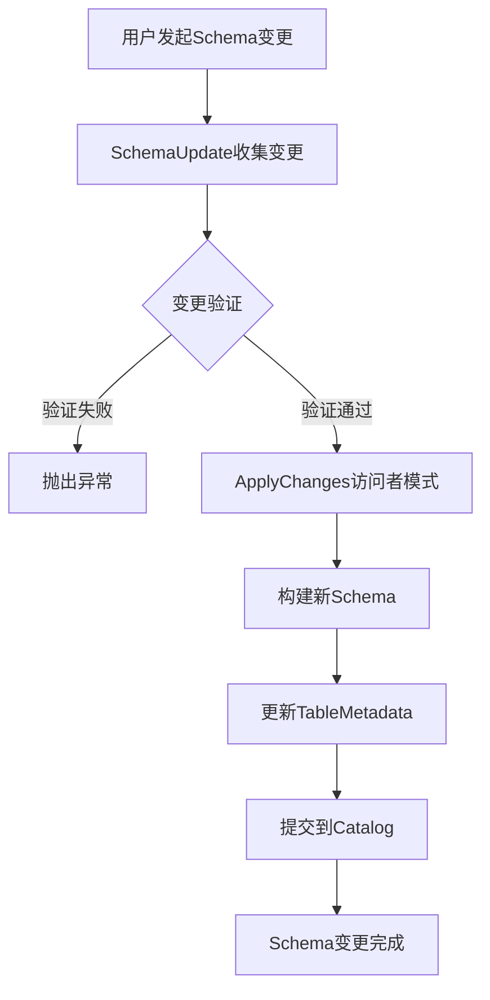
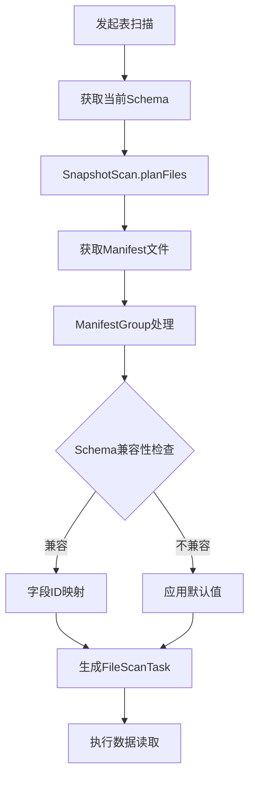
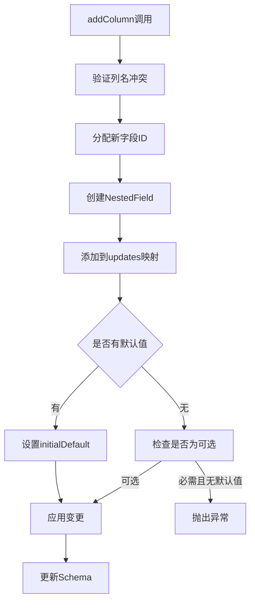
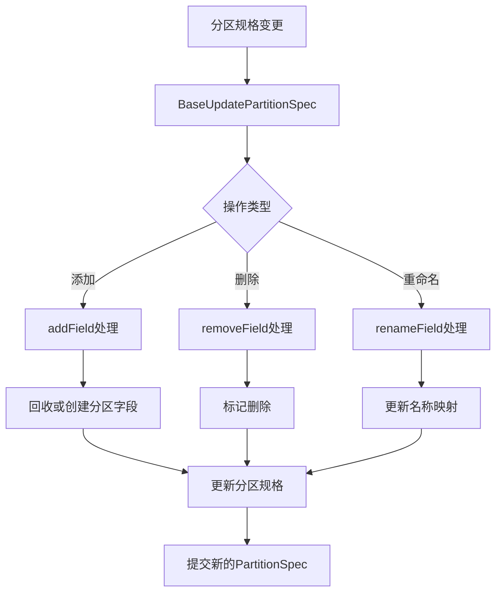

# Apache Iceberg Schema Evolution 深度技术分析

## 目录

1. [引言](#引言)
2. [Schema Evolution 核心机制](#schema-evolution-核心机制)
3. [数据读取流程分析](#数据读取流程分析)
4. [列变更详细分析](#列变更详细分析)
5. [分区列修改机制](#分区列修改机制)
6. [代码示例](#代码示例)
7. [流程图](#流程图)
8. [技术细节与最佳实践](#技术细节与最佳实践)
9. [总结](#总结)

## 引言

Apache Iceberg 是一个高性能开放式表格格式，专为大规模分析表设计。其核心优势之一就是强大的 Schema Evolution 能力，允许表结构随时间演化而不破坏现有数据的兼容性。本文将深入分析 Iceberg 的 Schema Evolution 机制，特别关注在 schema 变更后如何读取数据。

## Schema Evolution 核心机制

### 1. 核心类结构

**SchemaUpdate 类** (`core/src/main/java/org/apache/iceberg/SchemaUpdate.java`)

这是 Schema Evolution 的核心实现类，实现了 `UpdateSchema` 接口。主要功能包括：

- **Column Addition**: 支持添加可选或必需列
- **Column Deletion**: 支持删除列
- **Column Rename**: 支持列重命名
- **Type Evolution**: 支持类型提升（如 int → long）
- **Column Reordering**: 支持列重排序
- **Default Values**: 支持设置默认值

**关键字段解析**：

```java
// SchemaUpdate.java:49-68
class SchemaUpdate implements UpdateSchema {
  private final TableOperations ops;
  private final TableMetadata base;
  private final Schema schema;
  private final Map<Integer, Integer> idToParent;
  private final List<Integer> deletes = Lists.newArrayList();           // 删除的列ID
  private final Map<Integer, Types.NestedField> updates = Maps.newHashMap();  // 更新的列
  private final Multimap<Integer, Integer> parentToAddedIds;            // 父级到新增ID的映射
  private final Map<String, Integer> addedNameToId = Maps.newHashMap(); // 新增列名到ID映射
  private final Multimap<Integer, Move> moves;                          // 列移动操作
  private int lastColumnId;                                             // 最后分配的列ID
  private boolean allowIncompatibleChanges = false;                     // 是否允许不兼容变更
}
```

### 2. Schema Evolution 处理流程

Schema 变更的处理过程可以分为以下几个阶段：

#### 阶段1: 变更收集
- 收集所有的 schema 变更操作（增删改等）
- 验证变更的合法性和兼容性
- 分配新的字段ID

#### 阶段2: 变更应用
- 通过 `ApplyChanges` 访问者模式应用变更
- 构建新的 Schema 结构
- 更新 TableMetadata

#### 阶段3: 兼容性检查
- 验证标识符字段不被删除
- 检查类型提升的合法性
- 确保不破坏现有数据的读取

## 数据读取流程分析

### 1. Scan 机制概览

当 Schema 发生变更后，数据读取通过以下核心类协调：

**BaseTableScan** → **DataTableScan** → **SnapshotScan** → **ManifestGroup**

### 2. Schema 投影处理

**关键源码位置**: `core/src/main/java/org/apache/iceberg/SnapshotScan.java:130-135`

```java
List<Integer> projectedFieldIds = Lists.newArrayList(TypeUtil.getProjectedIds(schema()));
List<String> projectedFieldNames = 
    projectedFieldIds.stream().map(schema()::findColumnName).collect(Collectors.toList());
```

**投影处理机制**:

1. **字段ID映射**: Iceberg 使用稳定的字段ID而不是列名或位置进行字段识别
2. **Schema 兼容性**: 读取时使用扫描时的schema，与文件schema进行兼容性匹配
3. **默认值处理**: 新增列使用默认值填充历史数据

### 3. 文件扫描与过滤

**DataTableScan.java:64-91** 展示了文件扫描的核心流程：

```java
public CloseableIterable<FileScanTask> doPlanFiles() {
  Snapshot snapshot = snapshot();
  FileIO io = table().io();
  List<ManifestFile> dataManifests = snapshot.dataManifests(io);
  List<ManifestFile> deleteManifests = snapshot.deleteManifests(io);
  
  ManifestGroup manifestGroup = new ManifestGroup(io, dataManifests, deleteManifests)
      .caseSensitive(isCaseSensitive())
      .select(scanColumns())         // Schema 投影
      .filterData(filter())          // 数据过滤
      .specsById(table().specs())    // 分区规格
      .scanMetrics(scanMetrics());
}
```

## 列变更详细分析

### 1. 列添加 (Column Addition)

#### 实现机制

**源码位置**: `SchemaUpdate.java:111-185`

```java
private void internalAddColumn(String parent, String name, boolean isOptional, 
                              Type type, String doc, Literal<?> defaultValue) {
  // 1. 验证父级结构存在
  // 2. 检查列名冲突
  // 3. 分配新的字段ID
  int newId = assignNewColumnId();
  
  // 4. 创建新字段
  Types.NestedField newField = Types.NestedField.builder()
      .withName(name)
      .isOptional(isOptional)
      .withId(newId)
      .ofType(TypeUtil.assignFreshIds(type, this::assignNewColumnId))
      .withDoc(doc)
      .withInitialDefault(defaultValue)
      .withWriteDefault(defaultValue)
      .build();
}
```

#### 数据读取处理

- **新列处理**: 历史文件中不存在的列使用默认值填充
- **兼容性**: 通过字段ID映射确保向后兼容
- **投影优化**: 只读取需要的列，提高性能

### 2. 列删除 (Column Deletion)

#### 实现机制

**源码位置**: `SchemaUpdate.java:187-200`

```java
public UpdateSchema deleteColumn(String name) {
  Types.NestedField field = findField(name);
  Preconditions.checkArgument(field != null, "Cannot delete missing column: %s", name);
  Preconditions.checkArgument(!parentToAddedIds.containsKey(field.fieldId()), 
      "Cannot delete a column that has additions: %s", name);
  deletes.add(field.fieldId());
  return this;
}
```

#### 数据读取处理

- **软删除**: 列在metadata中标记为删除，但历史文件中的数据仍然存在
- **读取跳过**: 扫描时自动跳过已删除的列
- **存储优化**: 后续compaction可以物理删除这些列的数据

### 3. 列重命名 (Column Rename)

#### 实现机制

**源码位置**: `SchemaUpdate.java:202-225`

```java
public UpdateSchema renameColumn(String name, String newName) {
  Types.NestedField field = findField(name);
  int fieldId = field.fieldId();
  Types.NestedField update = updates.get(fieldId);
  Types.NestedField newField = Types.NestedField.from(update != null ? update : field)
      .withName(newName).build();
  updates.put(fieldId, newField);
  
  // 处理标识符字段重命名
  if (identifierFieldNames.contains(name)) {
    identifierFieldNames.remove(name);
    identifierFieldNames.add(newName);
  }
}
```

#### 数据读取处理

- **ID稳定性**: 字段ID保持不变，只更新名称映射
- **查询兼容**: 新旧名称在过渡期都可以使用
- **元数据更新**: 更新name mapping确保正确的字段解析

### 4. 类型演化 (Type Evolution)

#### 支持的类型提升

```java
// TypeUtil 中定义的合法类型提升
int → long
float → double  
decimal(p, s) → decimal(p', s) where p' > p
```

#### 实现机制

**源码位置**: `SchemaUpdate.java:270-296`

```java
public UpdateSchema updateColumn(String name, Type.PrimitiveType newType) {
  Types.NestedField field = findForUpdate(name);
  Preconditions.checkArgument(
      TypeUtil.isPromotionAllowed(field.type(), newType),
      "Cannot change column type: %s: %s -> %s", name, field.type(), newType);
  
  Types.NestedField newField = Types.NestedField.from(field).ofType(newType).build();
  updates.put(fieldId, newField);
}
```

## 分区列修改机制

### 1. 分区规格演化

**核心类**: `BaseUpdatePartitionSpec` (`core/src/main/java/org/apache/iceberg/BaseUpdatePartitionSpec.java`)

#### 关键特性：

- **分区字段添加**: 添加新的分区字段
- **分区字段删除**: 移除现有分区字段  
- **分区字段重命名**: 重命名分区字段
- **Transform 更新**: 更改分区转换函数

### 2. 分区字段回收机制

**源码位置**: `BaseUpdatePartitionSpec.java:122-144`

```java
private PartitionField recycleOrCreatePartitionField(
    Pair<Integer, Transform<?, ?>> sourceTransform, String name) {
  if (formatVersion >= 2 && base != null) {
    // 在历史分区规格中查找相似的分区字段
    // 尝试匹配源字段ID、变换类型和目标名称
    for (PartitionSpec partitionSpec : base.specs()) {
      for (PartitionField field : partitionSpec.fields()) {
        if (field.sourceId() == sourceId && field.transform().equals(transform)) {
          if (name == null || field.name().equals(name)) {
            return field; // 回收现有字段
          }
        }
      }
    }
  }
  return new PartitionField(sourceTransform.first(), assignFieldId(), name, sourceTransform.second());
}
```

### 3. 分区演化与数据读取

**影响分析**:

1. **文件定位**: 不同分区规格的文件需要不同的定位策略
2. **元数据扫描**: ManifestGroup 需要处理多个分区规格
3. **过滤下推**: 查询过滤器需要适配不同的分区结构

## 代码示例

### 1. 基本列操作示例

```java
// 添加新列
table.updateSchema()
    .addColumn("new_column", Types.StringType.get(), "新增的字符串列")
    .commit();

// 添加带默认值的必需列
table.updateSchema()
    .addRequiredColumn("required_col", Types.IntegerType.get(), 
                      Literals.of(0)) // 默认值为0
    .commit();

// 删除列
table.updateSchema()
    .deleteColumn("old_column")
    .commit();

// 重命名列
table.updateSchema()
    .renameColumn("old_name", "new_name")
    .commit();

// 类型提升
table.updateSchema()
    .updateColumn("price", Types.LongType.get()) // int -> long
    .commit();
```

### 2. 复杂嵌套结构操作

```java
// 原始Schema
Schema schema = new Schema(
    required(1, "id", Types.LongType.get()),
    optional(2, "user_info", Types.StructType.of(
        required(3, "name", Types.StringType.get()),
        optional(4, "age", Types.IntegerType.get())
    ))
);

// 在嵌套结构中添加列
table.updateSchema()
    .addColumn("user_info", "email", Types.StringType.get(), "用户邮箱")
    .commit();

// 修改嵌套列的类型
table.updateSchema()
    .updateColumn("user_info.age", Types.LongType.get()) // int -> long
    .commit();
```

### 3. 分区列演化示例

```java
// 添加新的分区字段
table.updatePartitionSpec()
    .addField("date_col")  // 按日期分区
    .commit();

// 添加带变换的分区字段  
table.updatePartitionSpec()
    .addField("created_month", Expressions.month("created_at"))
    .commit();

// 移除分区字段
table.updatePartitionSpec()
    .removeField("old_partition")
    .commit();
```

### 4. 数据读取与Schema Evolution

```java
// 读取演化后的数据
TableScan scan = table.newScan();

// 使用新增的列进行过滤
scan = scan.filter(Expressions.equal("new_column", "some_value"));

// 投影只需要的列（包括新增列）
scan = scan.select("id", "new_column", "user_info.email");

// 执行扫描
CloseableIterable<FileScanTask> tasks = scan.planFiles();
```

## 流程图

### 1. Schema Evolution 整体流程



### 2. 数据读取流程（Schema演化后）



### 3. 列添加处理流程



### 4. 分区演化处理流程



## 技术细节与最佳实践

### 1. 字段ID管理

**关键原则**:
- 字段ID是Schema演化的核心，必须保持稳定
- 每个字段获得唯一且递增的ID
- 删除的字段ID不会被重用

**源码体现** (`SchemaUpdate.java:476-480`):
```java
private int assignNewColumnId() {
  int next = lastColumnId + 1;
  this.lastColumnId = next;
  return next;
}
```

### 2. 兼容性检查机制

**类型提升规则**:
- 只允许安全的类型提升（扩大精度或范围）
- 禁止可能丢失数据的类型转换

**标识符字段保护** (`SchemaUpdate.java:538-561`):
```java
// 验证现有标识符字段不被删除
for (String name : identifierFieldNames) {
  Types.NestedField field = caseSensitive ? schema.findField(name) : schema.caseInsensitiveFindField(name);
  if (field != null) {
    Preconditions.checkArgument(!deletes.contains(field.fieldId()),
        "Cannot delete identifier field %s", field);
  }
}
```

### 3. 性能优化策略

**投影下推**:
- 只读取查询需要的列
- 利用列式存储格式的优势
- 减少I/O和内存使用

**分区剪枝**:
- 利用分区信息过滤不需要的文件
- 支持多层分区结构
- 动态分区发现

### 4. 最佳实践建议

#### Schema设计原则:
1. **向前兼容**: 新增列应该是可选的，或提供合理默认值
2. **谨慎删除**: 删除列前确保没有依赖的查询和应用
3. **渐进演化**: 大规模变更分步进行，减少风险

#### 分区策略:
1. **合理粒度**: 避免过多小文件或过少大文件
2. **演化规划**: 预留分区演化的空间
3. **性能测试**: 变更后验证查询性能

## 总结

Apache Iceberg的Schema Evolution机制通过以下核心技术实现了强大的表结构演化能力：

### 1. 核心技术特征

1. **字段ID稳定性**: 使用不可变的字段ID确保长期兼容性
2. **渐进式演化**: 支持增量式的schema变更，不影响现有数据
3. **类型安全**: 只允许安全的类型提升，防止数据丢失
4. **分区兼容**: 支持分区结构的演化，适应不断变化的查询模式

### 2. 数据读取保证

1. **向后兼容**: 新schema可以读取旧格式数据
2. **默认值处理**: 新增列在历史数据中自动填充默认值  
3. **性能优化**: 通过投影下推和分区剪枝优化查询性能
4. **错误恢复**: 提供完整的回滚和错误处理机制

### 3. 实际应用价值

- **业务敏捷性**: 支持快速的业务需求变更
- **数据一致性**: 确保长期数据的一致性和可用性  
- **运维便利**: 简化大规模数据表的维护工作
- **成本效益**: 减少数据迁移和重构的成本

Iceberg的Schema Evolution为现代数据湖提供了企业级的表结构管理能力，是其成为领先开放表格格式的重要原因之一。

---

*本文档基于Apache Iceberg 1.9.x版本源码分析编写，涵盖了Schema Evolution的核心实现机制和最佳实践指导。*