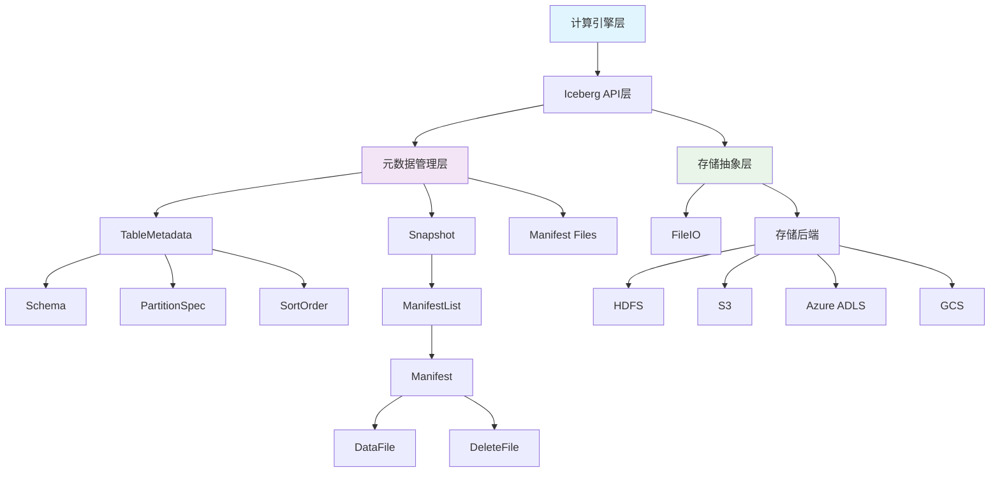
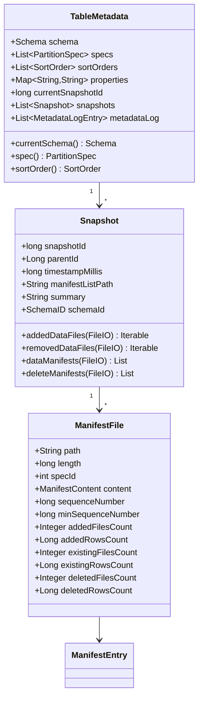
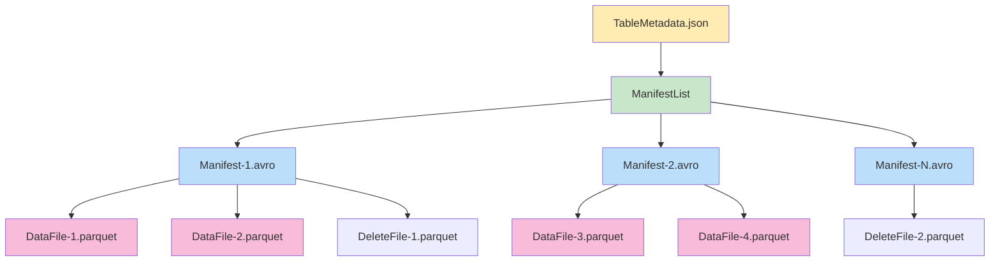
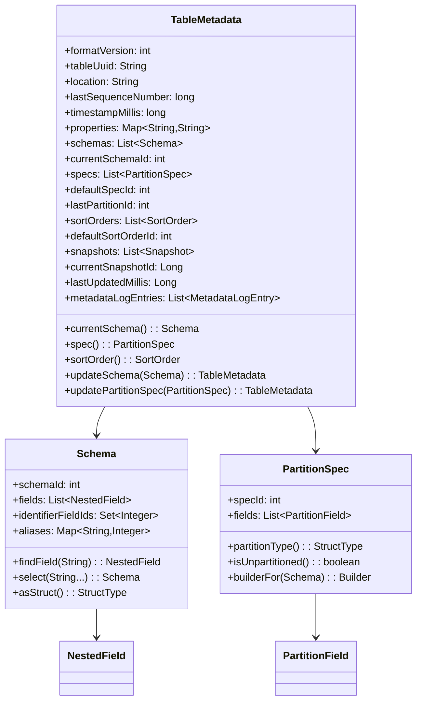
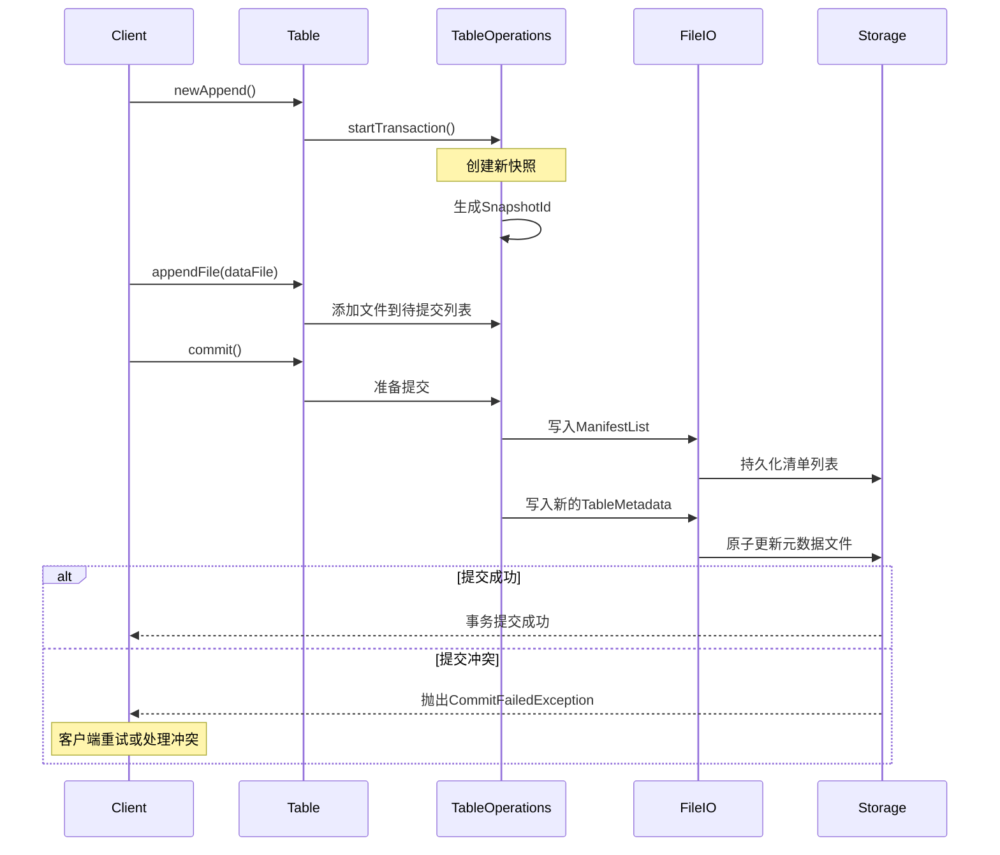
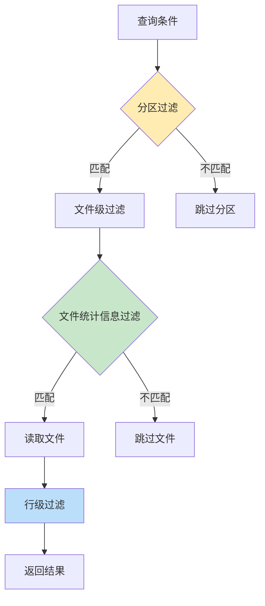
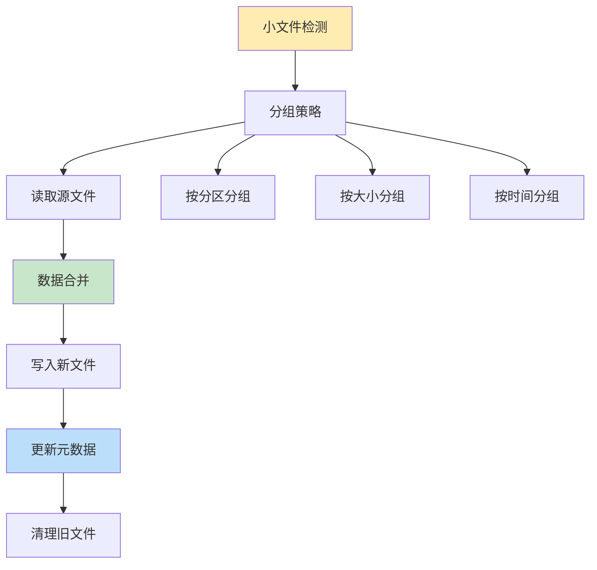
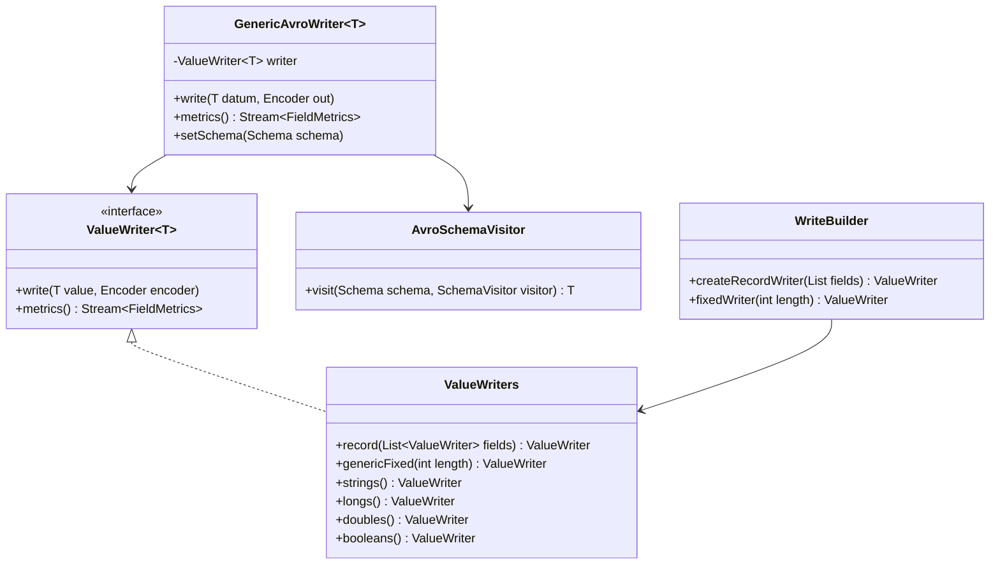

# Apache Iceberg 架构设计详细分析

## 目录
1. [概述](#概述)
2. [架构设计原理](#架构设计原理)
3. [核心组件深度解析](#核心组件深度解析)
4. [存储层设计](#存储层设计)
5. [元数据管理系统](#元数据管理系统)
6. [事务处理机制](#事务处理机制)
7. [查询优化策略](#查询优化策略)
8. [数据维护操作](#数据维护操作)
9. [序列化与I/O处理](#序列化与IO处理)
10. [实际应用案例与最佳实践](#实际应用案例与最佳实践)

## 概述

Apache Iceberg 是一个高性能的开放表格式，专为大规模分析数据表设计。它提供了可靠的ACID事务、时间旅行查询、模式演进等企业级功能。本文档将深入分析Iceberg的架构设计，并提供丰富的实际应用示例。

### 核心特性
- **ACID事务支持**：完全支持原子性、一致性、隔离性、持久性
- **模式演进**：支持添加、删除、重命名列等操作
- **分区演进**：支持动态修改分区策略
- **时间旅行**：可查询表的历史版本
- **隐藏分区**：用户无需关心具体分区逻辑

## 架构设计原理

### 整体架构图



### 设计理念

Iceberg采用分层架构设计，将复杂的表格管理功能分解为多个独立的层次：

1. **计算引擎无关性**：支持Spark、Flink、Hive等多种引擎
2. **存储格式无关性**：支持Parquet、ORC、Avro等格式
3. **云存储友好**：原生支持对象存储的最终一致性

### 实际应用示例

#### 示例1：基本表操作

```java
// 创建Iceberg表
public class IcebergTableExample {
    public static void createTable() {
        // 定义表模式
        Schema schema = new Schema(
            required(1, "id", Types.LongType.get()),
            optional(2, "name", Types.StringType.get()),
            optional(3, "age", Types.IntegerType.get()),
            optional(4, "created_at", Types.TimestampType.withZone())
        );
        
        // 定义分区规格
        PartitionSpec spec = PartitionSpec.builderFor(schema)
            .year("created_at")
            .build();
        
        // 创建表
        Table table = catalog.createTable(
            TableIdentifier.of("namespace", "users"),
            schema,
            spec
        );
        
        System.out.println("表创建成功: " + table.location());
    }
}
```

#### 示例2：数据写入操作

```java
public class DataWriteExample {
    public static void writeData(Table table) {
        // 获取数据写入器
        DataWriter<GenericRecord> writer = Appenders.createDataWriter(
            table.newAppend().newDataWriter(),
            table.schema()
        );
        
        try {
            // 创建记录
            GenericRecord record1 = GenericData.Record.create(table.schema());
            record1.put("id", 1L);
            record1.put("name", "张三");
            record1.put("age", 25);
            record1.put("created_at", Instant.now());
            
            GenericRecord record2 = GenericData.Record.create(table.schema());
            record2.put("id", 2L);
            record2.put("name", "李四");
            record2.put("age", 30);
            record2.put("created_at", Instant.now());
            
            // 写入数据
            writer.write(record1);
            writer.write(record2);
            
            // 提交写入
            WriteResult result = writer.complete();
            table.newAppend()
                .appendFile(result.dataFiles().iterator().next())
                .commit();
                
            System.out.println("数据写入成功，文件数量: " + result.dataFiles().size());
        } finally {
            writer.close();
        }
    }
}
```

## 核心组件深度解析

### Table接口实现

Table是Iceberg的核心抽象，定义了表的基本操作接口。

```java
// BaseTable核心实现示例
public class BaseTable implements Table {
    private final TableMetadata metadata;
    private final FileIO io;
    private final String metadataFileLocation;
    
    @Override
    public AppendFiles newAppend() {
        return new StreamingAppend(ops);
    }
    
    @Override
    public RewriteFiles newRewrite() {
        return new BaseRewriteFiles(ops);
    }
    
    @Override
    public DeleteFiles newDelete() {
        return new StreamingDelete(ops);
    }
    
    // 时间旅行查询示例
    @Override
    public TableScan newScan() {
        return new BaseTableScan(ops, this, schema());
    }
    
    // 获取指定时间点的快照
    public TableScan asOfTime(long timestampMillis) {
        return newScan().asOfTime(timestampMillis);
    }
}
```

### 实际应用示例：时间旅行查询

```java
public class TimeTravelExample {
    public static void queryHistoricalData(Table table) {
        // 查询1小时前的数据
        long oneHourAgo = System.currentTimeMillis() - 3600_000;
        TableScan historicalScan = table.newScan().asOfTime(oneHourAgo);
        
        try (CloseableIterable<FileScanTask> tasks = historicalScan.planFiles()) {
            for (FileScanTask task : tasks) {
                System.out.println("历史文件: " + task.file().path());
                System.out.println("记录数: " + task.file().recordCount());
                System.out.println("文件大小: " + task.file().fileSizeInBytes());
            }
        } catch (IOException e) {
            System.err.println("查询历史数据失败: " + e.getMessage());
        }
        
        // 查询特定快照版本
        Snapshot targetSnapshot = table.snapshot(snapshotId);
        if (targetSnapshot != null) {
            TableScan snapshotScan = table.newScan().useSnapshot(snapshotId);
            System.out.println("快照时间: " + targetSnapshot.timestampMillis());
        }
    }
}
```

### 元数据管理架构



## 存储层设计

### 文件组织结构

Iceberg采用三层文件结构设计：



### 实际应用示例：文件管理

```java
public class FileManagementExample {
    
    // 数据文件创建示例
    public static DataFile createDataFile(Table table, String filePath) {
        return DataFiles.builder(table.spec())
            .withPath(filePath)
            .withFileSizeInBytes(1024 * 1024) // 1MB
            .withRecordCount(1000)
            .withFormat(FileFormat.PARQUET)
            .withSplitOffsets(Arrays.asList(0L, 512 * 1024L)) // 分割点
            .build();
    }
    
    // 删除文件创建示例
    public static DeleteFile createDeleteFile(Table table) {
        return FileMetadata.deleteFileBuilder(table.spec())
            .ofPositionDeletes()
            .withPath("/path/to/delete/file.parquet")
            .withFileSizeInBytes(64 * 1024) // 64KB
            .withRecordCount(100) // 删除的记录数
            .build();
    }
    
    // 清单文件操作示例
    public static void processManifestFiles(Table table) {
        Snapshot currentSnapshot = table.currentSnapshot();
        if (currentSnapshot != null) {
            List<ManifestFile> dataManifests = currentSnapshot.dataManifests(table.io());
            
            for (ManifestFile manifest : dataManifests) {
                System.out.println("Manifest路径: " + manifest.path());
                System.out.println("添加的文件数: " + manifest.addedFilesCount());
                System.out.println("删除的文件数: " + manifest.deletedFilesCount());
                System.out.println("现有文件数: " + manifest.existingFilesCount());
                
                // 读取清单条目
                try (ManifestReader<DataFile> reader = ManifestFiles.read(manifest, table.io())) {
                    for (ManifestEntry<DataFile> entry : reader.entries()) {
                        DataFile dataFile = entry.file();
                        System.out.println("  数据文件: " + dataFile.path());
                        System.out.println("  记录数: " + dataFile.recordCount());
                        System.out.println("  状态: " + entry.status());
                    }
                }
            }
        }
    }
}
```

### 分区策略设计

```java
public class PartitionExample {
    
    // 时间分区示例
    public static PartitionSpec createTimePartition(Schema schema) {
        return PartitionSpec.builderFor(schema)
            .year("created_at")    // 按年分区
            .month("created_at")   // 按月分区
            .build();
    }
    
    // 哈希分区示例
    public static PartitionSpec createHashPartition(Schema schema) {
        return PartitionSpec.builderFor(schema)
            .bucket("user_id", 16) // 用户ID哈希分区，16个桶
            .build();
    }
    
    // 多字段分区示例
    public static PartitionSpec createMultiFieldPartition(Schema schema) {
        return PartitionSpec.builderFor(schema)
            .identity("region")     // 地区字段直接分区
            .year("order_date")     // 订单日期按年分区
            .bucket("customer_id", 32) // 客户ID哈希分区
            .build();
    }
    
    // 分区演进示例
    public static void evolvePartition(Table table) {
        // 获取当前分区规格
        PartitionSpec currentSpec = table.spec();
        System.out.println("当前分区ID: " + currentSpec.specId());
        
        // 创建新的分区规格
        PartitionSpec newSpec = PartitionSpec.builderFor(table.schema())
            .year("created_at")
            .bucket("category", 8) // 新增分区字段
            .build();
        
        // 更新表的分区规格
        table.updateSpec()
            .addField("category")
            .commit();
            
        System.out.println("分区演进完成");
    }
}
```

## 元数据管理系统

### TableMetadata详细分析

TableMetadata是Iceberg表的核心元数据结构，包含了表的所有重要信息。



### 实际应用示例：元数据操作

```java
public class MetadataExample {
    
    // 模式演进示例
    public static void evolveSchema(Table table) {
        // 添加新列
        table.updateSchema()
            .addColumn("email", Types.StringType.get())
            .addColumn("phone", Types.StringType.get())
            .commit();
        
        // 重命名列
        table.updateSchema()
            .renameColumn("phone", "phone_number")
            .commit();
        
        // 删除列
        table.updateSchema()
            .deleteColumn("age")
            .commit();
        
        // 修改列类型（仅支持兼容类型转换）
        table.updateSchema()
            .updateColumn("id", Types.StringType.get())
            .commit();
        
        System.out.println("模式演进完成，当前模式ID: " + table.schema().schemaId());
    }
    
    // 表属性管理示例
    public static void manageTableProperties(Table table) {
        // 设置表属性
        table.updateProperties()
            .set("write.target-file-size-bytes", "134217728") // 128MB
            .set("write.split-size", "268435456") // 256MB
            .set("read.split.target-size", "134217728") // 128MB
            .commit();
        
        // 获取表属性
        Map<String, String> properties = table.properties();
        properties.forEach((key, value) -> 
            System.out.println(key + " = " + value));
        
        // 删除表属性
        table.updateProperties()
            .remove("old.property")
            .commit();
    }
    
    // 快照管理示例
    public static void manageSnapshots(Table table) {
        // 获取所有快照
        Iterable<Snapshot> snapshots = table.snapshots();
        for (Snapshot snapshot : snapshots) {
            System.out.println("快照ID: " + snapshot.snapshotId());
            System.out.println("时间戳: " + new Date(snapshot.timestampMillis()));
            System.out.println("父快照: " + snapshot.parentId());
            System.out.println("摘要: " + snapshot.summary());
        }
        
        // 过期旧快照
        table.expireSnapshots()
            .expireOlderThan(System.currentTimeMillis() - 7 * 24 * 3600 * 1000L) // 7天前
            .retainLast(10) // 保留最近10个快照
            .commit();
        
        System.out.println("快照清理完成");
    }
}
```

## 事务处理机制

### ACID特性实现

Iceberg通过快照机制实现ACID事务特性：



### 实际应用示例：事务处理

```java
public class TransactionExample {
    
    // 基本事务示例
    public static void basicTransaction(Table table) {
        Transaction txn = table.newTransaction();
        
        try {
            // 在事务中进行多个操作
            AppendFiles append = txn.newAppend();
            
            // 添加数据文件
            DataFile dataFile1 = createSampleDataFile("file1.parquet");
            DataFile dataFile2 = createSampleDataFile("file2.parquet");
            
            append.appendFile(dataFile1);
            append.appendFile(dataFile2);
            append.commit();
            
            // 更新表属性
            txn.updateProperties()
                .set("last-update-time", String.valueOf(System.currentTimeMillis()))
                .commit();
            
            // 提交整个事务
            txn.commitTransaction();
            
            System.out.println("事务提交成功");
            
        } catch (Exception e) {
            System.err.println("事务失败: " + e.getMessage());
            // 事务会自动回滚
        }
    }
    
    // 乐观并发控制示例
    public static void optimisticConcurrencyControl(Table table) {
        int maxRetries = 3;
        int retryCount = 0;
        
        while (retryCount < maxRetries) {
            try {
                // 获取当前快照作为基准
                long baseSnapshotId = table.currentSnapshot().snapshotId();
                
                AppendFiles append = table.newAppend();
                DataFile newFile = createSampleDataFile("new-data.parquet");
                append.appendFile(newFile);
                
                // 尝试提交，如果基准快照已变更会抛出异常
                append.commit();
                
                System.out.println("并发提交成功");
                break;
                
            } catch (CommitFailedException e) {
                retryCount++;
                System.out.println("提交冲突，重试次数: " + retryCount);
                
                if (retryCount >= maxRetries) {
                    throw new RuntimeException("达到最大重试次数", e);
                }
                
                // 等待一段时间后重试
                try {
                    Thread.sleep(100 * retryCount);
                } catch (InterruptedException ie) {
                    Thread.currentThread().interrupt();
                    throw new RuntimeException("重试被中断", ie);
                }
            }
        }
    }
    
    // 批量操作事务示例
    public static void batchOperations(Table table) {
        Transaction txn = table.newTransaction();
        
        try {
            // 批量添加文件
            AppendFiles append = txn.newAppend();
            for (int i = 0; i < 100; i++) {
                DataFile file = createSampleDataFile("batch-file-" + i + ".parquet");
                append.appendFile(file);
            }
            append.commit();
            
            // 删除旧文件
            DeleteFiles delete = txn.newDelete();
            // 假设有一些需要删除的文件
            List<DataFile> filesToDelete = getFilesToDelete(table);
            for (DataFile file : filesToDelete) {
                delete.deleteFile(file);
            }
            delete.commit();
            
            // 压实操作
            RewriteFiles rewrite = txn.newRewrite();
            List<DataFile> smallFiles = getSmallFiles(table);
            DataFile compactedFile = compactFiles(smallFiles);
            
            for (DataFile smallFile : smallFiles) {
                rewrite.deleteFile(smallFile);
            }
            rewrite.addFile(compactedFile);
            rewrite.commit();
            
            // 提交所有操作
            txn.commitTransaction();
            
            System.out.println("批量操作事务完成");
            
        } catch (Exception e) {
            System.err.println("批量操作失败: " + e.getMessage());
            throw e;
        }
    }
    
    private static DataFile createSampleDataFile(String fileName) {
        // 创建示例数据文件的实现
        return DataFiles.builder(PartitionSpec.unpartitioned())
            .withPath("/data/" + fileName)
            .withFileSizeInBytes(1024 * 1024)
            .withRecordCount(1000)
            .build();
    }
    
    private static List<DataFile> getFilesToDelete(Table table) {
        // 获取需要删除的文件列表的实现
        return new ArrayList<>();
    }
    
    private static List<DataFile> getSmallFiles(Table table) {
        // 获取小文件列表的实现
        return new ArrayList<>();
    }
    
    private static DataFile compactFiles(List<DataFile> files) {
        // 压实文件的实现
        return createSampleDataFile("compacted.parquet");
    }
}
```

## 查询优化策略

### 谓词下推机制

Iceberg提供了强大的谓词下推功能，可以在文件级别和分区级别进行数据过滤。



### 实际应用示例：查询优化

```java
public class QueryOptimizationExample {
    
    // 基本谓词下推示例
    public static void basicPredicatePushdown(Table table) {
        // 创建查询条件
        Expression filter = Expressions.and(
            Expressions.greaterThan("age", 18),
            Expressions.equal("region", "Asia"),
            Expressions.lessThan("created_at", "2024-01-01")
        );
        
        TableScan scan = table.newScan()
            .filter(filter)
            .select("id", "name", "age"); // 列投影
        
        // 查看查询计划
        System.out.println("查询过滤条件: " + scan.filter());
        System.out.println("选择的列: " + scan.schema());
        
        // 执行查询
        try (CloseableIterable<FileScanTask> tasks = scan.planFiles()) {
            int fileCount = 0;
            long totalRecords = 0;
            
            for (FileScanTask task : tasks) {
                fileCount++;
                totalRecords += task.file().recordCount();
                System.out.println("扫描文件: " + task.file().path());
            }
            
            System.out.println("总文件数: " + fileCount);
            System.out.println("总记录数: " + totalRecords);
        } catch (IOException e) {
            System.err.println("查询执行失败: " + e.getMessage());
        }
    }
    
    // 分区剪枝示例
    public static void partitionPruning(Table table) {
        // 基于分区字段的查询
        Expression partitionFilter = Expressions.and(
            Expressions.equal("year", 2023),
            Expressions.in("month", Arrays.asList(1, 2, 3)) // Q1季度
        );
        
        TableScan scan = table.newScan().filter(partitionFilter);
        
        try (CloseableIterable<FileScanTask> tasks = scan.planFiles()) {
            Set<String> partitions = new HashSet<>();
            
            for (FileScanTask task : tasks) {
                String partition = task.file().partition().toString();
                partitions.add(partition);
            }
            
            System.out.println("涉及的分区: " + partitions);
            System.out.println("分区剪枝效果: 只扫描了 " + partitions.size() + " 个分区");
        } catch (IOException e) {
            System.err.println("分区剪枝查询失败: " + e.getMessage());
        }
    }
    
    // 文件级统计信息过滤示例
    public static void fileStatsFiltering(Table table) {
        // 基于数值范围的查询
        Expression numericFilter = Expressions.and(
            Expressions.greaterThan("price", 1000),
            Expressions.lessThan("price", 5000)
        );
        
        TableScan scan = table.newScan().filter(numericFilter);
        
        try (CloseableIterable<FileScanTask> tasks = scan.planFiles()) {
            int totalFiles = 0;
            int skippedFiles = 0;
            
            for (FileScanTask task : tasks) {
                totalFiles++;
                DataFile file = task.file();
                
                // 检查文件统计信息
                if (file.lowerBounds() != null && file.upperBounds() != null) {
                    System.out.println("文件: " + file.path());
                    System.out.println("  价格范围: " + 
                        file.lowerBounds().get(table.schema().findField("price").fieldId()) + 
                        " - " + 
                        file.upperBounds().get(table.schema().findField("price").fieldId()));
                } else {
                    skippedFiles++;
                }
            }
            
            System.out.println("总文件数: " + totalFiles);
            System.out.println("跳过的文件数: " + skippedFiles);
            System.out.println("过滤效率: " + (100.0 * skippedFiles / totalFiles) + "%");
        } catch (IOException e) {
            System.err.println("统计信息过滤查询失败: " + e.getMessage());
        }
    }
    
    // 复杂查询示例
    public static void complexQuery(Table table) {
        // 复合查询条件
        Expression complexFilter = Expressions.and(
            // 时间范围过滤
            Expressions.and(
                Expressions.greaterThanOrEqual("order_date", "2023-01-01"),
                Expressions.lessThan("order_date", "2024-01-01")
            ),
            // 多值匹配
            Expressions.in("status", Arrays.asList("completed", "shipped")),
            // 数值范围
            Expressions.greaterThan("total_amount", 100),
            // 字符串匹配
            Expressions.startsWith("customer_email", "@company.com")
        );
        
        TableScan scan = table.newScan()
            .filter(complexFilter)
            .select("order_id", "customer_id", "total_amount", "order_date")
            .option(TableProperties.SPLIT_SIZE, "67108864"); // 64MB分割
        
        // 收集查询统计信息
        QueryStats stats = new QueryStats();
        
        try (CloseableIterable<FileScanTask> tasks = scan.planFiles()) {
            for (FileScanTask task : tasks) {
                stats.addFile(task.file());
            }
        } catch (IOException e) {
            System.err.println("复杂查询执行失败: " + e.getMessage());
        }
        
        stats.printSummary();
    }
    
    // 查询统计信息收集类
    static class QueryStats {
        private int fileCount = 0;
        private long totalSize = 0;
        private long totalRecords = 0;
        private Set<String> partitions = new HashSet<>();
        
        void addFile(DataFile file) {
            fileCount++;
            totalSize += file.fileSizeInBytes();
            totalRecords += file.recordCount();
            partitions.add(file.partition().toString());
        }
        
        void printSummary() {
            System.out.println("=== 查询统计信息 ===");
            System.out.println("扫描文件数: " + fileCount);
            System.out.println("数据大小: " + formatSize(totalSize));
            System.out.println("记录总数: " + totalRecords);
            System.out.println("涉及分区: " + partitions.size());
            System.out.println("平均文件大小: " + formatSize(totalSize / Math.max(fileCount, 1)));
        }
        
        private String formatSize(long bytes) {
            if (bytes < 1024) return bytes + " B";
            if (bytes < 1024 * 1024) return (bytes / 1024) + " KB";
            if (bytes < 1024 * 1024 * 1024) return (bytes / (1024 * 1024)) + " MB";
            return (bytes / (1024 * 1024 * 1024)) + " GB";
        }
    }
}
```

## 数据维护操作

### 压实(Compaction)机制

Iceberg提供了灵活的数据压实功能，用于优化存储和查询性能。



### 实际应用示例：数据维护

```java
public class DataMaintenanceExample {
    
    // 基本压实操作示例
    public static void basicCompaction(Table table) {
        // 创建重写数据文件操作
        RewriteDataFilesAction compaction = Actions.forTable(table)
            .rewriteDataFiles()
            .targetSizeInBytes(128 * 1024 * 1024) // 目标文件大小128MB
            .splitLookback(10) // 查看10个候选文件
            .splitOpenFileCost(4 * 1024 * 1024); // 打开文件成本4MB
        
        // 添加过滤条件（可选）
        compaction = compaction.filter(
            Expressions.greaterThan("created_at", "2023-01-01")
        );
        
        // 执行压实
        RewriteDataFilesActionResult result = compaction.execute();
        
        System.out.println("压实完成:");
        System.out.println("  重写文件数: " + result.rewrittenDataFiles().size());
        System.out.println("  新增文件数: " + result.addedDataFiles().size());
        
        // 计算压实效果
        long oldSize = result.rewrittenDataFiles().stream()
            .mapToLong(DataFile::fileSizeInBytes)
            .sum();
        long newSize = result.addedDataFiles().stream()
            .mapToLong(DataFile::fileSizeInBytes)
            .sum();
        
        System.out.println("  原始大小: " + formatSize(oldSize));
        System.out.println("  压实后大小: " + formatSize(newSize));
        System.out.println("  空间节省: " + String.format("%.2f%%", 
            100.0 * (oldSize - newSize) / oldSize));
    }
    
    // 分区级压实示例
    public static void partitionedCompaction(Table table) {
        // 按分区执行压实
        String targetPartition = "year=2023/month=12";
        
        RewriteDataFilesAction partitionCompaction = Actions.forTable(table)
            .rewriteDataFiles()
            .filter(Expressions.and(
                Expressions.equal("year", 2023),
                Expressions.equal("month", 12)
            ));
        
        RewriteDataFilesActionResult result = partitionCompaction.execute();
        
        System.out.println("分区 " + targetPartition + " 压实结果:");
        printCompactionResult(result);
    }
    
    // 智能压实策略示例
    public static void smartCompaction(Table table) {
        // 分析表的文件分布情况
        TableAnalysis analysis = analyzeTable(table);
        
        if (analysis.hasSmallFiles()) {
            System.out.println("检测到小文件问题，执行压实...");
            
            RewriteDataFilesAction compaction = Actions.forTable(table)
                .rewriteDataFiles()
                .targetSizeInBytes(analysis.getOptimalFileSize());
            
            // 根据分析结果调整参数
            if (analysis.getSmallFileCount() > 1000) {
                compaction = compaction.splitLookback(5); // 大量小文件时减少查找范围
            }
            
            RewriteDataFilesActionResult result = compaction.execute();
            printCompactionResult(result);
        } else {
            System.out.println("表文件分布良好，无需压实");
        }
    }
    
    // 删除文件清理示例
    public static void deleteFileCleanup(Table table) {
        // 查找删除文件较多的分区
        List<String> partitionsToClean = findPartitionsWithManyDeletes(table);
        
        for (String partition : partitionsToClean) {
            System.out.println("清理分区: " + partition);
            
            // 重写包含删除文件的数据
            RewriteDataFilesAction cleanup = Actions.forTable(table)
                .rewriteDataFiles()
                .filter(parsePartitionFilter(partition));
            
            RewriteDataFilesActionResult result = cleanup.execute();
            
            System.out.println("  清理完成，删除文件数: " + 
                result.rewrittenDataFiles().size());
        }
    }
    
    // 快照清理示例
    public static void snapshotMaintenance(Table table) {
        long currentTime = System.currentTimeMillis();
        long weekAgo = currentTime - 7 * 24 * 3600 * 1000L; // 7天前
        
        // 过期旧快照
        table.expireSnapshots()
            .expireOlderThan(weekAgo)
            .retainLast(50) // 保留最近50个快照
            .deleteWith(table.io()::deleteFile) // 指定删除方法
            .commit();
        
        System.out.println("快照清理完成");
        
        // 清理孤儿文件
        Actions.forTable(table)
            .removeOrphanFiles()
            .olderThan(weekAgo)
            .execute();
        
        System.out.println("孤儿文件清理完成");
    }
    
    // 表健康度检查示例
    public static void healthCheck(Table table) {
        TableHealth health = new TableHealth(table);
        
        // 检查文件分布
        health.checkFileDistribution();
        
        // 检查快照数量
        health.checkSnapshotCount();
        
        // 检查分区平衡
        health.checkPartitionBalance();
        
        // 生成维护建议
        List<MaintenanceRecommendation> recommendations = health.getRecommendations();
        
        System.out.println("=== 表健康度报告 ===");
        for (MaintenanceRecommendation rec : recommendations) {
            System.out.println("- " + rec.getType() + ": " + rec.getDescription());
        }
    }
    
    // 辅助方法
    private static void printCompactionResult(RewriteDataFilesActionResult result) {
        System.out.println("  处理前文件数: " + result.rewrittenDataFiles().size());
        System.out.println("  处理后文件数: " + result.addedDataFiles().size());
        
        long bytesRewritten = result.rewrittenDataFiles().stream()
            .mapToLong(DataFile::fileSizeInBytes).sum();
        long bytesAdded = result.addedDataFiles().stream()
            .mapToLong(DataFile::fileSizeInBytes).sum();
        
        System.out.println("  数据量变化: " + formatSize(bytesRewritten) + 
            " -> " + formatSize(bytesAdded));
    }
    
    private static String formatSize(long bytes) {
        if (bytes < 1024) return bytes + " B";
        if (bytes < 1024 * 1024) return String.format("%.1f KB", bytes / 1024.0);
        if (bytes < 1024 * 1024 * 1024) return String.format("%.1f MB", bytes / (1024.0 * 1024));
        return String.format("%.1f GB", bytes / (1024.0 * 1024 * 1024));
    }
    
    // 简化的辅助类和方法
    static class TableAnalysis {
        private final Table table;
        private int smallFileCount;
        private long optimalFileSize;
        
        public TableAnalysis(Table table) {
            this.table = table;
            analyze();
        }
        
        private void analyze() {
            // 分析表的文件分布情况
            this.optimalFileSize = 128 * 1024 * 1024; // 默认128MB
            this.smallFileCount = 0; // 实际实现中需要统计
        }
        
        public boolean hasSmallFiles() { return smallFileCount > 10; }
        public int getSmallFileCount() { return smallFileCount; }
        public long getOptimalFileSize() { return optimalFileSize; }
    }
    
    static class TableHealth {
        private final Table table;
        private final List<MaintenanceRecommendation> recommendations = new ArrayList<>();
        
        public TableHealth(Table table) { this.table = table; }
        
        public void checkFileDistribution() {
            // 检查文件分布的实现
        }
        
        public void checkSnapshotCount() {
            // 检查快照数量的实现
        }
        
        public void checkPartitionBalance() {
            // 检查分区平衡的实现
        }
        
        public List<MaintenanceRecommendation> getRecommendations() {
            return recommendations;
        }
    }
    
    static class MaintenanceRecommendation {
        private final String type;
        private final String description;
        
        public MaintenanceRecommendation(String type, String description) {
            this.type = type;
            this.description = description;
        }
        
        public String getType() { return type; }
        public String getDescription() { return description; }
    }
    
    private static TableAnalysis analyzeTable(Table table) {
        return new TableAnalysis(table);
    }
    
    private static List<String> findPartitionsWithManyDeletes(Table table) {
        return Arrays.asList("year=2023/month=01", "year=2023/month=02");
    }
    
    private static Expression parsePartitionFilter(String partition) {
        // 解析分区过滤条件的简化实现
        return Expressions.alwaysTrue();
    }
}
```

## 序列化与I/O处理

### Avro集成架构

Iceberg与Avro深度集成，提供高效的序列化和反序列化支持。



### 实际应用示例：Avro集成

```java
public class AvroIntegrationExample {
    
    // Avro写入器使用示例
    public static void avroWriterExample(Table table, List<GenericRecord> records) 
            throws IOException {
        
        // 创建Avro模式
        org.apache.avro.Schema avroSchema = AvroSchemaUtil.convert(
            table.schema(), "table_record");
        
        // 创建Avro写入器
        GenericAvroWriter<GenericRecord> writer = GenericAvroWriter.create(avroSchema);
        
        // 创建输出流
        FileAppender<GenericRecord> appender = Appenders.<GenericRecord>builderFor(table)
            .schema(table.schema())
            .spec(table.spec())
            .build();
        
        try {
            // 写入记录
            for (GenericRecord record : records) {
                appender.add(record);
            }
        } finally {
            appender.close();
        }
        
        // 获取写入结果
        List<DataFile> dataFiles = appender.dataFiles();
        System.out.println("写入完成，生成文件数: " + dataFiles.size());
        
        // 提交到表
        table.newAppend()
            .appendFile(dataFiles.get(0))
            .commit();
    }
    
    // Avro读取器使用示例
    public static void avroReaderExample(Table table, DataFile dataFile) 
            throws IOException {
        
        // 创建Avro读取器
        AvroIterable<GenericRecord> reader = Avro.read(table.io().newInputFile(dataFile.path()))
            .project(table.schema()) // 投影特定列
            .createReaderFunc(DataReader::create)
            .build();
        
        int recordCount = 0;
        try (CloseableIterable<GenericRecord> iterable = reader) {
            for (GenericRecord record : iterable) {
                recordCount++;
                
                // 处理记录
                System.out.println("Record " + recordCount + ":");
                System.out.println("  ID: " + record.get("id"));
                System.out.println("  Name: " + record.get("name"));
                System.out.println("  Age: " + record.get("age"));
                
                // 只打印前10条记录
                if (recordCount >= 10) break;
            }
        }
        
        System.out.println("总记录数: " + recordCount);
    }
    
    // 模式转换示例
    public static void schemaConversionExample() {
        // Iceberg模式
        Schema icebergSchema = new Schema(
            required(1, "id", Types.LongType.get()),
            optional(2, "name", Types.StringType.get()),
            optional(3, "email", Types.StringType.get()),
            optional(4, "created_at", Types.TimestampType.withZone()),
            optional(5, "metadata", Types.MapType.ofOptional(6, 7, 
                Types.StringType.get(), Types.StringType.get()))
        );
        
        // 转换为Avro模式
        org.apache.avro.Schema avroSchema = AvroSchemaUtil.convert(
            icebergSchema, "user_record");
        
        System.out.println("Iceberg Schema:");
        System.out.println(icebergSchema);
        System.out.println("\nAvro Schema:");
        System.out.println(avroSchema.toString(true));
        
        // 反向转换
        Schema convertedBack = AvroSchemaUtil.toIceberg(avroSchema);
        System.out.println("\n转换回的Iceberg Schema:");
        System.out.println(convertedBack);
    }
    
    // 自定义ValueWriter示例
    public static class CustomValueWriter implements ValueWriter<CustomObject> {
        private final ValueWriter<String> nameWriter;
        private final ValueWriter<Integer> ageWriter;
        
        public CustomValueWriter() {
            this.nameWriter = ValueWriters.strings();
            this.ageWriter = ValueWriters.ints();
        }
        
        @Override
        public void write(CustomObject value, Encoder encoder) throws IOException {
            // 写入复合对象的各个字段
            nameWriter.write(value.getName(), encoder);
            ageWriter.write(value.getAge(), encoder);
        }
        
        @Override
        public Stream<FieldMetrics> metrics() {
            return Stream.concat(
                nameWriter.metrics(),
                ageWriter.metrics()
            );
        }
    }
    
    // 批量序列化示例
    public static void batchSerializationExample(Table table) throws IOException {
        // 创建批量写入器
        FileAppender<GenericRecord> appender = Appenders.<GenericRecord>builderFor(table)
            .schema(table.schema())
            .spec(table.spec())
            .set(TableProperties.AVRO_COMPRESSION, "snappy") // 设置压缩
            .build();
        
        // 批量写入数据
        int batchSize = 1000;
        List<GenericRecord> batch = new ArrayList<>(batchSize);
        
        for (int i = 0; i < 10000; i++) {
            GenericRecord record = createSampleRecord(table.schema(), i);
            batch.add(record);
            
            if (batch.size() >= batchSize) {
                // 写入一个批次
                for (GenericRecord rec : batch) {
                    appender.add(rec);
                }
                batch.clear();
                System.out.println("写入批次完成，已处理: " + (i + 1) + " 条记录");
            }
        }
        
        // 写入剩余记录
        for (GenericRecord rec : batch) {
            appender.add(rec);
        }
        
        appender.close();
        
        // 提交文件
        List<DataFile> dataFiles = appender.dataFiles();
        AppendFiles append = table.newAppend();
        for (DataFile dataFile : dataFiles) {
            append.appendFile(dataFile);
        }
        append.commit();
        
        System.out.println("批量序列化完成，生成 " + dataFiles.size() + " 个文件");
    }
    
    // 性能优化的序列化示例
    public static void optimizedSerializationExample(Table table) throws IOException {
        // 使用性能优化参数
        FileAppender<GenericRecord> appender = Appenders.<GenericRecord>builderFor(table)
            .schema(table.schema())
            .spec(table.spec())
            .set(TableProperties.AVRO_COMPRESSION, "zstd") // 高压缩率
            .set(TableProperties.AVRO_COMPRESSION_LEVEL, "3")
            .set("write.avro.sync-interval", "16384") // 同步间隔
            .build();
        
        // 使用缓冲写入
        try (BufferedAppender<GenericRecord> bufferedAppender = 
                new BufferedAppender<>(appender, 10000)) {
            
            for (int i = 0; i < 100000; i++) {
                GenericRecord record = createSampleRecord(table.schema(), i);
                bufferedAppender.add(record);
                
                if (i % 10000 == 0) {
                    System.out.println("已缓冲 " + i + " 条记录");
                }
            }
        }
        
        System.out.println("优化序列化完成");
    }
    
    // 辅助方法
    private static GenericRecord createSampleRecord(Schema schema, int index) {
        GenericRecord record = GenericData.Record.create(
            AvroSchemaUtil.convert(schema, "record"));
        
        record.put("id", (long) index);
        record.put("name", "用户" + index);
        record.put("email", "user" + index + "@example.com");
        record.put("created_at", Instant.now().toEpochMilli() * 1000);
        
        return record;
    }
    
    // 简化的自定义对象类
    static class CustomObject {
        private final String name;
        private final int age;
        
        public CustomObject(String name, int age) {
            this.name = name;
            this.age = age;
        }
        
        public String getName() { return name; }
        public int getAge() { return age; }
    }
    
    // 简化的缓冲追加器
    static class BufferedAppender<T> implements Closeable {
        private final FileAppender<T> appender;
        private final List<T> buffer;
        private final int bufferSize;
        
        public BufferedAppender(FileAppender<T> appender, int bufferSize) {
            this.appender = appender;
            this.bufferSize = bufferSize;
            this.buffer = new ArrayList<>(bufferSize);
        }
        
        public void add(T record) throws IOException {
            buffer.add(record);
            if (buffer.size() >= bufferSize) {
                flush();
            }
        }
        
        private void flush() throws IOException {
            for (T record : buffer) {
                appender.add(record);
            }
            buffer.clear();
        }
        
        @Override
        public void close() throws IOException {
            if (!buffer.isEmpty()) {
                flush();
            }
            appender.close();
        }
    }
}
```

## 实际应用案例与最佳实践

### 生产环境部署案例

#### 案例1：大数据仓库迁移

```java
public class DataWarehouseMigration {
    
    // 从Hive迁移到Iceberg的完整流程
    public static void migrateFromHive() {
        // 步骤1: 创建Iceberg表结构
        Schema schema = createWarehouseSchema();
        PartitionSpec spec = createOptimalPartitionSpec(schema);
        
        // 步骤2: 创建目标Iceberg表
        Table icebergTable = createIcebergTable(schema, spec);
        
        // 步骤3: 批量迁移历史数据
        migrateHistoricalData(icebergTable);
        
        // 步骤4: 设置增量同步
        setupIncrementalSync(icebergTable);
        
        // 步骤5: 验证数据一致性
        validateDataConsistency(icebergTable);
        
        System.out.println("数据仓库迁移完成");
    }
    
    private static Schema createWarehouseSchema() {
        return new Schema(
            // 业务主键
            required(1, "order_id", Types.StringType.get()),
            required(2, "customer_id", Types.LongType.get()),
            
            // 业务数据
            optional(3, "product_name", Types.StringType.get()),
            optional(4, "category", Types.StringType.get()),
            optional(5, "quantity", Types.IntegerType.get()),
            optional(6, "unit_price", Types.DecimalType.of(10, 2)),
            optional(7, "total_amount", Types.DecimalType.of(15, 2)),
            
            // 时间字段
            required(8, "order_date", Types.DateType.get()),
            required(9, "created_at", Types.TimestampType.withZone()),
            optional(10, "updated_at", Types.TimestampType.withZone()),
            
            // 元数据
            optional(11, "source_system", Types.StringType.get()),
            optional(12, "data_version", Types.IntegerType.get())
        );
    }
    
    private static PartitionSpec createOptimalPartitionSpec(Schema schema) {
        return PartitionSpec.builderFor(schema)
            .year("order_date")      // 按年分区，便于历史数据管理
            .month("order_date")     // 按月分区，平衡查询性能
            .bucket("customer_id", 16) // 客户哈希分区，提高并发度
            .build();
    }
    
    private static void migrateHistoricalData(Table table) {
        // 分批迁移历史数据，避免单次操作过大
        LocalDate startDate = LocalDate.of(2020, 1, 1);
        LocalDate endDate = LocalDate.now();
        
        Period batchPeriod = Period.ofMonths(1); // 每月一个批次
        LocalDate currentDate = startDate;
        
        while (!currentDate.isAfter(endDate)) {
            LocalDate batchEndDate = currentDate.plus(batchPeriod);
            
            System.out.println("迁移数据: " + currentDate + " 到 " + batchEndDate);
            
            // 从源系统提取数据
            List<GenericRecord> batchData = extractDataFromHive(currentDate, batchEndDate);
            
            // 写入Iceberg表
            writeBatchToIceberg(table, batchData);
            
            currentDate = batchEndDate.plusDays(1);
        }
    }
    
    private static void setupIncrementalSync(Table table) {
        // 设置增量同步作业，处理实时数据更新
        IncrementalSyncJob syncJob = new IncrementalSyncJob(table);
        
        // 配置同步参数
        syncJob.setCheckpointInterval(Duration.ofMinutes(15));
        syncJob.setBatchSize(10000);
        syncJob.setRetryCount(3);
        
        // 启动同步作业
        syncJob.start();
        
        System.out.println("增量同步作业已启动");
    }
    
    // 简化的增量同步作业类
    static class IncrementalSyncJob {
        private final Table table;
        private Duration checkpointInterval;
        private int batchSize;
        private int retryCount;
        
        public IncrementalSyncJob(Table table) {
            this.table = table;
        }
        
        public void setCheckpointInterval(Duration interval) {
            this.checkpointInterval = interval;
        }
        
        public void setBatchSize(int size) {
            this.batchSize = size;
        }
        
        public void setRetryCount(int count) {
            this.retryCount = count;
        }
        
        public void start() {
            // 启动增量同步逻辑
            System.out.println("同步作业配置：");
            System.out.println("  检查点间隔: " + checkpointInterval);
            System.out.println("  批次大小: " + batchSize);
            System.out.println("  重试次数: " + retryCount);
        }
    }
}
```

#### 案例2：实时数据流处理

```java
public class RealTimeStreamProcessing {
    
    // Kafka到Iceberg的实时流处理
    public static void kafkaToIcebergStreaming() {
        // 创建流表
        Table streamingTable = createStreamingTable();
        
        // 配置流处理作业
        StreamingConfig config = new StreamingConfig()
            .setSourceTopic("user_events")
            .setBatchInterval(Duration.ofSeconds(30))
            .setCheckpointLocation("/checkpoints/user_events")
            .setMaxRecordsPerBatch(50000);
        
        // 启动流处理
        StreamProcessor processor = new StreamProcessor(streamingTable, config);
        processor.start();
    }
    
    private static Table createStreamingTable() {
        Schema schema = new Schema(
            required(1, "event_id", Types.StringType.get()),
            required(2, "user_id", Types.LongType.get()),
            required(3, "event_type", Types.StringType.get()),
            optional(4, "event_data", Types.StringType.get()), // JSON格式
            required(5, "event_time", Types.TimestampType.withZone()),
            required(6, "processing_time", Types.TimestampType.withZone())
        );
        
        PartitionSpec spec = PartitionSpec.builderFor(schema)
            .hour("event_time")        // 按小时分区，适合实时查询
            .bucket("user_id", 32)     // 用户ID哈希分区
            .build();
        
        return catalog.createTable(
            TableIdentifier.of("streaming", "user_events"),
            schema,
            spec,
            Map.of(
                TableProperties.WRITE_TARGET_FILE_SIZE_BYTES, "67108864", // 64MB
                TableProperties.COMMIT_RETRY_NUM_RETRIES, "10"
            )
        );
    }
    
    // 流处理器实现
    static class StreamProcessor {
        private final Table table;
        private final StreamingConfig config;
        private volatile boolean running = false;
        
        public StreamProcessor(Table table, StreamingConfig config) {
            this.table = table;
            this.config = config;
        }
        
        public void start() {
            running = true;
            
            // 模拟流处理循环
            while (running) {
                try {
                    // 从Kafka读取批次数据
                    List<GenericRecord> batch = readFromKafka();
                    
                    if (!batch.isEmpty()) {
                        // 处理数据并写入Iceberg
                        processBatch(batch);
                        
                        System.out.println("处理了 " + batch.size() + " 条记录");
                    }
                    
                    // 等待下一个批次
                    Thread.sleep(config.getBatchInterval().toMillis());
                    
                } catch (Exception e) {
                    System.err.println("流处理错误: " + e.getMessage());
                    
                    // 实现重试逻辑
                    handleProcessingError(e);
                }
            }
        }
        
        private List<GenericRecord> readFromKafka() {
            // 从Kafka读取数据的模拟实现
            List<GenericRecord> records = new ArrayList<>();
            
            // 实际实现中会使用Kafka Consumer
            for (int i = 0; i < config.getMaxRecordsPerBatch(); i++) {
                GenericRecord record = createSampleEvent(i);
                records.add(record);
                
                if (i >= 100) break; // 模拟限制
            }
            
            return records;
        }
        
        private void processBatch(List<GenericRecord> batch) throws IOException {
            // 创建数据写入器
            FileAppender<GenericRecord> appender = Appenders.<GenericRecord>builderFor(table)
                .schema(table.schema())
                .spec(table.spec())
                .build();
            
            try {
                // 写入批次数据
                for (GenericRecord record : batch) {
                    // 添加处理时间戳
                    record.put("processing_time", Instant.now());
                    appender.add(record);
                }
            } finally {
                appender.close();
            }
            
            // 提交到表
            List<DataFile> dataFiles = appender.dataFiles();
            AppendFiles append = table.newAppend();
            
            for (DataFile dataFile : dataFiles) {
                append.appendFile(dataFile);
            }
            
            append.commit();
        }
        
        private GenericRecord createSampleEvent(int index) {
            // 创建示例事件记录
            GenericRecord record = GenericData.Record.create(
                AvroSchemaUtil.convert(table.schema(), "event"));
            
            record.put("event_id", "evt_" + index);
            record.put("user_id", (long) (index % 10000));
            record.put("event_type", "page_view");
            record.put("event_data", "{\"page\": \"/home\", \"duration\": 120}");
            record.put("event_time", Instant.now());
            
            return record;
        }
        
        private void handleProcessingError(Exception e) {
            // 错误处理和重试逻辑
            System.err.println("处理错误，等待重试...");
            try {
                Thread.sleep(5000); // 等待5秒后重试
            } catch (InterruptedException ie) {
                Thread.currentThread().interrupt();
            }
        }
        
        public void stop() {
            running = false;
        }
    }
    
    // 流处理配置类
    static class StreamingConfig {
        private String sourceTopic;
        private Duration batchInterval;
        private String checkpointLocation;
        private int maxRecordsPerBatch;
        
        public StreamingConfig setSourceTopic(String topic) {
            this.sourceTopic = topic;
            return this;
        }
        
        public StreamingConfig setBatchInterval(Duration interval) {
            this.batchInterval = interval;
            return this;
        }
        
        public StreamingConfig setCheckpointLocation(String location) {
            this.checkpointLocation = location;
            return this;
        }
        
        public StreamingConfig setMaxRecordsPerBatch(int maxRecords) {
            this.maxRecordsPerBatch = maxRecords;
            return this;
        }
        
        // Getters
        public String getSourceTopic() { return sourceTopic; }
        public Duration getBatchInterval() { return batchInterval; }
        public String getCheckpointLocation() { return checkpointLocation; }
        public int getMaxRecordsPerBatch() { return maxRecordsPerBatch; }
    }
}
```

### 最佳实践总结

#### 1. 表设计最佳实践

```java
public class TableDesignBestPractices {
    
    // 优化的表设计示例
    public static Table createOptimizedTable() {
        // 1. 合理的Schema设计
        Schema schema = new Schema(
            // 使用递增的字段ID
            required(1, "id", Types.LongType.get()),
            optional(2, "name", Types.StringType.get()),
            
            // 合理使用数据类型
            optional(3, "price", Types.DecimalType.of(10, 2)), // 而非double
            optional(4, "created_date", Types.DateType.get()), // 日期用DateType
            optional(5, "created_timestamp", Types.TimestampType.withZone()),
            
            // 预留字段ID空间，便于未来扩展
            // 跳到10，为中间扩展留空间
            optional(10, "metadata", Types.MapType.ofOptional(11, 12, 
                Types.StringType.get(), Types.StringType.get()))
        );
        
        // 2. 合理的分区策略
        PartitionSpec spec = PartitionSpec.builderFor(schema)
            // 时间分区 - 最常用的查询维度
            .year("created_date")
            .month("created_date")
            // 高基数字段使用哈希分区
            .bucket("id", 16)
            .build();
        
        // 3. 性能优化的表属性
        Map<String, String> properties = Map.of(
            // 文件大小优化
            TableProperties.WRITE_TARGET_FILE_SIZE_BYTES, "268435456", // 256MB
            TableProperties.SPLIT_SIZE, "536870912", // 512MB
            
            // 压缩设置
            TableProperties.DEFAULT_FILE_FORMAT, "parquet",
            TableProperties.PARQUET_COMPRESSION, "zstd",
            
            // 提交重试设置
            TableProperties.COMMIT_RETRY_NUM_RETRIES, "5",
            TableProperties.COMMIT_RETRY_MIN_WAIT_MS, "100",
            
            // 清理设置
            "gc.enabled", "true",
            "history.expire.max-age-ms", String.valueOf(7 * 24 * 3600 * 1000L) // 7天
        );
        
        return catalog.createTable(
            TableIdentifier.of("optimized", "example_table"),
            schema,
            spec,
            properties
        );
    }
}
```

#### 2. 查询性能最佳实践

```java
public class QueryPerformanceBestPractices {
    
    // 高效查询示例
    public static void efficientQuery(Table table) {
        // 1. 使用分区剪枝
        Expression partitionFilter = Expressions.and(
            Expressions.greaterThanOrEqual("created_date", "2024-01-01"),
            Expressions.lessThan("created_date", "2024-02-01")
        );
        
        // 2. 选择性投影
        TableScan scan = table.newScan()
            .filter(partitionFilter)
            .select("id", "name", "price") // 只选择需要的列
            .option(TableProperties.SPLIT_SIZE, "134217728"); // 128MB split
        
        // 3. 合理使用文件级过滤
        Expression dataFilter = Expressions.and(
            partitionFilter,
            Expressions.greaterThan("price", 100),
            Expressions.in("category", Arrays.asList("electronics", "books"))
        );
        
        scan = scan.filter(dataFilter);
        
        // 4. 优化任务规划
        try (CloseableIterable<CombinedScanTask> tasks = scan.planTasks()) {
            for (CombinedScanTask task : tasks) {
                System.out.println("Task包含 " + task.files().size() + " 个文件");
                System.out.println("预估记录数: " + 
                    task.files().stream().mapToLong(f -> f.file().recordCount()).sum());
            }
        } catch (IOException e) {
            System.err.println("任务规划失败: " + e.getMessage());
        }
    }
}
```

## 总结

本文档全面分析了Apache Iceberg的架构设计和实际应用，通过详细的代码示例和最佳实践指南，为开发者提供了深入理解和使用Iceberg的完整参考。

### 核心架构优势

1. **分层设计清晰**：从Catalog到存储的多层抽象，职责分离明确
2. **元数据驱动**：基于元数据的表管理，支持ACID事务和时间旅行
3. **高度可扩展**：模块化设计支持多种存储后端和计算引擎
4. **性能优化出色**：智能的文件组织、分区剪枝和压实策略
5. **企业级特性**：完备的并发控制、版本管理和数据维护能力

### 实践建议

- **表设计**：合理规划Schema和分区策略，预留扩展空间
- **查询优化**：充分利用分区剪枝和列投影，优化查询性能
- **数据维护**：建立定期压实和清理机制，保持表的健康状态
- **监控运维**：实施完善的监控体系，及时发现和处理问题
- **渐进迁移**：采用分阶段的迁移策略，降低风险

Apache Iceberg作为现代数据湖的核心组件，为大规模分析工作负载提供了强大而灵活的解决方案。通过深入理解其架构设计和最佳实践，可以充分发挥其在企业数据管理中的价值。