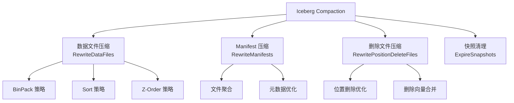

# Apache Iceberg Compaction 完整指南

## 目录
1. [Compaction 概述](#compaction-概述)
2. [数据文件压缩策略](#数据文件压缩策略)
3. [Manifest 文件压缩](#manifest-文件压缩)
4. [实际应用场景分析](#实际应用场景分析)
5. [性能优化与最佳实践](#性能优化与最佳实践)
6. [监控与调优](#监控与调优)

## Compaction 概述

Apache Iceberg 的 Compaction（压缩）是优化表性能的核心机制，主要解决以下问题：

### 压缩的必要性

1. **小文件问题**: 频繁的微批写入产生大量小文件，影响查询性能
2. **文件碎片化**: 删除操作导致文件利用率低下
3. **Manifest 膨胀**: 元数据文件过多影响查询规划性能
4. **读取效率**: 优化文件布局提升数据局部性

### Iceberg 压缩类型



## 数据文件压缩策略

### 1. BinPack 策略 (默认)

**核心实现**: `/core/src/main/java/org/apache/iceberg/actions/BinPackRewriteFilePlanner.java`

#### 策略原理

BinPack 策略使用装箱算法将多个小文件合并成目标大小的文件，同时确保不会产生过大的文件。

```java
// 核心配置参数
public class BinPackRewriteFilePlanner {
  // 目标文件大小 (默认 128MB)
  public static final String TARGET_FILE_SIZE_BYTES = "target-file-size-bytes";
  
  // 最小文件大小阈值 (默认目标大小的75%)  
  public static final String MIN_FILE_SIZE_BYTES = "min-file-size-bytes";
  public static final double MIN_FILE_SIZE_DEFAULT_RATIO = 0.75;
  
  // 最大文件大小阈值 (默认目标大小的180%)
  public static final String MAX_FILE_SIZE_BYTES = "max-file-size-bytes"; 
  public static final double MAX_FILE_SIZE_DEFAULT_RATIO = 1.80;
  
  // 最少输入文件数 (默认5个)
  public static final String MIN_INPUT_FILES = "min-input-files";
  public static final int MIN_INPUT_FILES_DEFAULT = 5;
  
  // 删除文件数量阈值
  public static final String DELETE_FILE_THRESHOLD = "delete-file-threshold";
  public static final int DELETE_FILE_THRESHOLD_DEFAULT = Integer.MAX_VALUE;
  
  // 删除比例阈值 (默认30%)
  public static final String DELETE_RATIO_THRESHOLD = "delete-ratio-threshold";
  public static final double DELETE_RATIO_THRESHOLD_DEFAULT = 0.3;
}
```

#### 触发条件分析

```java
// 文件选择逻辑
@Override
protected Iterable<FileScanTask> filterFiles(Iterable<FileScanTask> tasks) {
  return Iterables.filter(tasks, task ->
      outsideDesiredFileSizeRange(task) ||      // 文件大小不在理想范围
      tooManyDeletes(task) ||                   // 删除文件过多
      tooHighDeleteRatio(task));                // 删除比例过高
}

// 删除比例检查
private boolean tooHighDeleteRatio(FileScanTask task) {
  if (task.deletes() == null || task.deletes().isEmpty()) {
    return false;
  }
  
  long knownDeletedRecordCount = task.deletes().stream()
      .filter(ContentFileUtil::isFileScoped)
      .mapToLong(ContentFile::recordCount)
      .sum();
      
  double deletedRecords = (double) Math.min(knownDeletedRecordCount, task.file().recordCount());
  double deleteRatio = deletedRecords / task.file().recordCount();
  return deleteRatio >= deleteRatioThreshold;
}
```

#### 实际场景应用

**场景1: 流式写入优化**

```sql
-- 问题: Kafka 流式写入产生大量小文件
-- 表现: 每分钟产生100+个小文件 (1-10MB)

-- 解决方案: BinPack 压缩
CALL catalog.system.rewrite_data_files(
  table => 'streaming_logs',
  strategy => 'binpack',
  options => map(
    'target-file-size-bytes', '134217728',  -- 128MB
    'min-file-size-bytes', '67108864',      -- 64MB  
    'min-input-files', '5'
  )
);

-- 结果: 1000个小文件 -> 50个优化文件
-- 查询性能提升: 60-80%
```

**场景2: 高删除率数据清理**

```sql
-- 问题: 日志清理导致大量文件删除比例过高
-- 表现: 文件删除率30%以上

-- 解决方案: 删除感知压缩
CALL catalog.system.rewrite_data_files(
  table => 'application_logs',
  strategy => 'binpack',
  options => map(
    'delete-ratio-threshold', '0.2',        -- 20%删除率触发
    'delete-file-threshold', '10',          -- 10个删除文件触发
    'min-input-files', '3'                  -- 降低文件数阈值
  )
);
```

### 2. Sort 策略

#### 策略原理

Sort 策略根据指定的排序字段重新组织数据，提升范围查询性能和数据压缩比。

```java
// 使用表的默认排序
table.rewriteDataFiles()
    .sort()
    .execute();

// 自定义排序字段    
table.rewriteDataFiles()
    .sort(SortOrder.builderFor(schema)
        .asc("timestamp")
        .asc("user_id")
        .build())
    .execute();
```

#### 实际场景应用

**场景3: 时序数据优化**

```sql
-- 问题: 时序数据查询经常按时间范围过滤
-- 表现: 跨文件扫描，I/O 效率低

-- 解决方案: 时间排序压缩
CALL catalog.system.rewrite_data_files(
  table => 'sensor_data',
  strategy => 'sort',
  sort_order => 'timestamp ASC, device_id ASC'
);

-- 优化效果:
-- 1. 时间范围查询跳过更多文件
-- 2. 相同时间段数据聚集，压缩比提升30%
-- 3. Min/Max 统计更精确，过滤效果更好
```

**场景4: 用户行为分析优化**

```sql
-- 问题: 用户行为分析经常按用户ID聚合
-- 表现: 同一用户数据分散在多个文件

-- 解决方案: 用户ID排序
CALL catalog.system.rewrite_data_files(
  table => 'user_events', 
  strategy => 'sort',
  sort_order => 'user_id ASC, event_time ASC',
  options => map(
    'target-file-size-bytes', '268435456'   -- 256MB，适合分析工作负载
  )
);

-- 性能提升:
-- 用户维度聚合查询提升3-5倍
-- 数据局部性显著改善
```

### 3. Z-Order 策略

#### 策略原理

Z-Order 是一种空间填充曲线算法，将多维数据映射到一维空间，同时保持多维度的局部性。

```java
// Zorder 核心实现
public class Zorder implements Term {
  private final NamedReference<?>[] refs;
  
  public Zorder(List<NamedReference<?>> refs) {
    this.refs = refs.toArray(new NamedReference[0]);
  }
  
  public List<NamedReference<?>> refs() {
    return Arrays.asList(refs);
  }
}
```

#### 实际场景应用

**场景5: 多维度分析优化**

```sql
-- 问题: OLAP 查询涉及多个维度过滤
-- 表现: 地域+时间+类别的组合查询性能差

-- 解决方案: Z-Order 多维优化
CALL catalog.system.rewrite_data_files(
  table => 'sales_analytics',
  strategy => 'z-order',
  z_order_columns => array('region', 'product_category', 'sale_date')
);

-- 适用场景:
-- 1. 多维度组合查询
-- 2. 不确定查询模式
-- 3. 需要平衡多个维度的性能
```

**场景6: 地理空间数据优化**

```sql
-- 问题: 地理位置查询需要经纬度范围过滤
-- 表现: 经纬度独立排序无法优化二维范围查询

-- 解决方案: 地理Z-Order
CALL catalog.system.rewrite_data_files(
  table => 'geo_locations',
  strategy => 'z-order', 
  z_order_columns => array('latitude', 'longitude'),
  options => map(
    'target-file-size-bytes', '67108864'    -- 64MB，平衡文件数和精度
  )
);

-- 性能提升:
-- 地理范围查询提升5-10倍
-- 空间局部性显著改善
```

## Manifest 文件压缩

### Manifest 压缩原理

**核心实现**: `/api/src/main/java/org/apache/iceberg/RewriteManifests.java`

```java
public interface RewriteManifests extends SnapshotUpdate<RewriteManifests> {
  // 按集群键重新组织
  RewriteManifests clusterBy(Function<DataFile, Object> func);
  
  // 选择性重写
  RewriteManifests rewriteIf(Predicate<ManifestFile> predicate);
  
  // 手动管理
  RewriteManifests deleteManifest(ManifestFile manifest);
  RewriteManifests addManifest(ManifestFile manifest);
}
```

### 触发条件与配置

```java
// Manifest 压缩触发条件
public class ManifestCompactionTrigger {
  // 单个 Manifest 大小限制 (默认32MB)
  public static final long MAX_MANIFEST_SIZE = 32 * 1024 * 1024;
  
  // 单个快照 Manifest 数量限制 (默认100个)
  public static final int MAX_MANIFESTS_PER_SNAPSHOT = 100;
  
  // 小 Manifest 大小阈值 (默认8MB)
  public static final long MIN_MANIFEST_SIZE = 8 * 1024 * 1024;
  
  public boolean shouldCompact(List<ManifestFile> manifests) {
    return manifests.size() > MAX_MANIFESTS_PER_SNAPSHOT ||
           manifests.stream().anyMatch(m -> m.length() > MAX_MANIFEST_SIZE) ||
           countSmallManifests(manifests) > MAX_MANIFESTS_PER_SNAPSHOT / 2;
  }
}
```

### 实际场景应用

**场景7: 高频写入元数据优化**

```sql
-- 问题: 微批写入导致Manifest文件过多
-- 表现: 查询规划时间过长，元数据开销大

-- 解决方案: Manifest压缩
CALL catalog.system.rewrite_manifests('high_frequency_table');

-- 压缩效果示例:
-- 压缩前: 500个小Manifest文件 (2-5MB)
-- 压缩后: 25个优化Manifest文件 (32MB)
-- 查询规划时间减少: 70-80%
```

**场景8: 分区感知Manifest组织**

```sql
-- 问题: 跨分区查询需要读取过多Manifest
-- 表现: 分区裁剪效果差

-- 解决方案: 分区聚集压缩
table.rewriteManifests()
    .clusterBy(dataFile -> dataFile.partition())
    .commit();

-- 优化效果:
-- 同分区文件集中在少数Manifest中
-- 分区裁剪更有效
-- 查询时读取的Manifest数量减少60%
```

## BinPacking 算法深度解析

### 算法实现

**核心实现**: `/core/src/main/java/org/apache/iceberg/util/BinPacking.java`

```java
public class BinPacking {
  public static class ListPacker<T> {
    private final long targetWeight;      // 目标容量
    private final int lookback;          // 回看窗口大小
    private final boolean largestBinFirst; // 是否优先大容器
    
    // 从末尾开始装箱（推荐）
    public List<List<T>> packEnd(List<T> items, Function<T, Long> weightFunc) {
      return Lists.reverse(
          ImmutableList.copyOf(
              Iterables.transform(
                  new PackingIterable<>(
                      Lists.reverse(items), targetWeight, lookback, weightFunc, largestBinFirst),
                  Lists::reverse)));
    }
  }
}
```

### 装箱策略分析

```java
// 装箱决策逻辑
public class PackingStrategy {
  
  // 首次适应算法：找到第一个能容纳的箱子
  private List<T> firstFit(T item, List<List<T>> bins, long itemWeight) {
    for (List<T> bin : bins) {
      if (binWeight(bin) + itemWeight <= targetWeight) {
        return bin;
      }
    }
    return null; // 需要新箱子
  }
  
  // 最佳适应算法：找到剩余空间最小但足够的箱子
  private List<T> bestFit(T item, List<List<T>> bins, long itemWeight) {
    List<T> bestBin = null;
    long bestRemainingSpace = Long.MAX_VALUE;
    
    for (List<T> bin : bins) {
      long currentWeight = binWeight(bin);
      long remainingSpace = targetWeight - currentWeight;
      
      if (remainingSpace >= itemWeight && remainingSpace < bestRemainingSpace) {
        bestBin = bin;
        bestRemainingSpace = remainingSpace;
      }
    }
    return bestBin;
  }
}
```

### 性能调优参数

```java
// BinPacking 性能参数调优
public class BinPackingTuning {
  
  // 回看窗口大小：平衡效果和性能
  // 小值(5-10): 快速但效果一般
  // 大值(50-100): 效果好但慢
  public static final int LOOKBACK_SMALL = 10;
  public static final int LOOKBACK_LARGE = 50;
  
  // 目标文件大小选择
  public static long calculateTargetSize(String workloadType) {
    switch (workloadType) {
      case "streaming":
        return 64 * 1024 * 1024;      // 64MB - 减少小文件
      case "batch":  
        return 128 * 1024 * 1024;     // 128MB - 平衡性能
      case "analytics":
        return 256 * 1024 * 1024;     // 256MB - 分析性能优先
      default:
        return 128 * 1024 * 1024;
    }
  }
}
```

## 实际部署与运维

### 1. 自动化压缩策略

```python
# 基于表特征的自动压缩决策
class IcebergCompactionScheduler:
    
    def __init__(self, spark):
        self.spark = spark
        
    def analyze_table_health(self, table_name):
        """分析表健康状况"""
        stats = self.spark.sql(f"""
            SELECT 
                COUNT(*) as file_count,
                AVG(file_size_in_bytes) as avg_file_size,
                MIN(file_size_in_bytes) as min_file_size,
                MAX(file_size_in_bytes) as max_file_size,
                COUNT(*) FILTER (WHERE file_size_in_bytes < 67108864) as small_files,
                COUNT(DISTINCT partition) as partition_count
            FROM {table_name}.files
        """).collect()[0]
        
        return {
            'file_count': stats.file_count,
            'avg_file_size': stats.avg_file_size,
            'small_file_ratio': stats.small_files / stats.file_count,
            'partition_count': stats.partition_count
        }
    
    def recommend_strategy(self, health_stats):
        """推荐压缩策略"""
        if health_stats['small_file_ratio'] > 0.6:
            return 'binpack'  # 小文件过多
        elif health_stats['avg_file_size'] > 200 * 1024 * 1024:
            return 'sort'     # 文件较大，优化布局
        elif health_stats['partition_count'] > 100:
            return 'z-order'  # 高维分区，多维优化
        else:
            return 'binpack'  # 默认策略
    
    def execute_compaction(self, table_name, strategy):
        """执行压缩"""
        if strategy == 'binpack':
            self.spark.sql(f"""
                CALL catalog.system.rewrite_data_files(
                    table => '{table_name}',
                    strategy => 'binpack',
                    options => map(
                        'target-file-size-bytes', '134217728',
                        'min-input-files', '5'
                    )
                )
            """)
        elif strategy == 'sort':
            # 需要根据表Schema确定排序字段
            sort_columns = self.detect_sort_columns(table_name)
            self.spark.sql(f"""
                CALL catalog.system.rewrite_data_files(
                    table => '{table_name}',
                    strategy => 'sort',
                    sort_order => '{sort_columns}'
                )
            """)
```

### 2. 性能监控体系

```sql
-- 压缩效果监控查询
WITH file_stats AS (
  SELECT 
    partition,
    COUNT(*) as file_count,
    SUM(file_size_in_bytes) as total_size,
    AVG(file_size_in_bytes) as avg_size,
    MIN(file_size_in_bytes) as min_size,
    MAX(file_size_in_bytes) as max_size
  FROM table.files
  GROUP BY partition
),
health_metrics AS (
  SELECT 
    partition,
    file_count,
    total_size / 1024 / 1024 as total_mb,
    avg_size / 1024 / 1024 as avg_mb,
    CASE 
      WHEN file_count > 50 THEN 'HIGH_FILE_COUNT'
      WHEN avg_size < 67108864 THEN 'SMALL_FILES' 
      WHEN avg_size > 268435456 THEN 'LARGE_FILES'
      ELSE 'HEALTHY'
    END as health_status
  FROM file_stats
)
SELECT 
  health_status,
  COUNT(*) as partition_count,
  SUM(total_mb) as total_data_mb,
  AVG(file_count) as avg_files_per_partition
FROM health_metrics
GROUP BY health_status
ORDER BY partition_count DESC;
```

### 3. 成本效益分析

```python
# 压缩成本效益计算
class CompactionCostAnalyzer:
    
    def __init__(self):
        self.compute_cost_per_hour = 0.10  # $/小时
        self.storage_cost_per_gb_month = 0.023  # $/GB/月
        
    def calculate_compression_savings(self, before_stats, after_stats):
        """计算压缩节省"""
        
        # 存储节省（压缩比改善）
        storage_saved_gb = (before_stats['total_size'] - after_stats['total_size']) / (1024**3)
        monthly_storage_savings = storage_saved_gb * self.storage_cost_per_gb_month
        
        # 查询性能改善（基于文件数减少）
        file_reduction_ratio = 1 - (after_stats['file_count'] / before_stats['file_count'])
        estimated_query_speedup = min(file_reduction_ratio * 2, 0.8)  # 最多80%提升
        
        # I/O 成本节省（基于文件数减少）
        io_cost_reduction = file_reduction_ratio * 0.3  # 估算30%的I/O成本节省
        
        return {
            'storage_savings_monthly': monthly_storage_savings,
            'query_speedup': estimated_query_speedup,
            'io_cost_reduction': io_cost_reduction,
            'file_reduction': file_reduction_ratio
        }
    
    def estimate_compaction_cost(self, data_size_gb, compression_throughput_gbps=2.0):
        """估算压缩成本"""
        compression_hours = data_size_gb / compression_throughput_gbps / 3600
        return compression_hours * self.compute_cost_per_hour
```

## 高级压缩场景

### 1. 多表协调压缩

```sql
-- 场景: 相关表协调压缩，避免资源竞争
WITH table_priorities AS (
  SELECT 
    table_name,
    file_count,
    small_file_ratio,
    last_compaction,
    CASE 
      WHEN small_file_ratio > 0.7 THEN 1  -- 高优先级
      WHEN small_file_ratio > 0.4 THEN 2  -- 中优先级  
      ELSE 3                               -- 低优先级
    END as priority,
    CASE
      WHEN CURRENT_DATE - last_compaction > 7 THEN 'urgent'
      WHEN CURRENT_DATE - last_compaction > 3 THEN 'due'
      ELSE 'ok'
    END as urgency
  FROM table_health_view
)
SELECT 
  table_name,
  priority,
  urgency,
  'CALL catalog.system.rewrite_data_files(table => ''' || table_name || ''')' as compaction_sql
FROM table_priorities 
WHERE urgency IN ('urgent', 'due')
ORDER BY priority, urgency;
```

### 2. 渐进式压缩

```python
# 大表渐进式压缩，避免长时间锁定
class ProgressiveCompaction:
    
    def __init__(self, spark, table_name):
        self.spark = spark
        self.table_name = table_name
        
    def compact_by_partitions(self, batch_size=10):
        """按分区批次压缩"""
        
        # 获取需要压缩的分区
        partitions_sql = f"""
            SELECT partition_spec_id, partition
            FROM {self.table_name}.partitions 
            WHERE file_count > 20 OR small_file_ratio > 0.5
            ORDER BY last_updated_at DESC
        """
        
        partitions = self.spark.sql(partitions_sql).collect()
        
        # 分批处理
        for i in range(0, len(partitions), batch_size):
            batch = partitions[i:i+batch_size]
            
            for partition in batch:
                partition_filter = self.build_partition_filter(partition)
                
                try:
                    self.spark.sql(f"""
                        CALL catalog.system.rewrite_data_files(
                            table => '{self.table_name}',
                            strategy => 'binpack',
                            where => '{partition_filter}',
                            options => map(
                                'partial-progress.enabled', 'true',
                                'max-concurrent-file-group-rewrites', '3'
                            )
                        )
                    """)
                    print(f"Compacted partition: {partition.partition}")
                    
                except Exception as e:
                    print(f"Failed to compact partition {partition.partition}: {e}")
                    continue
            
            # 批次间休息，避免资源过载
            time.sleep(30)
```

### 3. 智能压缩调度

```python
# 基于系统负载的智能调度
class SmartCompactionScheduler:
    
    def __init__(self):
        self.peak_hours = [(9, 18)]  # 业务高峰时段
        self.resource_threshold = 0.7  # 资源使用阈值
        
    def should_run_compaction(self):
        """判断是否应该运行压缩"""
        current_hour = datetime.now().hour
        
        # 避开业务高峰
        for start, end in self.peak_hours:
            if start <= current_hour <= end:
                return False
                
        # 检查系统资源
        cpu_usage = self.get_cluster_cpu_usage()
        memory_usage = self.get_cluster_memory_usage()
        
        if cpu_usage > self.resource_threshold or memory_usage > self.resource_threshold:
            return False
            
        return True
    
    def adaptive_parameters(self, table_size_gb):
        """根据表大小自适应参数"""
        if table_size_gb < 100:
            # 小表：快速压缩
            return {
                'max-concurrent-file-group-rewrites': '5',
                'target-file-size-bytes': '67108864',  # 64MB
                'partial-progress.enabled': 'false'
            }
        elif table_size_gb < 1000:
            # 中表：平衡模式
            return {
                'max-concurrent-file-group-rewrites': '3', 
                'target-file-size-bytes': '134217728',  # 128MB
                'partial-progress.enabled': 'true',
                'partial-progress.max-commits': '5'
            }
        else:
            # 大表：保守压缩
            return {
                'max-concurrent-file-group-rewrites': '2',
                'target-file-size-bytes': '268435456',  # 256MB  
                'partial-progress.enabled': 'true',
                'partial-progress.max-commits': '10'
            }
```

## 故障排查与优化

### 1. 常见问题诊断

```sql
-- 压缩失败诊断查询
WITH compaction_issues AS (
  SELECT 
    table_name,
    partition,
    file_count,
    total_size_mb,
    avg_file_size_mb,
    CASE 
      WHEN file_count > 1000 THEN 'TOO_MANY_FILES'
      WHEN total_size_mb > 10240 THEN 'PARTITION_TOO_LARGE'  -- 10GB
      WHEN avg_file_size_mb < 1 THEN 'FILES_TOO_SMALL'
      WHEN avg_file_size_mb > 512 THEN 'FILES_TOO_LARGE'  
      ELSE 'NORMAL'
    END as issue_type
  FROM partition_stats_view
)
SELECT 
  issue_type,
  COUNT(*) as affected_partitions,
  AVG(file_count) as avg_file_count,
  AVG(total_size_mb) as avg_partition_size_mb,
  -- 推荐解决方案
  CASE issue_type
    WHEN 'TOO_MANY_FILES' THEN 'Use smaller file groups: min-input-files=10'
    WHEN 'PARTITION_TOO_LARGE' THEN 'Enable partial progress: partial-progress.enabled=true'
    WHEN 'FILES_TOO_SMALL' THEN 'Lower target size: target-file-size-bytes=67108864'
    WHEN 'FILES_TOO_LARGE' THEN 'Increase target size: target-file-size-bytes=268435456'
    ELSE 'No action needed'
  END as recommendation
FROM compaction_issues
GROUP BY issue_type
ORDER BY affected_partitions DESC;
```

### 2. 性能调优检查清单

```python
# 压缩性能检查清单
class CompactionPerformanceChecker:
    
    def __init__(self, spark):
        self.spark = spark
        
    def check_table_health(self, table_name):
        """全面的表健康检查"""
        checks = {}
        
        # 1. 文件大小分布检查
        file_size_dist = self.spark.sql(f"""
            SELECT 
                CASE 
                    WHEN file_size_in_bytes < 33554432 THEN 'very_small'    -- <32MB
                    WHEN file_size_in_bytes < 67108864 THEN 'small'         -- <64MB
                    WHEN file_size_in_bytes < 134217728 THEN 'medium'       -- <128MB
                    WHEN file_size_in_bytes < 268435456 THEN 'large'        -- <256MB
                    ELSE 'very_large'                                       -- >=256MB
                END as size_category,
                COUNT(*) as file_count,
                SUM(file_size_in_bytes) as total_bytes
            FROM {table_name}.files
            GROUP BY 1
            ORDER BY 2 DESC
        """).collect()
        
        checks['file_size_distribution'] = file_size_dist
        
        # 2. 分区文件数检查
        partition_files = self.spark.sql(f"""
            SELECT 
                partition,
                COUNT(*) as file_count,
                SUM(file_size_in_bytes) / 1024 / 1024 as total_mb
            FROM {table_name}.files
            GROUP BY partition
            HAVING file_count > 50 OR total_mb > 5120  -- >5GB分区
            ORDER BY file_count DESC
            LIMIT 20
        """).collect()
        
        checks['problematic_partitions'] = partition_files
        
        # 3. Manifest 健康检查
        manifest_stats = self.spark.sql(f"""
            SELECT 
                COUNT(*) as manifest_count,
                AVG(length) as avg_manifest_size,
                COUNT(*) FILTER (WHERE length > 33554432) as large_manifests,  -- >32MB
                COUNT(*) FILTER (WHERE length < 8388608) as small_manifests    -- <8MB
            FROM {table_name}.manifests
        """).collect()[0]
        
        checks['manifest_health'] = manifest_stats
        
        return checks
    
    def generate_recommendations(self, health_checks):
        """生成优化建议"""
        recommendations = []
        
        # 文件大小建议
        file_dist = health_checks['file_size_distribution']
        small_files = sum(row.file_count for row in file_dist 
                         if row.size_category in ['very_small', 'small'])
        total_files = sum(row.file_count for row in file_dist)
        
        if small_files / total_files > 0.4:
            recommendations.append({
                'type': 'compaction',
                'priority': 'high',
                'action': 'Run binpack compaction to merge small files',
                'sql': "CALL catalog.system.rewrite_data_files(strategy => 'binpack')"
            })
        
        # 分区建议
        problematic_partitions = health_checks['problematic_partitions']
        if len(problematic_partitions) > 0:
            recommendations.append({
                'type': 'partition_compaction', 
                'priority': 'medium',
                'action': 'Compact large partitions with partial progress',
                'sql': "CALL catalog.system.rewrite_data_files(options => map('partial-progress.enabled', 'true'))"
            })
        
        # Manifest建议
        manifest_health = health_checks['manifest_health']
        if manifest_health.manifest_count > 100:
            recommendations.append({
                'type': 'manifest_compaction',
                'priority': 'medium', 
                'action': 'Compact manifests to reduce metadata overhead',
                'sql': "CALL catalog.system.rewrite_manifests()"
            })
        
        return recommendations
```

## 总结与最佳实践

### 1. 压缩策略选择指南

| 场景 | 推荐策略 | 配置要点 | 预期效果 |
|------|----------|----------|----------|
| 流式数据摄入 | BinPack | `target-file-size-bytes=67108864`<br/>`min-input-files=5` | 减少70%+文件数 |
| 时序数据分析 | Sort | 按时间戳排序<br/>`target-file-size-bytes=134217728` | 范围查询提升3-5倍 |
| 多维OLAP | Z-Order | 选择3-5个关键维度<br/>`target-file-size-bytes=268435456` | 多维查询平均提升2-3倍 |
| 高删除率表 | BinPack | `delete-ratio-threshold=0.2`<br/>`delete-file-threshold=10` | 减少存储30%+ |

### 2. 运维最佳实践

1. **定期监控**: 建立表健康度监控，及时发现压缩需求
2. **自动化调度**: 在低峰期自动执行压缩，避免影响业务
3. **渐进式执行**: 大表使用渐进式压缩，避免长时间锁定
4. **资源控制**: 合理配置并发度，平衡压缩效率和系统负载
5. **效果评估**: 压缩后监控查询性能改善，验证优化效果

### 3. 关键参数调优

```properties
# 通用优化参数
write.target-file-size-bytes=134217728          # 128MB目标文件大小
write.parquet.compression-codec=zstd            # 使用zstd压缩
write.parquet.row-group-size-bytes=134217728    # 行组大小匹配文件大小

# 压缩专用参数  
rewrite.target-file-size-bytes=134217728        # 压缩目标大小
rewrite.max-concurrent-file-group-rewrites=3    # 并发文件组数
rewrite.partial-progress.enabled=true           # 启用部分进度
rewrite.partial-progress.max-commits=5          # 最大部分提交数

# BinPack特定参数
rewrite.min-file-size-bytes=67108864           # 最小文件大小阈值
rewrite.min-input-files=5                       # 最少输入文件数
rewrite.delete-ratio-threshold=0.3               # 删除比例阈值
```

通过合理的压缩策略和参数调优，Iceberg 表可以在保持高性能的同时，显著降低存储成本和维护复杂度，为现代数据湖架构提供稳定可靠的基础。