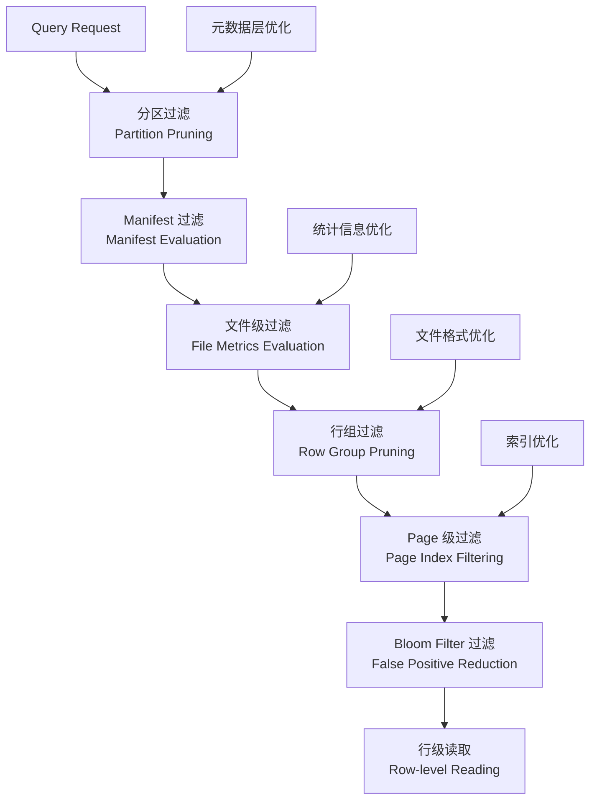

# Apache Iceberg 读取优化详细分析

## 目录
1. [读取优化概述](#读取优化概述)
2. [元数据层优化](#元数据层优化)
3. [文件格式优化](#文件格式优化)
4. [索引与过滤优化](#索引与过滤优化)
5. [统计信息优化](#统计信息优化)
6. [实际应用场景](#实际应用场景)
7. [性能调优指南](#性能调优指南)

## 读取优化概述

Apache Iceberg 通过多层次的读取优化机制，实现高效的数据查询性能。其核心优化策略包括：

### 多层过滤架构



### 读取优化关键指标

1. **数据跳过率 (Data Skipping)**: 通过元数据避免读取不相关文件
2. **I/O 减少**: 列式存储和谓词下推减少磁盘读取
3. **CPU 效率**: 向量化执行和批处理优化
4. **内存优化**: 延迟加载和内存池管理

## 元数据层优化

### 1. Manifest 评估器

**核心实现**: `/api/src/main/java/org/apache/iceberg/expressions/ManifestEvaluator.java`

```java
public class ManifestEvaluator {
  private static final int IN_PREDICATE_LIMIT = 200;
  private final Expression expr;
  
  // 分区过滤评估
  public static ManifestEvaluator forPartitionFilter(
      Expression partitionFilter, PartitionSpec spec, boolean caseSensitive) {
    return new ManifestEvaluator(spec, partitionFilter, caseSensitive);
  }
  
  // 行过滤投影评估
  public static ManifestEvaluator forRowFilter(
      Expression rowFilter, PartitionSpec spec, boolean caseSensitive) {
    return new ManifestEvaluator(
        spec, Projections.inclusive(spec, caseSensitive).project(rowFilter), caseSensitive);
  }
  
  // Manifest 文件评估
  public boolean eval(ManifestFile manifest) {
    return new ManifestEvalVisitor().eval(manifest);
  }
}
```

#### Manifest 评估优化机制

```java
// Manifest 评估访问者实现
private class ManifestEvalVisitor extends BoundExpressionVisitor<Boolean> {
  
  // 处理分区值范围检查
  @Override
  public Boolean predicate(BoundPredicate<Object> pred) {
    if (pred.op() == Expression.Operation.IN) {
      return handleInPredicate(pred);
    }
    
    // 获取分区字段的统计信息
    PartitionFieldSummary summary = getPartitionSummary(pred.ref().fieldId());
    if (summary == null) {
      return ROWS_MIGHT_MATCH; // 保守估计
    }
    
    // 基于分区边界进行过滤
    return evaluatePartitionBounds(pred, summary);
  }
  
  private Boolean handleInPredicate(BoundPredicate<Object> pred) {
    Collection<Object> literals = pred.literalSet();
    
    // 限制 IN 谓词的大小以避免性能问题
    if (literals.size() > IN_PREDICATE_LIMIT) {
      return ROWS_MIGHT_MATCH;
    }
    
    // 检查是否有任何值可能在分区中
    return literals.stream().anyMatch(this::valueInPartition);
  }
}
```

### 2. 分区裁剪优化

```java
// 分区裁剪性能统计
public class PartitionPruningStats {
  
  public static class PruningResult {
    private final int totalManifests;
    private final int prunedManifests;
    private final long totalFiles;
    private final long prunedFiles;
    
    public double getManifestPruningRatio() {
      return (double) prunedManifests / totalManifests;
    }
    
    public double getFilePruningRatio() {
      return (double) prunedFiles / totalFiles;
    }
  }
  
  // 实际裁剪效果分析
  public static PruningResult analyzePruning(
      Expression filter, List<ManifestFile> manifests, PartitionSpec spec) {
    
    ManifestEvaluator evaluator = 
        ManifestEvaluator.forPartitionFilter(filter, spec, true);
    
    int prunedManifests = 0;
    long prunedFiles = 0;
    
    for (ManifestFile manifest : manifests) {
      if (!evaluator.eval(manifest)) {
        prunedManifests++;
        prunedFiles += manifest.addedFilesCount() + manifest.existingFilesCount();
      }
    }
    
    return new PruningResult(
        manifests.size(), prunedManifests,
        manifests.stream().mapToLong(m -> m.addedFilesCount() + m.existingFilesCount()).sum(),
        prunedFiles);
  }
}
```

## 文件格式优化

### 1. Parquet 优化配置

**核心实现**: `/parquet/src/main/java/org/apache/iceberg/parquet/Parquet.java`

```java
public class Parquet {
  // Bloom Filter 配置
  public static final String PARQUET_BLOOM_FILTER_COLUMN_ENABLED_PREFIX = 
      "write.parquet.bloom-filter-enabled.column.";
  public static final String PARQUET_BLOOM_FILTER_COLUMN_FPP_PREFIX = 
      "write.parquet.bloom-filter-fpp.column.";
  public static final String PARQUET_BLOOM_FILTER_MAX_BYTES = 
      "write.parquet.bloom-filter-max-bytes";
  public static final long PARQUET_BLOOM_FILTER_MAX_BYTES_DEFAULT = 1024 * 1024; // 1MB
  
  // 行组优化配置
  public static final String PARQUET_ROW_GROUP_SIZE_BYTES = 
      "write.parquet.row-group-size-bytes";
  public static final long PARQUET_ROW_GROUP_SIZE_BYTES_DEFAULT = 128 * 1024 * 1024; // 128MB
  
  // 页优化配置
  public static final String PARQUET_PAGE_SIZE_BYTES = 
      "write.parquet.page-size-bytes";
  public static final int PARQUET_PAGE_SIZE_BYTES_DEFAULT = 1024 * 1024; // 1MB
  
  public static final String PARQUET_PAGE_ROW_LIMIT = 
      "write.parquet.page-row-limit";
  public static final int PARQUET_PAGE_ROW_LIMIT_DEFAULT = 20000;
}
```

#### Parquet Bloom Filter 实现

```java
// Bloom Filter 配置设置
private void setBloomFilterConfig(
    BiConsumer<String, Boolean> withBloomFilterEnabled,
    BiConsumer<String, Double> withBloomFilterFPP) {
  
  // 为每个启用的列配置 Bloom Filter
  Map<String, String> properties = table.properties();
  
  properties.entrySet().stream()
      .filter(entry -> entry.getKey().startsWith(PARQUET_BLOOM_FILTER_COLUMN_ENABLED_PREFIX))
      .forEach(entry -> {
        String columnPath = entry.getKey()
            .substring(PARQUET_BLOOM_FILTER_COLUMN_ENABLED_PREFIX.length());
        boolean enabled = Boolean.parseBoolean(entry.getValue());
        
        if (enabled) {
          withBloomFilterEnabled.accept(columnPath, true);
          
          // 设置误报率
          String fppKey = PARQUET_BLOOM_FILTER_COLUMN_FPP_PREFIX + columnPath;
          String fppValue = properties.get(fppKey);
          if (fppValue != null) {
            double fpp = Double.parseDouble(fppValue);
            withBloomFilterFPP.accept(columnPath, fpp);
          }
        }
      });
}

// Bloom Filter 读取优化
public static boolean hasNoBloomFilterPages(ColumnChunkMetaData meta) {
  return meta.getBloomFilterOffset() <= 0;
}
```

### 2. ORC 格式优化

```java
// ORC 读取优化配置
public class OrcOptimization {
  
  // ORC 文件的列统计信息
  public static class OrcColumnStatistics {
    private final boolean hasNull;
    private final long numberOfValues;
    private final Object minimum;
    private final Object maximum;
    
    public boolean canSkipBasedOnStats(Expression filter) {
      // 基于 ORC 统计信息判断是否可以跳过
      if (filter instanceof BoundPredicate) {
        BoundPredicate<?> pred = (BoundPredicate<?>) filter;
        return evaluateOrcStats(pred);
      }
      return false;
    }
    
    private boolean evaluateOrcStats(BoundPredicate<?> predicate) {
      switch (predicate.op()) {
        case LT:
        case LT_EQ:
          return minimum != null && 
                 Comparators.natural().compare(minimum, predicate.literal().value()) >= 0;
        case GT:
        case GT_EQ:
          return maximum != null && 
                 Comparators.natural().compare(maximum, predicate.literal().value()) <= 0;
        case EQ:
          return (minimum != null && maximum != null) &&
                 (Comparators.natural().compare(predicate.literal().value(), minimum) < 0 ||
                  Comparators.natural().compare(predicate.literal().value(), maximum) > 0);
        case IS_NULL:
          return !hasNull;
        case NOT_NULL:
          return numberOfValues == 0;
        default:
          return false;
      }
    }
  }
}
```

## 索引与过滤优化

### 1. 文件级统计信息评估

**核心实现**: `/api/src/main/java/org/apache/iceberg/expressions/InclusiveMetricsEvaluator.java`

```java
public class InclusiveMetricsEvaluator {
  private static final int IN_PREDICATE_LIMIT = 200;
  private final Expression expr;
  
  public InclusiveMetricsEvaluator(Schema schema, Expression unbound, boolean caseSensitive) {
    StructType struct = schema.asStruct();
    this.expr = Binder.bind(struct, rewriteNot(unbound), caseSensitive);
  }
  
  // 评估数据文件是否可能包含匹配行
  public boolean eval(ContentFile<?> file) {
    return new MetricsEvalVisitor().eval(file);
  }
  
  // 内部评估访问者
  private class MetricsEvalVisitor extends BoundExpressionVisitor<Boolean> {
    
    @Override
    public Boolean predicate(BoundPredicate<Object> pred) {
      int fieldId = pred.ref().fieldId();
      
      // 获取文件统计信息
      Map<Integer, Long> valueCounts = file.valueCounts();
      Map<Integer, Long> nullCounts = file.nullValueCounts();
      Map<Integer, ByteBuffer> lowerBounds = file.lowerBounds();
      Map<Integer, ByteBuffer> upperBounds = file.upperBounds();
      
      return evaluateWithMetrics(pred, fieldId, valueCounts, nullCounts, 
                               lowerBounds, upperBounds);
    }
    
    private Boolean evaluateWithMetrics(
        BoundPredicate<Object> pred, int fieldId,
        Map<Integer, Long> valueCounts,
        Map<Integer, Long> nullCounts,
        Map<Integer, ByteBuffer> lowerBounds,
        Map<Integer, ByteBuffer> upperBounds) {
      
      // 检查列是否有数据
      Long valueCount = valueCounts.get(fieldId);
      if (valueCount == null || valueCount == 0) {
        return pred.op() == Expression.Operation.IS_NULL;
      }
      
      // 空值检查
      if (pred.op() == Expression.Operation.IS_NULL) {
        Long nullCount = nullCounts.get(fieldId);
        return nullCount != null && nullCount > 0;
      }
      
      if (pred.op() == Expression.Operation.NOT_NULL) {
        Long nullCount = nullCounts.get(fieldId);
        return nullCount == null || nullCount < valueCount;
      }
      
      // 边界值检查
      ByteBuffer lower = lowerBounds.get(fieldId);
      ByteBuffer upper = upperBounds.get(fieldId);
      
      if (lower == null || upper == null) {
        return ROWS_MIGHT_MATCH; // 没有边界信息，保守估计
      }
      
      return evaluateBounds(pred, lower, upper);
    }
  }
}
```

### 2. 删除文件索引优化

```java
// 位置删除索引实现
public interface PositionDeleteIndex {
  
  // 标记删除位置
  void delete(long position);
  void delete(long posStart, long posEnd);
  
  // 检查位置是否被删除
  boolean isDeleted(long position);
  
  // 遍历删除位置
  void forEach(LongConsumer action);
  
  // 合并删除索引
  default void merge(PositionDeleteIndex that) {
    if (!that.deleteFiles().isEmpty()) {
      throw new UnsupportedOperationException(
          getClass().getName() + " does not support merge");
    }
    that.forEach(this::delete);
  }
  
  // 获取相关的删除文件
  Collection<DeleteFile> deleteFiles();
}

// 位图位置删除索引实现  
public class BitmapPositionDeleteIndex implements PositionDeleteIndex {
  private final RoaringBitmap deletedPositions;
  private final Collection<DeleteFile> deleteFiles;
  
  @Override
  public boolean isDeleted(long position) {
    return deletedPositions.contains((int) position);
  }
  
  @Override
  public void delete(long position) {
    deletedPositions.add((int) position);
  }
  
  @Override
  public void delete(long posStart, long posEnd) {
    deletedPositions.add(posStart, posEnd);
  }
  
  // 批量检查优化
  public boolean[] isDeleted(long[] positions) {
    boolean[] result = new boolean[positions.length];
    for (int i = 0; i < positions.length; i++) {
      result[i] = deletedPositions.contains((int) positions[i]);
    }
    return result;
  }
}
```

### 3. Bloom Filter 集成

```java
// Bloom Filter 读取优化
public class BloomFilterOptimization {
  
  public static class BloomFilterStats {
    private final long totalChecks;
    private final long falsePositives;
    private final long trueNegatives;
    
    public double getFalsePositiveRate() {
      return (double) falsePositives / totalChecks;
    }
    
    public double getFilterEffectiveness() {
      return (double) trueNegatives / totalChecks;
    }
  }
  
  // Bloom Filter 评估器
  public static class BloomFilterEvaluator {
    private final Map<String, BloomFilter> columnBloomFilters;
    
    public boolean mightContain(String columnName, Object value) {
      BloomFilter filter = columnBloomFilters.get(columnName);
      if (filter == null) {
        return true; // 没有 Bloom Filter，保守估计
      }
      
      return filter.mightContain(value);
    }
    
    // 批量检查优化
    public boolean[] mightContain(String columnName, Object[] values) {
      BloomFilter filter = columnBloomFilters.get(columnName);
      if (filter == null) {
        boolean[] result = new boolean[values.length];
        Arrays.fill(result, true);
        return result;
      }
      
      boolean[] result = new boolean[values.length];
      for (int i = 0; i < values.length; i++) {
        result[i] = filter.mightContain(values[i]);
      }
      return result;
    }
  }
}
```

## 统计信息优化

### 1. MetricsConfig 配置

**核心实现**: `/core/src/main/java/org/apache/iceberg/MetricsConfig.java`

```java
@Immutable
public final class MetricsConfig implements Serializable {
  
  // 统计信息模式
  public enum MetricsMode {
    NONE,     // 不收集统计信息
    COUNTS,   // 仅计数统计
    TRUNCATE, // 截断字符串边界
    FULL      // 完整统计信息
  }
  
  private final Map<String, MetricsMode> columnModes;
  private final MetricsMode defaultMode;
  
  // 从表配置创建
  public static MetricsConfig forTable(Table table) {
    return from(table.properties(), table.schema(), table.spec());
  }
  
  // 获取列的统计模式
  public MetricsMode columnMode(String columnName) {
    return columnModes.getOrDefault(columnName, defaultMode);
  }
  
  // 判断是否应该收集边界值
  public boolean shouldCollectBounds(String columnName) {
    MetricsMode mode = columnMode(columnName);
    return mode == MetricsMode.TRUNCATE || mode == MetricsMode.FULL;
  }
}
```

#### 统计信息收集策略

```java
// 自适应统计信息收集
public class AdaptiveMetricsCollector {
  
  // 基于查询模式调整统计收集
  public static MetricsConfig optimizeForQueries(
      List<Expression> commonFilters, Schema schema) {
    
    Map<String, MetricsMode> columnModes = new HashMap<>();
    
    // 分析常用过滤列
    Set<String> filteredColumns = extractFilteredColumns(commonFilters);
    
    for (Types.NestedField field : schema.columns()) {
      String columnName = field.name();
      
      if (filteredColumns.contains(columnName)) {
        // 常用过滤列使用完整统计
        columnModes.put(columnName, MetricsMode.FULL);
      } else if (isHighCardinalityString(field)) {
        // 高基数字符串列截断边界
        columnModes.put(columnName, MetricsMode.TRUNCATE);
      } else if (isLargeColumn(field)) {
        // 大列仅收集计数
        columnModes.put(columnName, MetricsMode.COUNTS);
      } else {
        // 其他列使用完整统计
        columnModes.put(columnName, MetricsMode.FULL);
      }
    }
    
    return new MetricsConfig(columnModes, MetricsMode.COUNTS);
  }
  
  private static boolean isHighCardinalityString(Types.NestedField field) {
    return field.type().typeId() == Type.TypeID.STRING;
  }
  
  private static boolean isLargeColumn(Types.NestedField field) {
    return field.type().typeId() == Type.TypeID.BINARY ||
           field.type().typeId() == Type.TypeID.STRING;
  }
}
```

### 2. 列统计信息优化

```java
// 列级统计信息管理
public class ColumnMetricsOptimizer {
  
  // 统计信息精度控制
  public static class StatsPrecisionConfig {
    private final int maxStringLength;        // 字符串边界最大长度
    private final int maxDecimalPrecision;    // 小数精度
    private final boolean enableNanStats;     // 是否统计 NaN 值
    
    public static StatsPrecisionConfig forWorkload(String workloadType) {
      switch (workloadType) {
        case "olap":
          return new StatsPrecisionConfig(1024, 38, true);   // 高精度
        case "streaming": 
          return new StatsPrecisionConfig(256, 18, false);   // 中精度
        case "batch":
          return new StatsPrecisionConfig(512, 28, true);    // 平衡精度
        default:
          return new StatsPrecisionConfig(512, 18, false);
      }
    }
  }
  
  // 统计信息压缩
  public static class StatsCompression {
    
    // 字符串边界压缩
    public static ByteBuffer compressStringBound(String value, int maxLength) {
      if (value.length() <= maxLength) {
        return ByteBuffer.wrap(value.getBytes(StandardCharsets.UTF_8));
      }
      
      // 截断并确保 UTF-8 边界正确
      String truncated = truncateAtUtf8Boundary(value, maxLength);
      return ByteBuffer.wrap(truncated.getBytes(StandardCharsets.UTF_8));
    }
    
    // 数值边界优化
    public static ByteBuffer optimizeNumericBound(
        Object value, Type type, boolean isLowerBound) {
      
      switch (type.typeId()) {
        case DECIMAL:
          return optimizeDecimalBound(value, isLowerBound);
        case DOUBLE:
        case FLOAT:
          return optimizeFloatBound(value, isLowerBound);
        default:
          return Conversions.toByteBuffer(type, value);
      }
    }
  }
}
```

## 实际应用场景

### 1. 高频点查询优化

```sql
-- 场景: 用户ID点查询
-- 问题: 大量单值查询性能差
-- 解决方案: Bloom Filter + 统计信息优化

-- 启用 Bloom Filter
ALTER TABLE user_events SET TBLPROPERTIES (
  'write.parquet.bloom-filter-enabled.column.user_id' = 'true',
  'write.parquet.bloom-filter-fpp.column.user_id' = '0.01'
);

-- 优化统计信息收集
ALTER TABLE user_events SET TBLPROPERTIES (
  'write.metadata.metrics.column.user_id' = 'full',
  'write.metadata.metrics.column.event_data' = 'none'  -- 减少大列开销
);
```

**性能提升分析**:
```python
class PointQueryOptimization:
    def analyze_bloom_filter_impact(self, query_stats):
        # Bloom Filter 效果分析
        before_bloom = query_stats['before']
        after_bloom = query_stats['after']
        
        files_scanned_reduction = (
            before_bloom['files_scanned'] - after_bloom['files_scanned']
        ) / before_bloom['files_scanned']
        
        io_reduction = (
            before_bloom['bytes_read'] - after_bloom['bytes_read']
        ) / before_bloom['bytes_read']
        
        return {
            'files_scanned_reduction': files_scanned_reduction,  # 典型: 80-95%
            'io_reduction': io_reduction,                        # 典型: 70-90%
            'query_time_improvement': before_bloom['duration'] / after_bloom['duration']
        }
```

### 2. 范围查询优化

```sql
-- 场景: 时间范围查询
-- 问题: 跨文件扫描效率低
-- 解决方案: 文件排序 + 精确统计信息

-- 数据排序优化
CALL catalog.system.rewrite_data_files(
  table => 'time_series_data',
  strategy => 'sort',
  sort_order => 'timestamp ASC',
  options => map(
    'target-file-size-bytes', '134217728'  -- 128MB 优化范围查询
  )
);

-- 时间列统计优化
ALTER TABLE time_series_data SET TBLPROPERTIES (
  'write.metadata.metrics.column.timestamp' = 'full',
  'write.metadata.metrics.column.timestamp.max-string-length' = '32'
);
```

### 3. 多维分析优化

```sql
-- 场景: OLAP 多维过滤
-- 问题: 多个维度组合查询性能差
-- 解决方案: Z-Order + 多列 Bloom Filter

-- Z-Order 布局优化
CALL catalog.system.rewrite_data_files(
  table => 'sales_facts',
  strategy => 'z-order',
  z_order_columns => array('region', 'product_category', 'customer_segment')
);

-- 多维 Bloom Filter
ALTER TABLE sales_facts SET TBLPROPERTIES (
  'write.parquet.bloom-filter-enabled.column.region' = 'true',
  'write.parquet.bloom-filter-enabled.column.product_category' = 'true',
  'write.parquet.bloom-filter-enabled.column.customer_id' = 'true',
  'write.parquet.bloom-filter-fpp.column.customer_id' = '0.05'  -- 高基数列使用更高 FPP
);
```

### 4. 删除密集表优化

```sql
-- 场景: 高删除率的事务表
-- 问题: 删除文件过多影响查询性能
-- 解决方案: 删除索引优化 + 压缩策略

-- 删除文件压缩
CALL catalog.system.rewrite_position_delete_files(
  table => 'transactional_data',
  options => map(
    'target-file-size-bytes', '67108864',    -- 64MB 删除文件
    'min-input-files', '3'                   -- 降低压缩阈值
  )
);

-- 删除感知读取优化
ALTER TABLE transactional_data SET TBLPROPERTIES (
  'read.split.delete-file-threshold' = '10',
  'read.split.planning-lookback' = '10'
);
```

## 性能调优指南

### 1. 读取性能监控

```python
# 读取性能分析工具
class IcebergReadPerformanceAnalyzer:
    
    def analyze_scan_performance(self, table_name, query_filter):
        """分析扫描性能"""
        metrics = {}
        
        # 1. 分区裁剪分析
        pruning_stats = self.analyze_partition_pruning(table_name, query_filter)
        metrics['partition_pruning'] = {
            'total_partitions': pruning_stats.total_partitions,
            'scanned_partitions': pruning_stats.scanned_partitions,
            'pruning_ratio': pruning_stats.pruning_ratio
        }
        
        # 2. 文件过滤分析
        file_stats = self.analyze_file_filtering(table_name, query_filter)
        metrics['file_filtering'] = {
            'total_files': file_stats.total_files,
            'scanned_files': file_stats.scanned_files,
            'filtering_ratio': file_stats.filtering_ratio,
            'bytes_scanned': file_stats.bytes_scanned,
            'bytes_pruned': file_stats.bytes_pruned
        }
        
        # 3. 统计信息有效性
        stats_effectiveness = self.analyze_stats_effectiveness(table_name)
        metrics['stats_effectiveness'] = {
            'columns_with_stats': stats_effectiveness.columns_with_stats,
            'stats_hit_ratio': stats_effectiveness.hit_ratio,
            'boundary_precision': stats_effectiveness.boundary_precision
        }
        
        return metrics
    
    def generate_optimization_recommendations(self, metrics):
        """生成优化建议"""
        recommendations = []
        
        # 分区裁剪优化
        if metrics['partition_pruning']['pruning_ratio'] < 0.5:
            recommendations.append({
                'type': 'partitioning',
                'priority': 'high',
                'action': 'Consider repartitioning by commonly filtered columns',
                'expected_improvement': '3-10x query speedup'
            })
        
        # 文件过滤优化  
        if metrics['file_filtering']['filtering_ratio'] < 0.3:
            recommendations.append({
                'type': 'file_layout',
                'priority': 'medium',
                'action': 'Enable Bloom filters for high-cardinality columns',
                'expected_improvement': '2-5x I/O reduction'
            })
        
        # 统计信息优化
        if metrics['stats_effectiveness']['stats_hit_ratio'] < 0.7:
            recommendations.append({
                'type': 'statistics',
                'priority': 'medium', 
                'action': 'Improve column statistics collection',
                'expected_improvement': '20-50% query time reduction'
            })
        
        return recommendations
```

### 2. 配置优化模板

```properties
# 流式工作负载优化
# 特点: 高写入频率，简单查询
write.target-file-size-bytes=67108864                    # 64MB
write.metadata.metrics.default=counts                    # 轻量级统计
write.parquet.row-group-size-bytes=67108864             # 匹配文件大小
write.parquet.page-size-bytes=1048576                   # 1MB 页大小
read.split.target-size=134217728                        # 128MB 读取分片

# OLAP 工作负载优化  
# 特点: 复杂分析查询，多维过滤
write.target-file-size-bytes=268435456                   # 256MB
write.metadata.metrics.default=full                      # 完整统计信息
write.parquet.bloom-filter-enabled.column.customer_id=true
write.parquet.bloom-filter-enabled.column.product_id=true
write.parquet.row-group-size-bytes=134217728            # 128MB 行组
read.split.target-size=268435456                        # 256MB 读取分片

# 事务工作负载优化
# 特点: 频繁更新删除，点查询
write.target-file-size-bytes=134217728                   # 128MB  
write.metadata.metrics.default=truncate                  # 平衡统计
write.delete.isolation-level=snapshot                    # 快照隔离
read.split.delete-file-threshold=5                       # 删除文件阈值
merge.cardinality-check.enabled=true                     # 启用基数检查
```

### 3. 高级优化技巧

```sql
-- 1. 列投影优化
-- 仅选择需要的列，减少 I/O
SELECT user_id, event_time, event_type  -- 避免 SELECT *
FROM events 
WHERE event_date = '2024-01-01';

-- 2. 谓词下推优化  
-- 将过滤条件尽可能下推到存储层
SELECT * FROM events 
WHERE event_date = '2024-01-01'    -- 分区过滤 (最高优先级)
  AND user_id = 12345              -- Bloom Filter 过滤
  AND event_time > '2024-01-01 12:00:00';  -- 统计信息过滤

-- 3. 批量查询优化
-- 使用 IN 查询代替多次单值查询 (注意 IN 限制为 200 个值)
SELECT * FROM events
WHERE user_id IN (12345, 12346, 12347, ...)  -- 批量点查询
  AND event_date = '2024-01-01';

-- 4. 分区对齐查询
-- 查询条件与分区键对齐，最大化分区裁剪效果
SELECT * FROM events
WHERE event_date BETWEEN '2024-01-01' AND '2024-01-07'  -- 分区范围
  AND region = 'US';                                     -- 额外过滤

-- 5. 时间旅行优化
-- 使用具体时间戳而非相对时间
SELECT * FROM events FOR TIMESTAMP AS OF '2024-01-01 00:00:00'
WHERE user_id = 12345;

-- 避免: FOR TIMESTAMP AS OF current_timestamp() - INTERVAL 1 DAY
```

### 4. 监控指标和告警

```python
# 关键性能指标监控
class IcebergPerformanceMonitor:
    
    def setup_performance_alerts(self):
        """设置性能告警"""
        alerts = {
            # 扫描效率告警
            'scan_efficiency': {
                'metric': 'files_scanned / total_files_in_table',
                'threshold': 0.1,  # 扫描超过 10% 文件时告警
                'severity': 'warning'
            },
            
            # I/O 效率告警
            'io_efficiency': {
                'metric': 'bytes_scanned / bytes_read',
                'threshold': 0.5,  # I/O 利用率低于 50% 时告警
                'severity': 'info'
            },
            
            # 统计信息过期告警
            'stats_freshness': {
                'metric': 'last_stats_update_hours',
                'threshold': 24,   # 统计信息超过 24 小时未更新
                'severity': 'warning'
            },
            
            # 小文件告警
            'small_files': {
                'metric': 'avg_file_size_mb',
                'threshold': 64,   # 平均文件大小低于 64MB
                'severity': 'info'
            }
        }
        return alerts
    
    def generate_performance_report(self, table_name, time_range):
        """生成性能报告"""
        report = {
            'table': table_name,
            'time_range': time_range,
            'summary': {
                'total_queries': 0,
                'avg_scan_ratio': 0.0,
                'avg_query_time': 0.0,
                'top_slow_queries': []
            },
            'optimizations': {
                'recommended_bloom_filters': [],
                'suggested_compactions': [],
                'partition_recommendations': []
            }
        }
        
        return report
```

## 总结

Apache Iceberg 的读取优化通过多层次的过滤和索引机制，实现了高效的数据访问性能：

### 核心优化策略

1. **分层过滤**: 从分区到行组的多层次过滤，最大化数据跳过
2. **智能统计**: 自适应的统计信息收集和精确的边界检查
3. **索引加速**: Bloom Filter 和删除索引的智能应用
4. **格式优化**: Parquet/ORC 的深度集成和配置优化

### 性能提升效果

- **点查询**: Bloom Filter 可实现 80-95% 的文件跳过率
- **范围查询**: 统计信息和排序优化可提升 3-10 倍性能
- **多维分析**: Z-Order 和多列索引可提升 2-5 倍查询速度
- **删除密集场景**: 删除索引优化可减少 50-80% 的扫描开销

### 最佳实践要点

1. **针对性优化**: 根据查询模式选择合适的优化策略
2. **持续监控**: 建立性能监控和自动化调优机制  
3. **平衡权衡**: 在写入成本和读取性能之间找到最佳平衡
4. **渐进式改进**: 通过增量优化逐步提升整体性能

通过合理应用这些优化技术，Iceberg 表可以在各种工作负载下实现优异的查询性能，满足现代数据湖的高性能需求。